# 11.7 &nbsp; Heap sort

!!! tip

    Trước khi đọc phần này, hãy đảm bảo bạn đã hoàn thành chương "Heap".

<u>Heap sort</u> là một thuật toán sắp xếp hiệu quả dựa trên cấu trúc dữ liệu heap.
Chúng ta có thể triển khai heap sort bằng cách sử dụng các thao tác "tạo heap"
và "trích xuất phần tử" mà chúng ta đã học.

1. Đầu vào là array và xây dựng một min-heap, trong đó phần tử nhỏ nhất
nằm ở đỉnh của heap.
2. Liên tục thực hiện thao tác trích xuất, ghi lại các phần tử đã trích xuất
theo trình tự để thu được một danh sách đã sắp xếp từ nhỏ nhất
đến lớn nhất.

Mặc dù phương pháp trên khả thi, nhưng nó yêu cầu một array bổ sung để
lưu trữ các phần tử đã được bật ra, điều này tốn khá nhiều không gian.
Trong thực tế, chúng ta thường sử dụng một cách triển khai thanh lịch hơn.

## 11.7.1 &nbsp; Luồng thuật toán

Giả sử độ dài của array là $n$, quá trình heap sort diễn ra như sau:

1. Đầu tiên, nhập array và xây dựng một max-heap. Sau bước này, phần tử lớn nhất
sẽ được đặt ở đỉnh của heap.
2. Hoán đổi phần tử đỉnh của heap (phần tử đầu tiên) với phần tử đáy của
heap (phần tử cuối cùng). Sau thao tác hoán đổi này, chúng ta giảm độ dài
của heap đi $1$ và tăng số lượng phần tử đã sắp xếp lên $1$.
3. Bắt đầu từ đỉnh heap, thực hiện thao tác sift-down từ trên xuống dưới.
Sau khi sift-down, tính chất của heap sẽ được khôi phục.
4. Lặp lại các bước `2.` và `3.` trong $n - 1$ vòng để hoàn thành việc sắp
xếp array.

!!! tip

    Trên thực tế, thao tác trích xuất phần tử cũng bao gồm các bước `2.` và `3.`,
    cùng với một bước bổ sung để pop (xóa) phần tử đã trích xuất khỏi heap.

=== "<1>"
    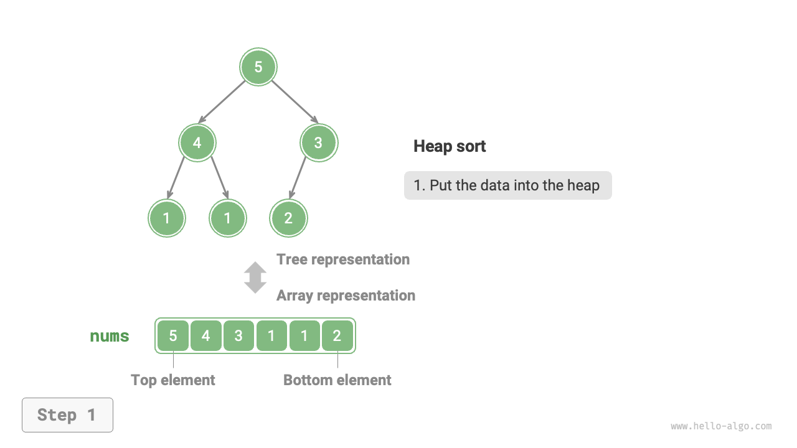{ class="animation-figure" }

=== "<2>"
    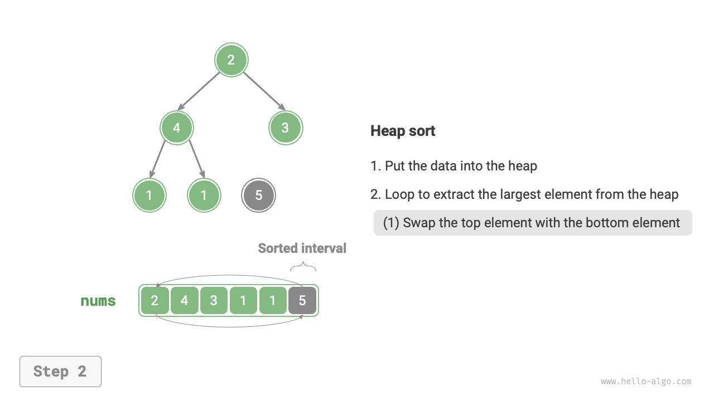{ class="animation-figure" }

=== "<3>"
    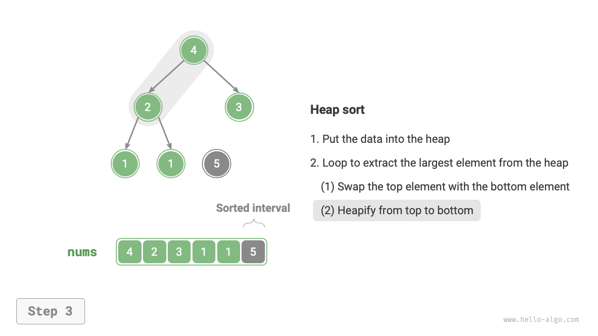{ class="animation-figure" }

=== "<4>"
    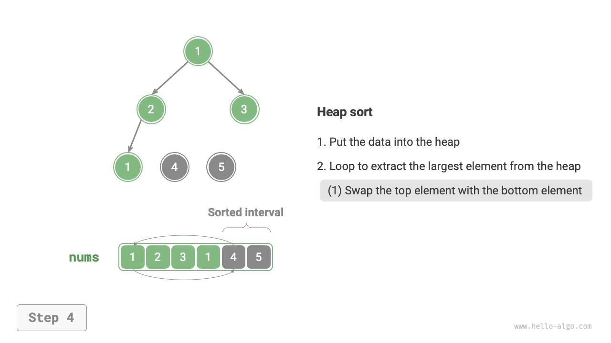{ class="animation-figure" }

=== "<5>"
    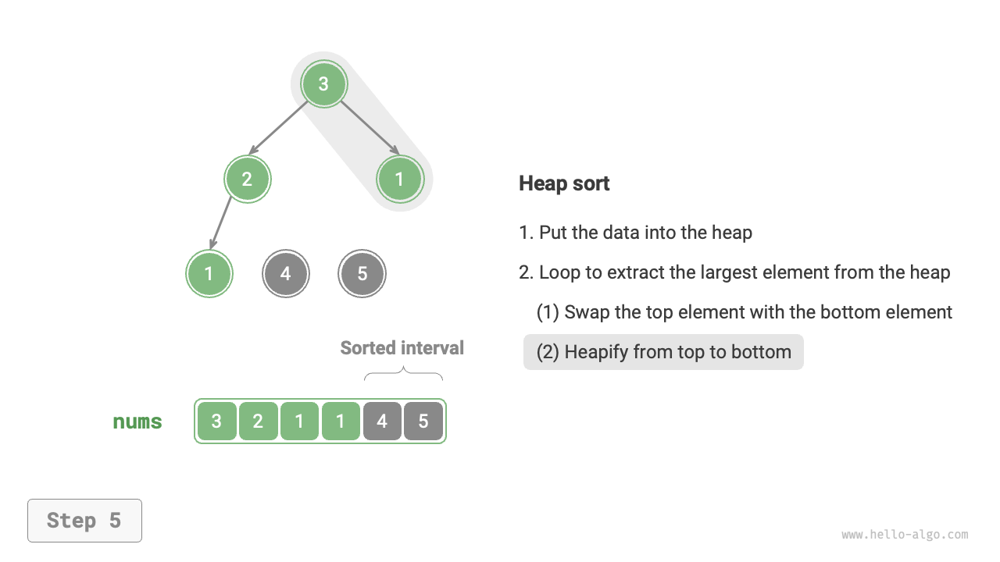{ class="animation-figure" }

=== "<6>"
    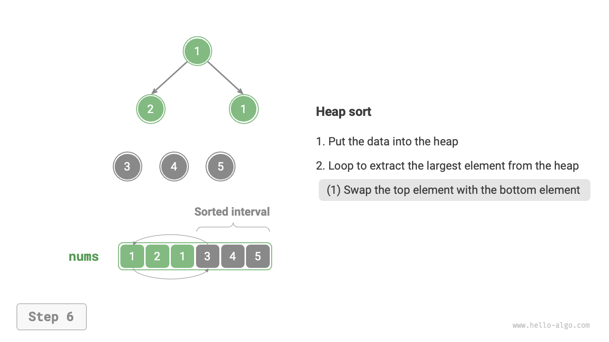{ class="animation-figure" }

=== "<7>"
    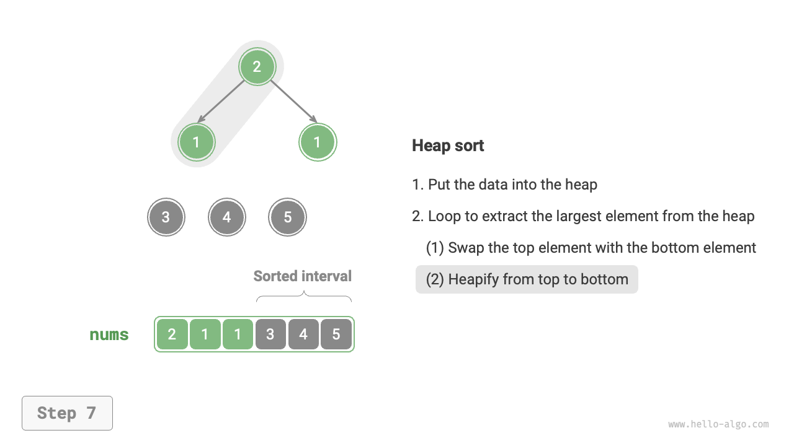{ class="animation-figure" }

=== "<8>"
    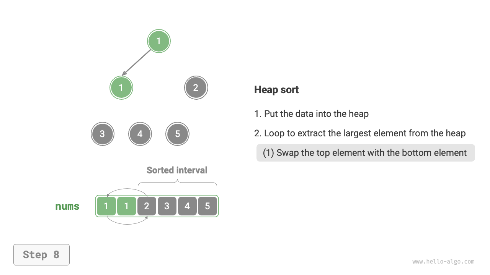{ class="animation-figure" }

=== "<9>"
    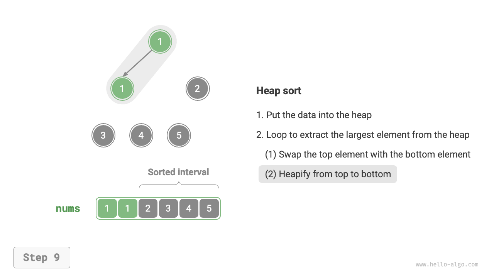{ class="animation-figure" }

=== "<10>"
    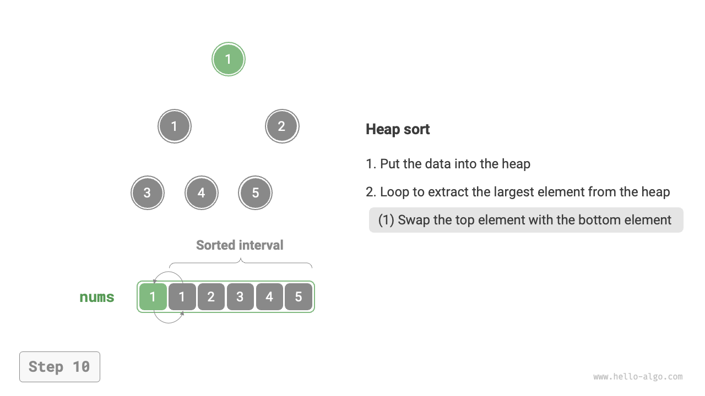{ class="animation-figure" }

=== "<11>"
    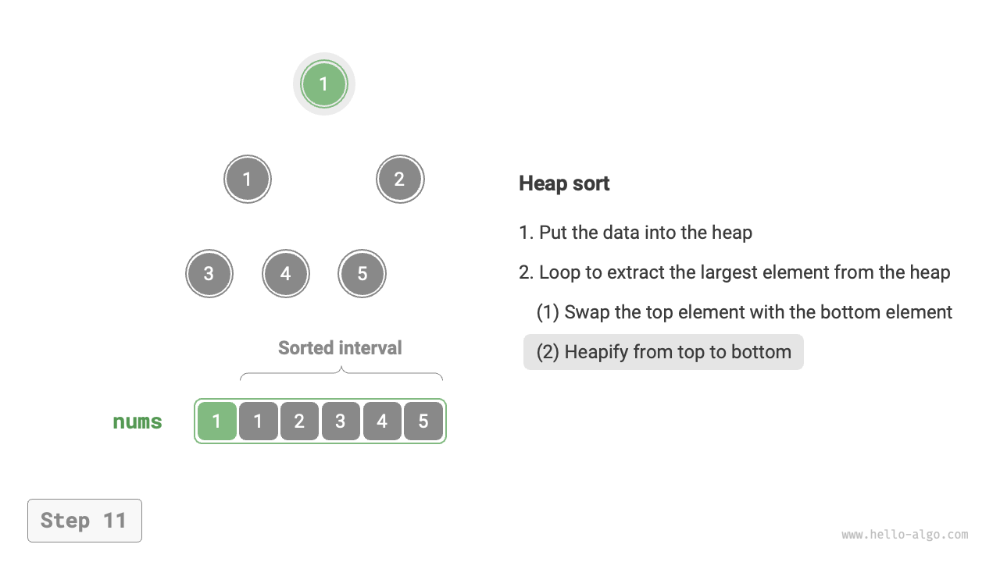{ class="animation-figure" }

=== "<12>"
    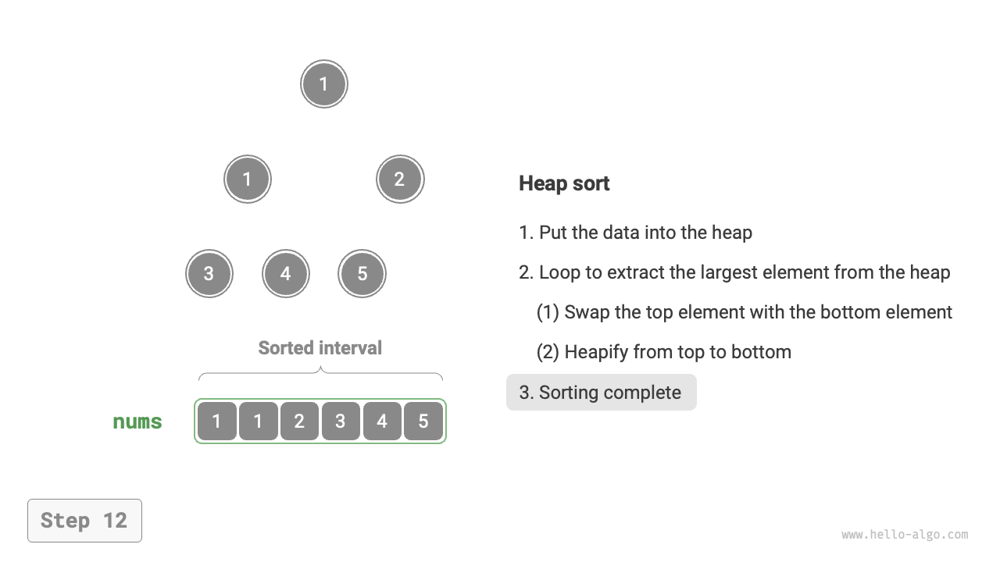{ class="animation-figure" }

<p align="center"> Hình 11-12 &nbsp; Quá trình heap sort </p>

Trong triển khai mã, chúng ta đã sử dụng hàm `sift_down()` từ chương "Heap".
Điều quan trọng cần lưu ý là vì độ dài của heap giảm khi phần tử lớn nhất được
trích xuất, chúng ta cần thêm tham số độ dài $n$ vào hàm `sift_down()` để chỉ
định độ dài hiệu dụng hiện tại của heap. Mã được hiển thị dưới đây:

=== "Python"

    ```python title="heap_sort.py"
    def sift_down(nums: list[int], n: int, i: int):
        """Độ dài heap là n, bắt đầu duy trì tính chất heap cho node i, từ trên xuống dưới"""
        while True:
            # Xác định node lớn nhất trong số i, l, r, ký hiệu là ma
            l = 2 * i + 1
            r = 2 * i + 2
            ma = i
            if l < n and nums[l] > nums[ma]:
                ma = l
            if r < n and nums[r] > nums[ma]:
                ma = r
            # Nếu node i là lớn nhất hoặc các chỉ số l, r nằm ngoài giới hạn, không cần duy trì
            # tính chất heap thêm, thoát
            if ma == i:
                break
            # Hoán đổi hai node
            nums[i], nums[ma] = nums[ma], nums[i]
            # Lặp lại việc duy trì tính chất heap xuống dưới
            i = ma

    def heap_sort(nums: list[int]):
        """heap sort"""
        # Thao tác xây dựng heap: duy trì tính chất heap cho tất cả các node trừ node lá
        for i in range(len(nums) // 2 - 1, -1, -1):
            sift_down(nums, len(nums), i)
        # Trích xuất phần tử lớn nhất từ heap và lặp lại trong n-1 vòng
        for i in range(len(nums) - 1, 0, -1):
            # Hoán đổi node gốc với node lá ngoài cùng bên phải (hoán đổi phần tử đầu tiên với
            # phần tử cuối cùng)
            nums[0], nums[i] = nums[i], nums[0]
            # Bắt đầu duy trì tính chất heap cho node gốc, từ trên xuống dưới
            sift_down(nums, i, 0)
    ```

=== "C++"

    ```cpp title="heap_sort.cpp"
    /* Độ dài heap là n, bắt đầu duy trì tính chất heap cho node i, từ trên xuống dưới */
    void siftDown(vector<int> &nums, int n, int i) {
        while (true) {
            // Xác định node lớn nhất trong số i, l, r, ký hiệu là ma
            int l = 2 * i + 1;
            int r = 2 * i + 2;
            int ma = i;
            if (l < n && nums[l] > nums[ma])
                ma = l;
            if (r < n && nums[r] > nums[ma])
                ma = r;
            // Nếu node i là lớn nhất hoặc các chỉ số l, r nằm ngoài giới hạn, không cần duy trì
            // tính chất heap thêm, thoát
            if (ma == i) {
                break;
            }
            // Hoán đổi hai node
            swap(nums[i], nums[ma]);
            // Lặp lại việc duy trì tính chất heap xuống dưới
            i = ma;
        }
    }

    /* heap sort */
    void heapSort(vector<int> &nums) {
        // Thao tác xây dựng heap: duy trì tính chất heap cho tất cả các node trừ node lá
        for (int i = nums.size() / 2 - 1; i >= 0; --i) {
            siftDown(nums, nums.size(), i);
        }
        // Trích xuất phần tử lớn nhất từ heap và lặp lại trong n-1 vòng
        for (int i = nums.size() - 1; i > 0; --i) {
            // Hoán đổi node gốc với node lá ngoài cùng bên phải (hoán đổi phần tử đầu tiên với
            // phần tử cuối cùng)
            swap(nums[0], nums[i]);
            // Bắt đầu duy trì tính chất heap cho node gốc, từ trên xuống dưới
            siftDown(nums, i, 0);
        }
    }
    ```

=== "Java"

    ```java title="heap_sort.java"
    /* Chiều dài của heap là n, bắt đầu heapify node i, từ trên xuống dưới */
    void siftDown(int[] nums, int n, int i) {
        while (true) {
            // Xác định node lớn nhất trong số i, l, r, được ghi chú là ma
            int l = 2 * i + 1;
            int r = 2 * i + 2;
            int ma = i;
            if (l < n && nums[l] > nums[ma])
                ma = l;
            if (r < n && nums[r] > nums[ma])
                ma = r;
            // Nếu node i là node lớn nhất hoặc các chỉ số l, r nằm ngoài giới hạn,
            // không cần heapify thêm, thoát
            if (ma == i)
                break;
            // Hoán đổi hai node
            int temp = nums[i];
            nums[i] = nums[ma];
            nums[ma] = temp;
            // Lặp lại quá trình heapify xuống dưới
            i = ma;
        }
    }

    /* Heap sort */
    void heapSort(int[] nums) {
        // Thao tác xây dựng heap: heapify tất cả các node trừ node lá
        for (int i = nums.length / 2 - 1; i >= 0; i--) {
            siftDown(nums, nums.length, i);
        }
        // Trích xuất phần tử lớn nhất từ heap và lặp lại n-1 lần
        for (int i = nums.length - 1; i > 0; i--) {
            // Hoán đổi node gốc với node lá ngoài cùng bên phải
            // (hoán đổi phần tử đầu tiên với phần tử cuối cùng)
            int tmp = nums[0];
            nums[0] = nums[i];
            nums[i] = tmp;
            // Bắt đầu heapify node gốc, từ trên xuống dưới
            siftDown(nums, i, 0);
        }
    }
    ```

=== "C#"

    ```csharp title="heap_sort.cs"
    [class]{heap_sort}-[func]{SiftDown}

    [class]{heap_sort}-[func]{HeapSort}
    ```

=== "Go"

    ```go title="heap_sort.go"
    [class]{}-[func]{siftDown}

    [class]{}-[func]{heapSort}
    ```

=== "Swift"

    ```swift title="heap_sort.swift"
    [class]{}-[func]{siftDown}

    [class]{}-[func]{heapSort}
    ```

=== "JS"

    ```javascript title="heap_sort.js"
    [class]{}-[func]{siftDown}

    [class]{}-[func]{heapSort}
    ```

=== "TS"

    ```typescript title="heap_sort.ts"
    [class]{}-[func]{siftDown}

    [class]{}-[func]{heapSort}
    ```

=== "Dart"

    ```dart title="heap_sort.dart"
    [class]{}-[func]{siftDown}

    [class]{}-[func]{heapSort}
    ```

=== "Rust"

    ```rust title="heap_sort.rs"
    [class]{}-[func]{sift_down}

    [class]{}-[func]{heap_sort}
    ```

=== "C"

    ```c title="heap_sort.c"
    [class]{}-[func]{siftDown}

    [class]{}-[func]{heapSort}
    ```

=== "Kotlin"

    ```kotlin title="heap_sort.kt"
    [class]{}-[func]{siftDown}

    [class]{}-[func]{heapSort}
    ```

=== "Ruby"

    ```ruby title="heap_sort.rb"
    [class]{}-[func]{sift_down}

    [class]{}-[func]{heap_sort}
    ```

=== "Zig"

    ```zig title="heap_sort.zig"
    [class]{}-[func]{siftDown}

    [class]{}-[func]{heapSort}
    ```

## 11.7.2 &nbsp; Đặc điểm của thuật toán

- **Time complexity là $O(n \log n)$, sắp xếp không thích nghi**: Việc tạo heap sử dụng
  thời gian $O(n)$. Việc trích xuất phần tử lớn nhất từ heap mất thời gian $O(\log n)$,
  thực hiện trong $n - 1$ vòng lặp.
- **Space complexity là $O(1)$, sắp xếp tại chỗ**: Một vài biến con trỏ sử dụng không
  gian $O(1)$. Các thao tác hoán đổi phần tử và heapify được thực hiện trên array gốc.
- **Sắp xếp không ổn định**: Vị trí tương đối của các phần tử bằng nhau có thể thay đổi
  trong quá trình hoán đổi phần tử trên cùng và phần tử dưới cùng của heap.
