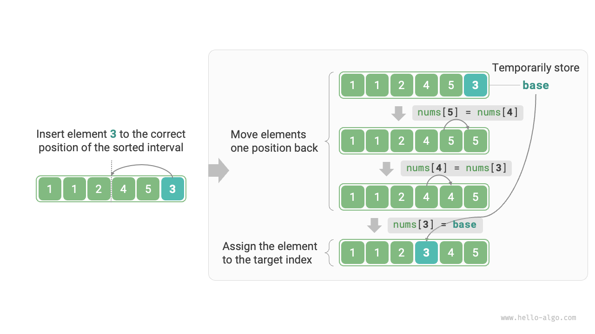
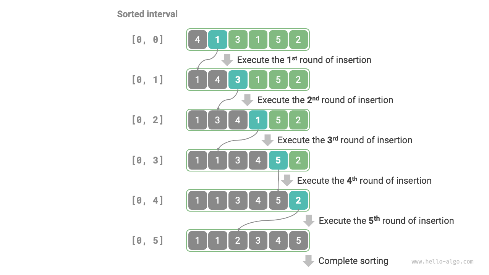

# 11.4 &nbsp; Insertion sort

<u>Insertion sort</u> là một thuật toán sắp xếp đơn giản, hoạt động rất giống
với quá trình sắp xếp thủ công một bộ bài.

Cụ thể, chúng ta chọn một phần tử cơ sở từ khoảng chưa sắp xếp, so sánh
nó với các phần tử trong khoảng đã sắp xếp ở bên trái nó, và chèn phần tử
vào vị trí chính xác.

Hình 11-6 minh họa cách một phần tử được chèn vào array. Giả sử phần tử
cơ sở là `base`, chúng ta cần dịch chuyển tất cả các phần tử từ chỉ số
mục tiêu cho đến `base` sang phải một vị trí, sau đó gán `base` vào chỉ
số mục tiêu.

{ class="animation-figure" }

<p align="center"> Hình 11-6 &nbsp; Thao tác chèn đơn lẻ </p>

```markdown
## 11.4.1 &nbsp; Quy trình thuật toán

Quy trình tổng thể của insertion sort được thể hiện trong Hình 11-7.

1. Coi phần tử đầu tiên của array là đã sắp xếp.
2. Chọn phần tử thứ hai làm `base`, chèn nó vào vị trí đúng, **khiến hai phần tử
   đầu tiên được sắp xếp**.
3. Chọn phần tử thứ ba làm `base`, chèn nó vào vị trí đúng, **khiến ba phần tử
   đầu tiên được sắp xếp**.
4. Tiếp tục theo cách này, trong lần lặp cuối cùng, phần tử cuối cùng được lấy
   làm `base`, và sau khi chèn nó vào vị trí đúng, **tất cả các phần tử được
   sắp xếp**.

{ class="animation-figure" }

<p align="center"> Hình 11-7 &nbsp; Quy trình Insertion sort </p>

Ví dụ code như sau:

=== "Python"

    ```python title="insertion_sort.py"
    def insertion_sort(nums: list[int]):
        """Insertion sort"""
        # Vòng lặp ngoài: khoảng đã sắp xếp là [0, i-1]
        for i in range(1, len(nums)):
            base = nums[i]
            j = i - 1
            # Vòng lặp trong: chèn base vào vị trí đúng trong khoảng đã sắp xếp [0, i-1]
            while j >= 0 and nums[j] > base:
                nums[j + 1] = nums[j]  # Di chuyển nums[j] sang phải một vị trí
                j -= 1
            nums[j + 1] = base  # Gán base vào vị trí đúng
    ```

=== "C++"

    ```cpp title="insertion_sort.cpp"
    /* Insertion sort */
    void insertionSort(vector<int> &nums) {
        // Vòng lặp ngoài: khoảng đã sắp xếp là [0, i-1]
        for (int i = 1; i < nums.size(); i++) {
            int base = nums[i], j = i - 1;
            // Vòng lặp trong: chèn base vào vị trí đúng trong khoảng đã sắp xếp [0, i-1]
            while (j >= 0 && nums[j] > base) {
                nums[j + 1] = nums[j]; // Di chuyển nums[j] sang phải một vị trí
                j--;
            }
            nums[j + 1] = base; // Gán base vào vị trí đúng
        }
    }
    ```

=== "Java"

    ```java title="insertion_sort.java"
    /* Insertion sort */
    void insertionSort(int[] nums) {
        // Vòng lặp ngoài: khoảng đã sắp xếp là [0, i-1]
        for (int i = 1; i < nums.length; i++) {
            int base = nums[i], j = i - 1;
            // Vòng lặp trong: chèn base vào vị trí đúng trong khoảng đã sắp xếp [0, i-1]
            while (j >= 0 && nums[j] > base) {
                nums[j + 1] = nums[j]; // Di chuyển nums[j] sang phải một vị trí
                j--;
            }
            nums[j + 1] = base;        // Gán base vào vị trí đúng
        }
    }
    ```

=== "C#"

    ```csharp title="insertion_sort.cs"
    [class]{insertion_sort}-[func]{InsertionSort}
    ```

=== "Go"

    ```go title="insertion_sort.go"
    [class]{}-[func]{insertionSort}
    ```

=== "Swift"

    ```swift title="insertion_sort.swift"
    [class]{}-[func]{insertionSort}
    ```

=== "JS"

    ```javascript title="insertion_sort.js"
    [class]{}-[func]{insertionSort}
    ```

=== "TS"

    ```typescript title="insertion_sort.ts"
    [class]{}-[func]{insertionSort}
    ```

=== "Dart"

    ```dart title="insertion_sort.dart"
    [class]{}-[func]{insertionSort}
    ```

=== "Rust"

    ```rust title="insertion_sort.rs"
    [class]{}-[func]{insertion_sort}
    ```

=== "C"

    ```c title="insertion_sort.c"
    [class]{}-[func]{insertionSort}
    ```

=== "Kotlin"

    ```kotlin title="insertion_sort.kt"
    [class]{}-[func]{insertionSort}
    ```

=== "Ruby"

    ```ruby title="insertion_sort.rb"
    [class]{}-[func]{insertion_sort}
    ```

=== "Zig"

    ```zig title="insertion_sort.zig"
    [class]{}-[func]{insertionSort}
    ```

## 11.4.2 &nbsp; Đặc điểm thuật toán

- **Time complexity là $O(n^2)$, sắp xếp thích nghi**: Trong trường hợp worst case,
  mỗi thao tác chèn yêu cầu $n - 1$, $n-2$, ..., $2$, $1$ vòng lặp,
  tổng cộng là $(n - 1) n / 2$, do đó, time complexity là $O(n^2)$.
  Trong trường hợp dữ liệu đã được sắp xếp, thao tác chèn sẽ kết thúc sớm.
  Khi input array được sắp xếp hoàn toàn, insertion sort đạt được best
  time complexity là $O(n)$.
- **Space complexity là $O(1)$, sắp xếp tại chỗ**: Các con trỏ $i$ và $j$
  sử dụng một lượng không gian bổ sung cố định.
- **Sắp xếp ổn định**: Trong quá trình thao tác chèn, chúng ta chèn các
  phần tử vào bên phải của các phần tử bằng nhau, mà không thay đổi thứ tự của chúng.

## 11.4.3 &nbsp; Ưu điểm của insertion sort

Time complexity của insertion sort là $O(n^2)$, trong khi time complexity
của quicksort, mà chúng ta sẽ nghiên cứu tiếp theo, là $O(n \log n)$.
Mặc dù insertion sort có time complexity cao hơn, **nó thường nhanh hơn
với các kích thước đầu vào nhỏ**.

Kết luận này tương tự như đối với linear search và binary search. Các thuật
toán như quicksort có time complexity là $O(n \log n)$ và dựa trên chiến
lược divide-and-conquer thường liên quan đến nhiều thao tác đơn vị hơn.
Đối với các kích thước đầu vào nhỏ, các giá trị số học của $n^2$ và
$n \log n$ gần nhau, và complexity không chiếm ưu thế, với số lượng thao tác
đơn vị mỗi vòng đóng vai trò quyết định.

Trên thực tế, nhiều ngôn ngữ lập trình (như Java) sử dụng insertion sort
trong các hàm sắp xếp tích hợp của chúng. Cách tiếp cận chung là: đối với
các array dài, sử dụng các thuật toán sắp xếp dựa trên chiến lược
divide-and-conquer, chẳng hạn như quicksort; đối với các array ngắn, sử dụng
insertion sort trực tiếp.

Mặc dù bubble sort, selection sort và insertion sort đều có time complexity
là $O(n^2)$, trên thực tế, **insertion sort được sử dụng phổ biến hơn
bubble sort và selection sort**, chủ yếu vì những lý do sau.

- Bubble sort dựa trên việc hoán đổi phần tử, đòi hỏi sử dụng một biến
  tạm thời, liên quan đến 3 thao tác đơn vị; insertion sort dựa trên việc
  gán phần tử, chỉ cần 1 thao tác đơn vị. Do đó, **overhead tính toán của
  bubble sort nói chung cao hơn insertion sort**.
- Time complexity của selection sort luôn là $O(n^2)$. **Với một tập hợp
  dữ liệu được sắp xếp một phần, insertion sort thường hiệu quả hơn
  selection sort**.
- Selection sort không ổn định và không thể áp dụng cho việc sắp xếp đa cấp.
