# 11.6 &nbsp; Merge sort

<u>Merge sort</u> là một thuật toán sắp xếp dựa trên chiến lược divide-and-conquer,
bao gồm các giai đoạn "divide" và "merge" được minh họa trong Hình 11-10.

1. **Giai đoạn divide**: Chia array một cách đệ quy từ điểm giữa, biến đổi bài
   toán sắp xếp của một array dài thành các array ngắn hơn.
2. **Giai đoạn merge**: Ngừng việc chia khi độ dài của sub-array là 1, và sau đó
   bắt đầu merge. Hai sorted array ngắn hơn liên tục được merge thành một
   sorted array dài hơn cho đến khi quá trình hoàn tất.

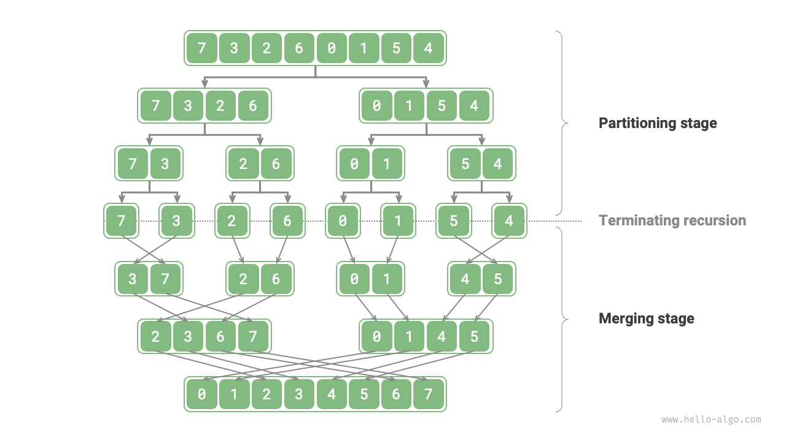{ class="animation-figure" }

<p align="center"> Hình 11-10 &nbsp; Các giai đoạn divide và merge của merge sort </p>

## 11.6.1 &nbsp; Quy trình hoạt động của thuật toán

Như minh họa trong Hình 11-11, "divide phase" (giai đoạn chia) sẽ đệ quy chia array
từ điểm giữa thành hai sub-array từ trên xuống dưới.

1. Tính điểm giữa `mid`, đệ quy chia sub-array bên trái (khoảng `[left, mid]`)
    và sub-array bên phải (khoảng `[mid + 1, right]`).
2. Tiếp tục bước `1.` một cách đệ quy cho đến khi độ dài của sub-array
    trở thành 1, sau đó dừng lại.

"Merge phase" (giai đoạn trộn) sẽ kết hợp các sub-array bên trái và bên phải
thành một mảng đã sắp xếp từ dưới lên trên. Điều quan trọng cần lưu ý là,
quá trình trộn bắt đầu với các sub-array có độ dài 1, và mỗi sub-array sẽ được
sắp xếp trong suốt giai đoạn trộn.

=== "<1>"
    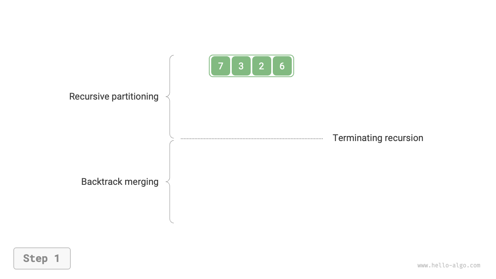{ class="animation-figure" }

=== "<2>"
    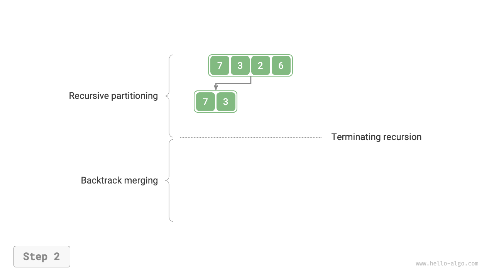{ class="animation-figure" }

=== "<3>"
    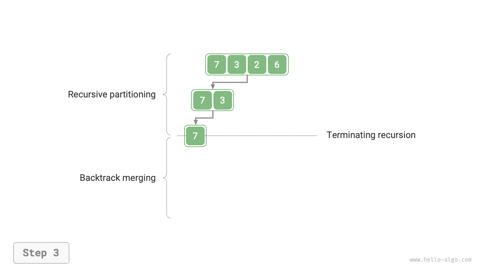{ class="animation-figure" }

=== "<4>"
    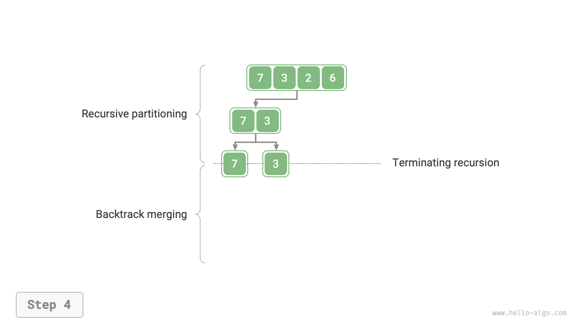{ class="animation-figure" }

=== "<5>"
    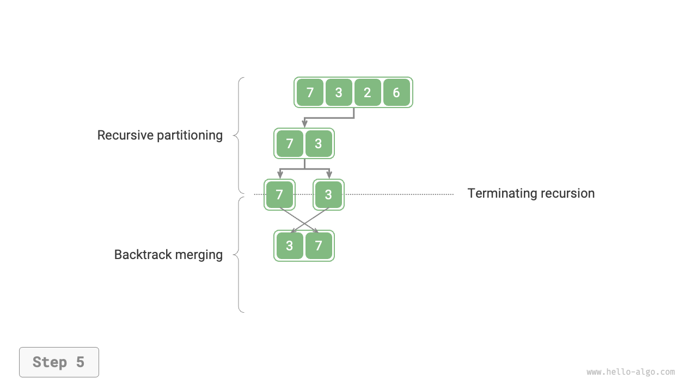{ class="animation-figure" }

=== "<6>"
    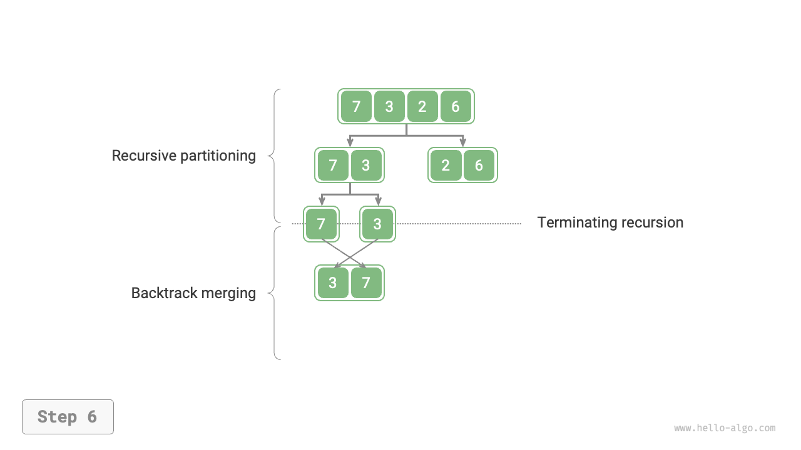{ class="animation-figure" }

=== "<7>"
    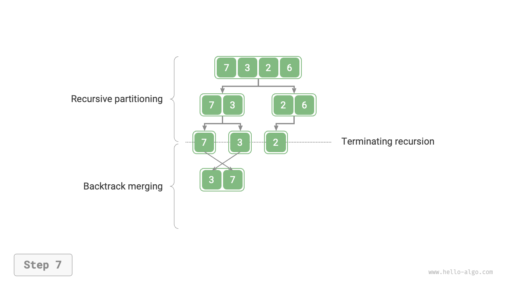{ class="animation-figure" }

=== "<8>"
    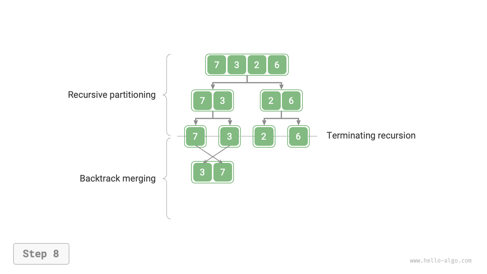{ class="animation-figure" }

=== "<9>"
    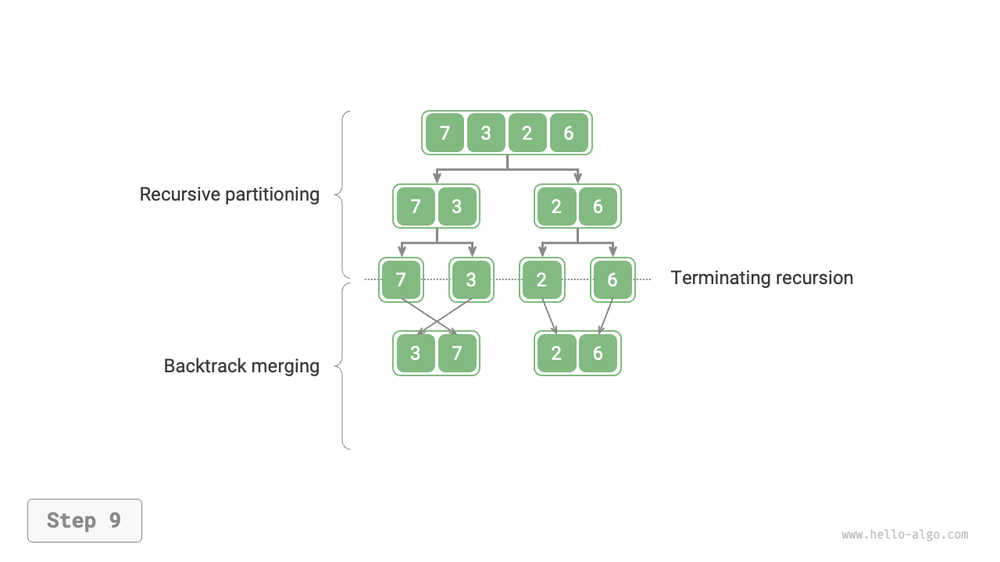{ class="animation-figure" }

=== "<10>"
    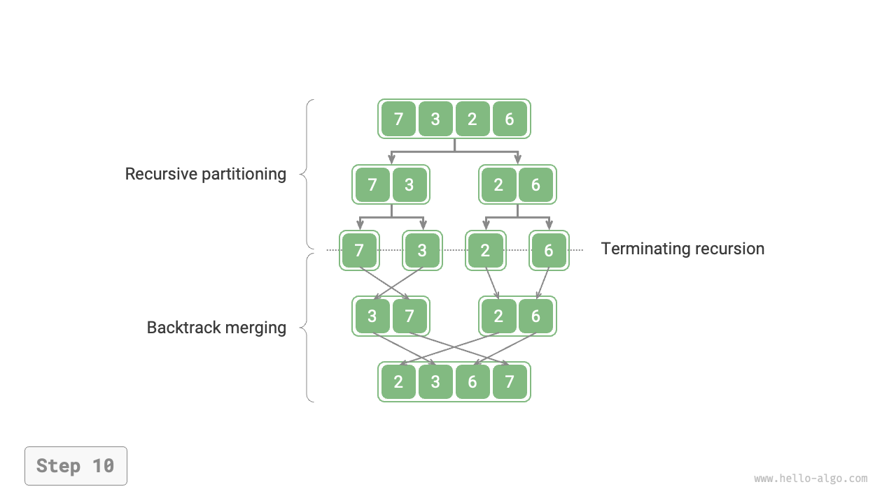{ class="animation-figure" }

<p align="center"> Hình 11-11 &nbsp; Quy trình merge sort </p>

Chúng ta có thể quan sát thấy rằng thứ tự recursion trong merge sort nhất quán với
post-order traversal của một binary tree.

- **Post-order traversal**: Đầu tiên đệ quy duyệt cây con bên trái, sau đó là
cây con bên phải, và cuối cùng xử lý node gốc.
- **Merge sort**: Đầu tiên đệ quy xử lý sub-array bên trái, sau đó là
 sub-array bên phải, và cuối cùng thực hiện thao tác trộn.

Việc triển khai merge sort được thể hiện trong đoạn code sau. Lưu ý rằng khoảng
cần trộn trong `nums` là `[left, right]`, trong khi khoảng tương ứng trong `tmp`
là `[0, right - left]`.

=== "Python"

    ```python title="merge_sort.py"
    def merge(nums: list[int], left: int, mid: int, right: int):
        """Trộn mảng con bên trái và mảng con bên phải"""
        # Khoảng của mảng con bên trái là [left, mid], khoảng của mảng con bên phải là [mid+1, right]
        # Tạo một array tạm thời tmp để lưu trữ kết quả trộn
        tmp = [0] * (right - left + 1)
        # Khởi tạo các chỉ số bắt đầu của mảng con bên trái và bên phải
        i, j, k = left, mid + 1, 0
        # Trong khi cả hai mảng con vẫn còn phần tử, so sánh và sao chép
        # phần tử nhỏ hơn vào array tạm thời
        while i <= mid and j <= right:
            if nums[i] <= nums[j]:
                tmp[k] = nums[i]
                i += 1
            else:
                tmp[k] = nums[j]
                j += 1
            k += 1
        # Sao chép các phần tử còn lại của mảng con bên trái và bên phải
        # vào array tạm thời
        while i <= mid:
            tmp[k] = nums[i]
            i += 1
            k += 1
        while j <= right:
            tmp[k] = nums[j]
            j += 1
            k += 1
        # Sao chép các phần tử từ array tạm thời tmp trở lại array gốc nums
        # tại khoảng tương ứng
        for k in range(0, len(tmp)):
            nums[left + k] = tmp[k]

    def merge_sort(nums: list[int], left: int, right: int):
        """Thuật toán merge sort"""
        # Điều kiện dừng
        if left >= right:
            return  # Dừng đệ quy khi độ dài mảng con là 1
        # Giai đoạn phân hoạch
        mid = left + (right - left) // 2  # Tính điểm giữa
        merge_sort(nums, left, mid)  # Xử lý đệ quy mảng con bên trái
        merge_sort(nums, mid + 1, right)  # Xử lý đệ quy mảng con bên phải
        # Giai đoạn trộn
        merge(nums, left, mid, right)
    ```

=== "C++"

    ```cpp title="merge_sort.cpp"
    /* Trộn array con bên trái và array con bên phải */
    void merge(vector<int> &nums, int left, int mid, int right) {
        // Khoảng của array con bên trái là [left, mid], khoảng của array con bên phải là [mid+1, right]
        // Tạo một array tạm thời tmp để lưu trữ kết quả trộn
        vector<int> tmp(right - left + 1);
        // Khởi tạo các chỉ số bắt đầu của array con bên trái và bên phải
        int i = left, j = mid + 1, k = 0;
        // Chừng nào cả hai array con vẫn còn phần tử, so sánh và sao chép
        // phần tử nhỏ hơn vào array tạm thời
        while (i <= mid && j <= right) {
            if (nums[i] <= nums[j])
                tmp[k++] = nums[i++];
            else
                tmp[k++] = nums[j++];
        }
        // Sao chép các phần tử còn lại của array con bên trái và array con bên phải
        // vào array tạm thời
        while (i <= mid) {
            tmp[k++] = nums[i++];
        }
        while (j <= right) {
            tmp[k++] = nums[j++];
        }
        // Sao chép các phần tử từ array tạm thời tmp trở lại array ban đầu nums
        // tại khoảng tương ứng
        for (k = 0; k < tmp.size(); k++) {
            nums[left + k] = tmp[k];
        }
    }

    /* Thuật toán merge sort */
    void mergeSort(vector<int> &nums, int left, int right) {
        // Điều kiện dừng
        if (left >= right)
            return; // Dừng đệ quy khi độ dài array con là 1
        // Giai đoạn phân hoạch
        int mid = left + (right - left) / 2;    // Tính điểm giữa
        mergeSort(nums, left, mid);      // Xử lý đệ quy array con bên trái
        mergeSort(nums, mid + 1, right); // Xử lý đệ quy array con bên phải
        // Giai đoạn trộn
        merge(nums, left, mid, right);
    }
    ```

=== "Java"

    ```java title="merge_sort.java"
    /* Trộn array con bên trái và array con bên phải */
    void merge(int[] nums, int left, int mid, int right) {
        // Khoảng của array con bên trái là [left, mid], khoảng của array con bên phải là [mid+1, right]
        // Tạo một array tạm thời tmp để lưu trữ kết quả trộn
        int[] tmp = new int[right - left + 1];
        // Khởi tạo các chỉ số bắt đầu của array con bên trái và bên phải
        int i = left, j = mid + 1, k = 0;
        // Chừng nào cả hai array con vẫn còn phần tử, so sánh và sao chép
        // phần tử nhỏ hơn vào array tạm thời
        while (i <= mid && j <= right) {
            if (nums[i] <= nums[j])
                tmp[k++] = nums[i++];
            else
                tmp[k++] = nums[j++];
        }
        // Sao chép các phần tử còn lại của array con bên trái và array con bên phải
        // vào array tạm thời
        while (i <= mid) {
            tmp[k++] = nums[i++];
        }
        while (j <= right) {
            tmp[k++] = nums[j++];
        }
        // Sao chép các phần tử từ array tạm thời tmp trở lại array ban đầu nums
        // tại khoảng tương ứng
        for (k = 0; k < tmp.length; k++) {
            nums[left + k] = tmp[k];
        }
    }

    /* Merge sort */
    void mergeSort(int[] nums, int left, int right) {
        // Điều kiện dừng
        if (left >= right)
            return; // Dừng đệ quy khi độ dài mảng con là 1
        // Giai đoạn phân hoạch
        int mid = left + (right - left) / 2; // Tính điểm giữa
        mergeSort(nums, left, mid); // Xử lý đệ quy mảng con bên trái
        mergeSort(nums, mid + 1, right); // Xử lý đệ quy mảng con bên phải
        // Giai đoạn trộn
        merge(nums, left, mid, right);
    }
    ```

=== "C#"

    ```csharp title="merge_sort.cs"
    [class]{merge_sort}-[func]{Merge}

    [class]{merge_sort}-[func]{MergeSort}
    ```

=== "Go"

    ```go title="merge_sort.go"
    [class]{}-[func]{merge}

    [class]{}-[func]{mergeSort}
    ```

=== "Swift"

    ```swift title="merge_sort.swift"
    [class]{}-[func]{merge}

    [class]{}-[func]{mergeSort}
    ```

=== "JS"

    ```javascript title="merge_sort.js"
    [class]{}-[func]{merge}

    [class]{}-[func]{mergeSort}
    ```

=== "TS"

    ```typescript title="merge_sort.ts"
    [class]{}-[func]{merge}

    [class]{}-[func]{mergeSort}
    ```

=== "Dart"

    ```dart title="merge_sort.dart"
    [class]{}-[func]{merge}

    [class]{}-[func]{mergeSort}
    ```

=== "Rust"

    ```rust title="merge_sort.rs"
    [class]{}-[func]{merge}

    [class]{}-[func]{merge_sort}
    ```

=== "C"

    ```c title="merge_sort.c"
    [class]{}-[func]{merge}

    [class]{}-[func]{mergeSort}
    ```

=== "Kotlin"

    ```kotlin title="merge_sort.kt"
    [class]{}-[func]{merge}

    [class]{}-[func]{mergeSort}
    ```

=== "Ruby"

    ```ruby title="merge_sort.rb"
    [class]{}-[func]{merge}

    [class]{}-[func]{merge_sort}
    ```

=== "Zig"

    ```zig title="merge_sort.zig"
    [class]{}-[func]{merge}

    [class]{}-[func]{mergeSort}
    ```

## 11.6.2 &nbsp; Đặc điểm của thuật toán

- **Time complexity là $O(n \log n)$, thuật toán sắp xếp không thích ứng**:
  Việc chia tạo ra một cây đệ quy có chiều cao $\log n$, với mỗi tầng
  trộn tổng cộng $n$ phép toán, dẫn đến time complexity tổng thể là
  $O(n \log n)$.
- **Space complexity là $O(n)$, thuật toán sắp xếp không tại chỗ**:
  Độ sâu đệ quy là $\log n$, sử dụng $O(\log n)$ không gian khung stack.
  Thao tác trộn yêu cầu array phụ trợ, sử dụng thêm $O(n)$ không gian.
- **Thuật toán sắp xếp ổn định**:
  Trong quá trình trộn, thứ tự của các phần tử bằng nhau vẫn được giữ
  nguyên.

## 11.6.3 &nbsp; Sắp xếp Linked List

Đối với linked lists, merge sort có những lợi thế đáng kể so với các
thuật toán sắp xếp khác. **Nó có thể tối ưu hóa space complexity của
tác vụ sắp xếp linked list xuống $O(1)$**.

- **Giai đoạn chia**: "Iteration" có thể được sử dụng thay vì "recursion"
  để thực hiện công việc chia linked list, do đó tiết kiệm không gian
  stack frame được sử dụng bởi recursion.
- **Giai đoạn trộn**: Trong linked lists, các thao tác chèn và xóa node
  có thể được thực hiện bằng cách thay đổi các tham chiếu (con trỏ),
  vì vậy không cần tạo các lists bổ sung trong giai đoạn trộn (kết hợp
  hai danh sách đã sắp xếp ngắn thành một danh sách đã sắp xếp dài).

Các chi tiết triển khai tương đối phức tạp, và những độc giả
quan tâm có thể tham khảo các tài liệu liên quan để tìm hiểu.
