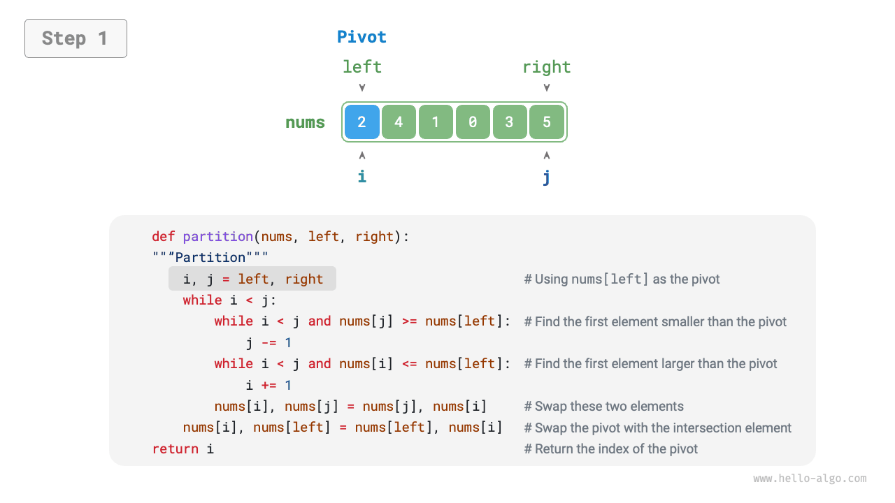
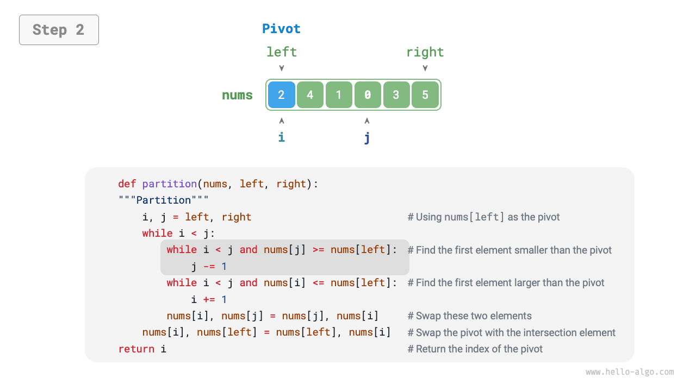
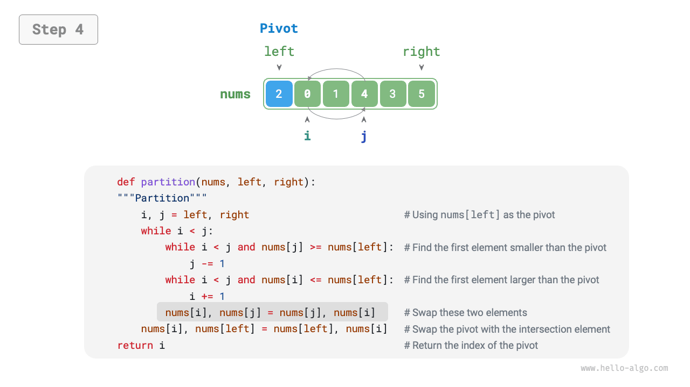
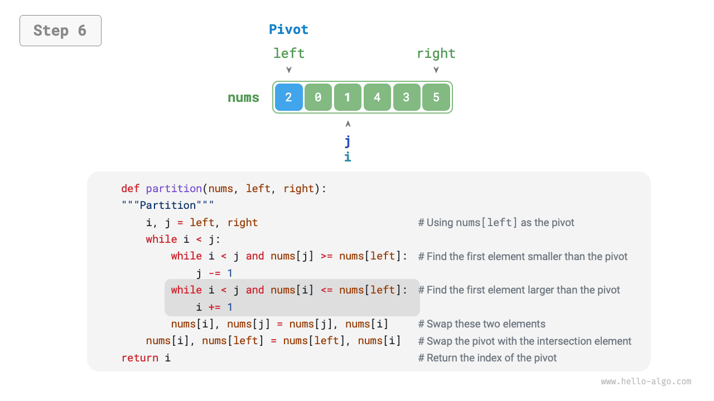
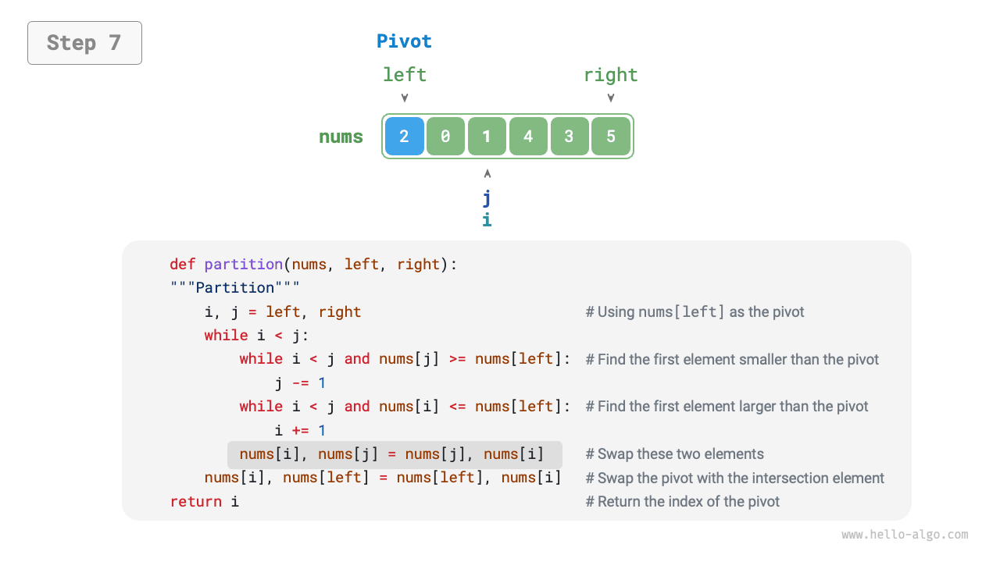
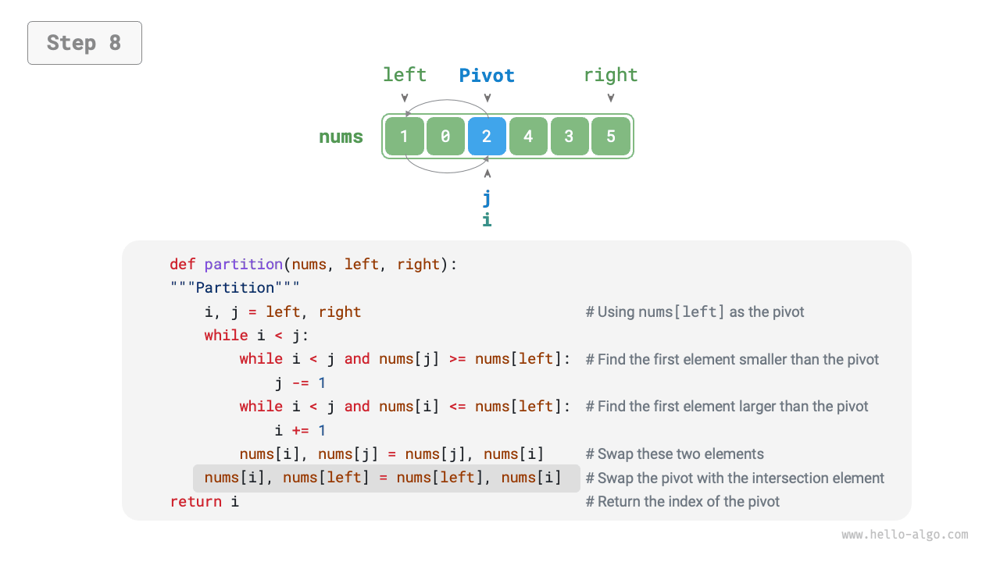
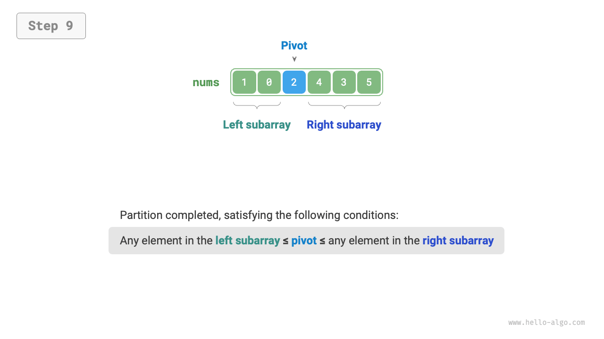
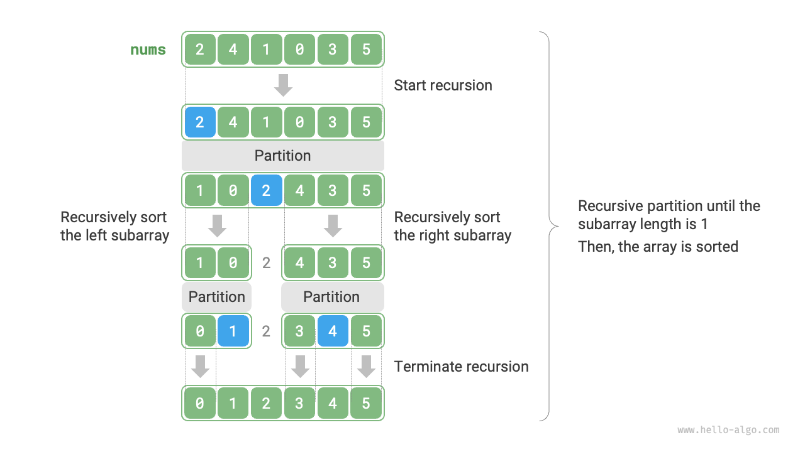

# 11.5 &nbsp; Quick sort

<u>Quick sort</u> là một thuật toán sắp xếp dựa trên chiến lược chia để trị,
nổi tiếng về tính hiệu quả và ứng dụng rộng rãi.

Thao tác cốt lõi của quick sort là "phân hoạch pivot", nhằm mục đích chọn
một phần tử từ array làm "pivot" và di chuyển tất cả các phần tử nhỏ hơn
pivot sang phía bên trái của nó, trong khi di chuyển tất cả các phần tử
lớn hơn pivot sang phía bên phải của nó. Cụ thể, quá trình phân hoạch
pivot được minh họa trong Hình 11-8.

1. Chọn phần tử ngoài cùng bên trái của array làm pivot, và khởi tạo
hai con trỏ `i` và `j` để trỏ đến hai đầu của array tương ứng.
2. Thiết lập một vòng lặp trong đó mỗi vòng sử dụng `i` (`j`) để tìm kiếm
phần tử đầu tiên lớn hơn (nhỏ hơn) pivot, sau đó hoán đổi hai phần tử này.
3. Lặp lại bước `2.` cho đến khi `i` và `j` gặp nhau, cuối cùng hoán đổi
pivot vào ranh giới giữa hai sub-array.

=== "<1>"
    { class="animation-figure" }

=== "<2>"
    { class="animation-figure" }

=== "<3>"
    { class="animation-figure" }

=== "<4>"
    { class="animation-figure" }

=== "<5>"
    { class="animation-figure" }

=== "<6>"
    { class="animation-figure" }

=== "<7>"
    { class="animation-figure" }

=== "<8>"
    { class="animation-figure" }

=== "<9>"
    { class="animation-figure" }

<p align="center"> Hình 11-8 &nbsp; Quá trình phân hoạch pivot </p>

Sau khi phân hoạch pivot, array ban đầu được chia thành ba phần:
left sub-array, pivot, và right sub-array, thỏa mãn "bất kỳ phần tử nào
trong left sub-array $\leq$ pivot $\leq$ bất kỳ phần tử nào trong
right sub-array." Do đó, chúng ta sau đó chỉ cần sắp xếp hai sub-array này.

!!! note "Chiến lược chia để trị cho quick sort"

    Bản chất của phân hoạch pivot là đơn giản hóa bài toán sắp xếp của
    một array dài hơn thành hai array ngắn hơn.

=== "Python"

    ```python title="quick_sort.py"
    def partition(self, nums: list[int], left: int, right: int) -> int:
        """Phân hoạch"""
        # Sử dụng nums[left] làm chốt (pivot)
        i, j = left, right
        while i < j:
            while i < j and nums[j] >= nums[left]:
                j -= 1  # Tìm từ phải sang trái phần tử đầu tiên nhỏ hơn pivot
            while i < j and nums[i] <= nums[left]:
                i += 1  # Tìm từ trái sang phải phần tử đầu tiên lớn hơn pivot
            # Hoán đổi các phần tử
            nums[i], nums[j] = nums[j], nums[i]
        # Hoán đổi pivot về vị trí biên giữa hai mảng con
        nums[i], nums[left] = nums[left], nums[i]
        return i  # Trả về chỉ số của pivot
    ```

=== "C++"

    ```cpp title="quick_sort.cpp"
    /* Phân hoạch */
    int partition(vector<int> &nums, int left, int right) {
        // Sử dụng nums[left] làm chốt (pivot)
        int i = left, j = right;
        while (i < j) {
            while (i < j && nums[j] >= nums[left])
                j--; // Tìm từ phải sang trái phần tử đầu tiên nhỏ hơn pivot
            while (i < j && nums[i] <= nums[left])
                i++;          // Tìm từ trái sang phải phần tử đầu tiên lớn hơn pivot
            swap(nums, i, j); // Hoán đổi hai phần tử này
        }
        swap(nums, i, left); // Hoán đổi pivot về vị trí biên giữa hai mảng con
        return i;            // Trả về chỉ số của pivot
    }
    ```

=== "Java"

    ```java title="quick_sort.java"
    /* Hoán đổi các phần tử */
    void swap(int[] nums, int i, int j) {
        int tmp = nums[i];
        nums[i] = nums[j];
        nums[j] = tmp;
    }

    /* Phân hoạch */
    int partition(int[] nums, int left, int right) {
        // Sử dụng nums[left] làm chốt (pivot)
        int i = left, j = right;
        while (i < j) {
            while (i < j && nums[j] >= nums[left])
                j--;          // Tìm từ phải sang trái phần tử đầu tiên nhỏ hơn pivot
            while (i < j && nums[i] <= nums[left])
                i++;          // Tìm từ trái sang phải phần tử đầu tiên lớn hơn pivot
            swap(nums, i, j); // Hoán đổi hai phần tử này
        }
        swap(nums, i, left);  // Hoán đổi pivot về vị trí biên giữa hai mảng con
        return i;             // Trả về chỉ số của pivot
    }
    ```

=== "C#"

    ```csharp title="quick_sort.cs"
    [class]{quickSort}-[func]{Swap}

    [class]{quickSort}-[func]{Partition}
    ```

=== "Go"

    ```go title="quick_sort.go"
    [class]{quickSort}-[func]{partition}
    ```

=== "Swift"

    ```swift title="quick_sort.swift"
    [class]{}-[func]{partition}
    ```

=== "JS"

    ```javascript title="quick_sort.js"
    [class]{QuickSort}-[func]{swap}

    [class]{QuickSort}-[func]{partition}
    ```

=== "TS"

    ```typescript title="quick_sort.ts"
    [class]{QuickSort}-[func]{swap}

    [class]{QuickSort}-[func]{partition}
    ```

=== "Dart"

    ```dart title="quick_sort.dart"
    [class]{QuickSort}-[func]{_swap}

    [class]{QuickSort}-[func]{_partition}
    ```

=== "Rust"

    ```rust title="quick_sort.rs"
    [class]{QuickSort}-[func]{partition}
    ```

=== "C"

    ```c title="quick_sort.c"
    [class]{}-[func]{swap}

    [class]{}-[func]{partition}
    ```

=== "Kotlin"

    ```kotlin title="quick_sort.kt"
    [class]{}-[func]{swap}

    [class]{}-[func]{partition}
    ```

=== "Ruby"

    ```ruby title="quick_sort.rb"
    [class]{QuickSort}-[func]{partition}
    ```

=== "Zig"

    ```zig title="quick_sort.zig"
    [class]{QuickSort}-[func]{swap}

    [class]{QuickSort}-[func]{partition}
    ```

## 11.5.1 &nbsp; Quá trình thuật toán

Quá trình tổng thể của quick sort được minh họa trong Hình 11-9.

1. Đầu tiên, thực hiện "phân hoạch chốt" trên array gốc để thu được các
   sub-array con trái và phải chưa được sắp xếp.
2. Sau đó, đệ quy thực hiện "phân hoạch chốt" trên các sub-array con trái và
   phải một cách riêng biệt.
3. Tiếp tục đệ quy cho đến khi độ dài của sub-array là 1, qua đó hoàn thành
   việc sắp xếp toàn bộ array.

{ class="animation-figure" }

<p align="center"> Hình 11-9 &nbsp; Quá trình quick sort </p>

=== "Python"

    ```python title="quick_sort.py"
    def quick_sort(self, nums: list[int], left: int, right: int):
        """Quick sort"""
        # Dừng đệ quy khi độ dài của sub-array là 1
        if left >= right:
            return
        # Phân hoạch
        pivot = self.partition(nums, left, right)
        # Đệ quy xử lý sub-array con trái và sub-array con phải
        self.quick_sort(nums, left, pivot - 1)
        self.quick_sort(nums, pivot + 1, right)
    ```

=== "C++"

    ```cpp title="quick_sort.cpp"
    /* Quick sort */
    void quickSort(vector<int> &nums, int left, int right) {
        // Dừng đệ quy khi độ dài của sub-array là 1
        if (left >= right)
            return;
        // Phân hoạch
        int pivot = partition(nums, left, right);
        // Đệ quy xử lý sub-array con trái và sub-array con phải
        quickSort(nums, left, pivot - 1);
        quickSort(nums, pivot + 1, right);
    }
    ```

=== "Java"

    ```java title="quick_sort.java"
    /* Quick sort */
    void quickSort(int[] nums, int left, int right) {
        // Dừng đệ quy khi độ dài của sub-array là 1
        if (left >= right)
            return;
        // Phân hoạch
        int pivot = partition(nums, left, right);
        // Đệ quy xử lý sub-array con trái và sub-array con phải
        quickSort(nums, left, pivot - 1);
        quickSort(nums, pivot + 1, right);
    }
    ```

=== "C#"

    ```csharp title="quick_sort.cs"
    [class]{quickSort}-[func]{QuickSort}
    ```

=== "Go"

    ```go title="quick_sort.go"
    [class]{quickSort}-[func]{quickSort}
    ```

=== "Swift"

    ```swift title="quick_sort.swift"
    [class]{}-[func]{quickSort}
    ```

=== "JS"

    ```javascript title="quick_sort.js"
    [class]{QuickSort}-[func]{quickSort}
    ```

=== "TS"

    ```typescript title="quick_sort.ts"
    [class]{QuickSort}-[func]{quickSort}
    ```

=== "Dart"

    ```dart title="quick_sort.dart"
    [class]{QuickSort}-[func]{quickSort}
    ```

=== "Rust"

    ```rust title="quick_sort.rs"
    [class]{QuickSort}-[func]{quick_sort}
    ```

=== "C"

    ```c title="quick_sort.c"
    [class]{}-[func]{quickSort}
    ```

=== "Kotlin"

    ```kotlin title="quick_sort.kt"
    [class]{}-[func]{quickSort}
    ```

=== "Ruby"

    ```ruby title="quick_sort.rb"
    [class]{QuickSort}-[func]{quick_sort}
    ```

=== "Zig"

    ```zig title="quick_sort.zig"
    [class]{QuickSort}-[func]{quickSort}
    ```

## 11.5.2 &nbsp; Đặc điểm của thuật toán

- **Time complexity là $O(n \log n)$, sắp xếp không thích nghi**: Trong trường hợp
  trung bình, các cấp độ đệ quy của phân hoạch pivot là $\log n$, và tổng số vòng
  lặp trên mỗi cấp độ là $n$, sử dụng tổng cộng $O(n \log n)$ time. Trong worst
  case, mỗi vòng phân hoạch pivot chia một array có độ dài $n$ thành hai mảng
  con có độ dài $0$ và $n - 1$, khi số cấp độ đệ quy đạt đến $n$, số vòng lặp
  trong mỗi cấp độ là $n$, và tổng thời gian sử dụng là $O(n^2)$.
- **Space complexity là $O(n)$, sắp xếp tại chỗ**: Trong trường hợp array đầu
  vào bị đảo ngược hoàn toàn, độ sâu đệ quy worst case đạt đến $n$, sử dụng $O(n)$
  không gian khung stack. Thao tác sắp xếp được thực hiện trên array gốc mà không
  cần sự trợ giúp của các array bổ sung.
- **Sắp xếp không ổn định**: Trong bước cuối cùng của phân hoạch pivot, pivot có
  thể bị hoán đổi sang bên phải của các phần tử bằng nhau.

## 11.5.3 &nbsp; Tại sao quick sort lại nhanh

Đúng như tên gọi, quick sort có những lợi thế nhất định về mặt hiệu suất.
Mặc dù time complexity trung bình của quick sort tương đương với merge sort
và heap sort, nhưng nó thường hiệu quả hơn vì những lý do sau.

- **Xác suất xảy ra trường hợp worst case thấp**: Mặc dù worst time complexity
  của quick sort là $O(n^2)$, kém ổn định hơn merge sort, nhưng trong hầu hết
  các trường hợp, quick sort có thể hoạt động với time complexity là
  $O(n \log n)$.
- **Tận dụng bộ nhớ cache cao**: Trong quá trình hoạt động phân hoạch theo pivot,
  hệ thống có thể tải toàn bộ sub-array vào bộ nhớ cache, từ đó truy cập các
  phần tử hiệu quả hơn. Ngược lại, các thuật toán như heap sort cần truy cập
  các phần tử một cách nhảy cóc, thiếu đi đặc điểm này.
- **Hệ số hằng số độ phức tạp nhỏ**: Trong số ba thuật toán đã đề cập ở trên,
quick sort có tổng số phép toán như so sánh, gán và hoán đổi ít nhất.
Điều này tương tự như lý do tại sao insertion sort nhanh hơn bubble sort.

## 11.5.4 &nbsp; Tối ưu hóa pivot

**Hiệu suất thời gian của quick sort có thể giảm sút với một số đầu vào
nhất định**. Ví dụ, nếu array (mảng) đầu vào bị đảo ngược hoàn toàn,
vì chúng ta chọn phần tử ngoài cùng bên trái làm pivot (phần tử chốt),
sau khi phân hoạch pivot, pivot được hoán đổi đến cuối bên phải của array,
làm cho độ dài của sub-array (mảng con) bên trái là $n - 1$ và độ dài
của sub-array bên phải là $0$. Tiếp tục theo cách này, mỗi vòng phân
hoạch pivot sẽ có độ dài sub-array là $0$, và chiến lược
divide-and-conquer (chia để trị) thất bại, làm cho quick sort suy giảm
thành một dạng tương tự như "bubble sort."

Để tránh tình huống này, **chúng ta có thể tối ưu hóa chiến lược chọn
pivot trong quá trình phân hoạch pivot**. Ví dụ, chúng ta có thể chọn
ngẫu nhiên một phần tử làm pivot. Tuy nhiên, nếu may mắn không đứng về
phía chúng ta, và chúng ta liên tục chọn các pivot không tối ưu, hiệu
suất vẫn không đạt yêu cầu.

Điều quan trọng cần lưu ý là các ngôn ngữ lập trình thường tạo ra "số
giả ngẫu nhiên". Nếu chúng ta xây dựng một trường hợp kiểm thử cụ thể
cho một chuỗi số giả ngẫu nhiên, hiệu suất của quick sort vẫn có thể
giảm sút.

Để cải thiện thêm, chúng ta có thể chọn ba phần tử ứng cử viên (thường
là phần tử đầu tiên, cuối cùng và giữa của array), **và sử dụng median
(trung vị) của ba phần tử ứng cử viên này làm pivot**. Bằng cách này,
xác suất pivot "không quá nhỏ cũng không quá lớn" sẽ được tăng lên đáng
kể. Tất nhiên, chúng ta cũng có thể chọn nhiều phần tử ứng cử viên hơn
để tăng cường hơn nữa tính mạnh mẽ của thuật toán. Với phương pháp này,
xác suất time complexity giảm xuống $O(n^2)$ được giảm đi đáng kể.

Mã mẫu như sau:

=== "Python"

    ```python title="quick_sort.py"
    def median_three(self, nums: list[int], left: int, mid: int, right: int) -> int:
        """Chọn median của ba phần tử ứng cử viên"""
        l, m, r = nums[left], nums[mid], nums[right]
        if (l <= m <= r) or (r <= m <= l):
            return mid  # m nằm giữa l và r
        if (m <= l <= r) or (r <= l <= m):
            return left  # l nằm giữa m và r
        return right

    def partition(self, nums: list[int], left: int, right: int) -> int:
        """Phân hoạch (median của ba phần tử)"""
        # Sử dụng nums[left] làm pivot
        med = self.median_three(nums, left, (left + right) // 2, right)
        # Hoán đổi median sang vị trí ngoài cùng bên trái của array
        nums[left], nums[med] = nums[med], nums[left]
        # Sử dụng nums[left] làm pivot
        i, j = left, right
        while i < j:
            while i < j and nums[j] >= nums[left]:
                j -= 1  # Tìm từ phải sang trái phần tử đầu tiên nhỏ hơn pivot
            while i < j and nums[i] <= nums[left]:
                i += 1  # Tìm từ trái sang phải phần tử đầu tiên lớn hơn pivot
            # Hoán đổi các phần tử
            nums[i], nums[j] = nums[j], nums[i]
        # Hoán đổi pivot về ranh giới giữa hai subarray
        nums[i], nums[left] = nums[left], nums[i]
        return i  # Trả về chỉ số của pivot
    ```

=== "C++"

    ```cpp title="quick_sort.cpp"
    /* Chọn median của ba phần tử ứng cử viên */
    int medianThree(vector<int> &nums, int left, int mid, int right) {
        int l = nums[left], m = nums[mid], r = nums[right];
        if ((l <= m && m <= r) || (r <= m && m <= l))
            return mid; // m nằm giữa l và r
        if ((m <= l && l <= r) || (r <= l && l <= m))
            return left; // l nằm giữa m và r
        return right;
    }

    /* Phân hoạch (median của ba phần tử) */
    int partition(vector<int> &nums, int left, int right) {
        // Chọn median của ba phần tử ứng cử viên
        int med = medianThree(nums, left, (left + right) / 2, right);
        // Hoán đổi median về vị trí ngoài cùng bên trái của array
        swap(nums, left, med);
        // Sử dụng nums[left] làm pivot
        int i = left, j = right;
        while (i < j) {
            while (i < j && nums[j] >= nums[left])
                j--; // Tìm từ phải sang trái phần tử đầu tiên nhỏ hơn pivot
            while (i < j && nums[i] <= nums[left])
                i++;          // Tìm từ trái sang phải phần tử đầu tiên lớn hơn pivot
            swap(nums, i, j); // Hoán đổi hai phần tử này
        }
        swap(nums, i, left); // Hoán đổi pivot về ranh giới giữa hai subarray
        return i;            // Trả về chỉ số của pivot
    }
    ```

=== "Java"

    ```java title="quick_sort.java"
    /* Chọn median của ba phần tử ứng cử viên */
    int medianThree(int[] nums, int left, int mid, int right) {
        int l = nums[left], m = nums[mid], r = nums[right];
        if ((l <= m && m <= r) || (r <= m && m <= l))
            return mid; // m nằm giữa l và r
        if ((m <= l && l <= r) || (r <= l && l <= m))
            return left; // l nằm giữa m và r
        return right;
    }

    /* Phân hoạch (trung vị của ba) */
    int partition(int[] nums, int left, int right) {
        // Chọn trung vị của ba phần tử ứng cử viên
        int med = medianThree(nums, left, (left + right) / 2, right);
        // Hoán đổi trung vị đến vị trí ngoài cùng bên trái của array
        swap(nums, left, med);
        // Sử dụng nums[left] làm pivot
        int i = left, j = right;
        while (i < j) {
            while (i < j && nums[j] >= nums[left])
                j--;          // Tìm kiếm từ phải sang trái để tìm phần tử đầu tiên nhỏ hơn pivot
            while (i < j && nums[i] <= nums[left])
                i++;          // Tìm kiếm từ trái sang phải để tìm phần tử đầu tiên lớn hơn pivot
            swap(nums, i, j); // Hoán đổi hai phần tử này
        }
        swap(nums, i, left);  // Hoán đổi pivot đến ranh giới giữa hai subarray
        return i;             // Trả về chỉ số của pivot
    }
    ```

=== "C#"

    ```csharp title="quick_sort.cs"
    [class]{QuickSortMedian}-[func]{MedianThree}

    [class]{QuickSortMedian}-[func]{Partition}
    ```

=== "Go"

    ```go title="quick_sort.go"
    [class]{quickSortMedian}-[func]{medianThree}

    [class]{quickSortMedian}-[func]{partition}
    ```

=== "Swift"

    ```swift title="quick_sort.swift"
    [class]{}-[func]{medianThree}

    [class]{}-[func]{partitionMedian}
    ```

=== "JS"

    ```javascript title="quick_sort.js"
    [class]{QuickSortMedian}-[func]{medianThree}

    [class]{QuickSortMedian}-[func]{partition}
    ```

=== "TS"

    ```typescript title="quick_sort.ts"
    [class]{QuickSortMedian}-[func]{medianThree}

    [class]{QuickSortMedian}-[func]{partition}
    ```

=== "Dart"

    ```dart title="quick_sort.dart"
    [class]{QuickSortMedian}-[func]{_medianThree}

    [class]{QuickSortMedian}-[func]{_partition}
    ```

=== "Rust"

    ```rust title="quick_sort.rs"
    [class]{QuickSortMedian}-[func]{median_three}

    [class]{QuickSortMedian}-[func]{partition}
    ```

=== "C"

    ```c title="quick_sort.c"
    [class]{}-[func]{medianThree}

    [class]{}-[func]{partitionMedian}
    ```

=== "Kotlin"

    ```kotlin title="quick_sort.kt"
    [class]{}-[func]{medianThree}

    [class]{}-[func]{partitionMedian}
    ```

=== "Ruby"

    ```ruby title="quick_sort.rb"
    [class]{QuickSortMedian}-[func]{median_three}

    [class]{QuickSortMedian}-[func]{partition}
    ```

=== "Zig"

    ```zig title="quick_sort.zig"
    [class]{QuickSortMedian}-[func]{medianThree}

    [class]{QuickSortMedian}-[func]{partition}
    ```

## 11.5.5 &nbsp; Tối ưu hóa đệ quy đuôi

**Trong một số trường hợp đầu vào nhất định, quick sort có thể chiếm nhiều không gian hơn**.
Ví dụ, hãy xem xét một array đầu vào đã được sắp xếp hoàn toàn. Giả sử độ dài
của sub-array trong đệ quy là $m$. Trong mỗi vòng phân hoạch (partitioning)
pivot, một sub-array bên trái có độ dài $0$ và một sub-array bên phải có độ dài
$m - 1$ được tạo ra. Điều này có nghĩa là kích thước bài toán chỉ giảm đi một
phần tử (element) sau mỗi lời gọi đệ quy, dẫn đến việc giảm rất ít ở mỗi cấp độ
đệ quy. Kết quả là, chiều cao của cây đệ quy (recursion tree) có thể đạt đến
$n - 1$, đòi hỏi $O(n)$ không gian stack frame.

Để ngăn chặn sự tích lũy không gian stack frame, chúng ta có thể so sánh độ dài
của hai sub-array sau mỗi vòng sắp xếp pivot, **và chỉ sắp xếp đệ quy
(recursively sort) sub-array ngắn hơn**. Vì độ dài của sub-array ngắn hơn sẽ
không vượt quá $n / 2$, phương pháp này đảm bảo rằng độ sâu đệ quy (recursion
depth) không vượt quá $\log n$, từ đó tối ưu hóa worst space complexity thành
$O(\log n)$. Đoạn code như sau:

=== "Python"

    ```python title="quick_sort.py"
    def quick_sort(self, nums: list[int], left: int, right: int):
        """quick sort (tối ưu hóa đệ quy đuôi)"""
        # Kết thúc khi độ dài sub-array là 1
        while left < right:
            # Thao tác phân hoạch (partition)
            pivot = self.partition(nums, left, right)
            # Thực hiện quick sort trên sub-array ngắn hơn trong hai sub-array
            if pivot - left < right - pivot:
                self.quick_sort(nums, left, pivot - 1)  # Sắp xếp đệ quy sub-array bên trái
                left = pivot + 1  # Khoảng chưa sắp xếp còn lại là [pivot + 1, right]
            else:
                self.quick_sort(nums, pivot + 1, right)  # Sắp xếp đệ quy sub-array bên phải
                right = pivot - 1  # Khoảng chưa sắp xếp còn lại là [left, pivot - 1]
    ```

=== "C++"

    ```cpp title="quick_sort.cpp"
    /* quick sort (tối ưu hóa đệ quy đuôi) */
    void quickSort(vector<int> &nums, int left, int right) {
        // Kết thúc khi độ dài sub-array là 1
        while (left < right) {
            // Thao tác phân hoạch (partition)
            int pivot = partition(nums, left, right);
            // Thực hiện quick sort trên sub-array ngắn hơn trong hai sub-array
            if (pivot - left < right - pivot) {
                quickSort(nums, left, pivot - 1); // Sắp xếp đệ quy sub-array bên trái
                left = pivot + 1;                 // Khoảng chưa sắp xếp còn lại là [pivot + 1, right]
            } else {
                quickSort(nums, pivot + 1, right); // Sắp xếp đệ quy sub-array bên phải
                right = pivot - 1;                 // Khoảng chưa sắp xếp còn lại là [left, pivot - 1]
            }
        }
    }
    ```

=== "Java"

    ```java title="quick_sort.java"
    /* Quick sort (tối ưu đệ quy đuôi) */
    void quickSort(int[] nums, int left, int right) {
        // Kết thúc khi độ dài mảng con là 1
        while (left < right) {
            // Thao tác phân hoạch
            int pivot = partition(nums, left, right);
            // Thực hiện quick sort trên mảng con ngắn hơn trong hai mảng con
            if (pivot - left < right - pivot) {
                quickSort(nums, left, pivot - 1); // Đệ quy sắp xếp mảng con bên trái
                left = pivot + 1; // Khoảng chưa sắp xếp còn lại là [pivot + 1, right]
            } else {
                quickSort(nums, pivot + 1, right); // Đệ quy sắp xếp mảng con bên phải
                right = pivot - 1; // Khoảng chưa sắp xếp còn lại là [left, pivot - 1]
            }
        }
    }
    ```

=== "C#"

    ```csharp title="quick_sort.cs"
    [class]{QuickSortTailCall}-[func]{QuickSort}
    ```

=== "Go"

    ```go title="quick_sort.go"
    [class]{quickSortTailCall}-[func]{quickSort}
    ```

=== "Swift"

    ```swift title="quick_sort.swift"
    [class]{}-[func]{quickSortTailCall}
    ```

=== "JS"

    ```javascript title="quick_sort.js"
    [class]{QuickSortTailCall}-[func]{quickSort}
    ```

=== "TS"

    ```typescript title="quick_sort.ts"
    [class]{QuickSortTailCall}-[func]{quickSort}
    ```

=== "Dart"

    ```dart title="quick_sort.dart"
    [class]{QuickSortTailCall}-[func]{quickSort}
    ```

=== "Rust"

    ```rust title="quick_sort.rs"
    [class]{QuickSortTailCall}-[func]{quick_sort}
    ```

=== "C"

    ```c title="quick_sort.c"
    [class]{}-[func]{quickSortTailCall}
    ```

=== "Kotlin"

    ```kotlin title="quick_sort.kt"
    [class]{}-[func]{quickSortTailCall}
    ```

=== "Ruby"

    ```ruby title="quick_sort.rb"
    [class]{QuickSortTailCall}-[func]{quick_sort}
    ```

=== "Zig"

    ```zig title="quick_sort.zig"
    [class]{QuickSortTailCall}-[func]{quickSort}
    ```
