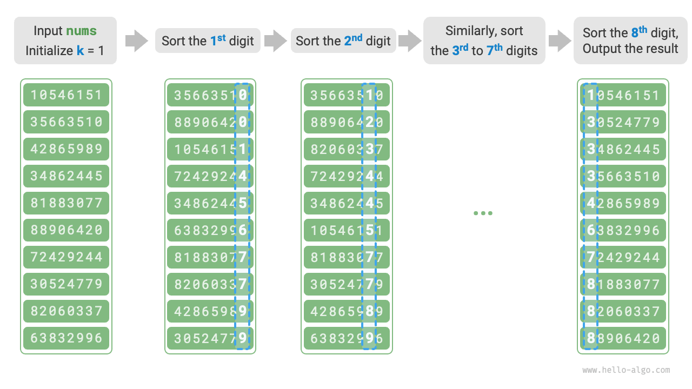

# 11.10 &nbsp; Radix sort

Phần trước đã giới thiệu counting sort, thích hợp cho các tình huống
mà kích thước dữ liệu $n$ lớn nhưng phạm vi dữ liệu $m$ nhỏ. Giả sử
chúng ta cần sắp xếp $n = 10^6$ mã số sinh viên, trong đó mỗi ID là
một số có $8$ chữ số. Điều này có nghĩa là phạm vi dữ liệu $m = 10^8$
là rất lớn. Việc sử dụng counting sort trong trường hợp này sẽ đòi hỏi
một lượng lớn không gian bộ nhớ. Radix sort có thể tránh được tình
huống này.

<u>Radix sort</u> chia sẻ cùng một khái niệm cốt lõi với counting sort,
cũng sắp xếp bằng cách đếm tần suất của các phần tử. Trong khi đó,
radix sort xây dựng dựa trên điều này bằng cách tận dụng mối quan hệ
tăng tiến giữa các chữ số của các số. Nó xử lý và sắp xếp các chữ số
từng cái một, đạt được thứ tự cuối cùng đã sắp xếp.

## 11.10.1 &nbsp; Tiến trình thuật toán

Lấy dữ liệu ID sinh viên làm ví dụ, giả sử chữ số ít quan trọng nhất là
chữ số thứ $1$ và chữ số quan trọng nhất là chữ số thứ $8$, tiến trình
radix sort được minh họa trong Hình 11-18.

1. Khởi tạo chữ số $k = 1$.
2. Thực hiện "counting sort" trên chữ số thứ $k$ của các ID sinh viên.
   Sau khi hoàn thành, dữ liệu sẽ được sắp xếp từ nhỏ nhất đến lớn nhất
   dựa trên chữ số thứ $k$.
3. Tăng $k$ lên $1$, sau đó quay lại bước `2.` và tiếp tục lặp cho đến
   khi tất cả các chữ số đã được sắp xếp, lúc đó tiến trình kết thúc.

{ class="animation-figure" }

<p align="center"> Hình 11-18 &nbsp; Tiến trình thuật toán radix sort </p>

Dưới đây, chúng ta sẽ phân tích triển khai code. Đối với một số $x$
trong cơ số $d$, để lấy chữ số thứ $k$ của nó là $x_k$, công thức tính toán
sau có thể được sử dụng:

$$
x_k = \lfloor\frac{x}{d^{k-1}}\rfloor \bmod d
$$

Trong đó $\lfloor a \rfloor$ biểu thị việc làm tròn xuống số thực $a$,
và $\bmod \: d$ biểu thị việc lấy phần dư của $d$. Đối với dữ liệu ID
sinh viên, $d = 10$ và $k \in [1, 8]$.

Ngoài ra, chúng ta cần sửa đổi một chút code counting sort để cho phép
sắp xếp dựa trên chữ số thứ $k$:

=== "Python"

    ```python title="radix_sort.py"
    def digit(num: int, exp: int) -> int:
        """Lấy chữ số thứ k của phần tử num, trong đó exp = 10^(k-1)"""
        # Truyền exp thay vì k có thể tránh được việc tính toán lũy thừa
        # tốn kém lặp đi lặp lại ở đây
        return (num // exp) % 10

    def counting_sort_digit(nums: list[int], exp: int):
        """Counting sort (dựa trên chữ số thứ k của nums)"""
        # Phạm vi chữ số thập phân là 0~9, do đó cần một array bucket
        # có độ dài 10
        counter = [0] * 10
        n = len(nums)
        # Đếm số lần xuất hiện của các chữ số 0~9
        for i in range(n):
            d = digit(nums[i], exp)  # Lấy chữ số thứ k của nums[i], ký hiệu là d
            counter[d] += 1  # Đếm số lần xuất hiện của chữ số d
        # Tính tổng tiền tố, chuyển đổi "số lần xuất hiện" thành "chỉ số array"
        for i in range(1, 10):
            counter[i] += counter[i - 1]
        # Duyệt ngược, dựa trên thống kê bucket, đặt từng phần tử vào res
        res = [0] * n
        for i in range(n - 1, -1, -1):
            d = digit(nums[i], exp)
            j = counter[d] - 1  # Lấy chỉ số j cho d trong array
            res[j] = nums[i]  # Đặt phần tử hiện tại vào chỉ số j
            counter[d] -= 1  # Giảm số lượng d đi 1
        # Sử dụng kết quả để ghi đè lên array nums ban đầu
        for i in range(n):
            nums[i] = res[i]

    def radix_sort(nums: list[int]):
        """radix sort"""
        # Lấy phần tử lớn nhất của array, được sử dụng để xác định số lượng chữ số tối đa
        m = max(nums)
        # Duyệt từ chữ số thấp nhất đến chữ số cao nhất
        exp = 1
        while exp <= m:
            # Thực hiện counting sort trên chữ số thứ k của các phần tử array
            # k = 1 -> exp = 1
            # k = 2 -> exp = 10
            # i.e., exp = 10^(k-1)
            counting_sort_digit(nums, exp)
            exp *= 10
    ```

=== "C++"

    ```cpp title="radix_sort.cpp"
    /* Lấy chữ số thứ k của phần tử num, trong đó exp = 10^(k-1) */
    int digit(int num, int exp) {
        // Truyền exp thay vì k có thể tránh lặp lại phép tính lũy thừa
        // tốn kém ở đây
        return (num / exp) % 10;
    }

    /* counting sort (dựa trên chữ số thứ k của nums) */
    void countingSortDigit(vector<int> &nums, int exp) {
        // Phạm vi chữ số thập phân là 0~9, do đó cần một bucket array
        // có độ dài 10
        vector<int> counter(10, 0);
        int n = nums.size();
        // Đếm số lần xuất hiện của các chữ số 0~9
        for (int i = 0; i < n; i++) {
            int d = digit(nums[i], exp); // Lấy chữ số thứ k của nums[i], ký hiệu là d
            counter[d]++;                // Đếm số lần xuất hiện của chữ số d
        }
        // Tính tổng tiền tố (prefix sum), chuyển đổi "số lần xuất hiện"
        // thành "chỉ số array"
        for (int i = 1; i < 10; i++) {
            counter[i] += counter[i - 1];
        }
        // Duyệt ngược lại, dựa trên thống kê bucket, đặt từng phần tử vào res
        vector<int> res(n, 0);
        for (int i = n - 1; i >= 0; i--) {
            int d = digit(nums[i], exp);
            int j = counter[d] - 1; // Lấy chỉ số j cho d trong array
            res[j] = nums[i];       // Đặt phần tử hiện tại vào chỉ số j
            counter[d]--;           // Giảm số đếm của d đi 1
        }
        // Sử dụng kết quả để ghi đè lên array nums gốc
        for (int i = 0; i < n; i++)
            nums[i] = res[i];
    }

    /* radix sort */
    void radixSort(vector<int> &nums) {
        // Lấy phần tử lớn nhất của array, được sử dụng để xác định số lượng
        // chữ số tối đa
        int m = *max_element(nums.begin(), nums.end());
        // Duyệt từ chữ số thấp nhất đến chữ số cao nhất
        for (int exp = 1; exp <= m; exp *= 10)
            // Thực hiện counting sort trên chữ số thứ k của các phần tử array
            // k = 1 -> exp = 1
            // k = 2 -> exp = 10
            // i.e., exp = 10^(k-1)
            countingSortDigit(nums, exp);
    }
    ```

=== "Java"

    ```java title="radix_sort.java"
    /* Lấy chữ số thứ k của phần tử num, trong đó exp = 10^(k-1) */
    int digit(int num, int exp) {
        // Truyền exp thay vì k có thể tránh lặp lại phép tính lũy thừa
        // tốn kém ở đây
        return (num / exp) % 10;
    }

    /* Counting sort (dựa trên chữ số thứ k của nums) */
    void countingSortDigit(int[] nums, int exp) {
        // Phạm vi chữ số thập phân là 0~9, vì vậy cần một bucket array có độ dài 10
        int[] counter = new int[10];
        int n = nums.length;
        // Đếm số lần xuất hiện của các chữ số 0~9
        for (int i = 0; i < n; i++) {
            int d = digit(nums[i], exp); // Lấy chữ số thứ k của nums[i], được ký hiệu là d
            counter[d]++;                // Đếm số lần xuất hiện của chữ số d
        }
        // Tính tổng tiền tố, chuyển đổi "số lần xuất hiện" thành "chỉ số array"
        for (int i = 1; i < 10; i++) {
            counter[i] += counter[i - 1];
        }
        // Duyệt ngược, dựa trên thống kê bucket, đặt từng phần tử vào res
        int[] res = new int[n];
        for (int i = n - 1; i >= 0; i--) {
            int d = digit(nums[i], exp);
            int j = counter[d] - 1; // Lấy chỉ số j cho d trong array
            res[j] = nums[i];       // Đặt phần tử hiện tại vào chỉ số j
            counter[d]--;           // Giảm số đếm của d đi 1
        }
        // Dùng kết quả để ghi đè lên array nums gốc
        for (int i = 0; i < n; i++)
            nums[i] = res[i];
    }

    /* Radix sort */
    void radixSort(int[] nums) {
        // Lấy phần tử lớn nhất của array, dùng để xác định số chữ số tối đa
        int m = Integer.MIN_VALUE;
        for (int num : nums)
            if (num > m)
                m = num;
        // Duyệt từ chữ số thấp nhất đến chữ số cao nhất
        for (int exp = 1; exp <= m; exp *= 10) {
            // Thực hiện counting sort trên chữ số thứ k của các phần tử array
            // k = 1 -> exp = 1
            // k = 2 -> exp = 10
            // tức là, exp = 10^(k-1)
            countingSortDigit(nums, exp);
        }
    }
    ```

=== "C#"

    ```csharp title="radix_sort.cs"
    [class]{radix_sort}-[func]{Digit}

    [class]{radix_sort}-[func]{CountingSortDigit}

    [class]{radix_sort}-[func]{RadixSort}
    ```

=== "Go"

    ```go title="radix_sort.go"
    [class]{}-[func]{digit}

    [class]{}-[func]{countingSortDigit}

    [class]{}-[func]{radixSort}
    ```

=== "Swift"

    ```swift title="radix_sort.swift"
    [class]{}-[func]{digit}

    [class]{}-[func]{countingSortDigit}

    [class]{}-[func]{radixSort}
    ```

=== "JS"

    ```javascript title="radix_sort.js"
    [class]{}-[func]{digit}

    [class]{}-[func]{countingSortDigit}

    [class]{}-[func]{radixSort}
    ```

=== "TS"

    ```typescript title="radix_sort.ts"
    [class]{}-[func]{digit}

    [class]{}-[func]{countingSortDigit}

    [class]{}-[func]{radixSort}
    ```

=== "Dart"

    ```dart title="radix_sort.dart"
    [class]{}-[func]{digit}

    [class]{}-[func]{countingSortDigit}

    [class]{}-[func]{radixSort}
    ```

=== "Rust"

    ```rust title="radix_sort.rs"
    [class]{}-[func]{digit}

    [class]{}-[func]{counting_sort_digit}

    [class]{}-[func]{radix_sort}
    ```

=== "C"

    ```c title="radix_sort.c"
    [class]{}-[func]{digit}

    [class]{}-[func]{countingSortDigit}

    [class]{}-[func]{radixSort}
    ```

=== "Kotlin"

    ```kotlin title="radix_sort.kt"
    [class]{}-[func]{digit}

    [class]{}-[func]{countingSortDigit}

    [class]{}-[func]{radixSort}
    ```

=== "Ruby"

    ```ruby title="radix_sort.rb"
    [class]{}-[func]{digit}

    [class]{}-[func]{counting_sort_digit}

    [class]{}-[func]{radix_sort}
    ```

=== "Zig"

    ```zig title="radix_sort.zig"
    [class]{}-[func]{digit}

    [class]{}-[func]{countingSortDigit}

    [class]{}-[func]{radixSort}
    ```

!!! question "Tại sao lại bắt đầu sắp xếp từ chữ số có trọng số thấp nhất?"

    Trong các vòng sắp xếp liên tiếp, kết quả của một vòng sau sẽ ghi đè lên
    kết quả của một vòng trước. Ví dụ, nếu kết quả của vòng đầu tiên là
    $a < b$ và vòng thứ hai là $a > b$, thì kết quả của vòng thứ hai sẽ thay
    thế kết quả của vòng đầu tiên. Vì các chữ số có trọng số cao hơn ưu tiên
    hơn các chữ số có trọng số thấp hơn, nên việc sắp xếp các chữ số thấp hơn
    trước các chữ số cao hơn là hợp lý.

## 11.10.2 &nbsp; Đặc điểm thuật toán

So với counting sort, radix sort phù hợp với các phạm vi số lớn hơn,
**nhưng nó giả định rằng dữ liệu có thể được biểu diễn bằng một số chữ số
cố định, và số chữ số đó không nên quá lớn**. Ví dụ, floating-point
numbers không phù hợp với radix sort, vì số lượng chữ số $k$ của chúng
có thể lớn, có khả năng dẫn đến một time complexity $O(nk) \gg O(n^2)$.

- **time complexity là $O(nk)$, sắp xếp không thích nghi**: Giả sử kích thước
dữ liệu là $n$, dữ liệu ở cơ số $d$, và số chữ số tối đa là $k$, thì việc
sắp xếp một chữ số mất $O(n + d)$ thời gian, và sắp xếp tất cả $k$ chữ số
mất $O((n + d)k)$ thời gian. Thông thường, cả $d$ và $k$ đều tương đối nhỏ,
dẫn đến một time complexity gần với $O(n)$.
- **space complexity là $O(n + d)$, sắp xếp không tại chỗ**: Giống như
counting sort, radix sort dựa vào các array `res` và `counter` có độ
dài lần lượt là $n$ và $d$.
- **Sắp xếp ổn định**: Khi counting sort ổn định, radix sort cũng ổn định;
nếu counting sort không ổn định, radix sort không thể đảm bảo thứ tự
sắp xếp đúng.
