# 11.2 &nbsp; Selection sort

<u>Selection sort</u> hoạt động dựa trên một nguyên tắc rất đơn giản:
nó sử dụng một vòng lặp, trong đó mỗi lần lặp sẽ chọn phần tử nhỏ nhất
từ khoảng chưa sắp xếp và di chuyển nó đến cuối phần đã sắp xếp.

Giả sử độ dài của array là $n$, các bước của selection sort được minh
họa trong Hình 11-2.

1. Ban đầu, tất cả các phần tử đều chưa được sắp xếp, tức là, khoảng
chỉ số chưa sắp xếp là $[0, n-1]$.
2. Chọn phần tử nhỏ nhất trong khoảng $[0, n-1]$ và hoán đổi nó với
phần tử tại index $0$. Sau bước này, phần tử đầu tiên của array
đã được sắp xếp.
3. Chọn phần tử nhỏ nhất trong khoảng $[1, n-1]$ và hoán đổi nó với
phần tử tại index $1$. Sau bước này, hai phần tử đầu tiên của array
đã được sắp xếp.
4. Tiếp tục theo cách này. Sau $n - 1$ vòng chọn và hoán đổi, $n - 1$
phần tử đầu tiên đã được sắp xếp.
5. Phần tử duy nhất còn lại sau đó là phần tử lớn nhất và không cần
sắp xếp, do đó array đã được sắp xếp.

=== "<1>"
    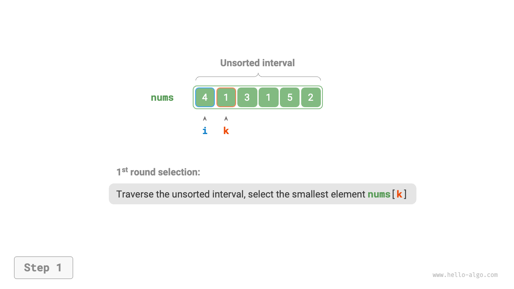{ class="animation-figure" }

=== "<2>"
    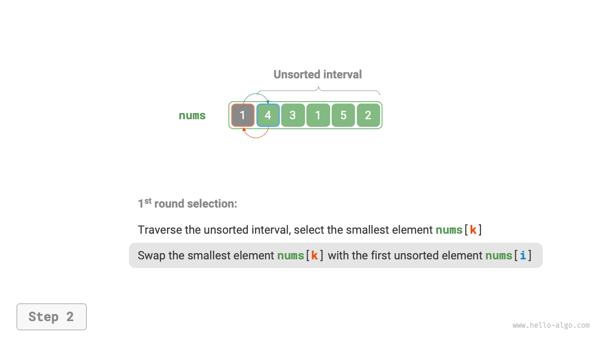{ class="animation-figure" }

=== "<3>"
    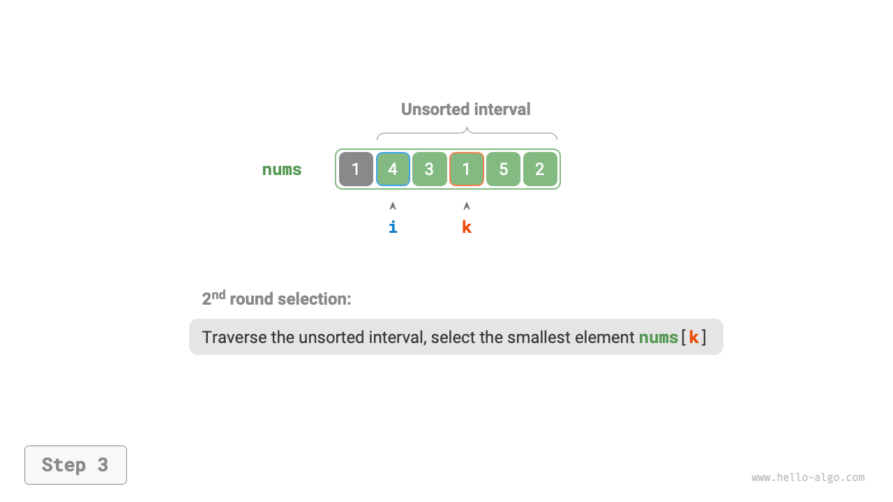{ class="animation-figure" }

=== "<4>"
    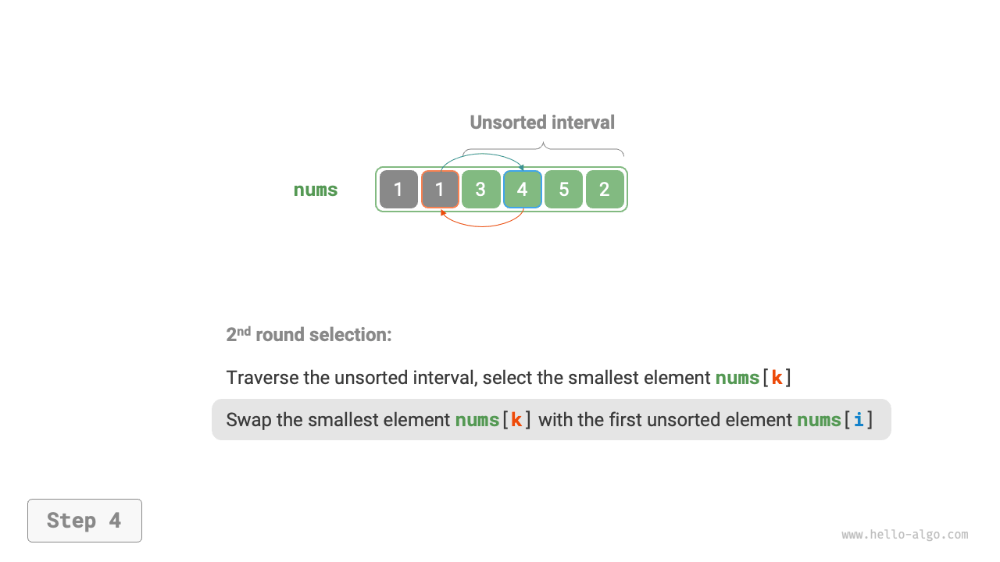{ class="animation-figure" }

=== "<5>"
    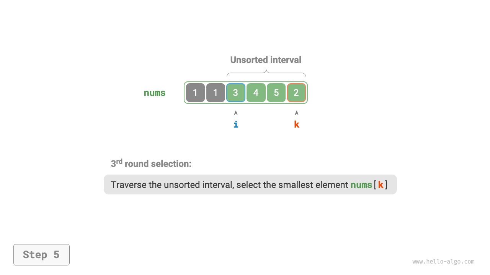{ class="animation-figure" }

=== "<6>"
    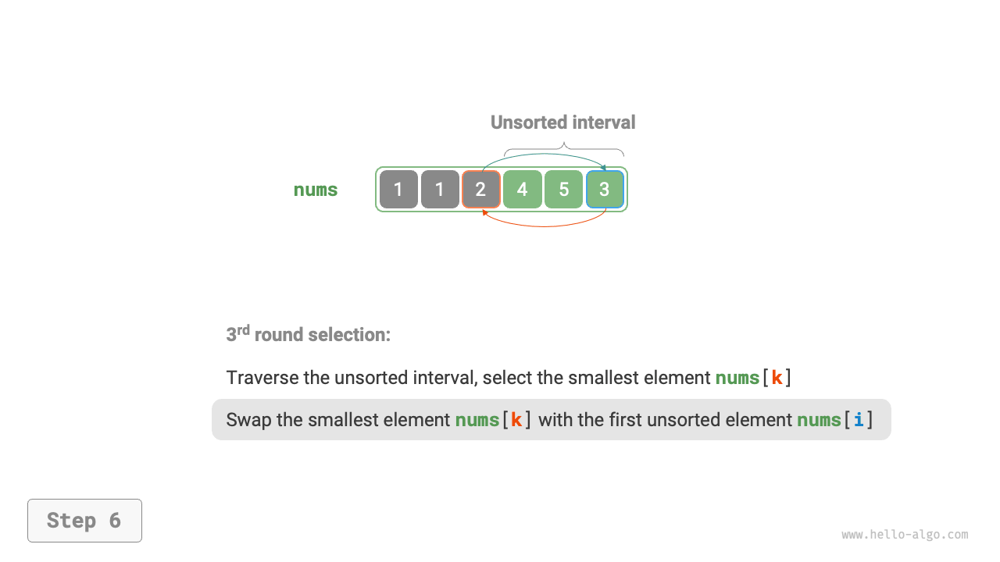{ class="animation-figure" }

=== "<7>"
    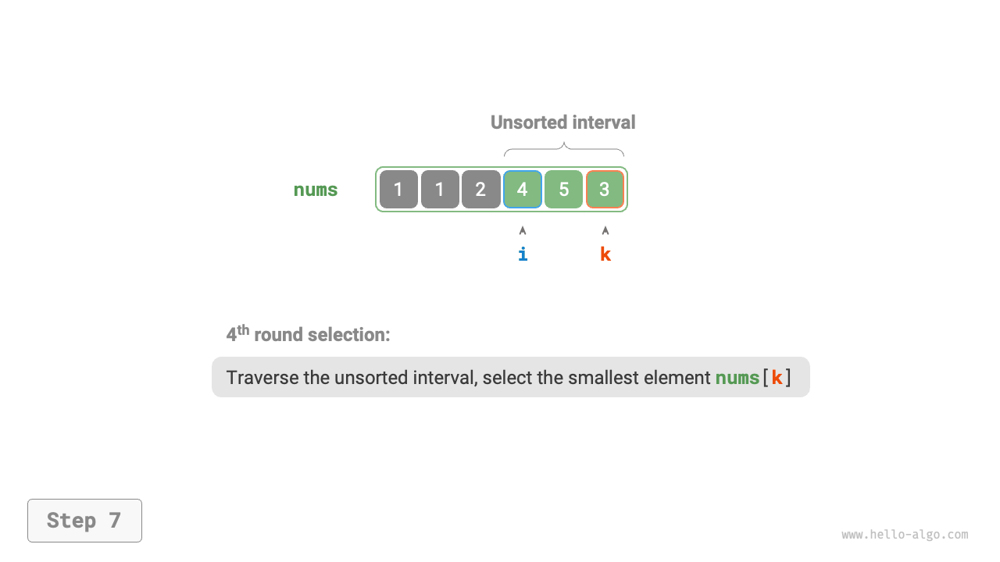{ class="animation-figure" }

=== "<8>"
    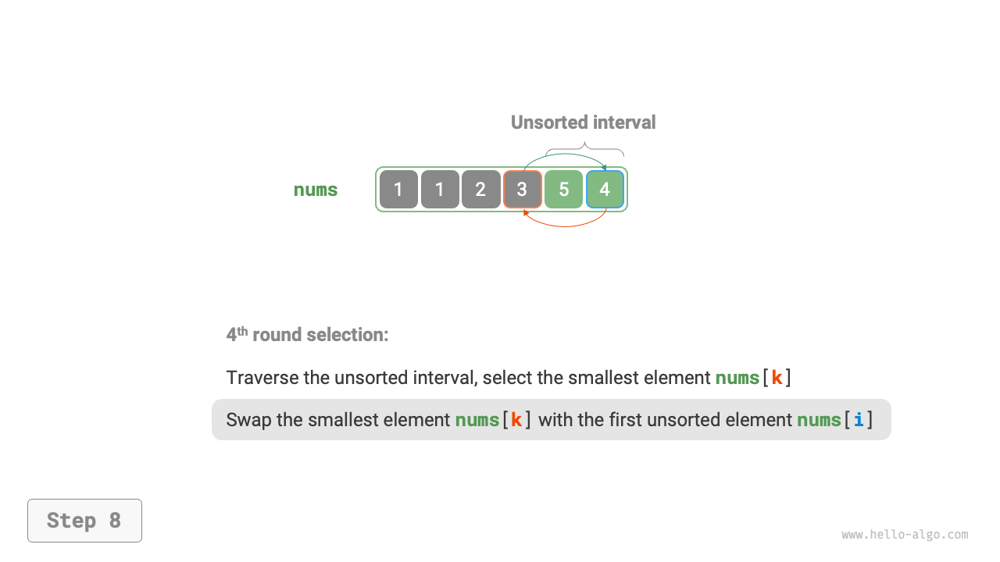{ class="animation-figure" }

=== "<9>"
    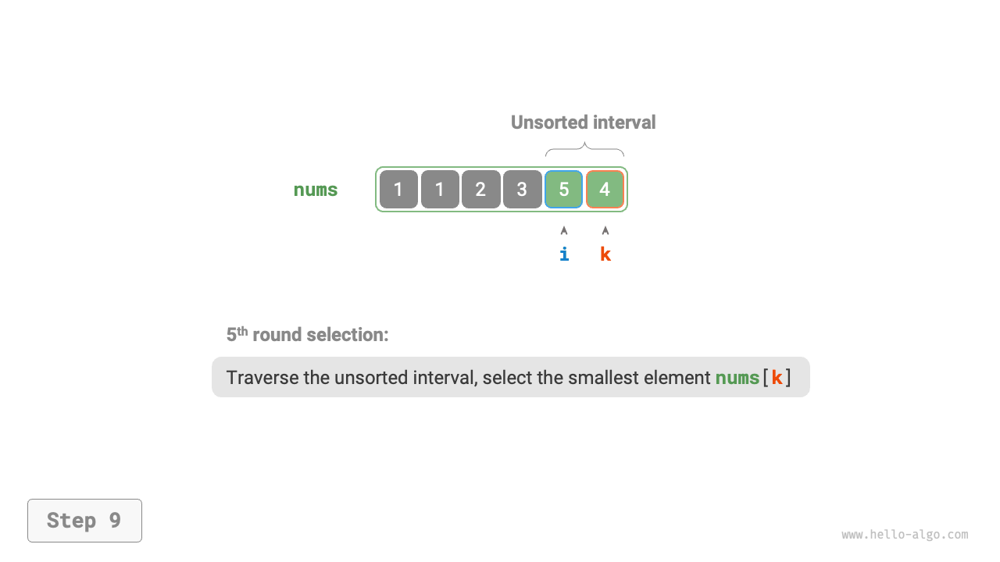{ class="animation-figure" }

=== "<10>"
    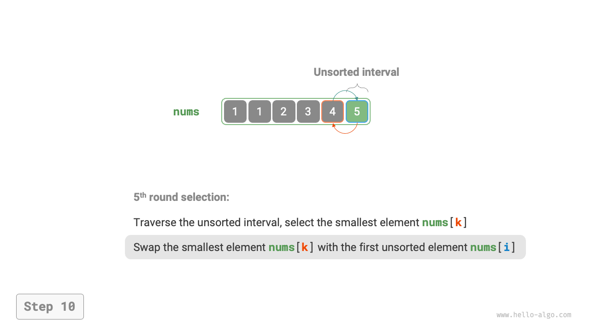{ class="animation-figure" }

=== "<11>"
    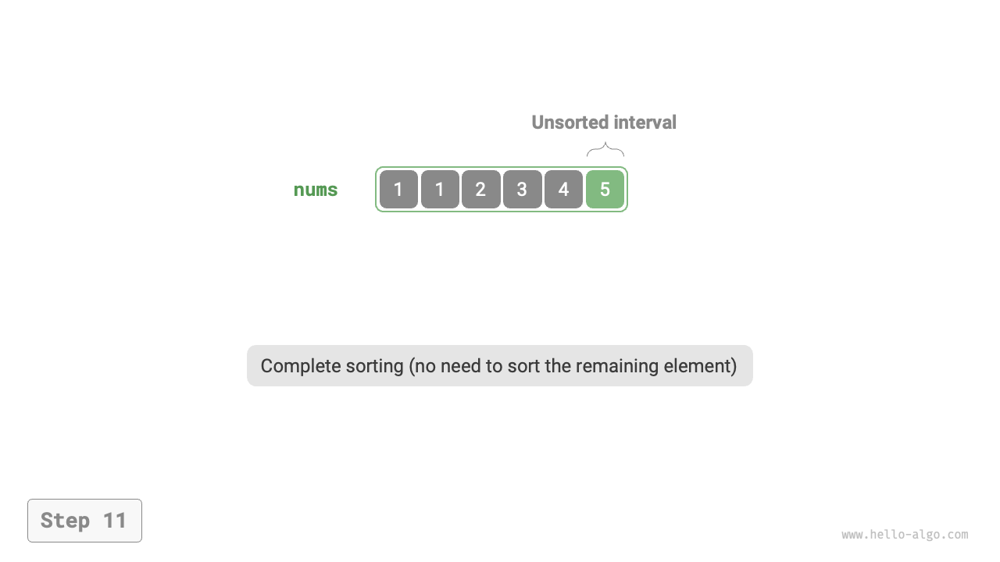{ class="animation-figure" }

<p align="center"> Hình 11-2 &nbsp; Quá trình selection sort </p>

Trong code, chúng ta sử dụng $k$ để ghi lại phần tử nhỏ nhất trong
khoảng chưa sắp xếp:

=== "Python"

    ```python title="selection_sort.py"
    def selection_sort(nums: list[int]):
        """Selection sort"""
        n = len(nums)
        # Vòng lặp ngoài: phạm vi chưa sắp xếp là [i, n-1]
        for i in range(n - 1):
            # Vòng lặp trong: tìm phần tử nhỏ nhất trong phạm vi chưa sắp xếp
            k = i
            for j in range(i + 1, n):
                if nums[j] < nums[k]:
                    k = j  # Ghi lại chỉ số của phần tử nhỏ nhất
            # Hoán đổi phần tử nhỏ nhất với phần tử đầu tiên của phạm vi chưa sắp xếp
            nums[i], nums[k] = nums[k], nums[i]
    ```

=== "C++"

    ```cpp title="selection_sort.cpp"
    /* Selection sort */
    void selectionSort(vector<int> &nums) {
        int n = nums.size();
        // Vòng lặp ngoài: phạm vi chưa sắp xếp là [i, n-1]
        for (int i = 0; i < n - 1; i++) {
            // Vòng lặp trong: tìm phần tử nhỏ nhất trong phạm vi chưa sắp xếp
            int k = i;
            for (int j = i + 1; j < n; j++) {
                if (nums[j] < nums[k])
                    k = j; // Ghi lại chỉ số của phần tử nhỏ nhất
            }
            // Hoán đổi phần tử nhỏ nhất với phần tử đầu tiên của phạm vi chưa sắp xếp
            swap(nums[i], nums[k]);
        }
    }
    ```

=== "Java"

    ```java title="selection_sort.java"
    /* Selection sort */
    void selectionSort(int[] nums) {
        int n = nums.length;
        // Vòng lặp ngoài: phạm vi chưa sắp xếp là [i, n-1]
        for (int i = 0; i < n - 1; i++) {
            // Vòng lặp trong: tìm phần tử nhỏ nhất trong phạm vi chưa sắp xếp
            int k = i;
            for (int j = i + 1; j < n; j++) {
                if (nums[j] < nums[k])
                    k = j; // Ghi lại chỉ số của phần tử nhỏ nhất
            }
            // Hoán đổi phần tử nhỏ nhất với phần tử đầu tiên của phạm vi chưa sắp xếp
            int temp = nums[i];
            nums[i] = nums[k];
            nums[k] = temp;
        }
    }
    ```

=== "C#"

    ```csharp title="selection_sort.cs"
    [class]{selection_sort}-[func]{SelectionSort}
    ```

=== "Go"

    ```go title="selection_sort.go"
    [class]{}-[func]{selectionSort}
    ```

=== "Swift"

    ```swift title="selection_sort.swift"
    [class]{}-[func]{selectionSort}
    ```

=== "JS"

    ```javascript title="selection_sort.js"
    [class]{}-[func]{selectionSort}
    ```

=== "TS"

    ```typescript title="selection_sort.ts"
    [class]{}-[func]{selectionSort}
    ```

=== "Dart"

    ```dart title="selection_sort.dart"
    [class]{}-[func]{selectionSort}
    ```

=== "Rust"

    ```rust title="selection_sort.rs"
    [class]{}-[func]{selection_sort}
    ```

=== "C"

    ```c title="selection_sort.c"
    [class]{}-[func]{selectionSort}
    ```

=== "Kotlin"

    ```kotlin title="selection_sort.kt"
    [class]{}-[func]{selectionSort}
    ```

=== "Ruby"

    ```ruby title="selection_sort.rb"
    [class]{}-[func]{selection_sort}
    ```

=== "Zig"

    ```zig title="selection_sort.zig"
    [class]{}-[func]{selectionSort}
    ```

## 11.2.1 &nbsp; Đặc điểm của thuật toán

- **Time complexity là $O(n^2)$, sắp xếp không thích ứng**: Có $n - 1$ lần lặp ở
  vòng lặp ngoài, với độ dài của phần chưa sắp xếp bắt đầu từ $n$ ở lần lặp
  đầu tiên và giảm xuống $2$ ở lần lặp cuối cùng. Tức là, mỗi lần lặp của
  vòng lặp ngoài chứa lần lượt $n$, $n - 1$, $\dots$, $3$, $2$ lần lặp của
  vòng lặp trong, tổng cộng là $\frac{(n - 1)(n + 2)}{2}$.
- **Space complexity là $O(1)$, sắp xếp tại chỗ**: Sử dụng không gian bổ sung
  hằng số với các con trỏ $i$ và $j$.
- **Sắp xếp không ổn định**: Như được minh họa trong Hình 11-3, một phần tử
  `nums[i]` có thể bị hoán đổi sang bên phải của một phần tử bằng nó, khiến
  thứ tự tương đối của chúng bị thay đổi.

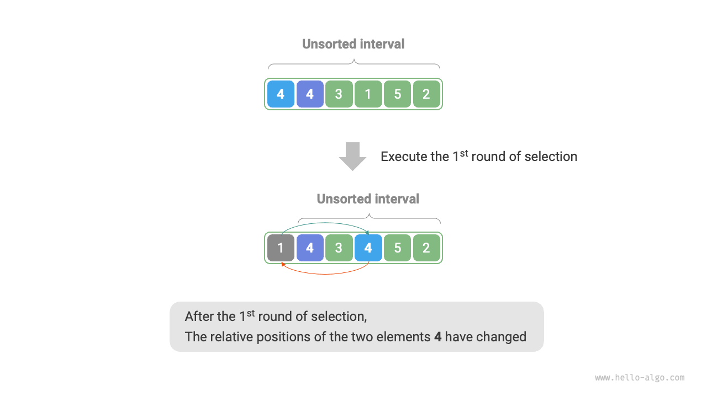{ class="animation-figure" }

<p align="center"> Hình 11-3 &nbsp; Ví dụ về tính không ổn định của Selection sort </p>
