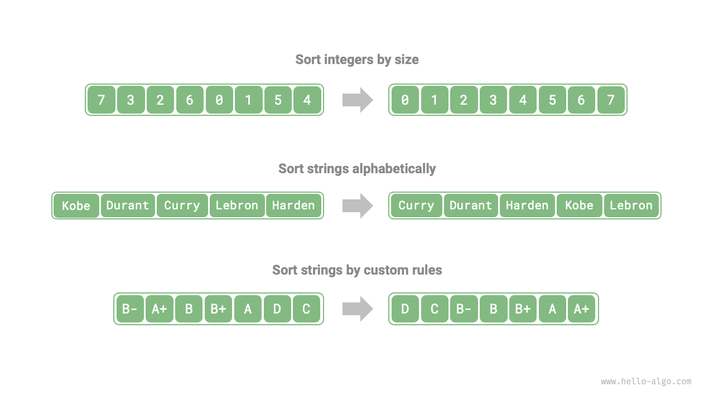

# 11.1 &nbsp; Thuật toán sắp xếp

<u>Thuật toán sắp xếp</u> được sử dụng để sắp xếp một tập hợp dữ liệu theo
một thứ tự cụ thể. Các thuật toán sắp xếp có nhiều ứng dụng rộng rãi vì
dữ liệu đã được sắp xếp thường có thể được tìm kiếm, phân tích và xử lý
hiệu quả hơn.

Như được hiển thị trong Hình 11-1, các kiểu dữ liệu trong các thuật toán
sắp xếp có thể là số nguyên, số thực, ký tự hoặc chuỗi, v.v. Tiêu chí
sắp xếp có thể được đặt theo nhu cầu, chẳng hạn như kích thước số, thứ
tự ASCII của ký tự hoặc tiêu chí tùy chỉnh.

{ class="animation-figure" }

<p align="center"> Hình 11-1 &nbsp; Ví dụ về kiểu dữ liệu và bộ so sánh </p>

## 11.1.1 &nbsp; Tiêu chí đánh giá

**Hiệu suất thực thi**: Chúng ta mong muốn time complexity của các sorting algorithm
càng thấp càng tốt, cũng như tổng số thao tác ít hơn (giảm hệ số hằng số
của time complexity). Đối với khối lượng dữ liệu lớn, hiệu suất thực thi đặc
biệt quan trọng.

**Thuộc tính tại chỗ**: Đúng như tên gọi, <u>in-place sorting</u> (sắp xếp tại chỗ)
được thực hiện bằng cách thao tác trực tiếp trên array gốc, không cần đến
các array hỗ trợ bổ sung, do đó tiết kiệm bộ nhớ. Nhìn chung, in-place sorting
liên quan đến ít thao tác di chuyển dữ liệu hơn và nhanh hơn.

**Tính ổn định**: <u>Stable sorting</u> (sắp xếp ổn định) đảm bảo rằng thứ tự
tương đối của các phần tử bằng nhau trong array không thay đổi sau khi sắp xếp.

Stable sorting là một điều kiện cần thiết cho các kịch bản sắp xếp đa khóa.
Giả sử chúng ta có một bảng lưu trữ thông tin sinh viên, với cột thứ nhất
và thứ hai lần lượt là tên và tuổi. Trong trường hợp này, <u>unstable sorting</u>
(sắp xếp không ổn định) có thể dẫn đến việc mất trật tự trong dữ liệu đầu vào:

```shell
# Dữ liệu đầu vào đã được sắp xếp theo tên
# (name, age)
  ('A', 19)
  ('B', 18)
  ('C', 21)
  ('D', 19)
  ('E', 23)

# Giả sử một thuật toán sắp xếp không ổn định được sử dụng để sắp xếp danh sách theo tuổi,
# kết quả thay đổi vị trí tương đối của ('D', 19) và ('A', 19),
# và thuộc tính dữ liệu đầu vào được sắp xếp theo tên bị mất
  ('B', 18)
  ('D', 19)
  ('A', 19)
  ('C', 21)
  ('E', 23)
```

**Tính thích nghi**: <u>Adaptive sorting</u> (sắp xếp thích nghi) tận dụng
thông tin thứ tự hiện có trong dữ liệu đầu vào để giảm công sức tính toán,
đạt được hiệu suất thời gian tối ưu hơn. Time complexity worst-case
của các adaptive sorting algorithm thường tốt hơn time complexity average-case
của chúng.

**Dựa trên so sánh hay không dựa trên so sánh**: <u>Comparison-based sorting</u>
(sắp xếp dựa trên so sánh) dựa vào các toán tử so sánh ($<$, $=$, $>$) để
xác định thứ tự tương đối của các phần tử và từ đó sắp xếp toàn bộ array,
với time complexity tối ưu về mặt lý thuyết là $O(n \log n)$. Trong khi đó,
<u>non-comparison sorting</u> (sắp xếp không dựa trên so sánh) không sử dụng
các toán tử so sánh và có thể đạt được time complexity $O(n)$, nhưng tính
linh hoạt của nó tương đối kém.

## 11.1.2 &nbsp; Thuật toán sắp xếp lý tưởng

**Thực thi nhanh, tại chỗ, ổn định, linh hoạt và đa năng**. Rõ ràng là, cho đến nay
vẫn chưa có thuật toán sắp xếp nào kết hợp được tất cả các đặc điểm này.
Do đó, khi chọn một thuật toán sắp xếp, cần phải quyết định dựa trên các đặc điểm
cụ thể của dữ liệu và yêu cầu của bài toán.

Tiếp theo, chúng ta sẽ cùng tìm hiểu về các thuật toán sắp xếp khác nhau và phân tích
ưu nhược điểm của từng thuật toán dựa trên các tiêu chí đánh giá nêu trên.
