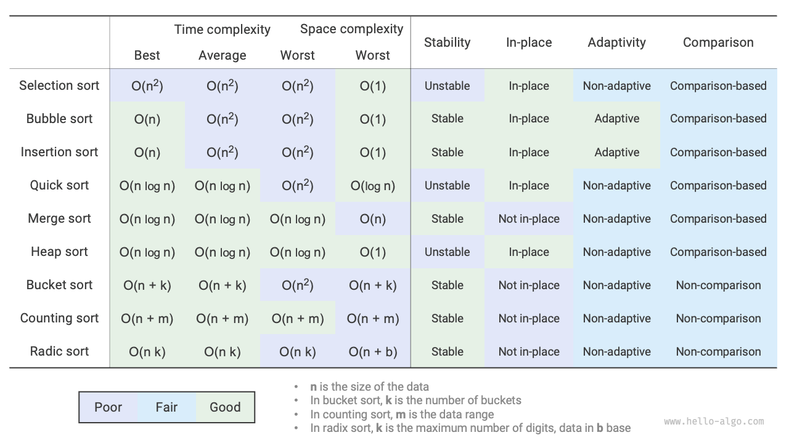

# 11.11 &nbsp; Tóm tắt

### 1. &nbsp; Tổng quan chính

- Bubble sort hoạt động bằng cách hoán đổi các phần tử liền kề. Bằng cách thêm một
cờ để bật tính năng trả về sớm, chúng ta có thể tối ưu hóa time complexity
trường hợp tốt nhất của bubble sort thành $O(n)$.
- Insertion sort sắp xếp mỗi vòng bằng cách chèn các phần tử từ khoảng chưa sắp
xếp vào vị trí chính xác trong khoảng đã sắp xếp. Mặc dù time complexity
của insertion sort là $O(n^2)$, nó rất phổ biến trong việc sắp xếp lượng
dữ liệu nhỏ do số lượng thao tác tương đối ít hơn trên mỗi đơn vị.
- Quick sort dựa trên các thao tác sentinel partitioning. Trong sentinel
partitioning, có thể luôn chọn pivot tồi tệ nhất, dẫn đến sự suy giảm
time complexity thành $O(n^2)$. Việc giới thiệu median hoặc random pivot
có thể giảm khả năng xảy ra sự suy giảm này. Tail recursion giảm độ sâu
recursion một cách hiệu quả, tối ưu hóa space complexity thành $O(\log n)$.
- Merge sort bao gồm hai giai đoạn chia và trộn, thường thể hiện chiến lược
divide-and-conquer. Trong merge sort, việc sắp xếp một array yêu cầu tạo
các array phụ trợ, dẫn đến space complexity là $O(n)$; tuy nhiên, space
complexity để sắp xếp một list có thể được tối ưu hóa thành $O(1)$.
- Bucket sort gồm ba bước: phân phối dữ liệu vào các bucket, sắp xếp trong
từng bucket, và trộn các kết quả theo thứ tự bucket. Nó cũng thể hiện chiến
lược divide-and-conquer, phù hợp cho các tập dữ liệu rất lớn. Chìa khóa
của bucket sort là sự phân bố dữ liệu đồng đều.
- Counting sort là một biến thể của bucket sort, sắp xếp bằng cách đếm số
lần xuất hiện của mỗi điểm dữ liệu. Counting sort phù hợp cho các tập dữ
liệu lớn với một phạm vi dữ liệu giới hạn và yêu cầu chuyển đổi dữ liệu
thành số nguyên dương.
- Radix sort xử lý dữ liệu bằng cách sắp xếp từng chữ số, yêu cầu dữ liệu
được biểu diễn dưới dạng các số có độ dài cố định.
- Nhìn chung, chúng ta tìm kiếm các thuật toán sắp xếp có hiệu suất cao, ổn
định, hoạt động tại chỗ (in-place) và khả năng thích ứng. Tuy nhiên, giống
như các cấu trúc dữ liệu và thuật toán khác, không có thuật toán sắp xếp
nào có thể đáp ứng tất cả các điều kiện này cùng một lúc. Trong các ứng
dụng thực tế, chúng ta cần chọn thuật toán sắp xếp phù hợp dựa trên đặc
điểm của dữ liệu.
- Hình 11-19 so sánh các thuật toán sắp xếp chính về hiệu suất, tính ổn định,
tính chất tại chỗ (in-place) và khả năng thích ứng.

{ class="animation-figure" }

 Hình 11-19 &nbsp; So sánh các thuật toán sắp xếp 

### 2. &nbsp; Hỏi & Đáp

**Hỏi**: Khi nào thì tính ổn định của các thuật toán sắp xếp là cần thiết?

Trong thực tế, chúng ta có thể sắp xếp dựa trên một thuộc tính của một đối
tượng. Ví dụ, sinh viên có tên và chiều cao làm thuộc tính, và chúng ta muốn
triển khai sắp xếp đa cấp: đầu tiên theo tên để có
`(A, 180) (B, 185) (C, 170) (D, 170)`; sau đó theo chiều cao. Bởi vì thuật toán
sắp xếp không ổn định, chúng ta có thể kết thúc với
`(D, 170) (C, 170) (A, 180) (B, 185)`.

Có thể thấy rằng vị trí của học sinh D và C đã bị hoán đổi, làm phá vỡ tính
trật tự của các tên, điều này là không mong muốn.

**Hỏi**: Thứ tự "tìm kiếm từ phải sang trái" và "tìm kiếm từ trái sang phải"
trong sentinel partitioning có thể hoán đổi được không?

Không, khi sử dụng phần tử ngoài cùng bên trái làm pivot, chúng ta phải
"tìm kiếm từ phải sang trái" trước, sau đó mới "tìm kiếm từ trái sang phải".
Kết luận này có vẻ hơi phản trực giác, vì vậy hãy cùng phân tích lý do.

Bước cuối cùng của sentinel partition `partition()` là hoán đổi `nums[left]`
và `nums[i]`. Sau khi hoán đổi, các phần tử bên trái pivot đều `<=` pivot,
**điều này yêu cầu `nums[left] >= nums[i]` phải đúng trước khi hoán đổi cuối cùng**.
Giả sử chúng ta "tìm kiếm từ trái sang phải" trước, và nếu không tìm thấy phần tử
nào lớn hơn pivot, **chúng ta sẽ thoát vòng lặp khi `i == j`, có thể với
`nums[j] == nums[i] > nums[left]`**. Nói cách khác, thao tác hoán đổi cuối cùng
sẽ trao đổi một phần tử lớn hơn pivot sang đầu bên trái của array, khiến cho
sentinel partition thất bại.

Ví dụ, với array `[0, 0, 0, 0, 1]`, nếu chúng ta "tìm kiếm từ trái sang phải"
trước, thì array sau sentinel partition là `[1, 0, 0, 0, 0]`, điều này là không
chính xác.

Khi xem xét thêm, nếu chúng ta chọn `nums[right]` làm pivot, thì ngược lại
hoàn toàn, chúng ta phải "tìm kiếm từ trái sang phải" trước.

**Hỏi**: Về tối ưu hóa tail recursion, tại sao việc chọn array ngắn hơn
đảm bảo độ sâu đệ quy không vượt quá $\log n$?

Độ sâu đệ quy là số lượng phương thức đệ quy hiện tại chưa được trả về.
Mỗi vòng sentinel partition chia array ban đầu thành hai subarrays. Với tối
ưu hóa tail recursion, độ dài của subarray được tiếp tục đệ quy tối đa bằng
một nửa độ dài array ban đầu. Giả sử trường hợp worst case luôn giảm một nửa
độ dài, thì độ sâu đệ quy cuối cùng sẽ là $\log n$.

Khi xem xét lại quicksort ban đầu, chúng ta có thể liên tục đệ quy xử lý
các array lớn hơn, trong trường hợp worst case từ $n$, $n - 1$, ..., $2$, $1$,
với độ sâu đệ quy là $n$. Tối ưu hóa tail recursion có thể tránh được kịch bản này.

**Hỏi**: Khi tất cả các phần tử trong array bằng nhau, time complexity của
quicksort có phải là $O(n^2)$ không? Trường hợp suy biến này nên được xử lý
như thế nào?

Có. Đối với tình huống này, hãy xem xét sử dụng sentinel partitioning để
chia array thành ba phần: nhỏ hơn pivot, bằng pivot và lớn hơn pivot. Chỉ đệ
quy tiếp tục với các phần nhỏ hơn và lớn hơn. Bằng phương pháp này, một array
mà tất cả các phần tử đầu vào bằng nhau có thể được sắp xếp chỉ trong một vòng
sentinel partitioning.

**Hỏi**: Tại sao worst-case time complexity của bucket sort lại là $O(n^2)$?

Trong trường hợp worst case, tất cả các phần tử được đặt vào cùng một bucket.
Nếu chúng ta sử dụng một thuật toán $O(n^2)$ để sắp xếp các phần tử này,
time complexity sẽ là $O(n^2)$.
