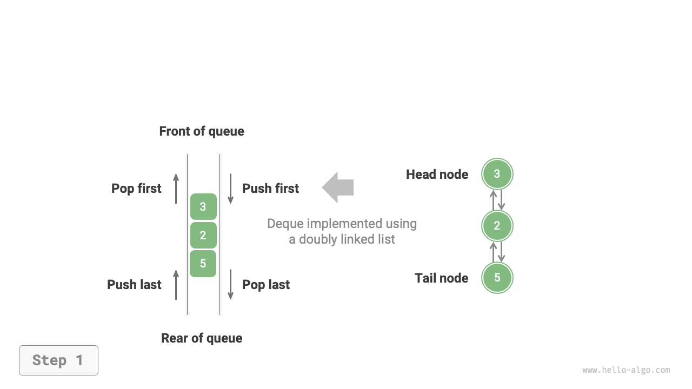

# Hàng đợi hai đầu (Double-ended queue)

Trong hàng đợi (queue), chúng ta chỉ có thể xóa các phần tử từ đầu hoặc thêm các phần tử vào cuối. Như hình dưới đây, <u>hàng đợi hai đầu (deque)</u> cung cấp sự linh hoạt hơn, cho phép thêm hoặc xóa các phần tử ở cả đầu và cuối.


## Các thao tác phổ biến trong hàng đợi hai đầu

Các thao tác phổ biến trong hàng đợi hai đầu được liệt kê dưới đây, và tên của các phương thức cụ thể phụ thuộc vào ngôn ngữ lập trình được sử dụng.

<p align="center"> Bảng <id> &nbsp; Hiệu suất của các thao tác hàng đợi hai đầu </p>

| Tên phương thức | Mô tả                      | Độ phức tạp thời gian |
| --------------- | -------------------------- | ---------------       |
| `pushFirst()`   | Thêm một phần tử vào đầu   | $O(1)$                |
| `pushLast()`    | Thêm một phần tử vào cuối  | $O(1)$                |
| `popFirst()`    | Xóa phần tử đầu tiên       | $O(1)$                |
| `popLast()`     | Xóa phần tử cuối cùng      | $O(1)$                |
| `peekFirst()`   | Truy cập phần tử đầu tiên  | $O(1)$                |
| `peekLast()`    | Truy cập phần tử cuối cùng | $O(1)$                |

Tương tự, chúng ta có thể trực tiếp sử dụng các lớp hàng đợi hai đầu được triển khai trong các ngôn ngữ lập trình:

=== "Python"

    ```python title="deque.py"
    from collections import deque

    # Khởi tạo deque
    deq: deque[int] = deque()

    # Thêm phần tử vào hàng đợi
    deq.append(2)      # Thêm vào cuối
    deq.append(5)
    deq.append(4)
    deq.appendleft(3)  # Thêm vào đầu
    deq.appendleft(1)

    # Truy cập phần tử
    front: int = deq[0]  # Phần tử đầu tiên
    rear: int = deq[-1]  # Phần tử cuối cùng

    # Xóa phần tử khỏi hàng đợi
    pop_front: int = deq.popleft()  # Phần tử đầu tiên bị xóa
    pop_rear: int = deq.pop()       # Phần tử cuối cùng bị xóa

    # Lấy độ dài của deque
    size: int = len(deq)

    # Kiểm tra xem deque có rỗng không
    is_empty: bool = len(deq) == 0
    ```

=== "C++"

    ```cpp title="deque.cpp"
    /* Khởi tạo deque */
    deque<int> deque;

    /* Thêm phần tử vào hàng đợi */
    deque.push_back(2);   // Thêm vào cuối
    deque.push_back(5);
    deque.push_back(4);
    deque.push_front(3);  // Thêm vào đầu
    deque.push_front(1);

    /* Truy cập phần tử */
    int front = deque.front(); // Phần tử đầu tiên
    int back = deque.back();   // Phần tử cuối cùng

    /* Xóa phần tử khỏi hàng đợi */
    deque.pop_front();  // Phần tử đầu tiên bị xóa
    deque.pop_back();   // Phần tử cuối cùng bị xóa

    /* Lấy độ dài của deque */
    int size = deque.size();

    /* Kiểm tra xem deque có rỗng không */
    bool empty = deque.empty();
    ```

=== "Java"

    ```java title="deque.java"
    /* Khởi tạo deque */
    Deque<Integer> deque = new LinkedList<>();

    /* Thêm phần tử vào hàng đợi */
    deque.offerLast(2);   // Thêm vào cuối
    deque.offerLast(5);
    deque.offerLast(4);
    deque.offerFirst(3);  // Thêm vào đầu
    deque.offerFirst(1);

    /* Truy cập phần tử */
    int peekFirst = deque.peekFirst();  // Phần tử đầu tiên
    int peekLast = deque.peekLast();    // Phần tử cuối cùng

    /* Xóa phần tử khỏi hàng đợi */
    int popFirst = deque.pollFirst();  // Phần tử đầu tiên bị xóa
    int popLast = deque.pollLast();    // Phần tử cuối cùng bị xóa

    /* Lấy độ dài của deque */
    int size = deque.size();

    /* Kiểm tra xem deque có rỗng không */
    boolean isEmpty = deque.isEmpty();
    ```

=== "C#"

    ```csharp title="deque.cs"
    /* Khởi tạo deque */
    // Trong C#, LinkedList được sử dụng như một deque
    LinkedList<int> deque = new();

    /* Thêm phần tử vào hàng đợi */
    deque.AddLast(2);   // Thêm vào cuối
    deque.AddLast(5);
    deque.AddLast(4);
    deque.AddFirst(3);  // Thêm vào đầu
    deque.AddFirst(1);

    /* Truy cập phần tử */
    int peekFirst = deque.First.Value;  // Phần tử đầu tiên
    int peekLast = deque.Last.Value;    // Phần tử cuối cùng

    /* Xóa phần tử khỏi hàng đợi */
    deque.RemoveFirst();  // Phần tử đầu tiên bị xóa
    deque.RemoveLast();   // Phần tử cuối cùng bị xóa

    /* Lấy độ dài của deque */
    int size = deque.Count;

    /* Kiểm tra xem deque có rỗng không */
    bool isEmpty = deque.Count == 0;
    ```

=== "Go"

    ```go title="deque_test.go"
    /* Khởi tạo deque */
    // Trong Go, sử dụng list như một deque
    deque := list.New()

    /* Thêm phần tử vào hàng đợi */
    deque.PushBack(2)      // Thêm vào cuối
    deque.PushBack(5)
    deque.PushBack(4)
    deque.PushFront(3)     // Thêm vào đầu
    deque.PushFront(1)

    /* Truy cập phần tử */
    front := deque.Front() // Phần tử đầu tiên
    rear := deque.Back()   // Phần tử cuối cùng

    /* Xóa phần tử khỏi hàng đợi */
    deque.Remove(front)    // Phần tử đầu tiên bị xóa
    deque.Remove(rear)     // Phần tử cuối cùng bị xóa

    /* Lấy độ dài của deque */
    size := deque.Len()

    /* Kiểm tra xem deque có rỗng không */
    isEmpty := deque.Len() == 0
    ```

=== "Swift"

    ```swift title="deque.swift"
    /* Khởi tạo deque */
    // Swift không có lớp deque tích hợp, vì vậy Array có thể được sử dụng như một deque
    var deque: [Int] = []

    /* Thêm phần tử vào hàng đợi */
    deque.append(2) // Thêm vào cuối
    deque.append(5)
    deque.append(4)
    deque.insert(3, at: 0) // Thêm vào đầu
    deque.insert(1, at: 0)

    /* Truy cập phần tử */
    let peekFirst = deque.first! // Phần tử đầu tiên
    let peekLast = deque.last!   // Phần tử cuối cùng

    /* Xóa phần tử khỏi hàng đợi */
    // Sử dụng Array, popFirst có độ phức tạp là O(n)
    let popFirst = deque.removeFirst() // Phần tử đầu tiên bị xóa
    let popLast = deque.removeLast()   // Phần tử cuối cùng bị xóa

    /* Lấy độ dài của deque */
    let size = deque.count

    /* Kiểm tra xem deque có rỗng không */
    let isEmpty = deque.isEmpty
    ```

=== "JS"

    ```javascript title="deque.js"
    /* Khởi tạo deque */
    // JavaScript không có deque tích hợp, vì vậy Array được sử dụng như một deque
    const deque = [];

    /* Thêm phần tử vào hàng đợi */
    deque.push(2);
    deque.push(5);
    deque.push(4);
    // Lưu ý rằng unshift() có độ phức tạp thời gian là O(n) vì nó là một mảng
    deque.unshift(3);
    deque.unshift(1);

    /* Truy cập phần tử */
    const peekFirst = deque[0]; // Phần tử đầu tiên
    const peekLast = deque[deque.length - 1]; // Phần tử cuối cùng

    /* Xóa phần tử khỏi hàng đợi */
    // Lưu ý rằng shift() có độ phức tạp thời gian là O(n) vì nó là một mảng
    const popFront = deque.shift(); // Phần tử đầu tiên bị xóa
    const popBack = deque.pop();    // Phần tử cuối cùng bị xóa

    /* Lấy độ dài của deque */
    const size = deque.length;

    /* Kiểm tra xem deque có rỗng không */
    const isEmpty = size === 0;
    ```

=== "TS"

    ```typescript title="deque.ts"
    /* Khởi tạo deque */
    // TypeScript không có deque tích hợp, vì vậy Array được sử dụng như một deque
    const deque: number[] = [];

    /* Thêm phần tử vào hàng đợi */
    deque.push(2);
    deque.push(5);
    deque.push(4);
    // Lưu ý rằng unshift() có độ phức tạp thời gian là O(n) vì nó là một mảng
    deque.unshift(3);
    deque.unshift(1);

    /* Truy cập phần tử */
    const peekFirst: number = deque[0]; // Phần tử đầu tiên
    const peekLast: number = deque[deque.length - 1]; // Phần tử cuối cùng

    /* Xóa phần tử khỏi hàng đợi */
    // Lưu ý rằng shift() có độ phức tạp thời gian là O(n) vì nó là một mảng
    const popFront: number = deque.shift() as number; // Phần tử đầu tiên bị xóa
    const popBack: number = deque.pop() as number;    // Phần tử cuối cùng bị xóa

    /* Lấy độ dài của deque */
    const size: number = deque.length;

    /* Kiểm tra xem deque có rỗng không */
    const isEmpty: boolean = size === 0;
    ```

=== "Dart"

    ```dart title="deque.dart"
    /* Khởi tạo deque */
    // Trong Dart, Queue được định nghĩa là một deque
    Queue<int> deque = Queue<int>();

    /* Thêm phần tử vào hàng đợi */
    deque.addLast(2);  // Thêm vào cuối
    deque.addLast(5);
    deque.addLast(4);
    deque.addFirst(3); // Thêm vào đầu
    deque.addFirst(1);

    /* Truy cập phần tử */
    int peekFirst = deque.first; // Phần tử đầu tiên
    int peekLast = deque.last;   // Phần tử cuối cùng

    /* Xóa phần tử khỏi hàng đợi */
    int popFirst = deque.removeFirst(); // Phần tử đầu tiên bị xóa
    int popLast = deque.removeLast();   // Phần tử cuối cùng bị xóa

    /* Lấy độ dài của deque */
    int size = deque.length;

    /* Kiểm tra xem deque có rỗng không */
    bool isEmpty = deque.isEmpty;
    ```

=== "Rust"

    ```rust title="deque.rs"
    /* Khởi tạo deque */
    let mut deque: VecDeque<u32> = VecDeque::new();

    /* Thêm phần tử vào hàng đợi */
    deque.push_back(2);  // Thêm vào cuối
    deque.push_back(5);
    deque.push_back(4);
    deque.push_front(3); // Thêm vào đầu
    deque.push_front(1);

    /* Truy cập phần tử */
    if let Some(front) = deque.front() { // Phần tử đầu tiên
    }
    if let Some(rear) = deque.back() {   // Phần tử cuối cùng
    }

    /* Xóa phần tử khỏi hàng đợi */
    if let Some(pop_front) = deque.pop_front() { // Phần tử đầu tiên bị xóa
    }
    if let Some(pop_rear) = deque.pop_back() {   // Phần tử cuối cùng bị xóa
    }

    /* Lấy độ dài của deque */
    let size = deque.len();

    /* Kiểm tra xem deque có rỗng không */
    let is_empty = deque.is_empty();
    ```

=== "C"

    ```c title="deque.c"
    // C không cung cấp deque tích hợp sẵn
    ```

=== "Kotlin"

    ```kotlin title="deque.kt"

    ```

=== "Zig"

    ```zig title="deque.zig"

    ```

??? pythontutor "Visualizing Code"

    https://pythontutor.com/render.html#code=from%20collections%20import%20deque%0A%0A%22%22%22Driver%20Code%22%22%22%0Aif%20__name__%20%3D%3D%20%22__main__%22%3A%0A%20%20%20%20%23%20%E5%88%9D%E5%A7%8B%E5%8C%96%E5%8F%8C%E5%90%91%E9%98%9F%E5%88%97%0A%20%20%20%20deq%20%3D%20deque%28%29%0A%0A%20%20%20%20%23%20%E5%85%83%E7%B4%A0%E5%85%A5%E9%98%9F%0A%20%20%20%20deq.append%282%29%20%20%23%20%E6%B7%BB%E5%8A%A0%E8%87%B3%E9%98%9F%E5%B0%BE%0A%20%20%20%20deq.append%285%29%0A%20%20%20%20deq.append%284%29%0A%20%20%20%20deq.appendleft%283%29%20%20%23%20%E6%B7%BB%E5%8A%A0%E8%87%B3%E9%98%9F%E9%A6%96%0A%20%20%20%20deq.appendleft%281%29%0A%20%20%20%20print%28%22%E5%8F%8C%E5%90%91%E9%98%9F%E5%88%97%20deque%20%3D%22,%20deq%29%0A%0A%20%20%20%20%23%20%E8%AE%BF%E9%97%AE%E5%85%83%E7%B4%A0%0A%20%20%20%20front%20%3D%20deq%5B0%5D%20%20%23%20%E9%98%9F%E9%A6%96%E5%85%83%E7%B4%A0%0A%20%20%20%20print%28%22%E9%98%9F%E9%A6%96%E5%85%83%E7%B4%A0%20front%20%3D%22,%20front%29%0A%20%20%20%20rear%20%3D%20deq%5B-1%5D%20%20%23%20%E9%98%9F%E5%B0%BE%E5%85%83%E7%B4%A0%0A%20%20%20%20print%28%22%E9%98%9F%E5%B0%BE%E5%85%83%E7%B4%A0%20rear%20%3D%22,%20rear%29%0A%0A%20%20%20%20%23%20%E5%85%83%E7%B4%A0%E5%87%BA%E9%98%9F%0A%20%20%20%20pop_front%20%3D%20deq.popleft%28%29%20%20%23%20%E9%98%9F%E9%A6%96%E5%85%83%E7%B4%A0%E5%87%BA%E9%98%9F%0A%20%20%20%20print%28%22%E9%98%9F%E9%A6%96%E5%87%BA%E9%98%9F%E5%85%83%E7%B4%A0%20%20pop_front%20%3D%22,%20pop_front%29%0A%20%20%20%20print%28%22%E9%98%9F%E9%A6%96%E5%87%BA%E9%98%9F%E5%90%8E%20deque%20%3D%22,%20deq%29%0A%0A%20%20%20%20pop_rear%20%3D%20deq.pop%28%29%20%20%23%20%E9%98%9F%E5%B0%BE%E5%85%83%E7%B4%A0%E5%87%BA%E9%98%9F%0A%20%20%20%20print%28%22%E9%98%9F%E5%B0%BE%E5%87%BA%E9%98%9F%E5%85%83%E7%B4%A0%20%20pop_rear%20%3D%22,%20pop_rear%29%0A%20%20%20%20print%28%22%E9%98%9F%E5%B0%BE%E5%87%BA%E9%98%9F%E5%90%8E%20deque%20%3D%22,%20deq%29%0A%0A%20%20%20%20%23%20%E8%8E%B7%E5%8F%96%E5%8F%8C%E5%90%91%E9%98%9F%E5%88%97%E7%9A%84%E9%95%BF%E5%BA%A6%0A%20%20%20%20size%20%3D%20len%28deq%29%0A%20%20%20%20print%28%22%E5%8F%8C%E5%90%91%E9%98%9F%E5%88%97%E9%95%BF%E5%BA%A6%20size%20%3D%22,%20size%29%0A%0A%20%20%20%20%23%20%E5%88%A4%E6%96%AD%E5%8F%8C%E5%90%91%E9%98%9F%E5%88%97%E6%98%AF%E5%90%A6%E4%B8%BA%E7%A9%BA%0A%20%20%20%20is_empty%20%3D%20len%28deq%29%20%3D%3D%200%0A%20%20%20%20print%28%22%E5%8F%8C%E5%90%91%E9%98%9F%E5%88%97%E6%98%AF%E5%90%A6%E4%B8%BA%E7%A9%BA%20%3D%22,%20is_empty%29&cumulative=false&curInstr=3&heapPrimitives=nevernest&mode=display&origin=opt-frontend.js&py=311&rawInputLstJSON=%5B%5D&textReferences=false

## Triển khai hàng đợi hai đầu *

Việc triển khai hàng đợi hai đầu tương tự như hàng đợi thông thường, nó có thể dựa trên danh sách liên kết hoặc mảng làm cấu trúc dữ liệu cơ bản.

### Triển khai dựa trên danh sách liên kết đôi

Nhớ lại từ phần trước rằng chúng ta đã sử dụng danh sách liên kết đơn thông thường để triển khai hàng đợi, vì nó cho phép xóa từ đầu (tương ứng với thao tác dequeue) và thêm các phần tử mới sau đuôi (tương ứng với thao tác enqueue) một cách thuận tiện.

Đối với hàng đợi hai đầu, cả đầu và đuôi đều có thể thực hiện các thao tác enqueue và dequeue. Nói cách khác, hàng đợi hai đầu cần triển khai các thao tác theo hướng ngược lại. Vì điều này, chúng ta sử dụng "danh sách liên kết đôi" làm cấu trúc dữ liệu cơ bản của hàng đợi hai đầu.

Như trong hình bên dưới, chúng ta coi các nút đầu và đuôi của danh sách liên kết đôi là phía trước và phía sau của hàng đợi hai đầu, tương ứng, và triển khai chức năng thêm và xóa các nút ở cả hai đầu.

=== "LinkedListDeque"
    

=== "pushLast()"
    

=== "pushFirst()"
    

=== "popLast()"
    

=== "popFirst()"
    

Đoạn code triển khai như sau:

```src
[file]{linkedlist_deque}-[class]{linked_list_deque}-[func]{}
```

### Triển khai dựa trên mảng

Như trong hình bên dưới, tương tự như triển khai hàng đợi bằng mảng, chúng ta cũng có thể sử dụng mảng vòng để triển khai hàng đợi hai đầu.

=== "ArrayDeque"
    

=== "pushLast()"
    

=== "pushFirst()"
    

=== "popLast()"
    

=== "popFirst()"
    

Việc triển khai chỉ cần thêm các phương thức cho "enqueue phía trước" và "dequeue phía sau":

```src
[file]{array_deque}-[class]{array_deque}-[func]{}
```

## Ứng dụng của hàng đợi hai đầu

Hàng đợi hai đầu kết hợp logic của cả ngăn xếp và hàng đợi, **do đó, nó có thể triển khai tất cả các trường hợp sử dụng tương ứng của chúng đồng thời mang lại sự linh hoạt cao hơn**.

Chúng ta biết rằng tính năng "undo" của phần mềm thường được triển khai bằng cách sử dụng ngăn xếp: hệ thống `đẩy` mỗi thao tác thay đổi vào ngăn xếp và sau đó `lấy ra` để thực hiện undo. Tuy nhiên, xem xét các hạn chế về tài nguyên hệ thống, phần mềm thường giới hạn số lượng các bước undo (ví dụ: chỉ cho phép 50 bước cuối cùng). Khi độ dài ngăn xếp vượt quá 50, phần mềm cần thực hiện thao tác xóa ở dưới cùng của ngăn xếp (phía trước của hàng đợi). **Nhưng một ngăn xếp thông thường không thể thực hiện chức năng này, trong đó hàng đợi hai đầu trở nên cần thiết**. Lưu ý rằng logic cốt lõi của "undo" vẫn tuân theo nguyên tắc Last-In-First-Out của ngăn xếp, nhưng hàng đợi hai đầu có thể linh hoạt hơn trong việc triển khai một số logic bổ sung.
