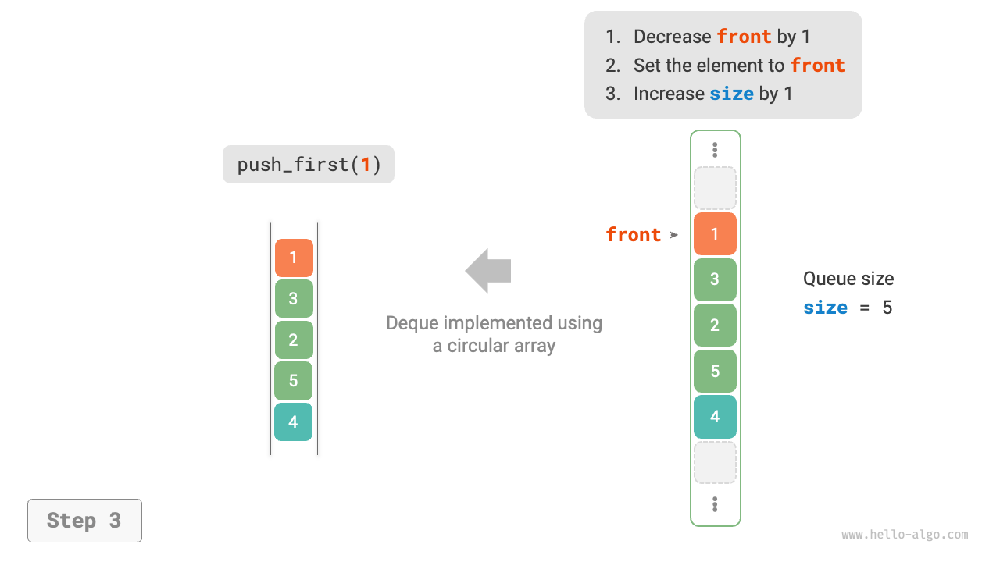

# 5.3 &nbsp; Hàng đợi hai đầu (Double-ended queue)

Trong hàng đợi (queue), chúng ta chỉ có thể xóa các phần tử từ đầu hoặc thêm các phần tử vào cuối. Như hình dưới đây, <u>hàng đợi hai đầu (deque)</u> cung cấp sự linh hoạt hơn, cho phép thêm hoặc xóa các phần tử ở cả đầu và cuối.

{ class="animation-figure" }

<p align="center"> Figure 5-7 &nbsp; Các thao tác trong hàng đợi hai đầu </p>

## Các thao tác phổ biến trong hàng đợi hai đầu

Các thao tác phổ biến trong hàng đợi hai đầu được liệt kê dưới đây, và tên của các phương thức cụ thể phụ thuộc vào ngôn ngữ lập trình được sử dụng.

<p align="center"> Bảng <id> &nbsp; Hiệu suất của các thao tác hàng đợi hai đầu </p>

| Tên phương thức | Mô tả                      | Độ phức tạp thời gian |
| --------------- | -------------------------- | ---------------       |
| `pushFirst()`   | Thêm một phần tử vào đầu   | $O(1)$                |
| `pushLast()`    | Thêm một phần tử vào cuối  | $O(1)$                |
| `popFirst()`    | Xóa phần tử đầu tiên       | $O(1)$                |
| `popLast()`     | Xóa phần tử cuối cùng      | $O(1)$                |
| `peekFirst()`   | Truy cập phần tử đầu tiên  | $O(1)$                |
| `peekLast()`    | Truy cập phần tử cuối cùng | $O(1)$                |

Tương tự, chúng ta có thể trực tiếp sử dụng các lớp hàng đợi hai đầu được triển khai trong các ngôn ngữ lập trình:

=== "Python"

    ```python title="deque.py"
    from collections import deque

    # Khởi tạo deque
    deq: deque[int] = deque()

    # Thêm phần tử vào hàng đợi
    deq.append(2)      # Thêm vào cuối
    deq.append(5)
    deq.append(4)
    deq.appendleft(3)  # Thêm vào đầu
    deq.appendleft(1)

    # Truy cập phần tử
    front: int = deq[0]  # Phần tử đầu tiên
    rear: int = deq[-1]  # Phần tử cuối cùng

    # Xóa phần tử khỏi hàng đợi
    pop_front: int = deq.popleft()  # Phần tử đầu tiên bị xóa
    pop_rear: int = deq.pop()       # Phần tử cuối cùng bị xóa

    # Lấy độ dài của deque
    size: int = len(deq)

    # Kiểm tra xem deque có rỗng không
    is_empty: bool = len(deq) == 0
    ```

=== "C++"

    ```cpp title="deque.cpp"
    /* Khởi tạo deque */
    deque<int> deque;

    /* Thêm phần tử vào hàng đợi */
    deque.push_back(2);   // Thêm vào cuối
    deque.push_back(5);
    deque.push_back(4);
    deque.push_front(3);  // Thêm vào đầu
    deque.push_front(1);

    /* Truy cập phần tử */
    int front = deque.front(); // Phần tử đầu tiên
    int back = deque.back();   // Phần tử cuối cùng

    /* Xóa phần tử khỏi hàng đợi */
    deque.pop_front();  // Phần tử đầu tiên bị xóa
    deque.pop_back();   // Phần tử cuối cùng bị xóa

    /* Lấy độ dài của deque */
    int size = deque.size();

    /* Kiểm tra xem deque có rỗng không */
    bool empty = deque.empty();
    ```

=== "Java"

    ```java title="deque.java"
    /* Khởi tạo deque */
    Deque<Integer> deque = new LinkedList<>();

    /* Thêm phần tử vào hàng đợi */
    deque.offerLast(2);   // Thêm vào cuối
    deque.offerLast(5);
    deque.offerLast(4);
    deque.offerFirst(3);  // Thêm vào đầu
    deque.offerFirst(1);

    /* Truy cập phần tử */
    int peekFirst = deque.peekFirst();  // Phần tử đầu tiên
    int peekLast = deque.peekLast();    // Phần tử cuối cùng

    /* Xóa phần tử khỏi hàng đợi */
    int popFirst = deque.pollFirst();  // Phần tử đầu tiên bị xóa
    int popLast = deque.pollLast();    // Phần tử cuối cùng bị xóa

    /* Lấy độ dài của deque */
    int size = deque.size();

    /* Kiểm tra xem deque có rỗng không */
    boolean isEmpty = deque.isEmpty();
    ```

=== "C#"

    ```csharp title="deque.cs"
    /* Khởi tạo deque */
    // Trong C#, LinkedList được sử dụng như một deque
    LinkedList<int> deque = new();

    /* Thêm phần tử vào hàng đợi */
    deque.AddLast(2);   // Thêm vào cuối
    deque.AddLast(5);
    deque.AddLast(4);
    deque.AddFirst(3);  // Thêm vào đầu
    deque.AddFirst(1);

    /* Truy cập phần tử */
    int peekFirst = deque.First.Value;  // Phần tử đầu tiên
    int peekLast = deque.Last.Value;    // Phần tử cuối cùng

    /* Xóa phần tử khỏi hàng đợi */
    deque.RemoveFirst();  // Phần tử đầu tiên bị xóa
    deque.RemoveLast();   // Phần tử cuối cùng bị xóa

    /* Lấy độ dài của deque */
    int size = deque.Count;

    /* Kiểm tra xem deque có rỗng không */
    bool isEmpty = deque.Count == 0;
    ```

=== "Go"

    ```go title="deque_test.go"
    /* Khởi tạo deque */
    // Trong Go, sử dụng list như một deque
    deque := list.New()

    /* Thêm phần tử vào hàng đợi */
    deque.PushBack(2)      // Thêm vào cuối
    deque.PushBack(5)
    deque.PushBack(4)
    deque.PushFront(3)     // Thêm vào đầu
    deque.PushFront(1)

    /* Truy cập phần tử */
    front := deque.Front() // Phần tử đầu tiên
    rear := deque.Back()   // Phần tử cuối cùng

    /* Xóa phần tử khỏi hàng đợi */
    deque.Remove(front)    // Phần tử đầu tiên bị xóa
    deque.Remove(rear)     // Phần tử cuối cùng bị xóa

    /* Lấy độ dài của deque */
    size := deque.Len()

    /* Kiểm tra xem deque có rỗng không */
    isEmpty := deque.Len() == 0
    ```

=== "Swift"

    ```swift title="deque.swift"
    /* Khởi tạo deque */
    // Swift không có lớp deque tích hợp, vì vậy Array có thể được sử dụng như một deque
    var deque: [Int] = []

    /* Thêm phần tử vào hàng đợi */
    deque.append(2) // Thêm vào cuối
    deque.append(5)
    deque.append(4)
    deque.insert(3, at: 0) // Thêm vào đầu
    deque.insert(1, at: 0)

    /* Truy cập phần tử */
    let peekFirst = deque.first! // Phần tử đầu tiên
    let peekLast = deque.last!   // Phần tử cuối cùng

    /* Xóa phần tử khỏi hàng đợi */
    // Sử dụng Array, popFirst có độ phức tạp là O(n)
    let popFirst = deque.removeFirst() // Phần tử đầu tiên bị xóa
    let popLast = deque.removeLast()   // Phần tử cuối cùng bị xóa

    /* Lấy độ dài của deque */
    let size = deque.count

    /* Kiểm tra xem deque có rỗng không */
    let isEmpty = deque.isEmpty
    ```

=== "JS"

    ```javascript title="deque.js"
    /* Khởi tạo deque */
    // JavaScript không có deque tích hợp, vì vậy Array được sử dụng như một deque
    const deque = [];

    /* Thêm phần tử vào hàng đợi */
    deque.push(2);
    deque.push(5);
    deque.push(4);
    // Lưu ý rằng unshift() có độ phức tạp thời gian là O(n) vì nó là một mảng
    deque.unshift(3);
    deque.unshift(1);

    /* Truy cập phần tử */
    const peekFirst = deque[0]; // Phần tử đầu tiên
    const peekLast = deque[deque.length - 1]; // Phần tử cuối cùng

    /* Xóa phần tử khỏi hàng đợi */
    // Lưu ý rằng shift() có độ phức tạp thời gian là O(n) vì nó là một mảng
    const popFront = deque.shift(); // Phần tử đầu tiên bị xóa
    const popBack = deque.pop();    // Phần tử cuối cùng bị xóa

    /* Lấy độ dài của deque */
    const size = deque.length;

    /* Kiểm tra xem deque có rỗng không */
    const isEmpty = size === 0;
    ```

=== "TS"

    ```typescript title="deque.ts"
    /* Khởi tạo deque */
    // TypeScript không có deque tích hợp, vì vậy Array được sử dụng như một deque
    const deque: number[] = [];

    /* Thêm phần tử vào hàng đợi */
    deque.push(2);
    deque.push(5);
    deque.push(4);
    // Lưu ý rằng unshift() có độ phức tạp thời gian là O(n) vì nó là một mảng
    deque.unshift(3);
    deque.unshift(1);

    /* Truy cập phần tử */
    const peekFirst: number = deque[0]; // Phần tử đầu tiên
    const peekLast: number = deque[deque.length - 1]; // Phần tử cuối cùng

    /* Xóa phần tử khỏi hàng đợi */
    // Lưu ý rằng shift() có độ phức tạp thời gian là O(n) vì nó là một mảng
    const popFront: number = deque.shift() as number; // Phần tử đầu tiên bị xóa
    const popBack: number = deque.pop() as number;    // Phần tử cuối cùng bị xóa

    /* Lấy độ dài của deque */
    const size: number = deque.length;

    /* Kiểm tra xem deque có rỗng không */
    const isEmpty: boolean = size === 0;
    ```

=== "Dart"

    ```dart title="deque.dart"
    /* Khởi tạo deque */
    // Trong Dart, Queue được định nghĩa là một deque
    Queue<int> deque = Queue<int>();

    /* Thêm phần tử vào hàng đợi */
    deque.addLast(2);  // Thêm vào cuối
    deque.addLast(5);
    deque.addLast(4);
    deque.addFirst(3); // Thêm vào đầu
    deque.addFirst(1);

    /* Truy cập phần tử */
    int peekFirst = deque.first; // Phần tử đầu tiên
    int peekLast = deque.last;   // Phần tử cuối cùng

    /* Xóa phần tử khỏi hàng đợi */
    int popFirst = deque.removeFirst(); // Phần tử đầu tiên bị xóa
    int popLast = deque.removeLast();   // Phần tử cuối cùng bị xóa

    /* Lấy độ dài của deque */
    int size = deque.length;

    /* Kiểm tra xem deque có rỗng không */
    bool isEmpty = deque.isEmpty;
    ```

=== "Rust"

    ```rust title="deque.rs"
    /* Khởi tạo deque */
    let mut deque: VecDeque<u32> = VecDeque::new();

    /* Thêm phần tử vào hàng đợi */
    deque.push_back(2);  // Thêm vào cuối
    deque.push_back(5);
    deque.push_back(4);
    deque.push_front(3); // Thêm vào đầu
    deque.push_front(1);

    /* Truy cập phần tử */
    if let Some(front) = deque.front() { // Phần tử đầu tiên
    }
    if let Some(rear) = deque.back() {   // Phần tử cuối cùng
    }

    /* Xóa phần tử khỏi hàng đợi */
    if let Some(pop_front) = deque.pop_front() { // Phần tử đầu tiên bị xóa
    }
    if let Some(pop_rear) = deque.pop_back() {   // Phần tử cuối cùng bị xóa
    }

    /* Lấy độ dài của deque */
    let size = deque.len();

    /* Kiểm tra xem deque có rỗng không */
    let is_empty = deque.is_empty();
    ```

=== "C"

    ```c title="deque.c"
    // C không cung cấp deque tích hợp sẵn
    ```

=== "Kotlin"

    ```kotlin title="deque.kt"

    ```

=== "Zig"

    ```zig title="deque.zig"

    ```

??? pythontutor "Visualizing Code"

    https://pythontutor.com/render.html#code=from%20collections%20import%20deque%0A%0A%22%22%22Driver%20Code%22%22%22%0Aif%20__name__%20%3D%3D%20%22__main__%22%3A%0A%20%20%20%20%23%20%E5%88%9D%E5%A7%8B%E5%8C%96%E5%8F%8C%E5%90%91%E9%98%9F%E5%88%97%0A%20%20%20%20deq%20%3D%20deque%28%29%0A%0A%20%20%20%20%23%20%E5%85%83%E7%B4%A0%E5%85%A5%E9%98%9F%0A%20%20%20%20deq.append%282%29%20%20%23%20%E6%B7%BB%E5%8A%A0%E8%87%B3%E9%98%9F%E5%B0%BE%0A%20%20%20%20deq.append%285%29%0A%20%20%20%20deq.append%284%29%0A%20%20%20%20deq.appendleft%283%29%20%20%23%20%E6%B7%BB%E5%8A%A0%E8%87%B3%E9%98%9F%E9%A6%96%0A%20%20%20%20deq.appendleft%281%29%0A%20%20%20%20print%28%22%E5%8F%8C%E5%90%91%E9%98%9F%E5%88%97%20deque%20%3D%22,%20deq%29%0A%0A%20%20%20%20%23%20%E8%AE%BF%E9%97%AE%E5%85%83%E7%B4%A0%0A%20%20%20%20front%20%3D%20deq%5B0%5D%20%20%23%20%E9%98%9F%E9%A6%96%E5%85%83%E7%B4%A0%0A%20%20%20%20print%28%22%E9%98%9F%E9%A6%96%E5%85%83%E7%B4%A0%20front%20%3D%22,%20front%29%0A%20%20%20%20rear%20%3D%20deq%5B-1%5D%20%20%23%20%E9%98%9F%E5%B0%BE%E5%85%83%E7%B4%A0%0A%20%20%20%20print%28%22%E9%98%9F%E5%B0%BE%E5%85%83%E7%B4%A0%20rear%20%3D%22,%20rear%29%0A%0A%20%20%20%20%23%20%E5%85%83%E7%B4%A0%E5%87%BA%E9%98%9F%0A%20%20%20%20pop_front%20%3D%20deq.popleft%28%29%20%20%23%20%E9%98%9F%E9%A6%96%E5%85%83%E7%B4%A0%E5%87%BA%E9%98%9F%0A%20%20%20%20print%28%22%E9%98%9F%E9%A6%96%E5%87%BA%E9%98%9F%E5%85%83%E7%B4%A0%20%20pop_front%20%3D%22,%20pop_front%29%0A%20%20%20%20print%28%22%E9%98%9F%E9%A6%96%E5%87%BA%E9%98%9F%E5%90%8E%20deque%20%3D%22,%20deq%29%0A%0A%20%20%20%20pop_rear%20%3D%20deq.pop%28%29%20%20%23%20%E9%98%9F%E5%B0%BE%E5%85%83%E7%B4%A0%E5%87%BA%E9%98%9F%0A%20%20%20%20print%28%22%E9%98%9F%E5%B0%BE%E5%87%BA%E9%98%9F%E5%85%83%E7%B4%A0%20%20pop_rear%20%3D%22,%20pop_rear%29%0A%20%20%20%20print%28%22%E9%98%9F%E5%B0%BE%E5%87%BA%E9%98%9F%E5%90%8E%20deque%20%3D%22,%20deq%29%0A%0A%20%20%20%20%23%20%E8%8E%B7%E5%8F%96%E5%8F%8C%E5%90%91%E9%98%9F%E5%88%97%E7%9A%84%E9%95%BF%E5%BA%A6%0A%20%20%20%20size%20%3D%20len%28deq%29%0A%20%20%20%20print%28%22%E5%8F%8C%E5%90%91%E9%98%9F%E5%88%97%E9%95%BF%E5%BA%A6%20size%20%3D%22,%20size%29%0A%0A%20%20%20%20%23%20%E5%88%A4%E6%96%AD%E5%8F%8C%E5%90%91%E9%98%9F%E5%88%97%E6%98%AF%E5%90%A6%E4%B8%BA%E7%A9%BA%0A%20%20%20%20is_empty%20%3D%20len%28deq%29%20%3D%3D%200%0A%20%20%20%20print%28%22%E5%8F%8C%E5%90%91%E9%98%9F%E5%88%97%E6%98%AF%E5%90%A6%E4%B8%BA%E7%A9%BA%20%3D%22,%20is_empty%29&cumulative=false&curInstr=3&heapPrimitives=nevernest&mode=display&origin=opt-frontend.js&py=311&rawInputLstJSON=%5B%5D&textReferences=false

## 5.3.2 &nbsp; Triển khai hàng đợi hai đầu *

Việc triển khai hàng đợi hai đầu tương tự như hàng đợi thông thường, nó có thể dựa trên danh sách liên kết hoặc mảng làm cấu trúc dữ liệu cơ bản.

### 1. &nbsp; Triển khai dựa trên danh sách liên kết đôi

Nhớ lại từ phần trước rằng chúng ta đã sử dụng danh sách liên kết đơn thông thường để triển khai hàng đợi, vì nó cho phép xóa từ đầu (tương ứng với thao tác dequeue) và thêm các phần tử mới sau đuôi (tương ứng với thao tác enqueue) một cách thuận tiện.

Đối với hàng đợi hai đầu, cả đầu và đuôi đều có thể thực hiện các thao tác enqueue và dequeue. Nói cách khác, hàng đợi hai đầu cần triển khai các thao tác theo hướng ngược lại. Vì điều này, chúng ta sử dụng "danh sách liên kết đôi" làm cấu trúc dữ liệu cơ bản của hàng đợi hai đầu.

Như trong hình bên dưới, chúng ta coi các nút đầu và đuôi của danh sách liên kết đôi là phía trước và phía sau của hàng đợi hai đầu, tương ứng, và triển khai chức năng thêm và xóa các nút ở cả hai đầu.

=== "LinkedListDeque"
    { class="animation-figure" }

=== "pushLast()"
    { class="animation-figure" }

=== "pushFirst()"
    { class="animation-figure" }

=== "popLast()"
    { class="animation-figure" }

=== "popFirst()"
    { class="animation-figure" }

<p align="center"> Figure 5-8 &nbsp; Triển khai hàng đợi hai đầu với danh sách liên kết đôi cho các thao tác Enqueue và Dequeue </p>

Đoạn code triển khai như sau:

=== "Python"

    ```python title="linkedlist_deque.py"
    class ListNode:
        """Double-linked list node"""

        def __init__(self, val: int):
            """Constructor"""
            self.val: int = val
            self.next: ListNode | None = None  # Reference to successor node
            self.prev: ListNode | None = None  # Reference to predecessor node

    class LinkedListDeque:
        """Double-ended queue class based on double-linked list"""

        def __init__(self):
            """Constructor"""
            self._front: ListNode | None = None  # Head node front
            self._rear: ListNode | None = None  # Tail node rear
            self._size: int = 0  # Length of the double-ended queue

        def size(self) -> int:
            """Get the length of the double-ended queue"""
            return self._size

        def is_empty(self) -> bool:
            """Determine if the double-ended queue is empty"""
            return self._size == 0

        def push(self, num: int, is_front: bool):
            """Enqueue operation"""
            node = ListNode(num)
            # If the list is empty, make front and rear both point to node
            if self.is_empty():
                self._front = self._rear = node
            # Front enqueue operation
            elif is_front:
                # Add node to the head of the list
                self._front.prev = node
                node.next = self._front
                self._front = node  # Update head node
            # Rear enqueue operation
            else:
                # Add node to the tail of the list
                self._rear.next = node
                node.prev = self._rear
                self._rear = node  # Update tail node
            self._size += 1  # Update queue length

        def push_first(self, num: int):
            """Front enqueue"""
            self.push(num, True)

        def push_last(self, num: int):
            """Rear enqueue"""
            self.push(num, False)

        def pop(self, is_front: bool) -> int:
            """Dequeue operation"""
            if self.is_empty():
                raise IndexError("Double-ended queue is empty")
            # Front dequeue operation
            if is_front:
                val: int = self._front.val  # Temporarily store the head node value
                # Remove head node
                fnext: ListNode | None = self._front.next
                if fnext is not None:
                    fnext.prev = None
                    self._front.next = None
                self._front = fnext  # Update head node
            # Rear dequeue operation
            else:
                val: int = self._rear.val  # Temporarily store the tail node value
                # Remove tail node
                rprev: ListNode | None = self._rear.prev
                if rprev is not None:
                    rprev.next = None
                    self._rear.prev = None
                self._rear = rprev  # Update tail node
            self._size -= 1  # Update queue length
            return val

        def pop_first(self) -> int:
            """Front dequeue"""
            return self.pop(True)

        def pop_last(self) -> int:
            """Rear dequeue"""
            return self.pop(False)

        def peek_first(self) -> int:
            """Access front element"""
            if self.is_empty():
                raise IndexError("Double-ended queue is empty")
            return self._front.val

        def peek_last(self) -> int:
            """Access rear element"""
            if self.is_empty():
                raise IndexError("Double-ended queue is empty")
            return self._rear.val

        def to_array(self) -> list[int]:
            """Return array for printing"""
            node = self._front
            res = [0] * self.size()
            for i in range(self.size()):
                res[i] = node.val
                node = node.next
            return res
    ```

=== "C++"

    ```cpp title="linkedlist_deque.cpp"
    /* Double-linked list node */
    struct DoublyListNode {
        int val;              // Node value
        DoublyListNode *next; // Pointer to successor node
        DoublyListNode *prev; // Pointer to predecessor node
        DoublyListNode(int val) : val(val), prev(nullptr), next(nullptr) {
        }
    };

    /* Double-ended queue class based on double-linked list */
    class LinkedListDeque {
      private:
        DoublyListNode *front, *rear; // Front node front, back node rear
        int queSize = 0;              // Length of the double-ended queue

      public:
        /* Constructor */
        LinkedListDeque() : front(nullptr), rear(nullptr) {
        }

        /* Destructor */
        ~LinkedListDeque() {
            // Traverse the linked list, remove nodes, free memory
            DoublyListNode *pre, *cur = front;
            while (cur != nullptr) {
                pre = cur;
                cur = cur->next;
                delete pre;
            }
        }

        /* Get the length of the double-ended queue */
        int size() {
            return queSize;
        }

        /* Determine if the double-ended queue is empty */
        bool isEmpty() {
            return size() == 0;
        }

        /* Enqueue operation */
        void push(int num, bool isFront) {
            DoublyListNode *node = new DoublyListNode(num);
            // If the list is empty, make front and rear both point to node
            if (isEmpty())
                front = rear = node;
            // Front enqueue operation
            else if (isFront) {
                // Add node to the head of the list
                front->prev = node;
                node->next = front;
                front = node; // Update head node
            // Rear enqueue operation
            } else {
                // Add node to the tail of the list
                rear->next = node;
                node->prev = rear;
                rear = node; // Update tail node
            }
            queSize++; // Update queue length
        }

        /* Front enqueue */
        void pushFirst(int num) {
            push(num, true);
        }

        /* Rear enqueue */
        void pushLast(int num) {
            push(num, false);
        }

        /* Dequeue operation */
        int pop(bool isFront) {
            if (isEmpty())
                throw out_of_range("Queue is empty");
            int val;
            // Front dequeue operation
            if (isFront) {
                val = front->val; // Temporarily store the head node value
                // Remove head node
                DoublyListNode *fNext = front->next;
                if (fNext != nullptr) {
                    fNext->prev = nullptr;
                    front->next = nullptr;
                }
                delete front;
                front = fNext; // Update head node
            // Rear dequeue operation
            } else {
                val = rear->val; // Temporarily store the tail node value
                // Remove tail node
                DoublyListNode *rPrev = rear->prev;
                if (rPrev != nullptr) {
                    rPrev->next = nullptr;
                    rear->prev = nullptr;
                }
                delete rear;
                rear = rPrev; // Update tail node
            }
            queSize--; // Update queue length
            return val;
        }

        /* Front dequeue */
        int popFirst() {
            return pop(true);
        }

        /* Rear dequeue */
        int popLast() {
            return pop(false);
        }

        /* Access front element */
        int peekFirst() {
            if (isEmpty())
                throw out_of_range("Double-ended queue is empty");
            return front->val;
        }

        /* Access rear element */
        int peekLast() {
            if (isEmpty())
                throw out_of_range("Double-ended queue is empty");
            return rear->val;
        }

        /* Return array for printing */
        vector<int> toVector() {
            DoublyListNode *node = front;
            vector<int> res(size());
            for (int i = 0; i < res.size(); i++) {
                res[i] = node->val;
                node = node->next;
            }
            return res;
        }
    };
    ```

=== "Java"

    ```java title="linkedlist_deque.java"
    /* Double-linked list node */
    class ListNode {
        int val; // Node value
        ListNode next; // Reference to successor node
        ListNode prev; // Reference to predecessor node

        ListNode(int val) {
            this.val = val;
            prev = next = null;
        }
    }

    /* Double-ended queue class based on double-linked list */
    class LinkedListDeque {
        private ListNode front, rear; // Front node front, back node rear
        private int queSize = 0; // Length of the double-ended queue

        public LinkedListDeque() {
            front = rear = null;
        }

        /* Get the length of the double-ended queue */
        public int size() {
            return queSize;
        }

        /* Determine if the double-ended queue is empty */
        public boolean isEmpty() {
            return size() == 0;
        }

        /* Enqueue operation */
        private void push(int num, boolean isFront) {
            ListNode node = new ListNode(num);
            // If the list is empty, make front and rear both point to node
            if (isEmpty())
                front = rear = node;
            // Front enqueue operation
            else if (isFront) {
                // Add node to the head of the list
                front.prev = node;
                node.next = front;
                front = node; // Update head node
            // Rear enqueue operation
            } else {
                // Add node to the tail of the list
                rear.next = node;
                node.prev = rear;
                rear = node; // Update tail node
            }
            queSize++; // Update queue length
        }

        /* Front enqueue */
        public void pushFirst(int num) {
            push(num, true);
        }

        /* Rear enqueue */
        public void pushLast(int num) {
            push(num, false);
        }

        /* Dequeue operation */
        private int pop(boolean isFront) {
            if (isEmpty())
                throw new IndexOutOfBoundsException();
            int val;
            // Front dequeue operation
            if (isFront) {
                val = front.val; // Temporarily store the head node value
                // Remove head node
                ListNode fNext = front.next;
                if (fNext != null) {
                    fNext.prev = null;
                    front.next = null;
                }
                front = fNext; // Update head node
            // Rear dequeue operation
            } else {
                val = rear.val; // Temporarily store the tail node value
                // Remove tail node
                ListNode rPrev = rear.prev;
                if (rPrev != null) {
                    rPrev.next = null;
                    rear.prev = null;
                }
                rear = rPrev; // Update tail node
            }
            queSize--; // Update queue length
            return val;
        }

        /* Front dequeue */
        public int popFirst() {
            return pop(true);
        }

        /* Rear dequeue */
        public int popLast() {
            return pop(false);
        }

        /* Access front element */
        public int peekFirst() {
            if (isEmpty())
                throw new IndexOutOfBoundsException();
            return front.val;
        }

        /* Access rear element */
        public int peekLast() {
            if (isEmpty())
                throw new IndexOutOfBoundsException();
            return rear.val;
        }

        /* Return array for printing */
        public int[] toArray() {
            ListNode node = front;
            int[] res = new int[size()];
            for (int i = 0; i < res.length; i++) {
                res[i] = node.val;
                node = node.next;
            }
            return res;
        }
    }
    ```

=== "C#"

    ```csharp title="linkedlist_deque.cs"
    [class]{ListNode}-[func]{}

    [class]{LinkedListDeque}-[func]{}
    ```

=== "Go"

    ```go title="linkedlist_deque.go"
    [class]{linkedListDeque}-[func]{}
    ```

=== "Swift"

    ```swift title="linkedlist_deque.swift"
    [class]{ListNode}-[func]{}

    [class]{LinkedListDeque}-[func]{}
    ```

=== "JS"

    ```javascript title="linkedlist_deque.js"
    [class]{ListNode}-[func]{}

    [class]{LinkedListDeque}-[func]{}
    ```

=== "TS"

    ```typescript title="linkedlist_deque.ts"
    [class]{ListNode}-[func]{}

    [class]{LinkedListDeque}-[func]{}
    ```

=== "Dart"

    ```dart title="linkedlist_deque.dart"
    [class]{ListNode}-[func]{}

    [class]{LinkedListDeque}-[func]{}
    ```

=== "Rust"

    ```rust title="linkedlist_deque.rs"
    pub struct ListNode<T> {
        pub val: T,                                 // Giá trị của nút
        pub next: Option<Rc<RefCell<ListNode<T>>>>, // Con trỏ đến nút kế tiếp
        pub prev: Option<Rc<RefCell<ListNode<T>>>>, // Con trỏ đến nút phía trước
    }

    impl<T> ListNode<T> {
        pub fn new(val: T) -> Rc<RefCell<ListNode<T>>> {
            Rc::new(RefCell::new(ListNode {
                val,
                next: None,
                prev: None,
            }))
        }
    }

    /* Hàng đợi hai đầu được triển khai dựa trên danh sách liên kết đôi */
    #[allow(dead_code)]
    pub struct LinkedListDeque<T> {
        front: Option<Rc<RefCell<ListNode<T>>>>, // Nút đầu front
        rear: Option<Rc<RefCell<ListNode<T>>>>,  // Nút cuối rear
        que_size: usize,                         // Độ dài của hàng đợi hai đầu
    }

    impl<T: Copy> LinkedListDeque<T> {
        pub fn new() -> Self {
            Self {
                front: None,
                rear: None,
                que_size: 0,
            }
        }

        /* Lấy độ dài của hàng đợi hai đầu */
        pub fn size(&self) -> usize {
            return self.que_size;
        }

        /* Kiểm tra xem hàng đợi hai đầu có rỗng không */
        pub fn is_empty(&self) -> bool {
            return self.que_size == 0;
        }

        /* Thao tác thêm vào hàng đợi */
        fn push(&mut self, num: T, is_front: bool) {
            let node = ListNode::new(num);
            // Thêm vào đầu hàng đợi
            if is_front {
                match self.front.take() {
                    // Nếu danh sách liên kết rỗng, cho front và rear cùng trỏ đến node
                    None => {
                        self.rear = Some(node.clone());
                        self.front = Some(node);
                    }
                    // Thêm node vào đầu danh sách liên kết
                    Some(old_front) => {
                        old_front.borrow_mut().prev = Some(node.clone());
                        node.borrow_mut().next = Some(old_front);
                        self.front = Some(node); // Cập nhật nút đầu
                    }
                }
            }
            // Thêm vào cuối hàng đợi
            else {
                match self.rear.take() {
                    // Nếu danh sách liên kết rỗng, cho front và rear cùng trỏ đến node
                    None => {
                        self.front = Some(node.clone());
                        self.rear = Some(node);
                    }
                    // Thêm node vào cuối danh sách liên kết
                    Some(old_rear) => {
                        old_rear.borrow_mut().next = Some(node.clone());
                        node.borrow_mut().prev = Some(old_rear);
                        self.rear = Some(node); // Cập nhật nút cuối
                    }
                }
            }
            self.que_size += 1; // Cập nhật độ dài hàng đợi
        }

        /* Thêm vào đầu hàng đợi */
        pub fn push_first(&mut self, num: T) {
            self.push(num, true);
        }

        /* Thêm vào cuối hàng đợi */
        pub fn push_last(&mut self, num: T) {
            self.push(num, false);
        }

        /* Thao tác lấy ra khỏi hàng đợi */
        fn pop(&mut self, is_front: bool) -> Option<T> {
            // Nếu hàng đợi rỗng, trả về None
            if self.is_empty() {
                return None;
            };
            // Lấy ra từ đầu hàng đợi
            if is_front {
                self.front.take().map(|old_front| {
                    match old_front.borrow_mut().next.take() {
                        Some(new_front) => {
                            new_front.borrow_mut().prev.take();
                            self.front = Some(new_front); // Cập nhật nút đầu
                        }
                        None => {
                            self.rear.take();
                        }
                    }
                    self.que_size -= 1; // Cập nhật độ dài hàng đợi
                    old_front.borrow().val
                })
            }
            // Lấy ra từ cuối hàng đợi
            else {
                self.rear.take().map(|old_rear| {
                    match old_rear.borrow_mut().prev.take() {
                        Some(new_rear) => {
                            new_rear.borrow_mut().next.take();
                            self.rear = Some(new_rear); // Cập nhật nút cuối
                        }
                        None => {
                            self.front.take();
                        }
                    }
                    self.que_size -= 1; // Cập nhật độ dài hàng đợi
                    old_rear.borrow().val
                })
            }
        }

        /* Lấy ra từ đầu hàng đợi */
        pub fn pop_first(&mut self) -> Option<T> {
            return self.pop(true);
        }

        /* Lấy ra từ cuối hàng đợi */
        pub fn pop_last(&mut self) -> Option<T> {
            return self.pop(false);
        }

        /* Truy cập phần tử đầu hàng đợi */
        pub fn peek_first(&self) -> Option<&Rc<RefCell<ListNode<T>>>> {
            self.front.as_ref()
        }

        /* Truy cập phần tử cuối hàng đợi */
        pub fn peek_last(&self) -> Option<&Rc<RefCell<ListNode<T>>>> {
            self.rear.as_ref()
        }

        /* Trả về mảng để in */
        pub fn to_array(&self, head: Option<&Rc<RefCell<ListNode<T>>>>) -> Vec<T> {
            let mut res: Vec<T> = Vec::new();
            fn recur<T: Copy>(cur: Option<&Rc<RefCell<ListNode<T>>>>, res: &mut Vec<T>) {
                if let Some(cur) = cur {
                    res.push(cur.borrow().val);
                    recur(cur.borrow().next.as_ref(), res);
                }
            }

            recur(head, &mut res);
            res
        }
    }
    ```

=== "C"

    ```c title="linkedlist_deque.c"
    [class]{DoublyListNode}-[func]{}

    [class]{LinkedListDeque}-[func]{}
    ```

=== "Kotlin"

    ```kotlin title="linkedlist_deque.kt"
    [class]{ListNode}-[func]{}

    [class]{LinkedListDeque}-[func]{}
    ```

=== "Ruby"

    ```ruby title="linkedlist_deque.rb"
    [class]{ListNode}-[func]{}

    [class]{LinkedListDeque}-[func]{}
    ```

=== "Zig"

    ```zig title="linkedlist_deque.zig"
    [class]{ListNode}-[func]{}

    [class]{LinkedListDeque}-[func]{}
    ```

### 2. &nbsp; Triển khai dựa trên mảng

Như trong hình bên dưới, tương tự như triển khai hàng đợi bằng mảng, chúng ta cũng có thể sử dụng mảng vòng để triển khai hàng đợi hai đầu.

=== "ArrayDeque"
    { class="animation-figure" }

=== "pushLast()"
    { class="animation-figure" }

=== "pushFirst()"
    { class="animation-figure" }

=== "popLast()"
    { class="animation-figure" }

=== "popFirst()"
    { class="animation-figure" }

<p align="center"> Figure 5-9 &nbsp; Triển khai hàng đợi hai đầu với mảng cho các thao tác Enqueue và Dequeue </p>

Việc triển khai chỉ cần thêm các phương thức cho "enqueue phía trước" và "dequeue phía sau":

=== "Python"

    ```python title="array_deque.py"
    class ArrayDeque:
        """Double-ended queue class based on circular array"""

        def __init__(self, capacity: int):
            """Constructor"""
            self._nums: list[int] = [0] * capacity
            self._front: int = 0
            self._size: int = 0

        def capacity(self) -> int:
            """Get the capacity of the double-ended queue"""
            return len(self._nums)

        def size(self) -> int:
            """Get the length of the double-ended queue"""
            return self._size

        def is_empty(self) -> bool:
            """Determine if the double-ended queue is empty"""
            return self._size == 0

        def index(self, i: int) -> int:
            """Calculate circular array index"""
            # Implement circular array by modulo operation
            # When i exceeds the tail of the array, return to the head
            # When i exceeds the head of the array, return to the tail
            return (i + self.capacity()) % self.capacity()

        def push_first(self, num: int):
            """Front enqueue"""
            if self._size == self.capacity():
                print("Double-ended queue is full")
                return
            # Move the front pointer one position to the left
            # Implement front crossing the head of the array to return to the tail by modulo operation
            self._front = self.index(self._front - 1)
            # Add num to the front
            self._nums[self._front] = num
            self._size += 1

        def push_last(self, num: int):
            """Rear enqueue"""
            if self._size == self.capacity():
                print("Double-ended queue is full")
                return
            # Calculate rear pointer, pointing to rear index + 1
            rear = self.index(self._front + self._size)
            # Add num to the rear
            self._nums[rear] = num
            self._size += 1

        def pop_first(self) -> int:
            """Front dequeue"""
            num = self.peek_first()
            # Move front pointer one position backward
            self._front = self.index(self._front + 1)
            self._size -= 1
            return num

        def pop_last(self) -> int:
            """Rear dequeue"""
            num = self.peek_last()
            self._size -= 1
            return num

        def peek_first(self) -> int:
            """Access front element"""
            if self.is_empty():
                raise IndexError("Double-ended queue is empty")
            return self._nums[self._front]

        def peek_last(self) -> int:
            """Access rear element"""
            if self.is_empty():
                raise IndexError("Double-ended queue is empty")
            # Calculate rear element index
            last = self.index(self._front + self._size - 1)
            return self._nums[last]

        def to_array(self) -> list[int]:
            """Return array for printing"""
            # Only convert elements within valid length range
            res = []
            for i in range(self._size):
                res.append(self._nums[self.index(self._front + i)])
            return res
    ```

=== "C++"

    ```cpp title="array_deque.cpp"
    /* Double-ended queue class based on circular array */
    class ArrayDeque {
      private:
        vector<int> nums; // Array used to store elements of the double-ended queue
        int front;        // Front pointer, pointing to the front element
        int queSize;      // Length of the double-ended queue

      public:
        /* Constructor */
        ArrayDeque(int capacity) {
            nums.resize(capacity);
            front = queSize = 0;
        }

        /* Get the capacity of the double-ended queue */
        int capacity() {
            return nums.size();
        }

        /* Get the length of the double-ended queue */
        int size() {
            return queSize;
        }

        /* Determine if the double-ended queue is empty */
        bool isEmpty() {
            return queSize == 0;
        }

        /* Calculate circular array index */
        int index(int i) {
            // Implement circular array by modulo operation
            // When i exceeds the tail of the array, return to the head
            // When i exceeds the head of the array, return to the tail
            return (i + capacity()) % capacity();
        }

        /* Front enqueue */
        void pushFirst(int num) {
            if (queSize == capacity()) {
                cout << "Double-ended queue is full" << endl;
                return;
            }
            // Move the front pointer one position to the left
            // Implement front crossing the head of the array to return to the tail by modulo operation
            front = index(front - 1);
            // Add num to the front
            nums[front] = num;
            queSize++;
        }

        /* Rear enqueue */
        void pushLast(int num) {
            if (queSize == capacity()) {
                cout << "Double-ended queue is full" << endl;
                return;
            }
            // Calculate rear pointer, pointing to rear index + 1
            int rear = index(front + queSize);
            // Add num to the rear
            nums[rear] = num;
            queSize++;
        }

        /* Front dequeue */
        int popFirst() {
            int num = peekFirst();
            // Move front pointer one position backward
            front = index(front + 1);
            queSize--;
            return num;
        }

        /* Rear dequeue */
        int popLast() {
            int num = peekLast();
            queSize--;
            return num;
        }

        /* Access front element */
        int peekFirst() {
            if (isEmpty())
                throw out_of_range("Double-ended queue is empty");
            return nums[front];
        }

        /* Access rear element */
        int peekLast() {
            if (isEmpty())
                throw out_of_range("Double-ended queue is empty");
            // Calculate rear element index
            int last = index(front + queSize - 1);
            return nums[last];
        }

        /* Return array for printing */
        vector<int> toVector() {
            // Only convert elements within valid length range
            vector<int> res(queSize);
            for (int i = 0, j = front; i < queSize; i++, j++) {
                res[i] = nums[index(j)];
            }
            return res;
        }
    };
    ```

=== "Java"

    ```java title="array_deque.java"
    /* Double-ended queue class based on circular array */
    class ArrayDeque {
        private int[] nums; // Array used to store elements of the double-ended queue
        private int front; // Front pointer, pointing to the front element
        private int queSize; // Length of the double-ended queue

        /* Constructor */
        public ArrayDeque(int capacity) {
            this.nums = new int[capacity];
            front = queSize = 0;
        }

        /* Get the capacity of the double-ended queue */
        public int capacity() {
            return nums.length;
        }

        /* Get the length of the double-ended queue */
        public int size() {
            return queSize;
        }

        /* Determine if the double-ended queue is empty */
        public boolean isEmpty() {
            return queSize == 0;
        }

        /* Calculate circular array index */
        private int index(int i) {
            // Implement circular array by modulo operation
            // When i exceeds the tail of the array, return to the head
            // When i exceeds the head of the array, return to the tail
            return (i + capacity()) % capacity();
        }

        /* Front enqueue */
        public void pushFirst(int num) {
            if (queSize == capacity()) {
                System.out.println("Double-ended queue is full");
                return;
            }
            // Move the front pointer one position to the left
            // Implement front crossing the head of the array to return to the tail by modulo operation
            front = index(front - 1);
            // Add num to the front
            nums[front] = num;
            queSize++;
        }

        /* Rear enqueue */
        public void pushLast(int num) {
            if (queSize == capacity()) {
                System.out.println("Double-ended queue is full");
                return;
            }
            // Calculate rear pointer, pointing to rear index + 1
            int rear = index(front + queSize);
            // Add num to the rear
            nums[rear] = num;
            queSize++;
        }

        /* Front dequeue */
        public int popFirst() {
            int num = peekFirst();
            // Move front pointer one position backward
            front = index(front + 1);
            queSize--;
            return num;
        }

        /* Rear dequeue */
        public int popLast() {
            int num = peekLast();
            queSize--;
            return num;
        }

        /* Access front element */
        public int peekFirst() {
            if (isEmpty())
                throw new IndexOutOfBoundsException();
            return nums[front];
        }

        /* Access rear element */
        public int peekLast() {
            if (isEmpty())
                throw new IndexOutOfBoundsException();
            // Calculate rear element index
            int last = index(front + queSize - 1);
            return nums[last];
        }

        /* Return array for printing */
        public int[] toArray() {
            // Only convert elements within valid length range
            int[] res = new int[queSize];
            for (int i = 0, j = front; i < queSize; i++, j++) {
                res[i] = nums[index(j)];
            }
            return res;
        }
    }
    ```

=== "C#"

    ```csharp title="array_deque.cs"
    [class]{ArrayDeque}-[func]{}
    ```

=== "Go"

    ```go title="array_deque.go"
    [class]{arrayDeque}-[func]{}
    ```

=== "Swift"

    ```swift title="array_deque.swift"
    [class]{ArrayDeque}-[func]{}
    ```

=== "JS"

    ```javascript title="array_deque.js"
    [class]{ArrayDeque}-[func]{}
    ```

=== "TS"

    ```typescript title="array_deque.ts"
    [class]{ArrayDeque}-[func]{}
    ```

=== "Dart"

    ```dart title="array_deque.dart"
    [class]{ArrayDeque}-[func]{}
    ```

=== "Rust"

    ```rust title="array_deque.rs"
    struct ArrayDeque<T> {
        // `Vec<T>` này sẽ là nơi chúng ta lưu trữ các phần tử của hàng đợi.
        nums: Vec<T>,
        // `front` là một chỉ số (index), nó cho biết vị trí của phần tử đầu tiên trong hàng đợi.
        front: usize,
        // `que_size` theo dõi số lượng phần tử hiện có trong hàng đợi.
        que_size: usize,
    }

    impl<T: Copy + Default> ArrayDeque<T> {
        /* Hàm khởi tạo (constructor) để tạo một `ArrayDeque` mới với dung lượng cho trước. */
        pub fn new(capacity: usize) -> Self {
            Self {
                nums: vec![T::default(); capacity],
                front: 0,
                que_size: 0,
            }
        }

        /* Lấy dung lượng tối đa của hàng đợi. */
        pub fn capacity(&self) -> usize {
            self.nums.len()
        }

        /* Lấy số lượng phần tử hiện tại trong hàng đợi. */
        pub fn size(&self) -> usize {
            self.que_size
        }

        /* Kiểm tra xem hàng đợi có rỗng không. */
        pub fn is_empty(&self) -> bool {
            self.que_size == 0
        }

        /* Hàm nội bộ giúp tính toán chỉ số trong mảng vòng. */
        fn index(&self, i: i32) -> usize {
            // Phép toán modulo (%) này là chìa khóa để biến mảng thông thường thành mảng vòng.
            // Khi chỉ số `i` đi quá cuối mảng, nó sẽ quay về đầu.
            // Tương tự, khi đi lùi quá đầu mảng, nó sẽ vòng ra cuối.
            ((i + self.capacity() as i32) % self.capacity() as i32) as usize
        }

        /* Thêm một phần tử vào đầu hàng đợi (giống như `push` trong Stack). */
        pub fn push_first(&mut self, num: T) {
            if self.que_size == self.capacity() {
                println!("Hàng đợi hai đầu đã đầy");
                return;
            }
            // Di chuyển con trỏ `front` về phía trước một vị trí (vòng tròn).
            // Phép toán `index` sẽ xử lý việc quay vòng khi `front` đi qua chỉ số 0.
            self.front = self.index(self.front as i32 - 1);
            // Gán giá trị mới vào vị trí `front` vừa được cập nhật.
            self.nums[self.front] = num;
            self.que_size += 1;
        }

        /* Thêm một phần tử vào cuối hàng đợi (giống như `enqueue` trong Queue). */
        pub fn push_last(&mut self, num: T) {
            if self.que_size == self.capacity() {
                println!("Hàng đợi hai đầu đã đầy");
                return;
            }
            // Tính toán chỉ số của vị trí cuối cùng còn trống để thêm phần tử mới.
            let rear = self.index(self.front as i32 + self.que_size as i32);
            // Gán giá trị mới vào vị trí cuối cùng đó.
            self.nums[rear] = num;
            self.que_size += 1;
        }

        /* Lấy ra phần tử ở đầu hàng đợi (giống như `pop` trong Stack hoặc `dequeue` trong Queue). */
        fn pop_first(&mut self) -> T {
            let num = self.peek_first();
            // Cập nhật lại con trỏ `front`, di chuyển nó đến phần tử kế tiếp.
            self.front = self.index(self.front as i32 + 1);
            self.que_size -= 1;
            num
        }

        /* Lấy ra phần tử ở cuối hàng đợi. */
        fn pop_last(&mut self) -> T {
            let num = self.peek_last();
            self.que_size -= 1;
            num
        }

        /* "Nhìn trộm" (peek) phần tử ở đầu hàng đợi mà không xóa nó. */
        fn peek_first(&self) -> T {
            if self.is_empty() {
                panic!("Hàng đợi hai đầu rỗng")
            };
            self.nums[self.front]
        }

        /* "Nhìn trộm" (peek) phần tử ở cuối hàng đợi mà không xóa nó. */
        fn peek_last(&self) -> T {
            if self.is_empty() {
                panic!("Hàng đợi hai đầu rỗng")
            };
            // Tính toán chỉ số của phần tử cuối cùng trong hàng đợi.
            let last = self.index(self.front as i32 + self.que_size as i32 - 1);
            self.nums[last]
        }

        /* Chuyển đổi hàng đợi thành một `Vec<T>` để dễ dàng hiển thị hoặc kiểm tra. */
        fn to_array(&self) -> Vec<T> {
            // Chỉ sao chép các phần tử hợp lệ từ mảng vòng vào vector kết quả.
            let mut res = vec![T::default(); self.que_size];
            let mut j = self.front;
            for i in 0..self.que_size {
                res[i] = self.nums[self.index(j as i32)];
                j += 1;
            }
            res
        }
    }
    ```

=== "C"

    ```c title="array_deque.c"
    [class]{ArrayDeque}-[func]{}
    ```

=== "Kotlin"

    ```kotlin title="array_deque.kt"
    [class]{ArrayDeque}-[func]{}
    ```

=== "Ruby"

    ```ruby title="array_deque.rb"
    [class]{ArrayDeque}-[func]{}
    ```

=== "Zig"

    ```zig title="array_deque.zig"
    [class]{ArrayDeque}-[func]{}
    ```

## 5.3.3 &nbsp; Ứng dụng của hàng đợi hai đầu

Hàng đợi hai đầu kết hợp logic của cả ngăn xếp và hàng đợi, **do đó, nó có thể triển khai tất cả các trường hợp sử dụng tương ứng của chúng đồng thời mang lại sự linh hoạt cao hơn**.

Chúng ta biết rằng tính năng "undo" của phần mềm thường được triển khai bằng cách sử dụng ngăn xếp: hệ thống `đẩy` mỗi thao tác thay đổi vào ngăn xếp và sau đó `lấy ra` để thực hiện undo. Tuy nhiên, xem xét các hạn chế về tài nguyên hệ thống, phần mềm thường giới hạn số lượng các bước undo (ví dụ: chỉ cho phép 50 bước cuối cùng). Khi độ dài ngăn xếp vượt quá 50, phần mềm cần thực hiện thao tác xóa ở dưới cùng của ngăn xếp (phía trước của hàng đợi). **Nhưng một ngăn xếp thông thường không thể thực hiện chức năng này, trong đó hàng đợi hai đầu trở nên cần thiết**. Lưu ý rằng logic cốt lõi của "undo" vẫn tuân theo nguyên tắc Last-In-First-Out của ngăn xếp, nhưng hàng đợi hai đầu có thể linh hoạt hơn trong việc triển khai một số logic bổ sung.
