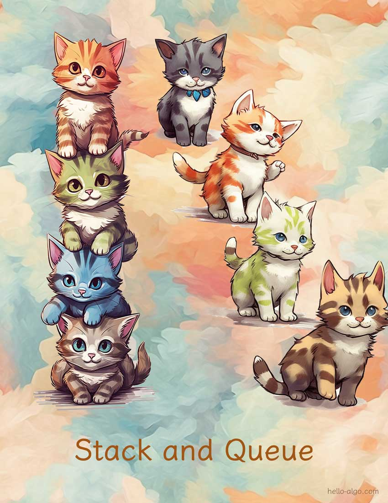

# Chapter 5. &nbsp; Stack và queue

{ class="cover-image" }

!!! abstract

    Stack giống như những chú mèo được xếp chồng lên nhau, trong khi queue giống như những chú mèo xếp hàng lần lượt.
    
    Chúng đại diện cho mối quan hệ logic của Last-In-First-Out (LIFO) và First-In-First-Out (FIFO), tương ứng.

## Chapter contents

- [5.1 &nbsp; Stack](stack.md)
- [5.2 &nbsp; Queue](queue.md)
- [5.3 &nbsp; Double-ended queue](deque.md)
- [5.4 &nbsp; Summary](summary.md)
