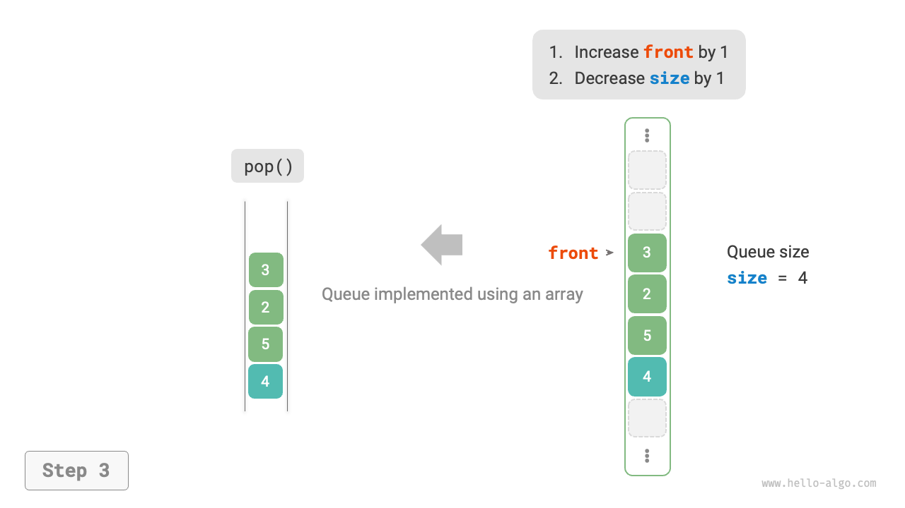

# 5.2 &nbsp; Hàng đợi (Queue)

<u>Hàng đợi (queue)</u> là một cấu trúc dữ liệu tuyến tính tuân theo nguyên tắc Nhập Trước Xuất Trước (FIFO). Như tên gọi của nó, hàng đợi mô phỏng hiện tượng xếp hàng, trong đó người mới đến sẽ tham gia vào hàng đợi ở phía sau và người ở phía trước sẽ rời khỏi hàng đợi trước.

Như trong hình dưới đây, chúng ta gọi đầu hàng đợi là "head" (đầu) và cuối hàng đợi là "tail" (đuôi). Thao tác thêm các phần tử vào cuối hàng đợi được gọi là "enqueue" (xếp hàng), và thao tác loại bỏ các phần tử từ đầu hàng đợi được gọi là "dequeue" (rời hàng).

{ class="animation-figure" }

<p align="center"> Figure 5-4 &nbsp; Quy tắc vào trước ra trước của hàng đợi </p>

## 5.2.1 &nbsp; Các thao tác phổ biến trên hàng đợi

Các thao tác phổ biến trên một hàng đợi được hiển thị trong bảng dưới đây. Lưu ý rằng tên phương thức có thể khác nhau giữa các ngôn ngữ lập trình khác nhau. Ở đây, chúng ta sử dụng quy ước đặt tên tương tự như quy ước được sử dụng cho ngăn xếp.

<p align="center"> Bảng <id> &nbsp; Hiệu quả của các hoạt động trên hàng đợi </p>

<div class="center-table" markdown>

| Tên phương thức | Mô tả                                          | Độ phức tạp thời gian |
| --------------- | ---------------------------------------------- | --------------------  |
| `push()`        | Xếp một phần tử vào hàng đợi, thêm nó vào đuôi | $O(1)$                |
| `pop()`         | Lấy phần tử ở đầu hàng đợi ra khỏi hàng đợi    | $O(1)$                |
| `peek()`        | Truy cập phần tử ở đầu hàng đợi                | $O(1)$                |

</div>

Chúng ta có thể trực tiếp sử dụng các lớp hàng đợi dựng sẵn trong các ngôn ngữ lập trình:

=== "Python"

    ```python title="queue.py"
    from collections import deque

    # Khởi tạo hàng đợi
    # Trong Python, chúng ta thường sử dụng lớp deque như một hàng đợi
    # Mặc dù queue.Queue() là một lớp hàng đợi thuần túy, nó không thân thiện lắm với người dùng, vì vậy nó không được khuyến khích
    que: deque[int] = deque()

    # Xếp hàng các phần tử
    que.append(1)
    que.append(3)
    que.append(2)
    que.append(5)
    que.append(4)

    # Truy cập phần tử đầu tiên
    front: int = que[0]

    # Lấy một phần tử ra khỏi hàng đợi
    pop: int = que.popleft()

    # Lấy độ dài của hàng đợi
    size: int = len(que)

    # Kiểm tra xem hàng đợi có trống hay không
    is_empty: bool = len(que) == 0
    ```

=== "C++"

    ```cpp title="queue.cpp"
    /* Khởi tạo hàng đợi */
    queue<int> queue;

    /* Xếp hàng các phần tử */
    queue.push(1);
    queue.push(3);
    queue.push(2);
    queue.push(5);
    queue.push(4);

    /* Truy cập phần tử đầu tiên*/
    int front = queue.front();

    /* Lấy một phần tử ra khỏi hàng đợi */
    queue.pop();

    /* Lấy độ dài của hàng đợi */
    int size = queue.size();

    /* Kiểm tra xem hàng đợi có trống hay không */
    bool empty = queue.empty();
    ```

=== "Java"

    ```java title="queue.java"
    /* Khởi tạo hàng đợi */
    Queue<Integer> queue = new LinkedList<>();

    /* Xếp hàng các phần tử */
    queue.offer(1);
    queue.offer(3);
    queue.offer(2);
    queue.offer(5);
    queue.offer(4);

    /* Truy cập phần tử đầu tiên */
    int peek = queue.peek();

    /* Lấy một phần tử ra khỏi hàng đợi */
    int pop = queue.poll();

    /* Lấy độ dài của hàng đợi */
    int size = queue.size();

    /* Kiểm tra xem hàng đợi có trống hay không */
    boolean isEmpty = queue.isEmpty();
    ```

=== "C#"

    ```csharp title="queue.cs"
    /* Khởi tạo hàng đợi */
    Queue<int> queue = new();

    /* Xếp hàng các phần tử */
    queue.Enqueue(1);
    queue.Enqueue(3);
    queue.Enqueue(2);
    queue.Enqueue(5);
    queue.Enqueue(4);

    /* Truy cập phần tử đầu tiên */
    int peek = queue.Peek();

    /* Lấy một phần tử ra khỏi hàng đợi */
    int pop = queue.Dequeue();

    /* Lấy độ dài của hàng đợi */
    int size = queue.Count;

    /* Kiểm tra xem hàng đợi có trống hay không */
    bool isEmpty = queue.Count == 0;
    ```

=== "Go"

    ```go title="queue_test.go"
    /* Khởi tạo hàng đợi */
    // Trong Go, sử dụng list như một hàng đợi
    queue := list.New()

    /* Xếp hàng các phần tử */
    queue.PushBack(1)
    queue.PushBack(3)
    queue.PushBack(2)
    queue.PushBack(5)
    queue.PushBack(4)

    /* Truy cập phần tử đầu tiên */
    peek := queue.Front()

    /* Lấy một phần tử ra khỏi hàng đợi */
    pop := queue.Front()
    queue.Remove(pop)

    /* Lấy độ dài của hàng đợi */
    size := queue.Len()

    /* Kiểm tra xem hàng đợi có trống hay không */
    isEmpty := queue.Len() == 0
    ```

=== "Swift"

    ```swift title="queue.swift"
    /* Khởi tạo hàng đợi */
    // Swift không có lớp hàng đợi tích hợp, vì vậy Array có thể được sử dụng như một hàng đợi
    var queue: [Int] = []

    /* Xếp hàng các phần tử */
    queue.append(1)
    queue.append(3)
    queue.append(2)
    queue.append(5)
    queue.append(4)

    /* Truy cập phần tử đầu tiên */
    let peek = queue.first!

    /* Lấy một phần tử ra khỏi hàng đợi */
    // Vì nó là một mảng, removeFirst có độ phức tạp là O(n)
    let pool = queue.removeFirst()

    /* Lấy độ dài của hàng đợi */
    let size = queue.count

    /* Kiểm tra xem hàng đợi có trống hay không */
    let isEmpty = queue.isEmpty
    ```

=== "JS"

    ```javascript title="queue.js"
    /* Khởi tạo hàng đợi */
    // JavaScript không có hàng đợi tích hợp, vì vậy Array có thể được sử dụng như một hàng đợi
    const queue = [];

    /* Xếp hàng các phần tử */
    queue.push(1);
    queue.push(3);
    queue.push(2);
    queue.push(5);
    queue.push(4);

    /* Truy cập phần tử đầu tiên */
    const peek = queue[0];

    /* Lấy một phần tử ra khỏi hàng đợi */
    // Vì cấu trúc bên dưới là một mảng, phương thức shift() có độ phức tạp thời gian là O(n)
    const pop = queue.shift();

    /* Lấy độ dài của hàng đợi */
    const size = queue.length;

    /* Kiểm tra xem hàng đợi có trống hay không */
    const empty = queue.length === 0;
    ```

=== "TS"

    ```typescript title="queue.ts"
    /* Khởi tạo hàng đợi */
    // TypeScript không có hàng đợi tích hợp, vì vậy Array có thể được sử dụng như một hàng đợi 
    const queue: number[] = [];

    /* Xếp hàng các phần tử */
    queue.push(1);
    queue.push(3);
    queue.push(2);
    queue.push(5);
    queue.push(4);

    /* Truy cập phần tử đầu tiên */
    const peek = queue[0];

    /* Lấy một phần tử ra khỏi hàng đợi */
    // Vì cấu trúc bên dưới là một mảng, phương thức shift() có độ phức tạp thời gian là O(n)
    const pop = queue.shift();

    /* Lấy độ dài của hàng đợi */
    const size = queue.length;

    /* Kiểm tra xem hàng đợi có trống hay không */
    const empty = queue.length === 0;
    ```

=== "Dart"

    ```dart title="queue.dart"
    /* Khởi tạo hàng đợi */
    // Trong Dart, lớp Queue là một hàng đợi hai đầu nhưng có thể được sử dụng như một hàng đợi
    Queue<int> queue = Queue();

    /* Xếp hàng các phần tử */
    queue.add(1);
    queue.add(3);
    queue.add(2);
    queue.add(5);
    queue.add(4);

    /* Truy cập phần tử đầu tiên */
    int peek = queue.first;

    /* Lấy một phần tử ra khỏi hàng đợi */
    int pop = queue.removeFirst();

    /* Lấy độ dài của hàng đợi */
    int size = queue.length;

    /* Kiểm tra xem hàng đợi có trống hay không */
    bool isEmpty = queue.isEmpty;
    ```

=== "Rust"

    ```rust title="queue.rs"
    /* Khởi tạo hàng đợi hai đầu */
    // Trong Rust, sử dụng hàng đợi hai đầu như một hàng đợi thông thường
    let mut deque: VecDeque<u32> = VecDeque::new();

    /* Xếp hàng các phần tử */
    deque.push_back(1);
    deque.push_back(3);
    deque.push_back(2);
    deque.push_back(5);
    deque.push_back(4);

    /* Truy cập phần tử đầu tiên */
    if let Some(front) = deque.front() {
    }

    /* Lấy một phần tử ra khỏi hàng đợi */
    if let Some(pop) = deque.pop_front() {
    }

    /* Lấy độ dài của hàng đợi */
    let size = deque.len();

    /* Kiểm tra xem hàng đợi có trống hay không */
    let is_empty = deque.is_empty();
    ```

=== "C"

    ```c title="queue.c"
    // C không cung cấp hàng đợi tích hợp sẵn
    ```

=== "Kotlin"

    ```kotlin title="queue.kt"

    ```

=== "Zig"

    ```zig title="queue.zig"

    ```

??? pythontutor "Code Visualization"

    https://pythontutor.com/render.html#code=from%20collections%20import%20deque%0A%0A%22%22%22Driver%20Code%22%22%22%0Aif%20__name__%20%3D%3D%20%22__main__%22%3A%0A%20%20%20%20%23%20%E5%88%9D%E5%A7%8B%E5%8C%96%E9%98%9F%E5%88%97%0A%20%20%20%20%23%20%E5%9C%A8%20Python%20%E4%B8%AD%EF%BC%8C%E6%88%91%E4%BB%AC%E4%B8%80%E8%88%AC%E5%B0%86%E5%8F%8C%E5%90%91%E9%98%9F%E5%88%97%E7%B1%BB%20deque%20%E7%9C%8B%E4%BD%9C%E9%98%9F%E5%88%97%E4%BD%BF%E7%94%A8%0A%20%20%20%20%23%20%E8%99%BD%E7%84%B6%20queue.Queue%28%29%20%E6%98%AF%E7%BA%AF%E6%AD%A3%E7%9A%84%E9%98%9F%E5%88%97%E7%B1%BB%EF%BC%8C%E4%BD%86%E4%B8%8D%E5%A4%AA%E5%A5%BD%E7%94%A8%0A%20%20%20%20que%20%3D%20deque%28%29%0A%0A%20%20%20%20%23%20%E5%85%83%E7%B4%A0%E5%85%A5%E9%98%9F%0A%20%20%20%20que.append%281%29%0A%20%20%20%20que.append%283%29%0A%20%20%20%20que.append%282%29%0A%20%20%20%20que.append%285%29%0A%20%20%20%20que.append%284%29%0A%20%20%20%20print%28%22%E9%98%9F%E5%88%97%20que%20%3D%22,%20que%29%0A%0A%20%20%20%20%23%20%E8%AE%BF%E9%97%AE%E9%98%9F%E9%A6%96%E5%85%83%E7%B4%A0%0A%20%20%20%20front%20%3D%20que%5B0%5D%0A%20%20%20%20print%28%22%E9%98%9F%E9%A6%96%E5%85%83%E7%B4%A0%20front%20%3D%22,%20front%29%0A%0A%20%20%20%20%23%20%E5%85%83%E7%B4%A0%E5%87%BA%E9%98%9F%0A%20%20%20%20pop%20%3D%20que.popleft%28%29%0A%20%20%20%20print%28%22%E5%87%BA%E9%98%9F%E5%85%83%E7%B4%A0%20pop%20%3D%22,%20pop%29%0A%20%20%20%20print%28%22%E5%87%BA%E9%98%9F%E5%90%8E%20que%20%3D%22,%20que%29%0A%0A%20%20%20%20%23%20%E8%8E%B7%E5%8F%96%E9%98%9F%E5%88%97%E7%9A%84%E9%95%BF%E5%BA%A6%0A%20%20%20%20size%20%3D%20len%28que%29%0A%20%20%20%20print%28%22%E9%98%9F%E5%88%97%E9%95%BF%E5%BA%A6%20size%20%3D%22,%20size%29%0A%0A%20%20%20%20%23%20%E5%88%A4%E6%96%AD%E9%98%9F%E5%88%97%E6%98%AF%E5%90%A6%E4%B8%BA%E7%A9%BA%0A%20%20%20%20is_empty%20%3D%20len%28que%29%20%3D%3D%200%0A%20%20%20%20print%28%22%E9%98%9F%E5%88%97%E6%98%AF%E5%90%A6%E4%B8%BA%E7%A9%BA%20%3D%22,%20is_empty%29&cumulative=false&curInstr=3&heapPrimitives=nevernest&mode=display&origin=opt-frontend.js&py=311&rawInputLstJSON=%5B%5D&textReferences=false

## 5.2.2 &nbsp; Triển khai hàng đợi

Để triển khai một hàng đợi, chúng ta cần một cấu trúc dữ liệu cho phép thêm các phần tử ở một đầu và loại bỏ chúng ở đầu kia. Cả danh sách liên kết và mảng đều đáp ứng yêu cầu này.

### 1. &nbsp; Triển khai dựa trên danh sách liên kết

Như trong hình dưới đây, chúng ta có thể coi "nút đầu" và "nút cuối" của một danh sách liên kết là "đầu" và "đuôi" của hàng đợi, tương ứng. Quy định là các nút chỉ có thể được thêm vào phía sau và loại bỏ ở phía trước.

=== "LinkedListQueue"
    { class="animation-figure" }

=== "push()"
    { class="animation-figure" }

=== "pop()"
    { class="animation-figure" }

<p align="center"> Figure 5-5 &nbsp; Triển khai hàng đợi bằng danh sách liên kết cho các thao tác xếp hàng và rời hàng </p>

Dưới đây là code để triển khai hàng đợi bằng danh sách liên kết:

=== "Python"

    ```python title="linkedlist_queue.py"
    class LinkedListQueue:
        """Queue class based on linked list"""

        def __init__(self):
            """Constructor"""
            self._front: ListNode | None = None  # Head node front
            self._rear: ListNode | None = None  # Tail node rear
            self._size: int = 0

        def size(self) -> int:
            """Get the length of the queue"""
            return self._size

        def is_empty(self) -> bool:
            """Determine if the queue is empty"""
            return self._size == 0

        def push(self, num: int):
            """Enqueue"""
            # Add num behind the tail node
            node = ListNode(num)
            # If the queue is empty, make the head and tail nodes both point to that node
            if self._front is None:
                self._front = node
                self._rear = node
            # If the queue is not empty, add that node behind the tail node
            else:
                self._rear.next = node
                self._rear = node
            self._size += 1

        def pop(self) -> int:
            """Dequeue"""
            num = self.peek()
            # Remove head node
            self._front = self._front.next
            self._size -= 1
            return num

        def peek(self) -> int:
            """Access front element"""
            if self.is_empty():
                raise IndexError("Queue is empty")
            return self._front.val

        def to_list(self) -> list[int]:
            """Convert to a list for printing"""
            queue = []
            temp = self._front
            while temp:
                queue.append(temp.val)
                temp = temp.next
            return queue
    ```

=== "C++"

    ```cpp title="linkedlist_queue.cpp"
    /* Queue class based on linked list */
    class LinkedListQueue {
      private:
        ListNode *front, *rear; // Front node front, back node rear
        int queSize;

      public:
        LinkedListQueue() {
            front = nullptr;
            rear = nullptr;
            queSize = 0;
        }

        ~LinkedListQueue() {
            // Traverse the linked list, remove nodes, free memory
            freeMemoryLinkedList(front);
        }

        /* Get the length of the queue */
        int size() {
            return queSize;
        }

        /* Determine if the queue is empty */
        bool isEmpty() {
            return queSize == 0;
        }

        /* Enqueue */
        void push(int num) {
            // Add num behind the tail node
            ListNode *node = new ListNode(num);
            // If the queue is empty, make the head and tail nodes both point to that node
            if (front == nullptr) {
                front = node;
                rear = node;
            }
            // If the queue is not empty, add that node behind the tail node
            else {
                rear->next = node;
                rear = node;
            }
            queSize++;
        }

        /* Dequeue */
        int pop() {
            int num = peek();
            // Remove head node
            ListNode *tmp = front;
            front = front->next;
            // Free memory
            delete tmp;
            queSize--;
            return num;
        }

        /* Access front element */
        int peek() {
            if (size() == 0)
                throw out_of_range("Queue is empty");
            return front->val;
        }

        /* Convert the linked list to Vector and return */
        vector<int> toVector() {
            ListNode *node = front;
            vector<int> res(size());
            for (int i = 0; i < res.size(); i++) {
                res[i] = node->val;
                node = node->next;
            }
            return res;
        }
    };
    ```

=== "Java"

    ```java title="linkedlist_queue.java"
    /* Queue class based on linked list */
    class LinkedListQueue {
        private ListNode front, rear; // Front node front, back node rear
        private int queSize = 0;

        public LinkedListQueue() {
            front = null;
            rear = null;
        }

        /* Get the length of the queue */
        public int size() {
            return queSize;
        }

        /* Determine if the queue is empty */
        public boolean isEmpty() {
            return size() == 0;
        }

        /* Enqueue */
        public void push(int num) {
            // Add num behind the tail node
            ListNode node = new ListNode(num);
            // If the queue is empty, make the head and tail nodes both point to that node
            if (front == null) {
                front = node;
                rear = node;
            // If the queue is not empty, add that node behind the tail node
            } else {
                rear.next = node;
                rear = node;
            }
            queSize++;
        }

        /* Dequeue */
        public int pop() {
            int num = peek();
            // Remove head node
            front = front.next;
            queSize--;
            return num;
        }

        /* Access front element */
        public int peek() {
            if (isEmpty())
                throw new IndexOutOfBoundsException();
            return front.val;
        }

        /* Convert the linked list to Array and return */
        public int[] toArray() {
            ListNode node = front;
            int[] res = new int[size()];
            for (int i = 0; i < res.length; i++) {
                res[i] = node.val;
                node = node.next;
            }
            return res;
        }
    }
    ```

=== "C#"

    ```csharp title="linkedlist_queue.cs"
    [class]{LinkedListQueue}-[func]{}
    ```

=== "Go"

    ```go title="linkedlist_queue.go"
    [class]{linkedListQueue}-[func]{}
    ```

=== "Swift"

    ```swift title="linkedlist_queue.swift"
    [class]{LinkedListQueue}-[func]{}
    ```

=== "JS"

    ```javascript title="linkedlist_queue.js"
    [class]{LinkedListQueue}-[func]{}
    ```

=== "TS"

    ```typescript title="linkedlist_queue.ts"
    [class]{LinkedListQueue}-[func]{}
    ```

=== "Dart"

    ```dart title="linkedlist_queue.dart"
    [class]{LinkedListQueue}-[func]{}
    ```

=== "Rust"

    ```rust title="linkedlist_queue.rs"
    /* Đây là cách chúng ta triển khai một hàng đợi (Queue) bằng danh sách liên kết trong Rust. */
    #[allow(dead_code)]
    pub struct LinkedListQueue<T> {
        // `front`: Con trỏ thông minh (`Rc<RefCell<...>>`) trỏ đến nút đầu tiên của hàng đợi.
        front: Option<Rc<RefCell<ListNode<T>>>>,
        // `rear`: Con trỏ thông minh trỏ đến nút cuối cùng, giúp thêm phần tử mới hiệu quả (O(1)).
        rear: Option<Rc<RefCell<ListNode<T>>>>,
        // `que_size`: Lưu trữ số lượng phần tử hiện tại trong hàng đợi.
        que_size: usize,
    }

    impl<T: Copy> LinkedListQueue<T> {
        pub fn new() -> Self {
            Self {
                front: None,
                rear: None,
                que_size: 0,
            }
        }

        /* Lấy số lượng phần tử hiện tại của hàng đợi. */
        pub fn size(&self) -> usize {
            return self.que_size;
        }

        /* Kiểm tra xem hàng đợi có rỗng hay không. */
        pub fn is_empty(&self) -> bool {
            return self.que_size == 0;
        }

        /* Thao tác `push` (enqueue): Thêm một phần tử mới vào cuối hàng đợi. */
        pub fn push(&mut self, num: T) {
            // Tạo một nút mới chứa giá trị `num`.
            let new_rear = ListNode::new(num);
            match self.rear.take() {
                // Trường hợp hàng đợi không rỗng: móc nút mới vào sau nút `rear` hiện tại.
                Some(old_rear) => {
                    old_rear.borrow_mut().next = Some(new_rear.clone());
                    self.rear = Some(new_rear);
                }
                // Trường hợp hàng đợi rỗng: cả `front` và `rear` đều trỏ đến nút mới này.
                None => {
                    self.front = Some(new_rear.clone());
                    self.rear = Some(new_rear);
                }
            }
            self.que_size += 1;
        }

        /* Thao tác `pop` (dequeue): Lấy và trả về phần tử ở đầu hàng đợi. */
        pub fn pop(&mut self) -> Option<T> {
            self.front.take().map(|old_front| {
                match old_front.borrow_mut().next.take() {
                    Some(new_front) => {
                        self.front = Some(new_front);
                    }
                    None => {
                        self.rear.take();
                    }
                }
                self.que_size -= 1;
                old_front.borrow().val
            })
        }

        /* Thao tác `peek`: "Nhìn" vào phần tử đầu tiên mà không lấy nó ra khỏi hàng đợi. */
        pub fn peek(&self) -> Option<&Rc<RefCell<ListNode<T>>>> {
            self.front.as_ref()
        }

        /* Hàm tiện ích: Chuyển đổi hàng đợi thành một `Vec<T>` để dễ dàng in ấn hoặc kiểm tra. */
        pub fn to_array(&self, head: Option<&Rc<RefCell<ListNode<T>>>>) -> Vec<T> {
            let mut res: Vec<T> = Vec::new();

            fn recur<T: Copy>(cur: Option<&Rc<RefCell<ListNode<T>>>>, res: &mut Vec<T>) {
                if let Some(cur) = cur {
                    res.push(cur.borrow().val);
                    recur(cur.borrow().next.as_ref(), res);
                }
            }

            recur(head, &mut res);

            res
        }
    }
    ```

=== "C"

    ```c title="linkedlist_queue.c"
    [class]{LinkedListQueue}-[func]{}
    ```

=== "Kotlin"

    ```kotlin title="linkedlist_queue.kt"
    [class]{LinkedListQueue}-[func]{}
    ```

=== "Ruby"

    ```ruby title="linkedlist_queue.rb"
    [class]{LinkedListQueue}-[func]{}
    ```

=== "Zig"

    ```zig title="linkedlist_queue.zig"
    [class]{LinkedListQueue}-[func]{}
    ```

### 2. &nbsp; Triển khai dựa trên mảng

Việc xóa phần tử đầu tiên trong một mảng có độ phức tạp thời gian là $O(n)$, điều này sẽ làm cho thao tác dequeue không hiệu quả. Tuy nhiên, vấn đề này có thể được tránh một cách khéo léo như sau.

Chúng ta sử dụng một biến `front` để chỉ ra chỉ số của phần tử đầu và duy trì một biến `size` để ghi lại độ dài của hàng đợi. Định nghĩa `rear = front + size`, trỏ đến vị trí ngay sau phần tử cuối.

Với thiết kế này, **khoảng hiệu quả của các phần tử trong mảng là `[front, rear - 1]`**. Các phương pháp triển khai cho các hoạt động khác nhau được hiển thị trong hình dưới đây.

- Thao tác enqueue: Gán phần tử đầu vào cho chỉ số `rear` và tăng `size` lên 1.
- Thao tác dequeue: Chỉ cần tăng `front` lên 1 và giảm `size` đi 1.

Cả hai thao tác enqueue và dequeue chỉ yêu cầu một thao tác duy nhất, mỗi thao tác có độ phức tạp thời gian là $O(1)$.

=== "ArrayQueue"
    { class="animation-figure" }

=== "push()"
    { class="animation-figure" }

=== "pop()"
    { class="animation-figure" }

<p align="center"> Figure 5-6 &nbsp; Triển khai hàng đợi bằng mảng cho các thao tác xếp hàng và rời hàng </p>

Bạn có thể nhận thấy một vấn đề: khi các thao tác enqueue và dequeue được thực hiện liên tục, cả `front` và `rear` đều di chuyển sang phải và **cuối cùng sẽ đạt đến cuối mảng và không thể di chuyển thêm**. Để giải quyết vấn đề này, chúng ta có thể coi mảng như một "mảng vòng tròn", nơi kết nối phần cuối của mảng trở lại phần đầu của nó.

Trong một mảng vòng tròn, `front` hoặc `rear` cần lặp lại về đầu mảng khi đạt đến cuối. Mẫu tuần hoàn này có thể đạt được với một "phép toán modulo" như trong code dưới đây:

=== "Python"

    ```python title="array_queue.py"
    class ArrayQueue:
        """Queue class based on circular array"""

        def __init__(self, size: int):
            """Constructor"""
            self._nums: list[int] = [0] * size  # Array for storing queue elements
            self._front: int = 0  # Front pointer, pointing to the front element
            self._size: int = 0  # Queue length

        def capacity(self) -> int:
            """Get the capacity of the queue"""
            return len(self._nums)

        def size(self) -> int:
            """Get the length of the queue"""
            return self._size

        def is_empty(self) -> bool:
            """Determine if the queue is empty"""
            return self._size == 0

        def push(self, num: int):
            """Enqueue"""
            if self._size == self.capacity():
                raise IndexError("Queue is full")
            # Calculate rear pointer, pointing to rear index + 1
            # Use modulo operation to wrap the rear pointer from the end of the array back to the start
            rear: int = (self._front + self._size) % self.capacity()
            # Add num to the rear
            self._nums[rear] = num
            self._size += 1

        def pop(self) -> int:
            """Dequeue"""
            num: int = self.peek()
            # Move front pointer one position backward, returning to the head of the array if it exceeds the tail
            self._front = (self._front + 1) % self.capacity()
            self._size -= 1
            return num

        def peek(self) -> int:
            """Access front element"""
            if self.is_empty():
                raise IndexError("Queue is empty")
            return self._nums[self._front]

        def to_list(self) -> list[int]:
            """Return array for printing"""
            res = [0] * self.size()
            j: int = self._front
            for i in range(self.size()):
                res[i] = self._nums[(j % self.capacity())]
                j += 1
            return res
    ```

=== "C++"

    ```cpp title="array_queue.cpp"
    /* Queue class based on circular array */
    class ArrayQueue {
      private:
        int *nums;       // Array for storing queue elements
        int front;       // Front pointer, pointing to the front element
        int queSize;     // Queue length
        int queCapacity; // Queue capacity

      public:
        ArrayQueue(int capacity) {
            // Initialize an array
            nums = new int[capacity];
            queCapacity = capacity;
            front = queSize = 0;
        }

        ~ArrayQueue() {
            delete[] nums;
        }

        /* Get the capacity of the queue */
        int capacity() {
            return queCapacity;
        }

        /* Get the length of the queue */
        int size() {
            return queSize;
        }

        /* Determine if the queue is empty */
        bool isEmpty() {
            return size() == 0;
        }

        /* Enqueue */
        void push(int num) {
            if (queSize == queCapacity) {
                cout << "Queue is full" << endl;
                return;
            }
            // Calculate rear pointer, pointing to rear index + 1
            // Use modulo operation to wrap the rear pointer from the end of the array back to the start
            int rear = (front + queSize) % queCapacity;
            // Add num to the rear
            nums[rear] = num;
            queSize++;
        }

        /* Dequeue */
        int pop() {
            int num = peek();
            // Move front pointer one position backward, returning to the head of the array if it exceeds the tail
            front = (front + 1) % queCapacity;
            queSize--;
            return num;
        }

        /* Access front element */
        int peek() {
            if (isEmpty())
                throw out_of_range("Queue is empty");
            return nums[front];
        }

        /* Convert array to Vector and return */
        vector<int> toVector() {
            // Only convert elements within valid length range
            vector<int> arr(queSize);
            for (int i = 0, j = front; i < queSize; i++, j++) {
                arr[i] = nums[j % queCapacity];
            }
            return arr;
        }
    };
    ```

=== "Java"

    ```java title="array_queue.java"
    /* Queue class based on circular array */
    class ArrayQueue {
        private int[] nums; // Array for storing queue elements
        private int front; // Front pointer, pointing to the front element
        private int queSize; // Queue length

        public ArrayQueue(int capacity) {
            nums = new int[capacity];
            front = queSize = 0;
        }

        /* Get the capacity of the queue */
        public int capacity() {
            return nums.length;
        }

        /* Get the length of the queue */
        public int size() {
            return queSize;
        }

        /* Determine if the queue is empty */
        public boolean isEmpty() {
            return queSize == 0;
        }

        /* Enqueue */
        public void push(int num) {
            if (queSize == capacity()) {
                System.out.println("Queue is full");
                return;
            }
            // Calculate rear pointer, pointing to rear index + 1
            // Use modulo operation to wrap the rear pointer from the end of the array back to the start
            int rear = (front + queSize) % capacity();
            // Add num to the rear
            nums[rear] = num;
            queSize++;
        }

        /* Dequeue */
        public int pop() {
            int num = peek();
            // Move front pointer one position backward, returning to the head of the array if it exceeds the tail
            front = (front + 1) % capacity();
            queSize--;
            return num;
        }

        /* Access front element */
        public int peek() {
            if (isEmpty())
                throw new IndexOutOfBoundsException();
            return nums[front];
        }

        /* Return array */
        public int[] toArray() {
            // Only convert elements within valid length range
            int[] res = new int[queSize];
            for (int i = 0, j = front; i < queSize; i++, j++) {
                res[i] = nums[j % capacity()];
            }
            return res;
        }
    }
    ```

=== "C#"

    ```csharp title="array_queue.cs"
    [class]{ArrayQueue}-[func]{}
    ```

=== "Go"

    ```go title="array_queue.go"
    [class]{arrayQueue}-[func]{}
    ```

=== "Swift"

    ```swift title="array_queue.swift"
    [class]{ArrayQueue}-[func]{}
    ```

=== "JS"

    ```javascript title="array_queue.js"
    [class]{ArrayQueue}-[func]{}
    ```

=== "TS"

    ```typescript title="array_queue.ts"
    [class]{ArrayQueue}-[func]{}
    ```

=== "Dart"

    ```dart title="array_queue.dart"
    [class]{ArrayQueue}-[func]{}
    ```

=== "Rust"

    ```rust title="array_queue.rs"
    /* Hàng đợi được triển khai bằng kỹ thuật "mảng vòng" (circular array). */
    struct ArrayQueue<T> {
        // `nums`: `Vec<T>` đóng vai trò là bộ nhớ đệm (buffer) cho các phần tử.
        nums: Vec<T>,
        // `front`: Chỉ số (index) của phần tử đầu tiên trong hàng đợi.
        front: i32,
        // `que_size`: Số lượng phần tử hiện tại trong hàng đợi.
        que_size: i32,
        // `que_capacity`: Dung lượng tối đa của mảng.
        que_capacity: i32,
    }

    impl<T: Copy + Default> ArrayQueue<T> {
        /* Hàm khởi tạo (constructor) cho `ArrayQueue`. */
        fn new(capacity: i32) -> ArrayQueue<T> {
            ArrayQueue {
                nums: vec![T::default(); capacity as usize],
                front: 0,
                que_size: 0,
                que_capacity: capacity,
            }
        }

        /* Lấy dung lượng tối đa của hàng đợi. */
        fn capacity(&self) -> i32 {
            self.que_capacity
        }

        /* Lấy số lượng phần tử hiện tại. */
        fn size(&self) -> i32 {
            self.que_size
        }

        /* Kiểm tra xem hàng đợi có rỗng không. */
        fn is_empty(&self) -> bool {
            self.que_size == 0
        }

        /* Thao tác `push` (enqueue): Thêm phần tử vào cuối hàng đợi. */
        fn push(&mut self, num: T) {
            if self.que_size == self.capacity() {
                println!("Hàng đợi đã đầy");
                return;
            }
            // Tính toán chỉ số của vị trí cuối cùng (rear).
            // Phép toán modulo (%) giúp con trỏ `rear` quay vòng lại từ đầu khi đi hết mảng.
            let rear = (self.front + self.que_size) % self.que_capacity;
            // Đặt phần tử mới vào vị trí `rear`.
            self.nums[rear as usize] = num;
            self.que_size += 1;
        }

        /* Thao tác `pop` (dequeue): Lấy phần tử từ đầu hàng đợi. */
        fn pop(&mut self) -> T {
            let num = self.peek();
            // Di chuyển con trỏ `front` về phía trước. Phép toán modulo (%) sẽ tự động xử lý việc quay vòng.
            self.front = (self.front + 1) % self.que_capacity;
            self.que_size -= 1;
            num
        }

        /* Thao tác `peek`: "Nhìn" vào phần tử đầu tiên mà không lấy nó ra. */
        fn peek(&self) -> T {
            if self.is_empty() {
                panic!("Hàng đợi rỗng, không có gì để xem!");
            }
            self.nums[self.front as usize]
        }

        /* Hàm tiện ích: Chuyển đổi hàng đợi thành một `Vec<T>`. */
        fn to_vector(&self) -> Vec<T> {
            let cap = self.que_capacity;
            let mut j = self.front;
            let mut arr = vec![T::default(); cap as usize];
            for i in 0..self.que_size {
                arr[i as usize] = self.nums[(j % cap) as usize];
                j += 1;
            }
            arr
        }
    }
    ```

=== "C"

    ```c title="array_queue.c"
    [class]{ArrayQueue}-[func]{}
    ```

=== "Kotlin"

    ```kotlin title="array_queue.kt"
    [class]{ArrayQueue}-[func]{}
    ```

=== "Ruby"

    ```ruby title="array_queue.rb"
    [class]{ArrayQueue}-[func]{}
    ```

=== "Zig"

    ```zig title="array_queue.zig"
    [class]{ArrayQueue}-[func]{}
    ```

Việc triển khai hàng đợi ở trên vẫn có những hạn chế: độ dài của nó là cố định. Tuy nhiên, vấn đề này không khó để giải quyết. Chúng ta có thể thay thế mảng bằng một mảng động có thể tự mở rộng nếu cần. Độc giả quan tâm có thể tự mình thử triển khai điều này.

So sánh hai cách triển khai nhất quán với ngăn xếp và không được lặp lại ở đây.

## 5.2.3 &nbsp; Các ứng dụng điển hình của hàng đợi

- **Đơn hàng Amazon**: Sau khi người mua sắm đặt hàng, các đơn hàng này sẽ tham gia vào một hàng đợi và hệ thống sẽ xử lý chúng theo thứ tự. Trong các sự kiện như Ngày Độc thân, một số lượng lớn đơn hàng được tạo ra trong một thời gian ngắn, khiến cho tính đồng thời cao trở thành một thách thức chính đối với các kỹ sư.
- **Các danh sách việc cần làm khác nhau**: Bất kỳ tình huống nào yêu cầu chức năng "đến trước, phục vụ trước", chẳng hạn như hàng đợi tác vụ của máy in hoặc hàng đợi giao đồ ăn của nhà hàng, đều có thể duy trì hiệu quả thứ tự xử lý bằng một hàng đợi.
