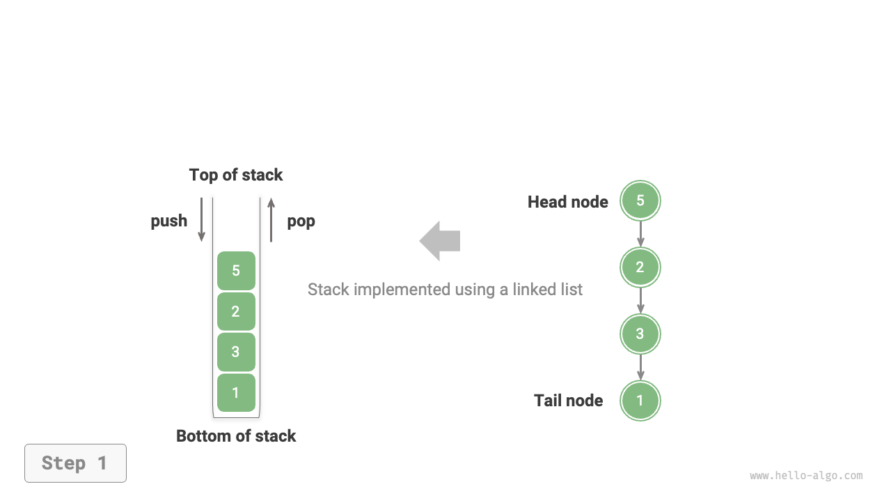
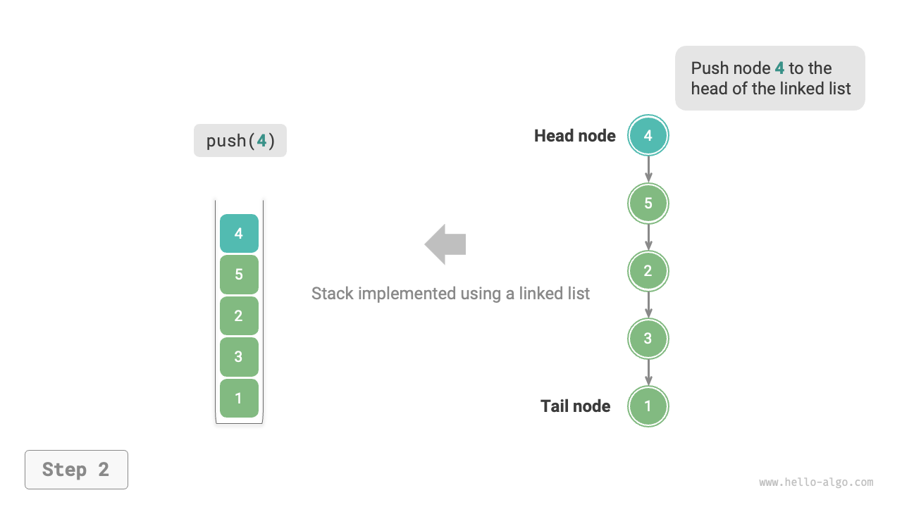
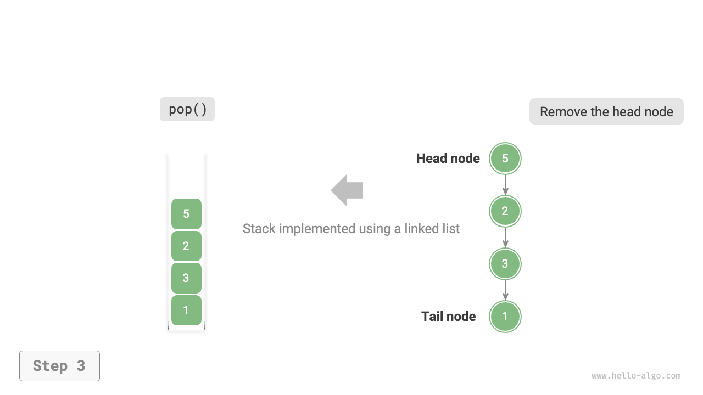
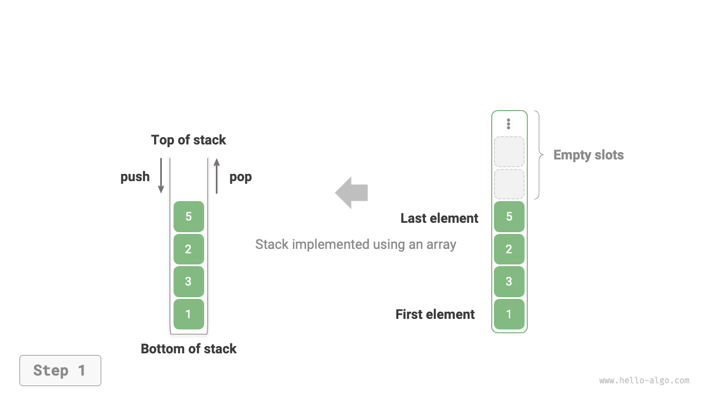
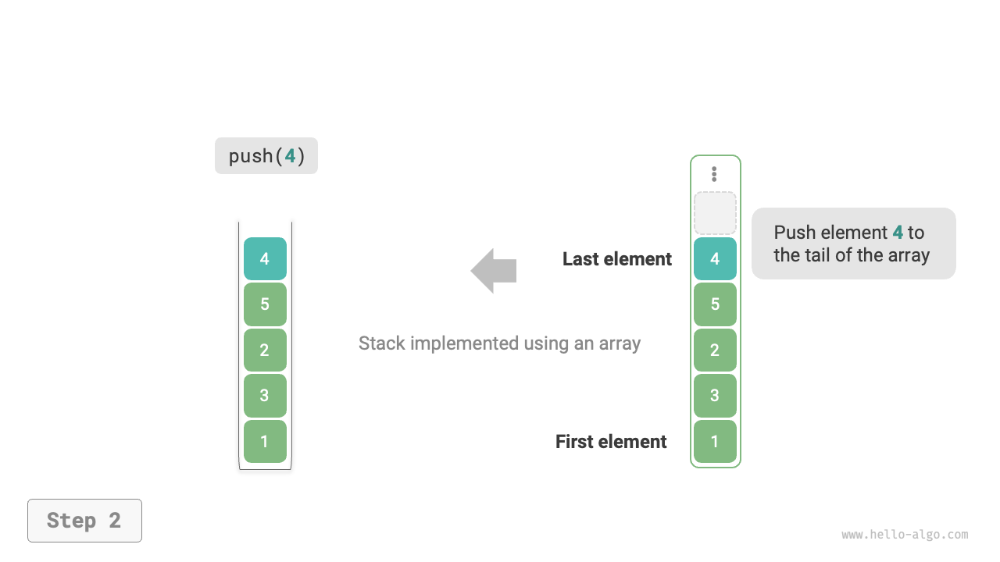
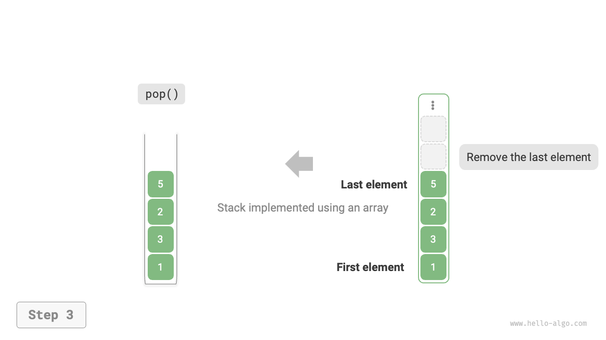

# 5.1 &nbsp; Stack

<u>Stack</u> là một cấu trúc dữ liệu tuyến tính tuân theo nguyên tắc Last-In-First-Out (LIFO) - Vào Sau Ra Trước.

Chúng ta có thể so sánh stack với một chồng đĩa trên bàn. Để lấy được chiếc đĩa dưới cùng, bạn phải lấy những chiếc đĩa ở trên ra trước. Bằng cách thay thế những chiếc đĩa bằng các loại phần tử khác nhau (ví dụ: số nguyên, ký tự, đối tượng, v.v.), chúng ta có cấu trúc dữ liệu được gọi là stack.

Như hình dưới đây, chúng ta gọi đỉnh của chồng phần tử là "đỉnh stack" và đáy là "đáy stack". Thao tác thêm phần tử vào đỉnh stack được gọi là "push" (đẩy), và thao tác loại bỏ phần tử trên cùng được gọi là "pop" (lấy ra).

{ class="animation-figure" }

<p align="center"> Figure 5-1 &nbsp; Quy tắc vào sau ra trước của Stack </p>

## 5.1.1 &nbsp; Các thao tác phổ biến trên stack

Các thao tác phổ biến trên một stack được hiển thị trong bảng dưới đây. Tên phương thức cụ thể phụ thuộc vào ngôn ngữ lập trình được sử dụng. Ở đây, chúng ta sử dụng `push()`, `pop()` và `peek()` làm ví dụ.

<p align="center"> Bảng <id> &nbsp; Hiệu quả của các thao tác stack </p>

<div class="center-table" markdown>

| Phương thức | Mô tả                                       | Độ phức tạp thời gian |
| ----------- | ------------------------------------------- | --------------------- |
| `push()`    | Đẩy một phần tử vào stack (thêm vào đỉnh)   | $O(1)$                |
| `pop()`     | Lấy phần tử trên cùng ra khỏi stack         | $O(1)$                |
| `peek()`    | Truy cập phần tử trên cùng của stack        | $O(1)$                |

</div>

Thông thường, chúng ta có thể sử dụng trực tiếp lớp stack được tích hợp sẵn trong ngôn ngữ lập trình. Tuy nhiên, một số ngôn ngữ có thể không cung cấp lớp stack cụ thể. Trong những trường hợp này, chúng ta có thể sử dụng "mảng" hoặc "danh sách liên kết" của ngôn ngữ đó làm stack và bỏ qua các thao tác không liên quan đến logic stack trong chương trình.

=== "Python"

    ```python title="stack.py"
    # Khởi tạo stack
    # Python không có lớp stack tích hợp sẵn, vì vậy có thể sử dụng list như một stack
    stack: list[int] = []

    # Đẩy các phần tử vào stack
    stack.append(1)
    stack.append(3)
    stack.append(2)
    stack.append(5)
    stack.append(4)

    # Truy cập phần tử trên cùng của stack
    peek: int = stack[-1]

    # Lấy một phần tử ra khỏi stack
    pop: int = stack.pop()

    # Lấy độ dài của stack
    size: int = len(stack)

    # Kiểm tra xem stack có rỗng hay không
    is_empty: bool = len(stack) == 0
    ```

=== "C++"

    ```cpp title="stack.cpp"
    /* Khởi tạo stack */
    stack<int> stack;

    /* Đẩy các phần tử vào stack */
    stack.push(1);
    stack.push(3);
    stack.push(2);
    stack.push(5);
    stack.push(4);

    /* Truy cập phần tử trên cùng của stack */
    int top = stack.top();

    /* Lấy một phần tử ra khỏi stack */
    stack.pop(); // Không có giá trị trả về

    /* Lấy độ dài của stack */
    int size = stack.size();

    /* Kiểm tra xem stack có rỗng hay không */
    bool empty = stack.empty();
    ```

=== "Java"

    ```java title="stack.java"
    /* Khởi tạo stack */
    Stack<Integer> stack = new Stack<>();

    /* Đẩy các phần tử vào stack */
    stack.push(1);
    stack.push(3);
    stack.push(2);
    stack.push(5);
    stack.push(4);

    /* Truy cập phần tử trên cùng của stack */
    int peek = stack.peek();

    /* Lấy một phần tử ra khỏi stack */
    int pop = stack.pop();

    /* Lấy độ dài của stack */
    int size = stack.size();

    /* Kiểm tra xem stack có rỗng hay không */
    boolean isEmpty = stack.isEmpty();
    ```

=== "C#"

    ```csharp title="stack.cs"
    /* Khởi tạo stack */
    Stack<int> stack = new();

    /* Đẩy các phần tử vào stack */
    stack.Push(1);
    stack.Push(3);
    stack.Push(2);
    stack.Push(5);
    stack.Push(4);

    /* Truy cập phần tử trên cùng của stack */
    int peek = stack.Peek();

    /* Lấy một phần tử ra khỏi stack */
    int pop = stack.Pop();

    /* Lấy độ dài của stack */
    int size = stack.Count;

    /* Kiểm tra xem stack có rỗng hay không */
    bool isEmpty = stack.Count == 0;
    ```

=== "Go"

    ```go title="stack_test.go"
    /* Khởi tạo stack */
    // Trong Go, nên sử dụng Slice như một stack
    var stack []int

    /* Đẩy các phần tử vào stack */
    stack = append(stack, 1)
    stack = append(stack, 3)
    stack = append(stack, 2)
    stack = append(stack, 5)
    stack = append(stack, 4)

    /* Truy cập phần tử trên cùng của stack */
    peek := stack[len(stack)-1]

    /* Lấy một phần tử ra khỏi stack */
    pop := stack[len(stack)-1]
    stack = stack[:len(stack)-1]

    /* Lấy độ dài của stack */
    size := len(stack)

    /* Kiểm tra xem stack có rỗng hay không */
    isEmpty := len(stack) == 0
    ```

=== "Swift"

    ```swift title="stack.swift"
    /* Khởi tạo stack */
    // Swift không có lớp stack tích hợp sẵn, vì vậy Array có thể được sử dụng như một stack
    var stack: [Int] = []

    /* Đẩy các phần tử vào stack */
    stack.append(1)
    stack.append(3)
    stack.append(2)
    stack.append(5)
    stack.append(4)

    /* Truy cập phần tử trên cùng của stack */
    let peek = stack.last!

    /* Lấy một phần tử ra khỏi stack */
    let pop = stack.removeLast()

    /* Lấy độ dài của stack */
    let size = stack.count

    /* Kiểm tra xem stack có rỗng hay không */
    let isEmpty = stack.isEmpty
    ```

=== "JS"

    ```javascript title="stack.js"
    /* Khởi tạo stack */
    // JavaScript không có lớp stack tích hợp sẵn, vì vậy Array có thể được sử dụng như một stack
    const stack = [];

    /* Đẩy các phần tử vào stack */
    stack.push(1);
    stack.push(3);
    stack.push(2);
    stack.push(5);
    stack.push(4);

    /* Truy cập phần tử trên cùng của stack */
    const peek = stack[stack.length-1];

    /* Lấy một phần tử ra khỏi stack */
    const pop = stack.pop();

    /* Lấy độ dài của stack */
    const size = stack.length;

    /* Kiểm tra xem stack có rỗng hay không */
    const is_empty = stack.length === 0;
    ```

=== "TS"

    ```typescript title="stack.ts"
    /* Khởi tạo stack */
    // TypeScript không có lớp stack tích hợp sẵn, vì vậy Array có thể được sử dụng như một stack
    const stack: number[] = [];

    /* Đẩy các phần tử vào stack */
    stack.push(1);
    stack.push(3);
    stack.push(2);
    stack.push(5);
    stack.push(4);

    /* Truy cập phần tử trên cùng của stack */
    const peek = stack[stack.length - 1];

    /* Lấy một phần tử ra khỏi stack */
    const pop = stack.pop();

    /* Lấy độ dài của stack */
    const size = stack.length;

    /* Kiểm tra xem stack có rỗng hay không */
    const is_empty = stack.length === 0;
    ```

=== "Dart"

    ```dart title="stack.dart"
    /* Khởi tạo stack */
    // Dart không có lớp stack tích hợp sẵn, vì vậy List có thể được sử dụng như một stack
    List<int> stack = [];

    /* Đẩy các phần tử vào stack */
    stack.add(1);
    stack.add(3);
    stack.add(2);
    stack.add(5);
    stack.add(4);

    /* Truy cập phần tử trên cùng của stack */
    int peek = stack.last;

    /* Lấy một phần tử ra khỏi stack */
    int pop = stack.removeLast();

    /* Lấy độ dài của stack */
    int size = stack.length;

    /* Kiểm tra xem stack có rỗng hay không */
    bool isEmpty = stack.isEmpty;
    ```

=== "Rust"

    ```rust title="stack.rs"
    /* Khởi tạo stack */
    // Sử dụng Vec như một stack
    let mut stack: Vec<i32> = Vec::new();

    /* Đẩy các phần tử vào stack */
    stack.push(1);
    stack.push(3);
    stack.push(2);
    stack.push(5);
    stack.push(4);

    /* Truy cập phần tử trên cùng của stack */
    let top = stack.last().unwrap();

    /* Lấy một phần tử ra khỏi stack */
    let pop = stack.pop().unwrap();

    /* Lấy độ dài của stack */
    let size = stack.len();

    /* Kiểm tra xem stack có rỗng hay không */
    let is_empty = stack.is_empty();
    ```

=== "C"

    ```c title="stack.c"
    // C không cung cấp stack tích hợp sẵn
    ```

=== "Kotlin"

    ```kotlin title="stack.kt"

    ```

=== "Zig"

    ```zig title="stack.zig"

    ```

??? pythontutor "Code Visualization"

    https://pythontutor.com/render.html#code=%22%22%22Driver%20Code%22%22%22%0Aif%20__name__%20%3D%3D%20%22__main__%22%3A%0A%20%20%20%20%23%20%E5%88%9D%E5%A7%8B%E5%8C%96%E6%A0%88%0A%20%20%20%20%23%20Python%20%E6%B2%A1%E6%9C%89%E5%86%85%E7%BD%AE%E7%9A%84%E6%A0%88%E7%B1%BB%EF%BC%8C%E5%8F%AF%E4%BB%A5%E6%8A%8A%20list%20%E5%BD%93%E4%BD%9C%E6%A0%88%E6%9D%A5%E4%BD%BF%E7%94%A8%0A%20%20%20%20stack%20%3D%20%5B%5D%0A%0A%20%20%20%20%23%20%E5%85%83%E7%B4%A0%E5%85%A5%E6%A0%88%0A%20%20%20%20stack.append%281%29%0A%20%20%20%20stack.append%283%29%0A%20%20%20%20stack.append%282%29%0A%20%20%20%20stack.append%285%29%0A%20%20%20%20stack.append%284%29%0A%20%20%20%20print%28%22%E6%A0%88%20stack%20%3D%22,%20stack%29%0A%0A%20%20%20%20%23%20%E8%AE%BF%E9%97%AE%E6%A0%88%E9%A1%B6%E5%85%83%E7%B4%A0%0A%20%20%20%20peek%20%3D%20stack%5B-1%5D%0A%20%20%20%20print%28%22%E6%A0%88%E9%A1%B6%E5%85%83%E7%B4%A0%20peek%20%3D%22,%20peek%29%0A%0A%20%20%20%20%23%20%E5%85%83%E7%B4%A0%E5%87%BA%E6%A0%88%0A%20%20%20%20pop%20%3D%20stack.pop%28%29%0A%20%20%20%20print%28%22%E5%87%BA%E6%A0%88%E5%85%83%E7%B4%A0%20pop%20%3D%22,%20pop%29%0A%20%20%20%20print%28%22%E5%87%BA%E6%A0%88%E5%90%8E%20stack%20%3D%22,%20stack%29%0A%0A%20%20%20%20%23%20%E8%8E%B7%E5%8F%96%E6%A0%88%E7%9A%84%E9%95%BF%E5%BA%A6%0A%20%20%20%20size%20%3D%20len%28stack%29%0A%20%20%20%20print%28%22%E6%A0%88%E7%9A%84%E9%95%BF%E5%BA%A6%20size%20%3D%22,%20size%29%0A%0A%20%20%20%20%23%20%E5%88%A4%E6%96%AD%E6%98%AF%E5%90%A6%E4%B8%BA%E7%A9%BA%0A%20%20%20%20is_empty%20%3D%20len%28stack%29%20%3D%3D%200%0A%20%20%20%20print%28%22%E6%A0%88%E6%98%AF%E5%90%A6%E4%B8%BA%E7%A9%BA%20%3D%22,%20is_empty%29&cumulative=false&curInstr=2&heapPrimitives=nevernest&mode=display&origin=opt-frontend.js&py=311&rawInputLstJSON=%5B%5D&textReferences=false

## 5.1.2 &nbsp; Triển khai Stack

Để hiểu sâu hơn về cách stack hoạt động, hãy thử tự triển khai một lớp stack.

Stack tuân theo nguyên tắc Last-In-First-Out, có nghĩa là chúng ta chỉ có thể thêm hoặc xóa các phần tử ở đỉnh stack. Tuy nhiên, cả mảng và danh sách liên kết đều cho phép thêm và xóa các phần tử ở bất kỳ vị trí nào, **do đó, stack có thể được xem như một mảng hoặc danh sách liên kết bị hạn chế**. Nói cách khác, chúng ta có thể "che chắn" một số thao tác không liên quan của mảng hoặc danh sách liên kết, điều chỉnh hành vi bên ngoài của chúng phù hợp với các đặc điểm của stack.

### 1. &nbsp; Triển khai dựa trên danh sách liên kết

Khi triển khai một stack bằng danh sách liên kết, chúng ta có thể coi nút đầu của danh sách là đỉnh của stack và nút cuối là đáy của stack.

Như hình dưới đây, đối với thao tác push, chúng ta chỉ cần chèn các phần tử vào đầu danh sách liên kết. Phương pháp chèn nút này được gọi là "chèn đầu". Đối với thao tác pop, chúng ta chỉ cần loại bỏ nút đầu khỏi danh sách.

=== "LinkedListStack"
    { class="animation-figure" }

=== "push()"
    { class="animation-figure" }

=== "pop()"
    { class="animation-figure" }

<p align="center"> Figure 5-2 &nbsp; Triển khai Stack bằng Danh sách liên kết cho các thao tác Push và Pop </p>

Dưới đây là một ví dụ về code triển khai stack dựa trên danh sách liên kết:

=== "Python"

    ```python title="linkedlist_stack.py"
    class LinkedListStack:
        """Stack class based on linked list"""

        def __init__(self):
            """Constructor"""
            self._peek: ListNode | None = None
            self._size: int = 0

        def size(self) -> int:
            """Get the length of the stack"""
            return self._size

        def is_empty(self) -> bool:
            """Determine if the stack is empty"""
            return self._size == 0

        def push(self, val: int):
            """Push"""
            node = ListNode(val)
            node.next = self._peek
            self._peek = node
            self._size += 1

        def pop(self) -> int:
            """Pop"""
            num = self.peek()
            self._peek = self._peek.next
            self._size -= 1
            return num

        def peek(self) -> int:
            """Access stack top element"""
            if self.is_empty():
                raise IndexError("Stack is empty")
            return self._peek.val

        def to_list(self) -> list[int]:
            """Convert to a list for printing"""
            arr = []
            node = self._peek
            while node:
                arr.append(node.val)
                node = node.next
            arr.reverse()
            return arr
    ```

=== "C++"

    ```cpp title="linkedlist_stack.cpp"
    /* Stack class based on linked list */
    class LinkedListStack {
      private:
        ListNode *stackTop; // Use the head node as the top of the stack
        int stkSize;        // Length of the stack

      public:
        LinkedListStack() {
            stackTop = nullptr;
            stkSize = 0;
        }

        ~LinkedListStack() {
            // Traverse the linked list, remove nodes, free memory
            freeMemoryLinkedList(stackTop);
        }

        /* Get the length of the stack */
        int size() {
            return stkSize;
        }

        /* Determine if the stack is empty */
        bool isEmpty() {
            return size() == 0;
        }

        /* Push */
        void push(int num) {
            ListNode *node = new ListNode(num);
            node->next = stackTop;
            stackTop = node;
            stkSize++;
        }

        /* Pop */
        int pop() {
            int num = top();
            ListNode *tmp = stackTop;
            stackTop = stackTop->next;
            // Free memory
            delete tmp;
            stkSize--;
            return num;
        }

        /* Access stack top element */
        int top() {
            if (isEmpty())
                throw out_of_range("Stack is empty");
            return stackTop->val;
        }

        /* Convert the List to Array and return */
        vector<int> toVector() {
            ListNode *node = stackTop;
            vector<int> res(size());
            for (int i = res.size() - 1; i >= 0; i--) {
                res[i] = node->val;
                node = node->next;
            }
            return res;
        }
    };
    ```

=== "Java"

    ```java title="linkedlist_stack.java"
    /* Stack class based on linked list */
    class LinkedListStack {
        private ListNode stackPeek; // Use the head node as the top of the stack
        private int stkSize = 0; // Length of the stack

        public LinkedListStack() {
            stackPeek = null;
        }

        /* Get the length of the stack */
        public int size() {
            return stkSize;
        }

        /* Determine if the stack is empty */
        public boolean isEmpty() {
            return size() == 0;
        }

        /* Push */
        public void push(int num) {
            ListNode node = new ListNode(num);
            node.next = stackPeek;
            stackPeek = node;
            stkSize++;
        }

        /* Pop */
        public int pop() {
            int num = peek();
            stackPeek = stackPeek.next;
            stkSize--;
            return num;
        }

        /* Access stack top element */
        public int peek() {
            if (isEmpty())
                throw new IndexOutOfBoundsException();
            return stackPeek.val;
        }

        /* Convert the List to Array and return */
        public int[] toArray() {
            ListNode node = stackPeek;
            int[] res = new int[size()];
            for (int i = res.length - 1; i >= 0; i--) {
                res[i] = node.val;
                node = node.next;
            }
            return res;
        }
    }
    ```

=== "C#"

    ```csharp title="linkedlist_stack.cs"
    [class]{LinkedListStack}-[func]{}
    ```

=== "Go"

    ```go title="linkedlist_stack.go"
    [class]{linkedListStack}-[func]{}
    ```

=== "Swift"

    ```swift title="linkedlist_stack.swift"
    [class]{LinkedListStack}-[func]{}
    ```

=== "JS"

    ```javascript title="linkedlist_stack.js"
    [class]{LinkedListStack}-[func]{}
    ```

=== "TS"

    ```typescript title="linkedlist_stack.ts"
    [class]{LinkedListStack}-[func]{}
    ```

=== "Dart"

    ```dart title="linkedlist_stack.dart"
    [class]{LinkedListStack}-[func]{}
    ```

=== "Rust"

    ```rust title="linkedlist_stack.rs"
    /* Stack được triển khai dựa trên danh sách liên kết */
    #[allow(dead_code)]
    pub struct LinkedListStack<T> {
        stack_peek: Option<Rc<RefCell<ListNode<T>>>>, // Coi nút đầu danh sách là đỉnh stack
        stk_size: usize,                              // Độ dài của stack
    }

    impl<T: Copy> LinkedListStack<T> {
        pub fn new() -> Self {
            Self {
                stack_peek: None,
                stk_size: 0,
            }
        }

        /* Lấy độ dài của stack */
        pub fn size(&self) -> usize {
            return self.stk_size;
        }

        /* Kiểm tra xem stack có rỗng không */
        pub fn is_empty(&self) -> bool {
            return self.size() == 0;
        }

        /* Đẩy phần tử vào stack (push) */
        pub fn push(&mut self, num: T) {
            let node = ListNode::new(num);
            node.borrow_mut().next = self.stack_peek.take();
            self.stack_peek = Some(node);
            self.stk_size += 1;
        }

        /* Lấy phần tử ra khỏi stack (pop) */
        pub fn pop(&mut self) -> Option<T> {
            self.stack_peek.take().map(|old_head| {
                self.stack_peek = old_head.borrow_mut().next.take();
                self.stk_size -= 1;

                old_head.borrow().val
            })
        }

        /* Truy cập phần tử ở đỉnh stack */
        pub fn peek(&self) -> Option<&Rc<RefCell<ListNode<T>>>> {
            self.stack_peek.as_ref()
        }

        /* Chuyển đổi danh sách liên kết thành mảng và trả về */
        pub fn to_array(&self) -> Vec<T> {
            fn _to_array<T: Sized + Copy>(head: Option<&Rc<RefCell<ListNode<T>>>>) -> Vec<T> {
                if let Some(node) = head {
                    let mut nums = _to_array(node.borrow().next.as_ref());
                    nums.push(node.borrow().val);
                    return nums;
                }
                return Vec::new();
            }

            _to_array(self.peek())
        }
    }
    ```

=== "C"

    ```c title="linkedlist_stack.c"
    [class]{LinkedListStack}-[func]{}
    ```

=== "Kotlin"

    ```kotlin title="linkedlist_stack.kt"
    [class]{LinkedListStack}-[func]{}
    ```

=== "Ruby"

    ```ruby title="linkedlist_stack.rb"
    [class]{LinkedListStack}-[func]{}
    ```

=== "Zig"

    ```zig title="linkedlist_stack.zig"
    [class]{LinkedListStack}-[func]{}
    ```

### 2. &nbsp; Triển khai dựa trên mảng

Khi triển khai một stack bằng mảng, chúng ta có thể coi cuối mảng là đỉnh của stack. Như hình dưới đây, các thao tác push và pop tương ứng với việc thêm và xóa các phần tử ở cuối mảng, với độ phức tạp thời gian là $O(1)$.

=== "ArrayStack"
    { class="animation-figure" }

=== "push()"
    { class="animation-figure" }

=== "pop()"
    { class="animation-figure" }

<p align="center"> Figure 5-3 &nbsp; Triển khai Stack bằng Mảng cho các thao tác Push và Pop</p>

Vì các phần tử được đẩy vào stack có thể liên tục tăng lên, chúng ta có thể sử dụng một mảng động, do đó tránh được việc tự xử lý việc mở rộng mảng. Dưới đây là một ví dụ về code:

=== "Python"

    ```python title="array_stack.py"
    class ArrayStack:
        """Stack class based on array"""

        def __init__(self):
            """Constructor"""
            self._stack: list[int] = []

        def size(self) -> int:
            """Get the length of the stack"""
            return len(self._stack)

        def is_empty(self) -> bool:
            """Determine if the stack is empty"""
            return self.size() == 0

        def push(self, item: int):
            """Push"""
            self._stack.append(item)

        def pop(self) -> int:
            """Pop"""
            if self.is_empty():
                raise IndexError("Stack is empty")
            return self._stack.pop()

        def peek(self) -> int:
            """Access stack top element"""
            if self.is_empty():
                raise IndexError("Stack is empty")
            return self._stack[-1]

        def to_list(self) -> list[int]:
            """Return array for printing"""
            return self._stack
    ```

=== "C++"

    ```cpp title="array_stack.cpp"
    /* Stack class based on array */
    class ArrayStack {
      private:
        vector<int> stack;

      public:
        /* Get the length of the stack */
        int size() {
            return stack.size();
        }

        /* Determine if the stack is empty */
        bool isEmpty() {
            return stack.size() == 0;
        }

        /* Push */
        void push(int num) {
            stack.push_back(num);
        }

        /* Pop */
        int pop() {
            int num = top();
            stack.pop_back();
            return num;
        }

        /* Access stack top element */
        int top() {
            if (isEmpty())
                throw out_of_range("Stack is empty");
            return stack.back();
        }

        /* Return Vector */
        vector<int> toVector() {
            return stack;
        }
    };
    ```

=== "Java"

    ```java title="array_stack.java"
    /* Stack class based on array */
    class ArrayStack {
        private ArrayList<Integer> stack;

        public ArrayStack() {
            // Initialize the list (dynamic array)
            stack = new ArrayList<>();
        }

        /* Get the length of the stack */
        public int size() {
            return stack.size();
        }

        /* Determine if the stack is empty */
        public boolean isEmpty() {
            return size() == 0;
        }

        /* Push */
        public void push(int num) {
            stack.add(num);
        }

        /* Pop */
        public int pop() {
            if (isEmpty())
                throw new IndexOutOfBoundsException();
            return stack.remove(size() - 1);
        }

        /* Access stack top element */
        public int peek() {
            if (isEmpty())
                throw new IndexOutOfBoundsException();
            return stack.get(size() - 1);
        }

        /* Convert the List to Array and return */
        public Object[] toArray() {
            return stack.toArray();
        }
    }
    ```

=== "C#"

    ```csharp title="array_stack.cs"
    [class]{ArrayStack}-[func]{}
    ```

=== "Go"

    ```go title="array_stack.go"
    [class]{arrayStack}-[func]{}
    ```

=== "Swift"

    ```swift title="array_stack.swift"
    [class]{ArrayStack}-[func]{}
    ```

=== "JS"

    ```javascript title="array_stack.js"
    [class]{ArrayStack}-[func]{}
    ```

=== "TS"

    ```typescript title="array_stack.ts"
    [class]{ArrayStack}-[func]{}
    ```

=== "Dart"

    ```dart title="array_stack.dart"
    [class]{ArrayStack}-[func]{}
    ```

=== "Rust"

    ```rust title="array_stack.rs"
    /* Stack được triển khai dựa trên mảng */
    struct ArrayStack<T> {
        stack: Vec<T>,
    }

    impl<T> ArrayStack<T> {
        /* Khởi tạo stack */
        fn new() -> ArrayStack<T> {
            ArrayStack::<T> {
                stack: Vec::<T>::new(),
            }
        }

        /* Lấy độ dài của stack */
        fn size(&self) -> usize {
            self.stack.len()
        }

        /* Kiểm tra xem stack có rỗng không */
        fn is_empty(&self) -> bool {
            self.size() == 0
        }

        /* Đẩy phần tử vào stack (push) */
        fn push(&mut self, num: T) {
            self.stack.push(num);
        }

        /* Lấy phần tử ra khỏi stack (pop) */
        fn pop(&mut self) -> Option<T> {
            self.stack.pop()
        }

        /* Truy cập phần tử ở đỉnh stack */
        fn peek(&self) -> Option<&T> {
            if self.is_empty() {
                panic!("Stack rỗng")
            };
            self.stack.last()
        }

        /* Trả về một tham chiếu đến Vec */
        fn to_array(&self) -> &Vec<T> {
            &self.stack
        }
    }
    ```

=== "C"

    ```c title="array_stack.c"
    [class]{ArrayStack}-[func]{}
    ```

=== "Kotlin"

    ```kotlin title="array_stack.kt"
    [class]{ArrayStack}-[func]{}
    ```

=== "Ruby"

    ```ruby title="array_stack.rb"
    [class]{ArrayStack}-[func]{}
    ```

=== "Zig"

    ```zig title="array_stack.zig"
    [class]{ArrayStack}-[func]{}
    ```

## 5.1.3 &nbsp; So sánh hai cách triển khai

**Các thao tác được hỗ trợ**

Cả hai cách triển khai đều hỗ trợ tất cả các thao tác được định nghĩa trong một stack. Việc triển khai dựa trên mảng còn hỗ trợ thêm truy cập ngẫu nhiên, nhưng điều này nằm ngoài phạm vi định nghĩa của một stack và thường không được sử dụng.

**Hiệu quả thời gian**

Trong cách triển khai dựa trên mảng, cả hai thao tác push và pop đều xảy ra trong bộ nhớ liền kề được phân bổ trước, có tính cục bộ bộ nhớ cache tốt và do đó hiệu quả cao hơn. Tuy nhiên, nếu thao tác push vượt quá dung lượng mảng, nó sẽ kích hoạt cơ chế thay đổi kích thước, làm cho độ phức tạp thời gian của thao tác push đó là $O(n)$.

Trong cách triển khai danh sách liên kết, việc mở rộng danh sách rất linh hoạt và không có vấn đề giảm hiệu quả như trong việc mở rộng mảng. Tuy nhiên, thao tác push yêu cầu khởi tạo một đối tượng nút và sửa đổi các con trỏ, vì vậy hiệu quả của nó tương đối thấp hơn. Nếu các phần tử được đẩy đã là các đối tượng nút, thì có thể bỏ qua bước khởi tạo, giúp cải thiện hiệu quả.

Do đó, khi các phần tử cho các thao tác push và pop là các kiểu dữ liệu cơ bản như `int` hoặc `double`, chúng ta có thể đưa ra các kết luận sau:

- Hiệu quả của việc triển khai stack dựa trên mảng giảm trong quá trình mở rộng, nhưng vì việc mở rộng là một thao tác tần số thấp, nên hiệu quả trung bình của nó cao hơn.
- Việc triển khai stack dựa trên danh sách liên kết cung cấp hiệu suất hiệu quả ổn định hơn.

**Hiệu quả không gian**

Khi khởi tạo một danh sách, hệ thống sẽ phân bổ một "dung lượng ban đầu", có thể vượt quá nhu cầu thực tế; hơn nữa, cơ chế mở rộng thường tăng dung lượng theo một hệ số cụ thể (chẳng hạn như tăng gấp đôi), điều này cũng có thể vượt quá nhu cầu thực tế. Do đó, **stack dựa trên mảng có thể lãng phí một số không gian**.

Tuy nhiên, vì các nút danh sách liên kết yêu cầu thêm không gian để lưu trữ các con trỏ, **không gian chiếm dụng bởi các nút danh sách liên kết tương đối lớn hơn**.

Tóm lại, chúng ta không thể đơn giản xác định cách triển khai nào tiết kiệm bộ nhớ hơn. Nó đòi hỏi phân tích dựa trên các tình huống cụ thể.

## 5.1.4 &nbsp; Các ứng dụng điển hình của stack

- **Quay lại và chuyển tiếp trong trình duyệt, hoàn tác và làm lại trong phần mềm**. Mỗi khi chúng ta mở một trang web mới, trình duyệt sẽ đẩy trang trước đó vào stack, cho phép chúng ta quay lại trang trước đó thông qua thao tác quay lại, về cơ bản là một thao tác pop. Để hỗ trợ cả quay lại và chuyển tiếp, cần có hai stack để phối hợp với nhau.
- **Quản lý bộ nhớ trong chương trình**. Mỗi khi một hàm được gọi, hệ thống sẽ thêm một khung stack ở trên cùng của stack để ghi lại thông tin ngữ cảnh của hàm. Trong các hàm đệ quy, giai đoạn đệ quy xuống tiếp tục đẩy vào stack, trong khi giai đoạn theo dõi ngược lên tiếp tục lấy ra khỏi stack.
