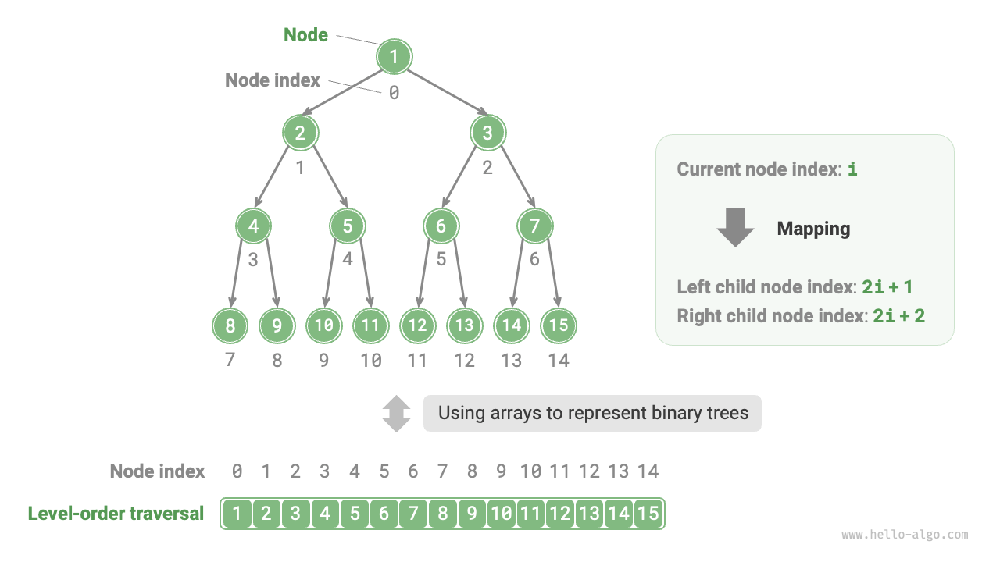
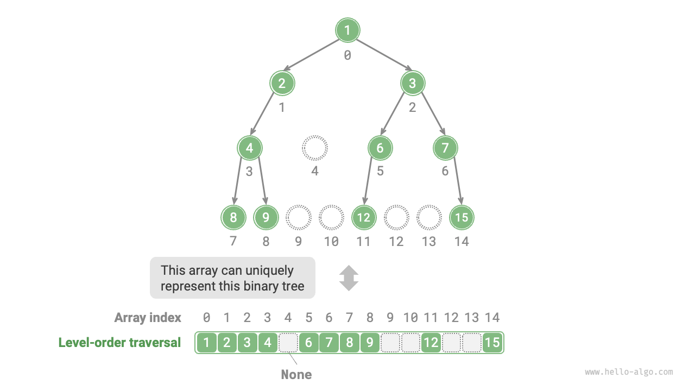
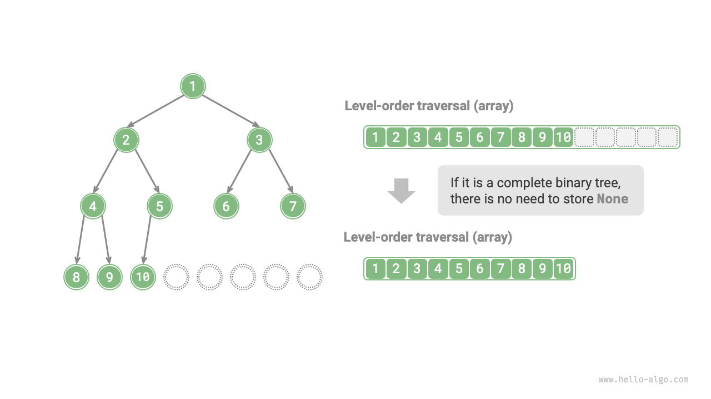

# 7.3 &nbsp; Biểu diễn cây nhị phân bằng mảng

Trong biểu diễn bằng danh sách liên kết, đơn vị lưu trữ của một cây nhị phân là một nút `TreeNode`, các nút được nối với nhau bằng các con trỏ. Các thao tác cơ bản của cây nhị phân dưới biểu diễn danh sách liên kết đã được giới thiệu trong phần trước.

Vậy, chúng ta có thể dùng mảng để biểu diễn một cây nhị phân không? Câu trả lời là có.

## 7.3.1 &nbsp; Biểu diễn cây nhị phân hoàn chỉnh

Hãy phân tích một trường hợp đơn giản trước. Với một cây nhị phân hoàn chỉnh, ta lưu tất cả các nút vào một mảng theo thứ tự duyệt theo mức (level-order), mỗi nút tương ứng với một chỉ số mảng duy nhất.

Dựa vào đặc điểm của duyệt theo mức, ta có thể suy ra một "công thức ánh xạ" giữa chỉ số của nút cha và các con của nó: **Nếu chỉ số của một nút là $i$, thì chỉ số của con trái là $2i + 1$ và con phải là $2i + 2$**. Hình dưới đây cho thấy mối quan hệ ánh xạ giữa chỉ số của các nút.

{ class="animation-figure" }

<p align="center"> Figure 7-12 &nbsp; Biểu diễn bằng mảng của một cây nhị phân hoàn chỉnh </p>

**Công thức ánh xạ có vai trò tương tự như các tham chiếu nút (con trỏ) trong danh sách liên kết**. Khi biết một nút trong mảng, ta có thể truy cập con trái (con phải) của nó bằng công thức ánh xạ này.

## 7.3.2 &nbsp; Biểu diễn bất kỳ cây nhị phân nào

Cây nhị phân hoàn chỉnh là một trường hợp đặc biệt; thường có nhiều giá trị `None` xuất hiện ở các mức giữa của một cây nhị phân. Vì chuỗi duyệt theo mức không bao gồm các giá trị `None` này, ta không thể chỉ dựa vào chuỗi đó để suy ra số lượng và vị trí của các giá trị `None`. **Điều này có nghĩa là nhiều cấu trúc cây khác nhau có thể tương ứng với cùng một chuỗi duyệt theo mức**.

Như hình dưới đây cho thấy, với một cây nhị phân không hoàn chỉnh, phương pháp biểu diễn bằng mảng nêu trên sẽ bị sai.

{ class="animation-figure" }

<p align="center"> Figure 7-13 &nbsp; Một chuỗi duyệt theo cấp có thể biểu diễn nhiều cây nhị phân khác nhau. </p>

Để giải quyết vấn đề này, **chúng ta có thể ghi rõ tất cả các giá trị `None` trong chuỗi duyệt theo mức**. Như hình dưới đây, sau khi làm vậy, chuỗi duyệt theo mức có thể biểu diễn duy nhất một cây nhị phân. Ví dụ mã như sau:

=== "Python"

    ```python title=""
    # Biểu diễn cây nhị phân bằng mảng
    # Sử dụng None để biểu thị các ô trống
    tree = [1, 2, 3, 4, None, 6, 7, 8, 9, None, None, 12, None, None, 15]
    ```

=== "C++"

    ```cpp title=""
    /* Biểu diễn cây nhị phân bằng mảng */
    // Sử dụng giá trị nguyên lớn nhất INT_MAX để đánh dấu ô trống
    vector<int> tree = {1, 2, 3, 4, INT_MAX, 6, 7, 8, 9, INT_MAX, INT_MAX, 12, INT_MAX, INT_MAX, 15};
    ```

=== "Java"

    ```java title=""
    /* Biểu diễn cây nhị phân bằng mảng */
    // Sử dụng lớp wrapper Integer cho phép dùng null để đánh dấu ô trống
    Integer[] tree = { 1, 2, 3, 4, null, 6, 7, 8, 9, null, null, 12, null, null, 15 };
    ```

=== "C#"

    ```csharp title=""
    /* Biểu diễn cây nhị phân bằng mảng */
    // Sử dụng int? (nullable int) cho phép dùng null để đánh dấu ô trống
    int?[] tree = [1, 2, 3, 4, null, 6, 7, 8, 9, null, null, 12, null, null, 15];
    ```

=== "Go"

    ```go title=""
    /* Biểu diễn cây nhị phân bằng mảng */
    // Sử dụng slice kiểu any, cho phép nil để đánh dấu ô trống
    tree := []any{1, 2, 3, 4, nil, 6, 7, 8, 9, nil, nil, 12, nil, nil, 15}
    ```

=== "Swift"

    ```swift title=""
    /* Biểu diễn cây nhị phân bằng mảng */
    // Sử dụng Int? (optional Int) cho phép dùng nil để đánh dấu ô trống
    let tree: [Int?] = [1, 2, 3, 4, nil, 6, 7, 8, 9, nil, nil, 12, nil, nil, 15]
    ```

=== "JS"

    ```javascript title=""
    /* Biểu diễn cây nhị phân bằng mảng */
    // Sử dụng null để biểu thị các ô trống
    let tree = [1, 2, 3, 4, null, 6, 7, 8, 9, null, null, 12, null, null, 15];
    ```

=== "TS"

    ```typescript title=""
    /* Biểu diễn cây nhị phân bằng mảng */
    // Sử dụng null để biểu thị các ô trống
    let tree: (number | null)[] = [1, 2, 3, 4, null, 6, 7, 8, 9, null, null, 12, null, null, 15];
    ```

=== "Dart"

    ```dart title=""
    /* Biểu diễn cây nhị phân bằng mảng */
    // Sử dụng int? (nullable int) cho phép dùng null để đánh dấu ô trống
    List<int?> tree = [1, 2, 3, 4, null, 6, 7, 8, 9, null, null, 12, null, null, 15];
    ```

=== "Rust"

    ```rust title=""
    /* Biểu diễn cây nhị phân bằng mảng */
    // Sử dụng None để đánh dấu các ô trống
    let tree = [Some(1), Some(2), Some(3), Some(4), None, Some(6), Some(7), Some(8), Some(9), None, None, Some(12), None, None, Some(15)];
    ```

=== "C"

    ```c title=""
    /* Biểu diễn cây nhị phân bằng mảng */
    // Sử dụng giá trị int lớn nhất để đánh dấu ô trống, do đó giá trị nút không được bằng INT_MAX
    int tree[] = {1, 2, 3, 4, INT_MAX, 6, 7, 8, 9, INT_MAX, INT_MAX, 12, INT_MAX, INT_MAX, 15};
    ```

=== "Kotlin"

    ```kotlin title=""
    /* Biểu diễn cây nhị phân bằng mảng */
    // Sử dụng null để biểu thị các ô trống
    val tree = mutableListOf( 1, 2, 3, 4, null, 6, 7, 8, 9, null, null, 12, null, null, 15 )
    ```

=== "Ruby"

    ```ruby title=""

    ```

=== "Zig"

    ```zig title=""

    ```

{ class="animation-figure" }

Cần lưu ý rằng **cây nhị phân hoàn chỉnh rất phù hợp để biểu diễn bằng mảng**. Nhớ lại định nghĩa của cây nhị phân hoàn chỉnh, `None` chỉ xuất hiện ở mức cuối cùng và về phía bên phải, **nghĩa là tất cả các giá trị `None` chắc chắn xuất hiện ở cuối chuỗi duyệt theo mức**.

Điều này có nghĩa là khi dùng mảng để biểu diễn một cây nhị phân hoàn chỉnh, có thể bỏ qua lưu trữ tất cả các giá trị `None`, điều này rất tiện lợi. Hình dưới đây đưa ra một ví dụ.

{ class="animation-figure" }

<p align="center"> Figure 7-14 &nbsp; Biểu diễn bằng mảng của một cây nhị phân hoàn chỉnh </p>

Đoạn mã sau hiện thực một cây nhị phân dựa trên biểu diễn mảng, bao gồm các thao tác sau:

- Với một nút cho trước, lấy được giá trị của nó, con trái (con phải) và nút cha của nó.
- Lấy được các chuỗi duyệt tiền tự, trung tự, hậu tự và duyệt theo mức.

```src
[file]{array_binary_tree}-[class]{array_binary_tree}-[func]{}
```

## 7.3.3 &nbsp; Ưu điểm và hạn chế

Biểu diễn cây bằng mảng có các ưu điểm sau:

- Mảng được lưu trong vùng nhớ liên tiếp, thân thiện với cache và cho phép truy cập, duyệt nhanh hơn.
- Không cần lưu các con trỏ, do đó tiết kiệm không gian.
- Cho phép truy cập ngẫu nhiên tới các nút.

Tuy nhiên, biểu diễn bằng mảng cũng có một số hạn chế:

- Lưu trữ bằng mảng yêu cầu vùng nhớ liên tiếp, nên không phù hợp để lưu các cây có lượng dữ liệu lớn.
- Thêm hoặc xóa nút cần các thao tác chèn và xóa trong mảng, kém hiệu quả hơn.
- Khi có nhiều giá trị `None` trong cây nhị phân, tỷ lệ dữ liệu nút trong mảng thấp, dẫn đến hiệu suất sử dụng không gian kém.
