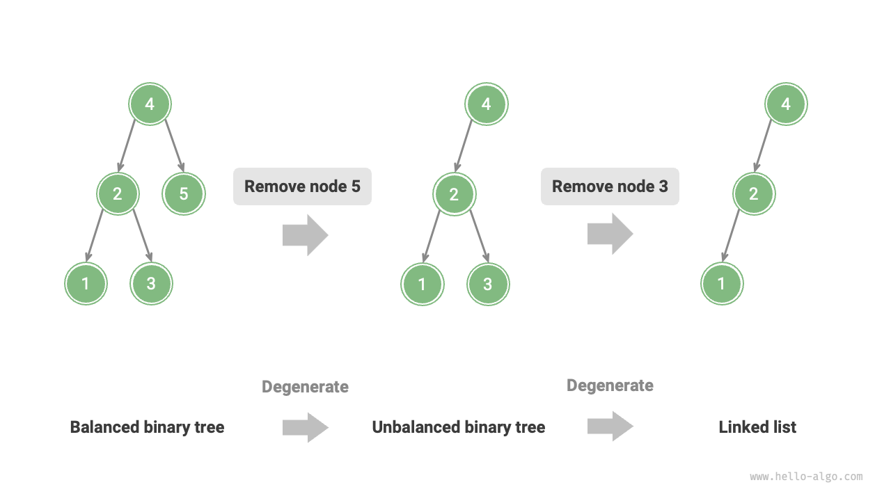
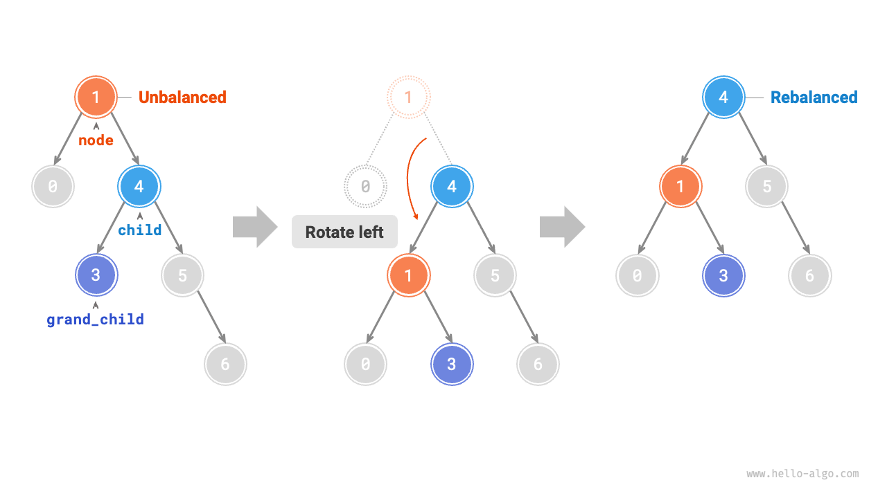

# 7.5 &nbsp; Cây AVL *

Trong phần "Cây tìm kiếm nhị phân", chúng ta đã đề cập rằng sau nhiều lần chèn và xóa, một cây tìm kiếm nhị phân có thể thoái hóa thành một danh sách liên kết. Trong những trường hợp như vậy, độ phức tạp thời gian của tất cả các thao tác giảm từ $O(\log n)$ xuống $O(n)$.

Như thể hiện trong hình dưới đây, sau hai lần xóa nút, cây tìm kiếm nhị phân này sẽ thoái hóa thành một danh sách liên kết.

{ class="animation-figure" }

<p align="center"> Figure 7-24 &nbsp; Degradation of an AVL tree after removing nodes </p>

Ví dụ, trong cây nhị phân hoàn chỉnh được minh họa trong hình dưới đây, sau khi chèn hai nút, cây sẽ nghiêng mạnh về bên trái, và độ phức tạp thời gian của các phép tìm kiếm cũng sẽ bị thoái hóa.

{ class="animation-figure" }

<p align="center"> Figure 7-25 &nbsp; Degradation of an AVL tree after inserting nodes </p>

Vào năm 1962, G. M. Adelson-Velsky và E. M. Landis đã đề xuất <u>Cây AVL</u> trong bài báo "An algorithm for the organization of information". Bài báo mô tả một loạt các phép toán để đảm bảo rằng sau khi liên tục thêm và xóa nút, cây AVL sẽ không bị thoái hóa, do vậy duy trì độ phức tạp thời gian của các thao tác ở mức $O(\log n)$. Nói cách khác, trong các tình huống cần thực hiện thường xuyên các thao tác thêm, xóa, tìm kiếm và sửa đổi, cây AVL luôn giữ được hiệu năng thao tác dữ liệu hiệu quả, điều này có giá trị ứng dụng lớn.

## 7.5.1 &nbsp; Thuật ngữ thường gặp trong cây AVL

Cây AVL vừa là một cây tìm kiếm nhị phân vừa là một cây nhị phân cân bằng, thỏa mãn tất cả các tính chất của hai loại cây này, do đó nó là một <u>cây tìm kiếm nhị phân cân bằng</u>.

### 1. &nbsp; Chiều cao của nút

Vì các phép toán liên quan đến cây AVL cần lấy chiều cao của nút, chúng ta cần thêm biến `height` vào lớp nút:

=== "Python"

    ```python title=""
    class TreeNode:
        """Nút cây AVL"""
        def __init__(self, val: int):
            self.val: int = val                 # Giá trị nút
            self.height: int = 0                # Chiều cao nút
            self.left: TreeNode | None = None   # Tham chiếu con trái
            self.right: TreeNode | None = None  # Tham chiếu con phải
    ```

=== "C++"

    ```cpp title=""
    /* Nút cây AVL */
    struct TreeNode {
        int val{};          // Giá trị nút
        int height = 0;     // Chiều cao nút
        TreeNode *left{};   // Con trái
        TreeNode *right{};  // Con phải
        TreeNode() = default;
        explicit TreeNode(int x) : val(x){}
    };
    ```

=== "Java"

    ```java title=""
    /* Nút cây AVL */
    class TreeNode {
        public int val;        // Giá trị nút
        public int height;     // Chiều cao nút
        public TreeNode left;  // Con trái
        public TreeNode right; // Con phải
        public TreeNode(int x) { val = x; }
    }
    ```

=== "C#"

    ```csharp title=""
    /* Nút cây AVL */
    class TreeNode(int? x) {
        public int? val = x;    // Giá trị nút
        public int height;      // Chiều cao nút
        public TreeNode? left;  // Tham chiếu con trái
        public TreeNode? right; // Tham chiếu con phải
    }
    ```

=== "Go"

    ```go title=""
    /* Nút cây AVL */
    type TreeNode struct {
        Val    int       // Giá trị nút
        Height int       // Chiều cao nút
        Left   *TreeNode // Tham chiếu con trái
        Right  *TreeNode // Tham chiếu con phải
    }
    ```

=== "Swift"

    ```swift title=""
    /* Nút cây AVL */
    class TreeNode {
        var val: Int // Giá trị nút
        var height: Int // Chiều cao nút
        var left: TreeNode? // Con trái
        var right: TreeNode? // Con phải

        init(x: Int) {
            val = x
            height = 0
        }
    }
    ```

=== "JS"

    ```javascript title=""
    /* Nút cây AVL */
    class TreeNode {
        val; // Giá trị nút
        height; // Chiều cao nút
        left; // Con trái
        right; // Con phải
        constructor(val, left, right, height) {
            this.val = val === undefined ? 0 : val;
            this.height = height === undefined ? 0 : height;
            this.left = left === undefined ? null : left;
            this.right = right === undefined ? null : right;
        }
    }
    ```

=== "TS"

    ```typescript title=""
    /* Nút cây AVL */
    class TreeNode {
        val: number;            // Giá trị nút
        height: number;         // Chiều cao nút
        left: TreeNode | null;  // Con trái
        right: TreeNode | null; // Con phải
        constructor(val?: number, height?: number, left?: TreeNode | null, right?: TreeNode | null) {
            this.val = val === undefined ? 0 : val;
            this.height = height === undefined ? 0 : height; 
            this.left = left === undefined ? null : left; 
            this.right = right === undefined ? null : right; 
        }
    }
    ```

=== "Dart"

    ```dart title=""
    /* Nút cây AVL */
    class TreeNode {
      int val;         // Giá trị nút
      int height;      // Chiều cao nút
      TreeNode? left;  // Con trái
      TreeNode? right; // Con phải
      TreeNode(this.val, [this.height = 0, this.left, this.right]);
    }
    ```

=== "Rust"

    ```rust title=""
    use std::rc::Rc;
    use std::cell::RefCell;

    /* Nút cây AVL */
    struct TreeNode {
        val: i32,                               // Giá trị nút
        height: i32,                            // Chiều cao nút
        left: Option<Rc<RefCell<TreeNode>>>,    // Con trái
        right: Option<Rc<RefCell<TreeNode>>>,   // Con phải
    }

    impl TreeNode {
        /* Hàm khởi tạo */
        fn new(val: i32) -> Rc<RefCell<Self>> {
            Rc::new(RefCell::new(Self {
                val,
                height: 0,
                left: None,
                right: None
            }))
        }
    }
    ```

=== "C"

    ```c title=""
    /* Nút cây AVL */
    TreeNode struct TreeNode {
        int val;
        int height;
        struct TreeNode *left;
        struct TreeNode *right;
    } TreeNode;

    /* Hàm khởi tạo */
    TreeNode *newTreeNode(int val) {
        TreeNode *node;

        node = (TreeNode *)malloc(sizeof(TreeNode));
        node->val = val;
        node->height = 0;
        node->left = NULL;
        node->right = NULL;
        return node;
    }
    ```

=== "Kotlin"

    ```kotlin title=""
    /* Nút cây AVL */
    class TreeNode(val _val: Int) {  // Giá trị nút
        val height: Int = 0          // Chiều cao nút
        val left: TreeNode? = null   // Con trái
        val right: TreeNode? = null  // Con phải
    }
    ```

=== "Ruby"

    ```ruby title=""

    ```

=== "Zig"

    ```zig title=""

    ```

"Chiều cao nút" đề cập đến khoảng cách từ nút đó đến lá xa nhất, tức là số "cạnh" đi qua. Cần lưu ý rằng chiều cao của một nút lá là $0$, và chiều cao của một nút null là $-1$. Chúng ta sẽ tạo hai hàm tiện ích để lấy và cập nhật chiều cao của một nút:

=== "Python"

    ```python title="avl_tree.py"
    def height(self, node: TreeNode | None) -> int:
        """Get node height"""
        # Empty node height is -1, leaf node height is 0
        if node is not None:
            return node.height
        return -1

    def update_height(self, node: TreeNode | None):
        """Update node height"""
        # Node height equals the height of the tallest subtree + 1
        node.height = max([self.height(node.left), self.height(node.right)]) + 1
    ```

=== "C++"

    ```cpp title="avl_tree.cpp"
    /* Get node height */
    int height(TreeNode *node) {
        // Empty node height is -1, leaf node height is 0
        return node == nullptr ? -1 : node->height;
    }

    /* Update node height */
    void updateHeight(TreeNode *node) {
        // Node height equals the height of the tallest subtree + 1
        node->height = max(height(node->left), height(node->right)) + 1;
    }
    ```

=== "Java"

    ```java title="avl_tree.java"
    /* Get node height */
    int height(TreeNode node) {
        // Empty node height is -1, leaf node height is 0
        return node == null ? -1 : node.height;
    }

    /* Update node height */
    void updateHeight(TreeNode node) {
        // Node height equals the height of the tallest subtree + 1
        node.height = Math.max(height(node.left), height(node.right)) + 1;
    }
    ```

=== "C#"

    ```csharp title="avl_tree.cs"
    [class]{AVLTree}-[func]{Height}

    [class]{AVLTree}-[func]{UpdateHeight}
    ```

=== "Go"

    ```go title="avl_tree.go"
    [class]{aVLTree}-[func]{height}

    [class]{aVLTree}-[func]{updateHeight}
    ```

=== "Swift"

    ```swift title="avl_tree.swift"
    [class]{AVLTree}-[func]{height}

    [class]{AVLTree}-[func]{updateHeight}
    ```

=== "JS"

    ```javascript title="avl_tree.js"
    [class]{AVLTree}-[func]{height}

    [class]{AVLTree}-[func]{updateHeight}
    ```

=== "TS"

    ```typescript title="avl_tree.ts"
    [class]{AVLTree}-[func]{height}

    [class]{AVLTree}-[func]{updateHeight}
    ```

=== "Dart"

    ```dart title="avl_tree.dart"
    [class]{AVLTree}-[func]{height}

    [class]{AVLTree}-[func]{updateHeight}
    ```

=== "Rust"

    ```rust title="avl_tree.rs"
    [class]{AVLTree}-[func]{height}

    [class]{AVLTree}-[func]{update_height}
    ```

=== "C"

    ```c title="avl_tree.c"
    [class]{}-[func]{height}

    [class]{}-[func]{updateHeight}
    ```

=== "Kotlin"

    ```kotlin title="avl_tree.kt"
    [class]{AVLTree}-[func]{height}

    [class]{AVLTree}-[func]{updateHeight}
    ```

=== "Ruby"

    ```ruby title="avl_tree.rb"
    [class]{AVLTree}-[func]{height}

    [class]{AVLTree}-[func]{update_height}
    ```

=== "Zig"

    ```zig title="avl_tree.zig"
    [class]{AVLTree}-[func]{height}

    [class]{AVLTree}-[func]{updateHeight}
    ```

### 2. &nbsp; Hệ số cân bằng nút

<u>Hệ số cân bằng</u> của một nút được định nghĩa là chiều cao của cây con trái trừ đi chiều cao của cây con phải, với hệ số cân bằng của nút null được định nghĩa là $0$. Chúng ta cũng sẽ đóng gói chức năng lấy hệ số cân bằng của nút vào một hàm để dễ dùng sau này:

=== "Python"

    ```python title="avl_tree.py"
    def balance_factor(self, node: TreeNode | None) -> int:
        """Get balance factor"""
        # Empty node balance factor is 0
        if node is None:
            return 0
        # Node balance factor = left subtree height - right subtree height
        return self.height(node.left) - self.height(node.right)
    ```

=== "C++"

    ```cpp title="avl_tree.cpp"
    /* Get balance factor */
    int balanceFactor(TreeNode *node) {
        // Empty node balance factor is 0
        if (node == nullptr)
            return 0;
        // Node balance factor = left subtree height - right subtree height
        return height(node->left) - height(node->right);
    }
    ```

=== "Java"

    ```java title="avl_tree.java"
    /* Get balance factor */
    int balanceFactor(TreeNode node) {
        // Empty node balance factor is 0
        if (node == null)
            return 0;
        // Node balance factor = left subtree height - right subtree height
        return height(node.left) - height(node.right);
    }
    ```

=== "C#"

    ```csharp title="avl_tree.cs"
    [class]{AVLTree}-[func]{BalanceFactor}
    ```

=== "Go"

    ```go title="avl_tree.go"
    [class]{aVLTree}-[func]{balanceFactor}
    ```

=== "Swift"

    ```swift title="avl_tree.swift"
    [class]{AVLTree}-[func]{balanceFactor}
    ```

=== "JS"

    ```javascript title="avl_tree.js"
    [class]{AVLTree}-[func]{balanceFactor}
    ```

=== "TS"

    ```typescript title="avl_tree.ts"
    [class]{AVLTree}-[func]{balanceFactor}
    ```

=== "Dart"

    ```dart title="avl_tree.dart"
    [class]{AVLTree}-[func]{balanceFactor}
    ```

=== "Rust"

    ```rust title="avl_tree.rs"
    [class]{AVLTree}-[func]{balance_factor}
    ```

=== "C"

    ```c title="avl_tree.c"
    [class]{}-[func]{balanceFactor}
    ```

=== "Kotlin"

    ```kotlin title="avl_tree.kt"
    [class]{AVLTree}-[func]{balanceFactor}
    ```

=== "Ruby"

    ```ruby title="avl_tree.rb"
    [class]{AVLTree}-[func]{balance_factor}
    ```

=== "Zig"

    ```zig title="avl_tree.zig"
    [class]{AVLTree}-[func]{balanceFactor}
    ```

!!! tip

    Giả sử hệ số cân bằng là $f$, thì hệ số cân bằng của bất kỳ nút nào trong một cây AVL thỏa mãn $-1 \le f \le 1$.

## 7.5.2 &nbsp; Phép quay trong cây AVL

Đặc trưng của cây AVL là phép "quay", dùng để khôi phục cân bằng cho một nút mất cân bằng mà không làm thay đổi thứ tự duyệt theo thứ tự (in-order) của cây nhị phân. Nói cách khác, phép quay có thể giữ nguyên tính chất "cây tìm kiếm nhị phân" trong khi biến cây trở lại thành "cây nhị phân cân bằng".

Chúng ta gọi các nút có trị tuyệt đối của hệ số cân bằng > 1 là "nút mất cân bằng". Tùy theo loại mất cân bằng, có bốn kiểu quay: quay phải, quay trái, quay phải-trái và quay trái-phải. Dưới đây mô tả chi tiết các phép quay này.

### 1. &nbsp; Quay phải

Như trong hình dưới đây, nút mất cân bằng đầu tiên từ dưới lên trong cây là "nút 3". Tập trung vào cây con có nút mất cân bằng này làm gốc, gọi là `node`, và con trái của nó là `child`, ta thực hiện một "quay phải". Sau quay phải, cây con được cân bằng lại đồng thời vẫn giữ tính chất của cây tìm kiếm nhị phân.

=== "<1>"
    { class="animation-figure" }

=== "<2>"
    { class="animation-figure" }

=== "<3>"
    { class="animation-figure" }

=== "<4>"
    { class="animation-figure" }

<p align="center"> Figure 7-26 &nbsp; Steps of right rotation </p

Như hình dưới đây, khi `child` có con phải (gọi là `grand_child`), cần thêm bước trong phép quay phải: đặt `grand_child` làm con trái của `node`.

{ class="animation-figure" }

<p align="center"> Figure 7-27 &nbsp; Right rotation with grand_child </p

"Quay phải" là cách nói hình tượng; trên thực tế, nó được thực hiện bằng cách thay đổi con trỏ của các nút, như trong mã sau:

=== "Python"

    ```python title="avl_tree.py"
    def right_rotate(self, node: TreeNode | None) -> TreeNode | None:
        """Right rotation operation"""
        child = node.left
        grand_child = child.right
        # Rotate node to the right around child
        child.right = node
        node.left = grand_child
        # Update node height
        self.update_height(node)
        self.update_height(child)
        # Return the root of the subtree after rotation
        return child
    ```

=== "C++"

    ```cpp title="avl_tree.cpp"
    /* Right rotation operation */
    TreeNode *rightRotate(TreeNode *node) {
        TreeNode *child = node->left;
        TreeNode *grandChild = child->right;
        // Rotate node to the right around child
        child->right = node;
        node->left = grandChild;
        // Update node height
        updateHeight(node);
        updateHeight(child);
        // Return the root of the subtree after rotation
        return child;
    }
    ```

=== "Java"

    ```java title="avl_tree.java"
    /* Right rotation operation */
    TreeNode rightRotate(TreeNode node) {
        TreeNode child = node.left;
        TreeNode grandChild = child.right;
        // Rotate node to the right around child
        child.right = node;
        node.left = grandChild;
        // Update node height
        updateHeight(node);
        updateHeight(child);
        // Return the root of the subtree after rotation
        return child;
    }
    ```

=== "C#"

    ```csharp title="avl_tree.cs"
    [class]{AVLTree}-[func]{RightRotate}
    ```

=== "Go"

    ```go title="avl_tree.go"
    [class]{aVLTree}-[func]{rightRotate}
    ```

=== "Swift"

    ```swift title="avl_tree.swift"
    [class]{AVLTree}-[func]{rightRotate}
    ```

=== "JS"

    ```javascript title="avl_tree.js"
    [class]{AVLTree}-[func]{rightRotate}
    ```

=== "TS"

    ```typescript title="avl_tree.ts"
    [class]{AVLTree}-[func]{rightRotate}
    ```

=== "Dart"

    ```dart title="avl_tree.dart"
    [class]{AVLTree}-[func]{rightRotate}
    ```

=== "Rust"

    ```rust title="avl_tree.rs"
    [class]{AVLTree}-[func]{right_rotate}
    ```

=== "C"

    ```c title="avl_tree.c"
    [class]{}-[func]{rightRotate}
    ```

=== "Kotlin"

    ```kotlin title="avl_tree.kt"
    [class]{AVLTree}-[func]{rightRotate}
    ```

=== "Ruby"

    ```ruby title="avl_tree.rb"
    [class]{AVLTree}-[func]{right_rotate}
    ```

=== "Zig"

    ```zig title="avl_tree.zig"
    [class]{AVLTree}-[func]{rightRotate}
    ```

### 2. &nbsp; Quay trái

Tương tự, nếu xem trường hợp đối xứng của cây mất cân bằng ở trên, cần thực hiện phép "quay trái" như hình dưới đây.

{ class="animation-figure" }

<p align="center"> Figure 7-28 &nbsp; Left rotation operation </p>

Tương tự, như hình dưới đây, khi `child` có con trái (gọi là `grand_child`), cần thêm bước trong phép quay trái: đặt `grand_child` làm con phải của `node`.

{ class="animation-figure" }

<p align="center"> Figure 7-29 &nbsp; Left rotation with grand_child </p>>

Ta có thể thấy rằng **quay phải và quay trái là đối xứng nhau về mặt logic, và chúng giải quyết hai loại mất cân bằng đối xứng**. Dựa trên đối xứng, bằng cách thay tất cả `left` bằng `right` và tất cả `right` bằng `left` trong mã hiện thực của quay phải, ta sẽ có mã thực hiện quay trái:

=== "Python"

    ```python title="avl_tree.py"
    def left_rotate(self, node: TreeNode | None) -> TreeNode | None:
        """Left rotation operation"""
        child = node.right
        grand_child = child.left
        # Rotate node to the left around child
        child.left = node
        node.right = grand_child
        # Update node height
        self.update_height(node)
        self.update_height(child)
        # Return the root of the subtree after rotation
        return child
    ```

=== "C++"

    ```cpp title="avl_tree.cpp"
    /* Left rotation operation */
    TreeNode *leftRotate(TreeNode *node) {
        TreeNode *child = node->right;
        TreeNode *grandChild = child->left;
        // Rotate node to the left around child
        child->left = node;
        node->right = grandChild;
        // Update node height
        updateHeight(node);
        updateHeight(child);
        // Return the root of the subtree after rotation
        return child;
    }
    ```

=== "Java"

    ```java title="avl_tree.java"
    /* Left rotation operation */
    TreeNode leftRotate(TreeNode node) {
        TreeNode child = node.right;
        TreeNode grandChild = child.left;
        // Rotate node to the left around child
        child.left = node;
        node.right = grandChild;
        // Update node height
        updateHeight(node);
        updateHeight(child);
        // Return the root of the subtree after rotation
        return child;
    }
    ```

=== "C#"

    ```csharp title="avl_tree.cs"
    [class]{AVLTree}-[func]{LeftRotate}
    ```

=== "Go"

    ```go title="avl_tree.go"
    [class]{aVLTree}-[func]{leftRotate}
    ```

=== "Swift"

    ```swift title="avl_tree.swift"
    [class]{AVLTree}-[func]{leftRotate}
    ```

=== "JS"

    ```javascript title="avl_tree.js"
    [class]{AVLTree}-[func]{leftRotate}
    ```

=== "TS"

    ```typescript title="avl_tree.ts"
    [class]{AVLTree}-[func]{leftRotate}
    ```

=== "Dart"

    ```dart title="avl_tree.dart"
    [class]{AVLTree}-[func]{leftRotate}
    ```

=== "Rust"

    ```rust title="avl_tree.rs"
    [class]{AVLTree}-[func]{left_rotate}
    ```

=== "C"

    ```c title="avl_tree.c"
    [class]{}-[func]{leftRotate}
    ```

=== "Kotlin"

    ```kotlin title="avl_tree.kt"
    [class]{AVLTree}-[func]{leftRotate}
    ```

=== "Ruby"

    ```ruby title="avl_tree.rb"
    [class]{AVLTree}-[func]{left_rotate}
    ```

=== "Zig"

    ```zig title="avl_tree.zig"
    [class]{AVLTree}-[func]{leftRotate}
    ```

### 3. &nbsp; Quay trái-phải

Với nút mất cân bằng 3 như trong hình dưới đây, chỉ dùng quay trái hoặc quay phải một mình không khôi phục được cân bằng cho cây con. Trong trường hợp này, cần thực hiện một lần "quay trái" trên `child` trước, sau đó thực hiện "quay phải" trên `node`.

{ class="animation-figure" }

<p align="center"> Figure 7-30 &nbsp; Left-right rotation </p

### 4. &nbsp; Quay phải-trái

Như hình dưới đây, với trường hợp đối xứng, cần thực hiện một lần "quay phải" trên `child` trước, sau đó thực hiện "quay trái" trên `node`.

{ class="animation-figure" }

<p align="center"> Figure 7-31 &nbsp; Right-left rotation </p>

### 5. &nbsp; Lựa chọn phép quay

Bốn loại mất cân bằng minh họa dưới đây tương ứng với các trường hợp đã mô tả, lần lượt yêu cầu quay phải, quay trái-phải, quay phải-trái và quay trái.

{ class="animation-figure" }

<p align="center"> Figure 7-32 &nbsp; The four rotation cases of AVL tree </p>

Như trong bảng dưới đây, ta xác định nút mất cân bằng thuộc trường hợp nào bằng cách xét dấu của hệ số cân bằng của nút mất cân bằng và hệ số cân bằng của con ở phía có chiều cao lớn hơn.

<p align="center"> Table <id> &nbsp; Điều kiện chọn một trong bốn trường hợp quay </p>

<div class="center-table" markdown>

| Hệ số cân bằng của nút mất cân bằng | Hệ số cân bằng của nút con | Phương pháp quay cần dùng            |
| --------------------------------- | ---------------------------- | --------------------------------- |
| $> 1$ (Nghiêng trái)         | $\geq 0$                     | Quay phải                    |
| $> 1$ (Nghiêng trái)         | $<0$                         | Quay trái rồi quay phải |
| $< -1$ (Nghiêng phải)       | $\leq 0$                     | Quay trái                     |
| $<div -1$ (Nghiêng phải)       | $>0$                         | Quay phải rồi quay trái |

</div>

Để tiện lợi, chúng ta đóng gói các phép quay vào một hàm. **Với hàm này, ta có thể thực hiện quay trên nhiều loại mất cân bằng, khôi phục cân bằng cho các nút mất cân bằng**. Mã như sau:

=== "Python"

    ```python title="avl_tree.py"
    def rotate(self, node: TreeNode | None) -> TreeNode | None:
        """Perform rotation operation to restore balance to the subtree"""
        # Get the balance factor of node
        balance_factor = self.balance_factor(node)
        # Left-leaning tree
        if balance_factor > 1:
            if self.balance_factor(node.left) >= 0:
                # Right rotation
                return self.right_rotate(node)
            else:
                # First left rotation then right rotation
                node.left = self.left_rotate(node.left)
                return self.right_rotate(node)
        # Right-leaning tree
        elif balance_factor < -1:
            if self.balance_factor(node.right) <= 0:
                # Left rotation
                return self.left_rotate(node)
            else:
                # First right rotation then left rotation
                node.right = self.right_rotate(node.right)
                return self.left_rotate(node)
        # Balanced tree, no rotation needed, return
        return node
    ```

=== "C++"

    ```cpp title="avl_tree.cpp"
    /* Perform rotation operation to restore balance to the subtree */
    TreeNode *rotate(TreeNode *node) {
        // Get the balance factor of node
        int _balanceFactor = balanceFactor(node);
        // Left-leaning tree
        if (_balanceFactor > 1) {
            if (balanceFactor(node->left) >= 0) {
                // Right rotation
                return rightRotate(node);
            } else {
                // First left rotation then right rotation
                node->left = leftRotate(node->left);
                return rightRotate(node);
            }
        }
        // Right-leaning tree
        if (_balanceFactor < -1) {
            if (balanceFactor(node->right) <= 0) {
                // Left rotation
                return leftRotate(node);
            } else {
                // First right rotation then left rotation
                node->right = rightRotate(node->right);
                return leftRotate(node);
            }
        }
        // Balanced tree, no rotation needed, return
        return node;
    }
    ```

=== "Java"

    ```java title="avl_tree.java"
    /* Perform rotation operation to restore balance to the subtree */
    TreeNode rotate(TreeNode node) {
        // Get the balance factor of node
        int balanceFactor = balanceFactor(node);
        // Left-leaning tree
        if (balanceFactor > 1) {
            if (balanceFactor(node.left) >= 0) {
                // Right rotation
                return rightRotate(node);
            } else {
                // First left rotation then right rotation
                node.left = leftRotate(node.left);
                return rightRotate(node);
            }
        }
        // Right-leaning tree
        if (balanceFactor < -1) {
            if (balanceFactor(node.right) <= 0) {
                // Left rotation
                return leftRotate(node);
            } else {
                // First right rotation then left rotation
                node.right = rightRotate(node.right);
                return leftRotate(node);
            }
        }
        // Balanced tree, no rotation needed, return
        return node;
    }
    ```

=== "C#"

    ```csharp title="avl_tree.cs"
    [class]{AVLTree}-[func]{Rotate}
    ```

=== "Go"

    ```go title="avl_tree.go"
    [class]{aVLTree}-[func]{rotate}
    ```

=== "Swift"

    ```swift title="avl_tree.swift"
    [class]{AVLTree}-[func]{rotate}
    ```

=== "JS"

    ```javascript title="avl_tree.js"
    [class]{AVLTree}-[func]{rotate}
    ```

=== "TS"

    ```typescript title="avl_tree.ts"
    [class]{AVLTree}-[func]{rotate}
    ```

=== "Dart"

    ```dart title="avl_tree.dart"
    [class]{AVLTree}-[func]{rotate}
    ```

=== "Rust"

    ```rust title="avl_tree.rs"
    [class]{AVLTree}-[func]{rotate}
    ```

=== "C"

    ```c title="avl_tree.c"
    [class]{}-[func]{rotate}
    ```

=== "Kotlin"

    ```kotlin title="avl_tree.kt"
    [class]{AVLTree}-[func]{rotate}
    ```

=== "Ruby"

    ```ruby title="avl_tree.rb"
    [class]{AVLTree}-[func]{rotate}
    ```

=== "Zig"

    ```zig title="avl_tree.zig"
    [class]{AVLTree}-[func]{rotate}
    ```

## 7.5.3 &nbsp; Các thao tác thông dụng trên cây AVL

### 1. &nbsp; Chèn nút

Thao tác chèn nút trên cây AVL giống với trên cây tìm kiếm nhị phân. Điểm khác là sau khi chèn một nút trong cây AVL, có thể xuất hiện một loạt các nút mất cân bằng dọc theo đường từ nút đó lên tới nút gốc. Do đó, **ta cần bắt đầu từ nút vừa chèn và thực hiện các phép quay lên trên để khôi phục cân bằng cho tất cả các nút mất cân bằng**. Mã như sau:

=== "Python"

    ```python title="avl_tree.py"
    def insert(self, val):
        """Insert node"""
        self._root = self.insert_helper(self._root, val)

    def insert_helper(self, node: TreeNode | None, val: int) -> TreeNode:
        """Recursively insert node (helper method)"""
        if node is None:
            return TreeNode(val)
        # 1. Find insertion position and insert node
        if val < node.val:
            node.left = self.insert_helper(node.left, val)
        elif val > node.val:
            node.right = self.insert_helper(node.right, val)
        else:
            # Do not insert duplicate nodes, return
            return node
        # Update node height
        self.update_height(node)
        # 2. Perform rotation operation to restore balance to the subtree
        return self.rotate(node)
    ```

=== "C++"

    ```cpp title="avl_tree.cpp"
    /* Insert node */
    void insert(int val) {
        root = insertHelper(root, val);
    }

    /* Recursively insert node (helper method) */
    TreeNode *insertHelper(TreeNode *node, int val) {
        if (node == nullptr)
            return new TreeNode(val);
        /* 1. Find insertion position and insert node */
        if (val < node->val)
            node->left = insertHelper(node->left, val);
        else if (val > node->val)
            node->right = insertHelper(node->right, val);
        else
            return node;    // Do not insert duplicate nodes, return
        updateHeight(node); // Update node height
        /* 2. Perform rotation operation to restore balance to the subtree */
        node = rotate(node);
        // Return the root node of the subtree
        return node;
    }
    ```

=== "Java"

    ```java title="avl_tree.java"
    /* Insert node */
    void insert(int val) {
        root = insertHelper(root, val);
    }

    /* Recursively insert node (helper method) */
    TreeNode insertHelper(TreeNode node, int val) {
        if (node == null)
            return new TreeNode(val);
        /* 1. Find insertion position and insert node */
        if (val < node.val)
            node.left = insertHelper(node.left, val);
        else if (val > node.val)
            node.right = insertHelper(node.right, val);
        else
            return node; // Do not insert duplicate nodes, return
        updateHeight(node); // Update node height
        /* 2. Perform rotation operation to restore balance to the subtree */
        node = rotate(node);
        // Return the root node of the subtree
        return node;
    }
    ```

=== "C#"

    ```csharp title="avl_tree.cs"
    [class]{AVLTree}-[func]{Insert}

    [class]{AVLTree}-[func]{InsertHelper}
    ```

=== "Go"

    ```go title="avl_tree.go"
    [class]{aVLTree}-[func]{insert}

    [class]{aVLTree}-[func]{insertHelper}
    ```

=== "Swift"

    ```swift title="avl_tree.swift"
    [class]{AVLTree}-[func]{insert}

    [class]{AVLTree}-[func]{insertHelper}
    ```

=== "JS"

    ```javascript title="avl_tree.js"
    [class]{AVLTree}-[func]{insert}

    [class]{AVLTree}-[func]{insertHelper}
    ```

=== "TS"

    ```typescript title="avl_tree.ts"
    [class]{AVLTree}-[func]{insert}

    [class]{AVLTree}-[func]{insertHelper}
    ```

=== "Dart"

    ```dart title="avl_tree.dart"
    [class]{AVLTree}-[func]{insert}

    [class]{AVLTree}-[func]{insertHelper}
    ```

=== "Rust"

    ```rust title="avl_tree.rs"
    [class]{AVLTree}-[func]{insert}

    [class]{AVLTree}-[func]{insert_helper}
    ```

=== "C"

    ```c title="avl_tree.c"
    [class]{AVLTree}-[func]{insert}

    [class]{}-[func]{insertHelper}
    ```

=== "Kotlin"

    ```kotlin title="avl_tree.kt"
    [class]{AVLTree}-[func]{insert}

    [class]{AVLTree}-[func]{insertHelper}
    ```

=== "Ruby"

    ```ruby title="avl_tree.rb"
    [class]{AVLTree}-[func]{insert}

    [class]{AVLTree}-[func]{insert_helper}
    ```

=== "Zig"

    ```zig title="avl_tree.zig"
    [class]{AVLTree}-[func]{insert}

    [class]{AVLTree}-[func]{insertHelper}
    ```

### 2. &nbsp; Xóa nút

Tương tự, dựa trên phương pháp xóa nút trong cây tìm kiếm nhị phân, cần thực hiện các phép quay từ dưới lên để khôi phục cân bằng cho tất cả các nút mất cân bằng. Mã như sau:

=== "Python"

    ```python title="avl_tree.py"
    def remove(self, val: int):
        """Remove node"""
        self._root = self.remove_helper(self._root, val)

    def remove_helper(self, node: TreeNode | None, val: int) -> TreeNode | None:
        """Recursively remove node (helper method)"""
        if node is None:
            return None
        # 1. Find and remove the node
        if val < node.val:
            node.left = self.remove_helper(node.left, val)
        elif val > node.val:
            node.right = self.remove_helper(node.right, val)
        else:
            if node.left is None or node.right is None:
                child = node.left or node.right
                # Number of child nodes = 0, remove node and return
                if child is None:
                    return None
                # Number of child nodes = 1, remove node
                else:
                    node = child
            else:
                # Number of child nodes = 2, remove the next node in in-order traversal and replace the current node with it
                temp = node.right
                while temp.left is not None:
                    temp = temp.left
                node.right = self.remove_helper(node.right, temp.val)
                node.val = temp.val
        # Update node height
        self.update_height(node)
        # 2. Perform rotation operation to restore balance to the subtree
        return self.rotate(node)
    ```

=== "C++"

    ```cpp title="avl_tree.cpp"
    /* Remove node */
    void remove(int val) {
        root = removeHelper(root, val);
    }

    /* Recursively remove node (helper method) */
    TreeNode *removeHelper(TreeNode *node, int val) {
        if (node == nullptr)
            return nullptr;
        /* 1. Find and remove the node */
        if (val < node->val)
            node->left = removeHelper(node->left, val);
        else if (val > node->val)
            node->right = removeHelper(node->right, val);
        else {
            if (node->left == nullptr || node->right == nullptr) {
                TreeNode *child = node->left != nullptr ? node->left : node->right;
                // Number of child nodes = 0, remove node and return
                if (child == nullptr) {
                    delete node;
                    return nullptr;
                }
                // Number of child nodes = 1, remove node
                else {
                    delete node;
                    node = child;
                }
            } else {
                // Number of child nodes = 2, remove the next node in in-order traversal and replace the current node with it
                TreeNode *temp = node->right;
                while (temp->left != nullptr) {
                    temp = temp->left;
                }
                int tempVal = temp->val;
                node->right = removeHelper(node->right, temp->val);
                node->val = tempVal;
            }
        }
        updateHeight(node); // Update node height
        /* 2. Perform rotation operation to restore balance to the subtree */
        node = rotate(node);
        // Return the root node of the subtree
        return node;
    }
    ```

=== "Java"

    ```java title="avl_tree.java"
    /* Remove node */
    void remove(int val) {
        root = removeHelper(root, val);
    }

    /* Recursively remove node (helper method) */
    TreeNode removeHelper(TreeNode node, int val) {
        if (node == null)
            return null;
        /* 1. Find and remove the node */
        if (val < node.val)
            node.left = removeHelper(node.left, val);
        else if (val > node.val)
            node.right = removeHelper(node.right, val);
        else {
            if (node.left == null || node.right == null) {
                TreeNode child = node.left != null ? node.left : node.right;
                // Number of child nodes = 0, remove node and return
                if (child == null)
                    return null;
                // Number of child nodes = 1, remove node
                else
                    node = child;
            } else {
                // Number of child nodes = 2, remove the next node in in-order traversal and replace the current node with it
                TreeNode temp = node.right;
                while (temp.left != null) {
                    temp = temp.left;
                }
                node.right = removeHelper(node.right, temp.val);
                node.val = temp.val;
            }
        }
        updateHeight(node); // Update node height
        /* 2. Perform rotation operation to restore balance to the subtree */
        node = rotate(node);
        // Return the root node of the subtree
        return node;
    }
    ```

=== "C#"

    ```csharp title="avl_tree.cs"
    [class]{AVLTree}-[func]{Remove}

    [class]{AVLTree}-[func]{RemoveHelper}
    ```

=== "Go"

    ```go title="avl_tree.go"
    [class]{aVLTree}-[func]{remove}

    [class]{aVLTree}-[func]{removeHelper}
    ```

=== "Swift"

    ```swift title="avl_tree.swift"
    [class]{AVLTree}-[func]{remove}

    [class]{AVLTree}-[func]{removeHelper}
    ```

=== "JS"

    ```javascript title="avl_tree.js"
    [class]{AVLTree}-[func]{remove}

    [class]{AVLTree}-[func]{removeHelper}
    ```

=== "TS"

    ```typescript title="avl_tree.ts"
    [class]{AVLTree}-[func]{remove}

    [class]{AVLTree}-[func]{removeHelper}
    ```

=== "Dart"

    ```dart title="avl_tree.dart"
    [class]{AVLTree}-[func]{remove}

    [class]{AVLTree}-[func]{removeHelper}
    ```

=== "Rust"

    ```rust title="avl_tree.rs"
    [class]{AVLTree}-[func]{remove}

    [class]{AVLTree}-[func]{remove_helper}
    ```

=== "C"

    ```c title="avl_tree.c"
    [class]{AVLTree}-[func]{removeItem}

    [class]{}-[func]{removeHelper}
    ```

=== "Kotlin"

    ```kotlin title="avl_tree.kt"
    [class]{AVLTree}-[func]{remove}

    [class]{AVLTree}-[func]{removeHelper}
    ```

=== "Ruby"

    ```ruby title="avl_tree.rb"
    [class]{AVLTree}-[func]{remove}

    [class]{AVLTree}-[func]{remove_helper}
    ```

=== "Zig"

    ```zig title="avl_tree.zig"
    [class]{AVLTree}-[func]{remove}

    [class]{AVLTree}-[func]{removeHelper}
    ```

### 3. &nbsp; Tìm kiếm nút

Phép tìm kiếm nút trong cây AVL giống với trong cây tìm kiếm nhị phân và sẽ không được trình bày chi tiết ở đây.

## 7.5.4 &nbsp; Ứng dụng điển hình của cây AVL

- Tổ chức và lưu trữ một lượng lớn dữ liệu, phù hợp cho các kịch bản có tần suất tìm kiếm cao và tần suất chèn, xóa thấp.
- Dùng để xây dựng hệ thống chỉ mục trong cơ sở dữ liệu.
- Cây đỏ-đen cũng là một loại cây tìm kiếm nhị phân cân bằng phổ biến. So với cây AVL, cây đỏ-đen có điều kiện cân bằng lỏng hơn, cần ít phép quay hơn khi chèn và xóa nút, và có hiệu năng trung bình cao hơn cho các thao tác thêm và xóa nút.
