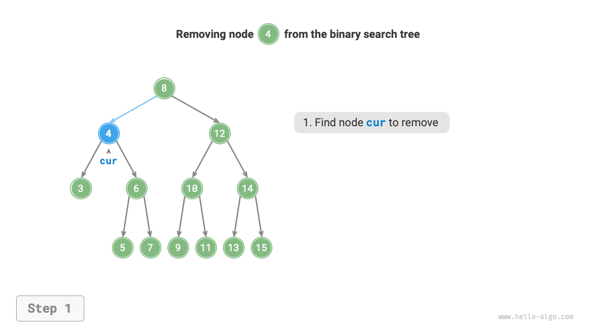
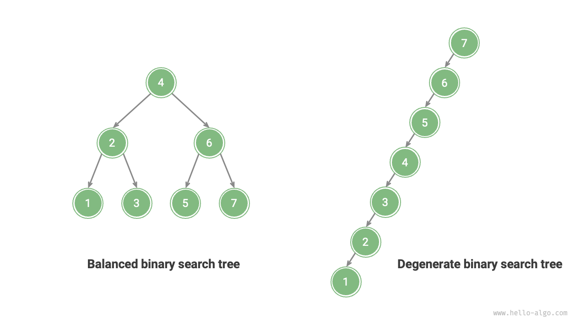

# 7.4 &nbsp; Cây tìm kiếm nhị phân

Như hình bên dưới, một <u>cây tìm kiếm nhị phân</u> thỏa mãn các điều kiện sau.

1. Với nút gốc, giá trị của tất cả các nút trong cây con trái $<$ giá trị của nút gốc $<$ giá trị của tất cả các nút trong cây con phải.
2. Cây con trái và phải của bất kỳ nút nào cũng là cây tìm kiếm nhị phân, tức là chúng cũng thỏa mãn điều kiện `1.`.

{ class="animation-figure" }

<p align="center"> Figure 7-16 &nbsp; Binary search tree </p>

## 7.4.1 &nbsp; Các thao tác trên cây tìm kiếm nhị phân

Ta đóng gói cây tìm kiếm nhị phân vào một lớp `BinarySearchTree` và khai báo biến thành viên `root` trỏ tới nút gốc của cây.

### 1. &nbsp; Tìm kiếm một nút

Cho giá trị nút mục tiêu `num`, ta có thể tìm kiếm theo tính chất của cây tìm kiếm nhị phân. Như hình bên dưới, ta khai báo một nút `cur`, bắt đầu từ nút gốc `root`, và lặp để so sánh giá trị giữa `cur.val` và `num`.

- Nếu `cur.val < num`, nghĩa là nút mục tiêu nằm trong cây con phải của `cur`, nên thực hiện `cur = cur.right`.
- Nếu `cur.val > num`, nghĩa là nút mục tiêu nằm trong cây con trái của `cur`, nên thực hiện `cur = cur.left`.
- Nếu `cur.val = num`, nghĩa là đã tìm thấy nút mục tiêu, thoát vòng lặp và trả về nút đó.

=== "<1>"
    { class="animation-figure" }

=== "<2>"
    { class="animation-figure" }

=== "<3>"
    { class="animation-figure" }

=== "<4>"
    { class="animation-figure" }

<p align="center"> Figure 7-17 &nbsp; Example of searching for a node in a binary search tree </p>

Thao tác tìm kiếm trong cây tìm kiếm nhị phân hoạt động theo cùng một nguyên lý với thuật toán tìm kiếm nhị phân, loại bỏ một nửa trường hợp ở mỗi bước. Số vòng lặp tối đa bằng chiều cao của cây. Khi cây cân bằng, thời gian là $O(\log n)$. Ví dụ mã như sau:

=== "Python"

    ```python title="binary_search_tree.py"
    def search(self, num: int) -> TreeNode | None:
        """Search node"""
        cur = self._root
        # Loop find, break after passing leaf nodes
        while cur is not None:
            # Target node is in cur's right subtree
            if cur.val < num:
                cur = cur.right
            # Target node is in cur's left subtree
            elif cur.val > num:
                cur = cur.left
            # Found target node, break loop
            else:
                break
        return cur
    ```

=== "C++"

    ```cpp title="binary_search_tree.cpp"
    /* Search node */
    TreeNode *search(int num) {
        TreeNode *cur = root;
        // Loop find, break after passing leaf nodes
        while (cur != nullptr) {
            // Target node is in cur's right subtree
            if (cur->val < num)
                cur = cur->right;
            // Target node is in cur's left subtree
            else if (cur->val > num)
                cur = cur->left;
            // Found target node, break loop
            else
                break;
        }
        // Return target node
        return cur;
    }
    ```

=== "Java"

    ```java title="binary_search_tree.java"
    /* Search node */
    TreeNode search(int num) {
        TreeNode cur = root;
        // Loop find, break after passing leaf nodes
        while (cur != null) {
            // Target node is in cur's right subtree
            if (cur.val < num)
                cur = cur.right;
            // Target node is in cur's left subtree
            else if (cur.val > num)
                cur = cur.left;
            // Found target node, break loop
            else
                break;
        }
        // Return target node
        return cur;
    }
    ```

=== "C#"

    ```csharp title="binary_search_tree.cs"
    [class]{BinarySearchTree}-[func]{Search}
    ```

=== "Go"

    ```go title="binary_search_tree.go"
    [class]{binarySearchTree}-[func]{search}
    ```

=== "Swift"

    ```swift title="binary_search_tree.swift"
    [class]{BinarySearchTree}-[func]{search}
    ```

=== "JS"

    ```javascript title="binary_search_tree.js"
    [class]{BinarySearchTree}-[func]{search}
    ```

=== "TS"

    ```typescript title="binary_search_tree.ts"
    [class]{BinarySearchTree}-[func]{search}
    ```

=== "Dart"

    ```dart title="binary_search_tree.dart"
    [class]{BinarySearchTree}-[func]{search}
    ```

=== "Rust"

    ```rust title="binary_search_tree.rs"
    [class]{BinarySearchTree}-[func]{search}
    ```

=== "C"

    ```c title="binary_search_tree.c"
    [class]{BinarySearchTree}-[func]{search}
    ```

=== "Kotlin"

    ```kotlin title="binary_search_tree.kt"
    [class]{BinarySearchTree}-[func]{search}
    ```

=== "Ruby"

    ```ruby title="binary_search_tree.rb"
    [class]{BinarySearchTree}-[func]{search}
    ```

=== "Zig"

    ```zig title="binary_search_tree.zig"
    [class]{BinarySearchTree}-[func]{search}
    ```

### 2. &nbsp; Chèn một nút

Cho một phần tử `num` cần chèn, để giữ tính chất của cây tìm kiếm nhị phân "cây con trái < nút gốc < cây con phải", thao tác chèn tiến hành như hình dưới.

1. **Tìm vị trí chèn**: Tương tự thao tác tìm kiếm, bắt đầu từ nút gốc, lặp xuống theo quan hệ giá trị giữa nút hiện tại và `num`, cho tới khi vượt qua nút lá (duyệt đến `None`), rồi thoát vòng lặp.
2. **Chèn nút vào vị trí này**: Khởi tạo nút `num` và đặt vào chỗ `None` đã đến.

{ class="animation-figure" }

<p align="center"> Figure 7-18 &nbsp; Inserting a node into a binary search tree </p>

Trong hiện thực mã, lưu ý hai điểm sau.

- Cây tìm kiếm nhị phân không cho phép tồn tại các nút trùng lặp; nếu không định nghĩa sẽ bị vi phạm. Do đó, nếu nút cần chèn đã tồn tại trong cây, không thực hiện chèn và trả về trực tiếp.
- Để thực hiện chèn, ta cần dùng nút `pre` lưu lại nút ở vòng lặp trước. Bằng cách này, khi duyệt tới `None`, ta sẽ có được nút cha của vị trí cần chèn, từ đó hoàn thành thao tác chèn.

=== "Python"

    ```python title="binary_search_tree.py"
    def insert(self, num: int):
        """Insert node"""
        # If tree is empty, initialize root node
        if self._root is None:
            self._root = TreeNode(num)
            return
        # Loop find, break after passing leaf nodes
        cur, pre = self._root, None
        while cur is not None:
            # Found duplicate node, thus return
            if cur.val == num:
                return
            pre = cur
            # Insertion position is in cur's right subtree
            if cur.val < num:
                cur = cur.right
            # Insertion position is in cur's left subtree
            else:
                cur = cur.left
        # Insert node
        node = TreeNode(num)
        if pre.val < num:
            pre.right = node
        else:
            pre.left = node
    ```

=== "C++"

    ```cpp title="binary_search_tree.cpp"
    /* Insert node */
    void insert(int num) {
        // If tree is empty, initialize root node
        if (root == nullptr) {
            root = new TreeNode(num);
            return;
        }
        TreeNode *cur = root, *pre = nullptr;
        // Loop find, break after passing leaf nodes
        while (cur != nullptr) {
            // Found duplicate node, thus return
            if (cur->val == num)
                return;
            pre = cur;
            // Insertion position is in cur's right subtree
            if (cur->val < num)
                cur = cur->right;
            // Insertion position is in cur's left subtree
            else
                cur = cur->left;
        }
        // Insert node
        TreeNode *node = new TreeNode(num);
        if (pre->val < num)
            pre->right = node;
        else
            pre->left = node;
    }
    ```

=== "Java"

    ```java title="binary_search_tree.java"
    /* Insert node */
    void insert(int num) {
        // If tree is empty, initialize root node
        if (root == null) {
            root = new TreeNode(num);
            return;
        }
        TreeNode cur = root, pre = null;
        // Loop find, break after passing leaf nodes
        while (cur != null) {
            // Found duplicate node, thus return
            if (cur.val == num)
                return;
            pre = cur;
            // Insertion position is in cur's right subtree
            if (cur.val < num)
                cur = cur.right;
            // Insertion position is in cur's left subtree
            else
                cur = cur.left;
        }
        // Insert node
        TreeNode node = new TreeNode(num);
        if (pre.val < num)
            pre.right = node;
        else
            pre.left = node;
    }
    ```

=== "C#"

    ```csharp title="binary_search_tree.cs"
    [class]{BinarySearchTree}-[func]{Insert}
    ```

=== "Go"

    ```go title="binary_search_tree.go"
    [class]{binarySearchTree}-[func]{insert}
    ```

=== "Swift"

    ```swift title="binary_search_tree.swift"
    [class]{BinarySearchTree}-[func]{insert}
    ```

=== "JS"

    ```javascript title="binary_search_tree.js"
    [class]{BinarySearchTree}-[func]{insert}
    ```

=== "TS"

    ```typescript title="binary_search_tree.ts"
    [class]{BinarySearchTree}-[func]{insert}
    ```

=== "Dart"

    ```dart title="binary_search_tree.dart"
    [class]{BinarySearchTree}-[func]{insert}
    ```

=== "Rust"

    ```rust title="binary_search_tree.rs"
    [class]{BinarySearchTree}-[func]{insert}
    ```

=== "C"

    ```c title="binary_search_tree.c"
    [class]{BinarySearchTree}-[func]{insert}
    ```

=== "Kotlin"

    ```kotlin title="binary_search_tree.kt"
    [class]{BinarySearchTree}-[func]{insert}
    ```

=== "Ruby"

    ```ruby title="binary_search_tree.rb"
    [class]{BinarySearchTree}-[func]{insert}
    ```

=== "Zig"

    ```zig title="binary_search_tree.zig"
    [class]{BinarySearchTree}-[func]{insert}
    ```

Tương tự tìm kiếm, chèn một nút có thời gian $O(\log n)$.

### 3. &nbsp; Xóa một nút

Đầu tiên, tìm nút mục tiêu trong cây, sau đó xóa nó. Tương tự chèn, ta cần đảm bảo rằng sau khi xóa, cây vẫn thỏa mãn tính chất 'cây con trái < nút gốc < cây con phải'. Do đó, dựa vào số con của nút cần xóa, chia thành ba trường hợp: 0, 1 và 2, và thực hiện các thao tác xóa tương ứng.

Như hình dưới, khi bậc (số con) của nút cần xóa là $0$, nghĩa là nút là lá và có thể xóa trực tiếp.

{ class="animation-figure" }

<p align="center"> Figure 7-19 &nbsp; Removing a node in a binary search tree (degree 0) </p>

Như hình dưới, khi bậc của nút cần xóa là $1$, thay thế nút cần xóa bằng con của nó là đủ.

{ class="animation-figure" }

<p align="center"> Figure 7-20 &nbsp; Removing a node in a binary search tree (degree 1) </p>

Khi nút cần xóa có bậc $2$, không thể xóa trực tiếp mà cần dùng một nút để thay thế. Để duy trì tính chất 'cây con trái $<$ nút gốc $<$ cây con phải', **nút thay thế có thể là nút nhỏ nhất của cây con phải hoặc nút lớn nhất của cây con trái**.

Giả sử ta chọn nút nhỏ nhất của cây con phải (nút kế tiếp trong duyệt in-order), thì thao tác xóa như sau.

1. Tìm nút kế tiếp trong "trình tự duyệt trung thứ tự (in-order)" của nút cần xóa, gọi là `tmp`.
2. Thay giá trị của nút cần xóa bằng giá trị của `tmp`, và đệ quy xóa nút `tmp` trong cây.

=== "<1>"
    { class="animation-figure" }

=== "<2>"
    { class="animation-figure" }

=== "<3>"
    { class="animation-figure" }

=== "<4>"
    { class="animation-figure" }

<p align="center"> Figure 7-21 &nbsp; Removing a node in a binary search tree (degree 2) </p>

Thao tác xóa một nút cũng có thời gian $O(\log n)$, trong đó tìm nút cần xóa tốn $O(\log n)$ và tìm nút kế tiếp theo duyệt in-order cũng tốn $O(\log n)$. Ví dụ mã như sau:

=== "Python"

    ```python title="binary_search_tree.py"
    def remove(self, num: int):
        """Remove node"""
        # If tree is empty, return
        if self._root is None:
            return
        # Loop find, break after passing leaf nodes
        cur, pre = self._root, None
        while cur is not None:
            # Found node to be removed, break loop
            if cur.val == num:
                break
            pre = cur
            # Node to be removed is in cur's right subtree
            if cur.val < num:
                cur = cur.right
            # Node to be removed is in cur's left subtree
            else:
                cur = cur.left
        # If no node to be removed, return
        if cur is None:
            return

        # Number of child nodes = 0 or 1
        if cur.left is None or cur.right is None:
            # When the number of child nodes = 0/1, child = null/that child node
            child = cur.left or cur.right
            # Remove node cur
            if cur != self._root:
                if pre.left == cur:
                    pre.left = child
                else:
                    pre.right = child
            else:
                # If the removed node is the root, reassign the root
                self._root = child
        # Number of child nodes = 2
        else:
            # Get the next node in in-order traversal of cur
            tmp: TreeNode = cur.right
            while tmp.left is not None:
                tmp = tmp.left
            # Recursively remove node tmp
            self.remove(tmp.val)
            # Replace cur with tmp
            cur.val = tmp.val
    ```

=== "C++"

    ```cpp title="binary_search_tree.cpp"
    /* Remove node */
    void remove(int num) {
        // If tree is empty, return
        if (root == nullptr)
            return;
        TreeNode *cur = root, *pre = nullptr;
        // Loop find, break after passing leaf nodes
        while (cur != nullptr) {
            // Found node to be removed, break loop
            if (cur->val == num)
                break;
            pre = cur;
            // Node to be removed is in cur's right subtree
            if (cur->val < num)
                cur = cur->right;
            // Node to be removed is in cur's left subtree
            else
                cur = cur->left;
        }
        // If no node to be removed, return
        if (cur == nullptr)
            return;
        // Number of child nodes = 0 or 1
        if (cur->left == nullptr || cur->right == nullptr) {
            // When the number of child nodes = 0 / 1, child = nullptr / that child node
            TreeNode *child = cur->left != nullptr ? cur->left : cur->right;
            // Remove node cur
            if (cur != root) {
                if (pre->left == cur)
                    pre->left = child;
                else
                    pre->right = child;
            } else {
                // If the removed node is the root, reassign the root
                root = child;
            }
            // Free memory
            delete cur;
        }
        // Number of child nodes = 2
        else {
            // Get the next node in in-order traversal of cur
            TreeNode *tmp = cur->right;
            while (tmp->left != nullptr) {
                tmp = tmp->left;
            }
            int tmpVal = tmp->val;
            // Recursively remove node tmp
            remove(tmp->val);
            // Replace cur with tmp
            cur->val = tmpVal;
        }
    }
    ```

=== "Java"

    ```java title="binary_search_tree.java"
    /* Remove node */
    void remove(int num) {
        // If tree is empty, return
        if (root == null)
            return;
        TreeNode cur = root, pre = null;
        // Loop find, break after passing leaf nodes
        while (cur != null) {
            // Found node to be removed, break loop
            if (cur.val == num)
                break;
            pre = cur;
            // Node to be removed is in cur's right subtree
            if (cur.val < num)
                cur = cur.right;
            // Node to be removed is in cur's left subtree
            else
                cur = cur.left;
        }
        // If no node to be removed, return
        if (cur == null)
            return;
        // Number of child nodes = 0 or 1
        if (cur.left == null || cur.right == null) {
            // When the number of child nodes = 0/1, child = null/that child node
            TreeNode child = cur.left != null ? cur.left : cur.right;
            // Remove node cur
            if (cur != root) {
                if (pre.left == cur)
                    pre.left = child;
                else
                    pre.right = child;
            } else {
                // If the removed node is the root, reassign the root
                root = child;
            }
        }
        // Number of child nodes = 2
        else {
            // Get the next node in in-order traversal of cur
            TreeNode tmp = cur.right;
            while (tmp.left != null) {
                tmp = tmp.left;
            }
            // Recursively remove node tmp
            remove(tmp.val);
            // Replace cur with tmp
            cur.val = tmp.val;
        }
    }
    ```

=== "C#"

    ```csharp title="binary_search_tree.cs"
    [class]{BinarySearchTree}-[func]{Remove}
    ```

=== "Go"

    ```go title="binary_search_tree.go"
    [class]{binarySearchTree}-[func]{remove}
    ```

=== "Swift"

    ```swift title="binary_search_tree.swift"
    [class]{BinarySearchTree}-[func]{remove}
    ```

=== "JS"

    ```javascript title="binary_search_tree.js"
    [class]{BinarySearchTree}-[func]{remove}
    ```

=== "TS"

    ```typescript title="binary_search_tree.ts"
    [class]{BinarySearchTree}-[func]{remove}
    ```

=== "Dart"

    ```dart title="binary_search_tree.dart"
    [class]{BinarySearchTree}-[func]{remove}
    ```

=== "Rust"

    ```rust title="binary_search_tree.rs"
    [class]{BinarySearchTree}-[func]{remove}
    ```

=== "C"

    ```c title="binary_search_tree.c"
    [class]{BinarySearchTree}-[func]{removeItem}
    ```

=== "Kotlin"

    ```kotlin title="binary_search_tree.kt"
    [class]{BinarySearchTree}-[func]{remove}
    ```

=== "Ruby"

    ```ruby title="binary_search_tree.rb"
    [class]{BinarySearchTree}-[func]{remove}
    ```

=== "Zig"

    ```zig title="binary_search_tree.zig"
    [class]{BinarySearchTree}-[func]{remove}
    ```

### 4. &nbsp; Duyệt in-order tạo thứ tự tăng dần

Như hình dưới, duyệt in-order của một cây nhị phân theo thứ tự "trái $\rightarrow$ gốc $\rightarrow$ phải", và cây tìm kiếm nhị phân thỏa mãn quan hệ "nút con trái $<$ nút gốc $<$ nút con phải".

Điều này có nghĩa khi duyệt in-order trên cây tìm kiếm nhị phân, các nút nhỏ hơn sẽ được duyệt trước, dẫn tới một tính chất quan trọng: **Dãy các nút theo duyệt in-order của cây tìm kiếm nhị phân là tăng dần**.

Dựa vào tính chất tăng dần của duyệt in-order, lấy dữ liệu có thứ tự từ cây tìm kiếm nhị phân chỉ tốn $O(n)$ thời gian, không cần sắp xếp thêm, rất hiệu quả.

{ class="animation-figure" }

<p align="center"> Figure 7-22 &nbsp; In-order traversal sequence of a binary search tree </p>

## 7.4.2 &nbsp; Hiệu năng của cây tìm kiếm nhị phân

Với một tập dữ liệu, ta cân nhắc dùng mảng hoặc cây tìm kiếm nhị phân để lưu trữ. Nhìn vào bảng dưới, các thao tác trên cây tìm kiếm nhị phân đều có độ phức tạp logarit, ổn định và hiệu quả. Mảng chỉ hiệu quả hơn khi thêm phần tử thường xuyên nhưng tìm kiếm hoặc xóa ít.

<p align="center"> Bảng <id> &nbsp; So sánh hiệu năng giữa mảng và cây tìm kiếm </p>

<div class="center-table" markdown>

|                | Mảng không sắp xếp | Cây tìm kiếm nhị phân |
| -------------- | ------------------ | --------------------- |
| Tìm phần tử    | $O(n)$             | $O(\log n)$           |
| Chèn phần tử   | $O(1)$             | $O(\log n)$           |
| Xóa phần tử    | $O(n)$             | $O(\log n)$           |

</div>

Lý tưởng thì cây tìm kiếm nhị phân là "cân bằng", cho phép tìm bất kỳ nút nào trong $\log n$ vòng lặp.

Tuy nhiên, nếu ta liên tục chèn và xóa, cây tìm kiếm nhị phân có thể thoái biến thành một danh sách liên kết như hình dưới, khi đó độ phức tạp của các thao tác giảm xuống $O(n)$.

{ class="animation-figure" }

<p align="center"> Figure 7-23 &nbsp; Degradation of a binary search tree </p>

## 7.4.3 &nbsp; Ứng dụng phổ biến của cây tìm kiếm nhị phân

- Được dùng làm chỉ mục đa cấp trong hệ thống để thực hiện tìm kiếm, chèn và xóa hiệu quả.
- Làm cấu trúc dữ liệu nền tảng cho một số thuật toán tìm kiếm.
- Dùng để lưu luồng dữ liệu nhằm giữ thứ tự của chúng.
