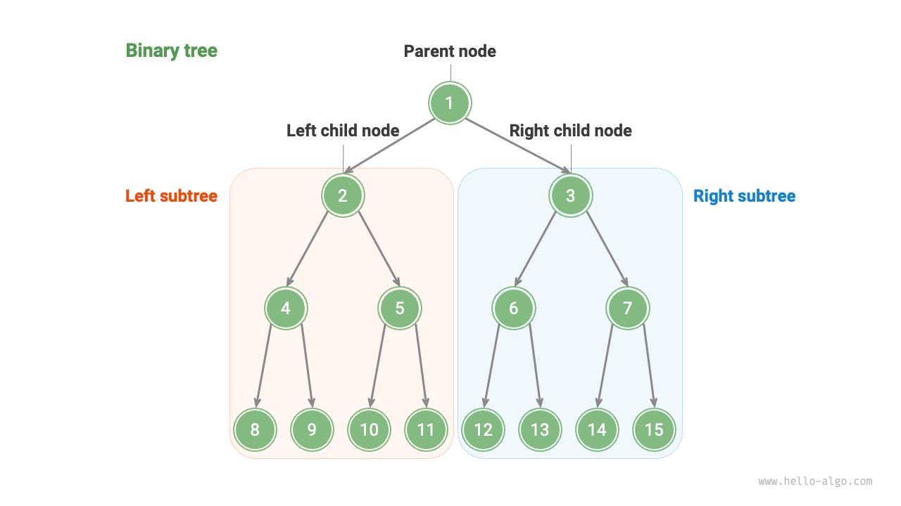
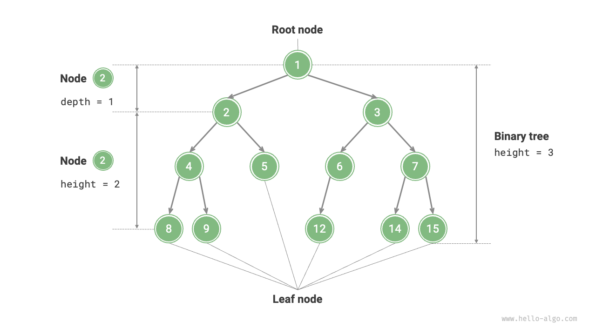
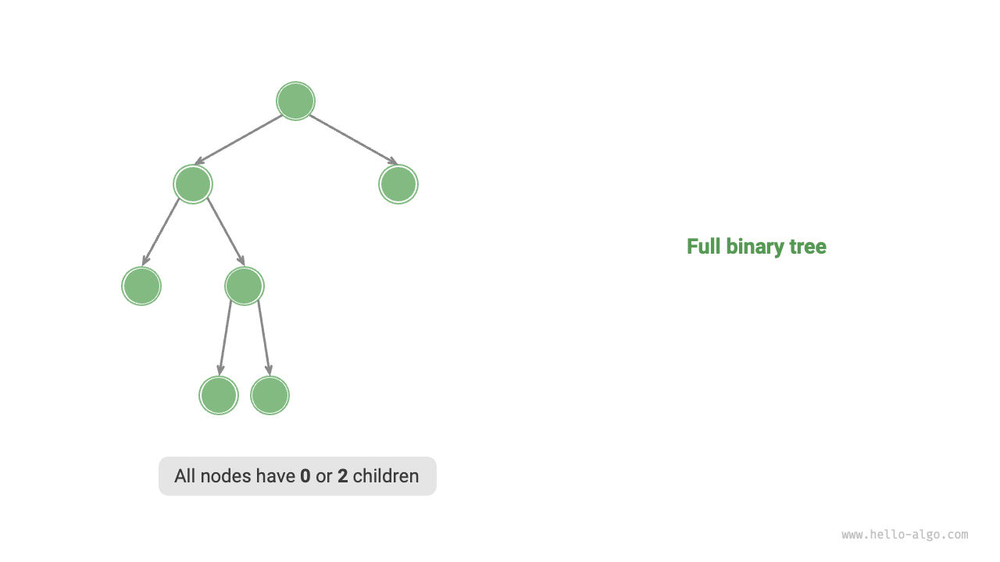
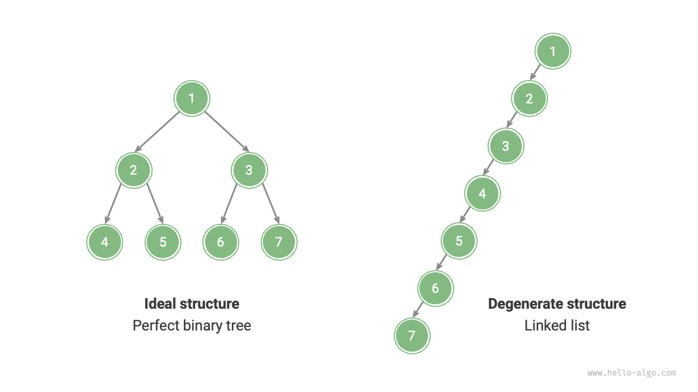

# 7.1 &nbsp; Cây nhị phân

Một <u>cây nhị phân</u> là một cấu trúc dữ liệu phi tuyến thể hiện mối quan hệ hệ thống giữa tổ tiên và hậu duệ và bao hàm tư duy chia để trị "tách thành hai". Tương tự như danh sách liên kết, đơn vị cơ bản của cây nhị phân là một nút, và mỗi nút chứa một giá trị, một tham chiếu tới nút con bên trái và một tham chiếu tới nút con bên phải.

=== "Python"

    ```python title=""
    class TreeNode:
        """Nút cây nhị phân"""
        def __init__(self, val: int):
            self.val: int = val                # Giá trị nút
            self.left: TreeNode | None = None  # Tham chiếu tới nút con bên trái
            self.right: TreeNode | None = None # Tham chiếu tới nút con bên phải
    ```

=== "C++"

    ```cpp title=""
    /* Nút cây nhị phân */
    struct TreeNode {
        int val;          // Giá trị nút
        TreeNode *left;   // Con trỏ tới nút con bên trái
        TreeNode *right;  // Con trỏ tới nút con bên phải
        TreeNode(int x) : val(x), left(nullptr), right(nullptr) {}
    };
    ```

=== "Java"

    ```java title=""
    /* Nút cây nhị phân */
    class TreeNode {
        int val;         // Giá trị nút
        TreeNode left;   // Tham chiếu tới nút con bên trái
        TreeNode right;  // Tham chiếu tới nút con bên phải
        TreeNode(int x) { val = x; }
    }
    ```

=== "C#"

    ```csharp title=""
    /* Nút cây nhị phân */
    class TreeNode(int? x) {
        public int? val = x;    // Giá trị nút
        public TreeNode? left;  // Tham chiếu tới nút con bên trái
        public TreeNode? right; // Tham chiếu tới nút con bên phải
    }
    ```

=== "Go"

    ```go title=""
    /* Nút cây nhị phân */
    type TreeNode struct {
        Val   int
        Left  *TreeNode
        Right *TreeNode
    }
    /* Hàm khởi tạo */
    func NewTreeNode(v int) *TreeNode {
        return &TreeNode{
            Left:  nil, // Con trỏ tới nút con bên trái
            Right: nil, // Con trỏ tới nút con bên phải
            Val:   v,   // Giá trị nút
        }
    }
    ```

=== "Swift"

    ```swift title=""
    /* Nút cây nhị phân */
    class TreeNode {
        var val: Int // Giá trị nút
        var left: TreeNode? // Tham chiếu tới nút con bên trái
        var right: TreeNode? // Tham chiếu tới nút con bên phải

        init(x: Int) {
            val = x
        }
    }
    ```

=== "JS"

    ```javascript title=""
    /* Nút cây nhị phân */
    class TreeNode {
        val; // Giá trị nút
        left; // Con trỏ tới nút con bên trái
        right; // Con trỏ tới nút con bên phải
        constructor(val, left, right) {
            this.val = val === undefined ? 0 : val;
            this.left = left === undefined ? null : left;
            this.right = right === undefined ? null : right;
        }
    }
    ```

=== "TS"

    ```typescript title=""
    /* Nút cây nhị phân */
    class TreeNode {
        val: number;
        left: TreeNode | null;
        right: TreeNode | null;

        constructor(val?: number, left?: TreeNode | null, right?: TreeNode | null) {
            this.val = val === undefined ? 0 : val; // Giá trị nút
            this.left = left === undefined ? null : left; // Tham chiếu tới nút con bên trái
            this.right = right === undefined ? null : right; // Tham chiếu tới nút con bên phải
        }
    }
    ```

=== "Dart"

    ```dart title=""
    /* Nút cây nhị phân */
    class TreeNode {
      int val;         // Giá trị nút
      TreeNode? left;  // Tham chiếu tới nút con bên trái
      TreeNode? right; // Tham chiếu tới nút con bên phải
      TreeNode(this.val, [this.left, this.right]);
    }
    ```

=== "Rust"

    ```rust title=""
    use std::rc::Rc;
    use std::cell::RefCell;

    /* Nút cây nhị phân */
    struct TreeNode {
        val: i32,                               // Giá trị nút
        left: Option<Rc<RefCell<TreeNode>>>,    // Tham chiếu tới nút con bên trái
        right: Option<Rc<RefCell<TreeNode>>>,   // Tham chiếu tới nút con bên phải
    }

    impl TreeNode {
        /* Hàm tạo */
        fn new(val: i32) -> Rc<RefCell<Self>> {
            Rc::new(RefCell::new(Self {
                val,
                left: None,
                right: None
            }))
        }
    }
    ```

=== "C"

    ```c title=""
    /* Nút cây nhị phân */
    typedef struct TreeNode {
        int val;                // Giá trị nút
        int height;             // Chiều cao của nút
        struct TreeNode *left;  // Con trỏ tới nút con bên trái
        struct TreeNode *right; // Con trỏ tới nút con bên phải
    } TreeNode;

    /* Hàm tạo */
    TreeNode *newTreeNode(int val) {
        TreeNode *node;

        node = (TreeNode *)malloc(sizeof(TreeNode));
        node->val = val;
        node->height = 0;
        node->left = NULL;
        node->right = NULL;
        return node;
    }
    ```

=== "Kotlin"

    ```kotlin title=""
    /* Nút cây nhị phân */
    class TreeNode(val _val: Int) {  // Giá trị nút
        val left: TreeNode? = null   // Tham chiếu tới nút con bên trái
        val right: TreeNode? = null  // Tham chiếu tới nút con bên phải
    }
    ```

=== "Ruby"

    ```ruby title=""

    ```

=== "Zig"

    ```zig title=""

    ```

Mỗi nút có hai tham chiếu (con trỏ), lần lượt trỏ tới <u>nút con bên trái</u> và <u>nút con bên phải</u>. Nút này được gọi là <u>nút cha</u> của hai nút con đó. Khi xét một nút trong cây nhị phân, cây được tạo bởi nút con bên trái của nút đó và tất cả các nút bên dưới nó gọi là <u>cây con bên trái</u> của nút. Tương tự, ta có thể định nghĩa <u>cây con bên phải</u>.

**Trong một cây nhị phân, ngoại trừ các nút lá, tất cả các nút khác đều có các nút con và các cây con không rỗng.** Như trong hình bên dưới, nếu "Nút 2" được xem như một nút cha, thì nút con bên trái và bên phải của nó lần lượt là "Nút 4" và "Nút 5". Cây con bên trái được hình thành bởi "Nút 4" và tất cả các nút phía dưới nó, trong khi cây con bên phải được hình thành bởi "Nút 5" và tất cả các nút phía dưới nó.

{ class="animation-figure" }

<p align="center"> Figure 7-1 &nbsp; Node cha, node con, cây con</p>

## 7.1.1 &nbsp; Thuật ngữ thường gặp trong cây nhị phân

Thuật ngữ thường dùng cho cây nhị phân được trình bày trong hình dưới đây.

- <u>Nút gốc</u>: Nút ở mức trên cùng của cây nhị phân, không có nút cha.
- <u>Nút lá</u>: Nút không có nút con nào, với cả hai con trỏ đều trỏ tới `None`.
- <u>Cạnh</u>: Đoạn thẳng nối hai nút, biểu thị một tham chiếu (con trỏ) giữa các nút.
- <u>Cấp (mức)</u> của một nút: Tăng dần từ trên xuống dưới, với nút gốc ở cấp 1.
- <u>Bậc</u> của một nút: Số lượng nút con mà một nút có. Trong cây nhị phân, bậc có thể là 0, 1 hoặc 2.
- <u>Chiều cao</u> của một cây nhị phân: Số cạnh từ nút gốc đến nút lá xa nhất.
- <u>Độ sâu</u> của một nút: Số cạnh từ nút gốc đến nút đó.
- <u>Chiều cao</u> của một nút: Số cạnh từ nút đó đến lá xa nhất nằm dưới nó.

{ class="animation-figure" }

<p align="center"> Figure 7-2 &nbsp; Thuật ngữ thường gặp trong cây nhị phân</p>

!!! tip

    Lưu ý rằng chúng ta thường định nghĩa "chiều cao" và "độ sâu" theo "số cạnh phải đi qua", nhưng một số bài toán hoặc sách giáo khoa có thể định nghĩa là "số nút phải đi qua". Trong trường hợp đó, cả chiều cao và độ sâu cần tăng thêm 1.

## 7.1.2 &nbsp; Các thao tác cơ bản trên cây nhị phân

### 1. &nbsp; Khởi tạo một cây nhị phân

Tương tự như danh sách liên kết, việc khởi tạo cây nhị phân bao gồm tạo các nút trước, sau đó thiết lập các tham chiếu (con trỏ) giữa chúng.

=== "Python"

    ```python title="binary_tree.py"
    # Khởi tạo một cây nhị phân
    # Khởi tạo các nút
    n1 = TreeNode(val=1)
    n2 = TreeNode(val=2)
    n3 = TreeNode(val=3)
    n4 = TreeNode(val=4)
    n5 = TreeNode(val=5)
    # Liên kết tham chiếu (con trỏ) giữa các nút
    n1.left = n2
    n1.right = n3
    n2.left = n4
    n2.right = n5
    ```

=== "C++"

    ```cpp title="binary_tree.cpp"
    /* Khởi tạo một cây nhị phân */
    // Khởi tạo các nút
    TreeNode* n1 = new TreeNode(1);
    TreeNode* n2 = new TreeNode(2);
    TreeNode* n3 = new TreeNode(3);
    TreeNode* n4 = new TreeNode(4);
    TreeNode* n5 = new TreeNode(5);
    // Liên kết tham chiếu (con trỏ) giữa các nút
    n1->left = n2;
    n1->right = n3;
    n2->left = n4;
    n2->right = n5;
    ```

=== "Java"

    ```java title="binary_tree.java"
    // Khởi tạo các nút
    TreeNode n1 = new TreeNode(1);
    TreeNode n2 = new TreeNode(2);
    TreeNode n3 = new TreeNode(3);
    TreeNode n4 = new TreeNode(4);
    TreeNode n5 = new TreeNode(5);
    // Liên kết tham chiếu (con trỏ) giữa các nút
    n1.left = n2;
    n1.right = n3;
    n2.left = n4;
    n2.right = n5;
    ```

=== "C#"

    ```csharp title="binary_tree.cs"
    /* Khởi tạo một cây nhị phân */
    // Khởi tạo các nút
    TreeNode n1 = new(1);
    TreeNode n2 = new(2);
    TreeNode n3 = new(3);
    TreeNode n4 = new(4);
    TreeNode n5 = new(5);
    // Liên kết tham chiếu (con trỏ) giữa các nút
    n1.left = n2;
    n1.right = n3;
    n2.left = n4;
    n2.right = n5;
    ```

=== "Go"

    ```go title="binary_tree.go"
    /* Khởi tạo một cây nhị phân */
    // Khởi tạo các nút
    n1 := NewTreeNode(1)
    n2 := NewTreeNode(2)
    n3 := NewTreeNode(3)
    n4 := NewTreeNode(4)
    n5 := NewTreeNode(5)
    // Liên kết tham chiếu (con trỏ) giữa các nút
    n1.Left = n2
    n1.Right = n3
    n2.Left = n4
    n2.Right = n5
    ```

=== "Swift"

    ```swift title="binary_tree.swift"
    // Khởi tạo các nút
    let n1 = TreeNode(x: 1)
    let n2 = TreeNode(x: 2)
    let n3 = TreeNode(x: 3)
    let n4 = TreeNode(x: 4)
    let n5 = TreeNode(x: 5)
    // Liên kết tham chiếu (con trỏ) giữa các nút
    n1.left = n2
    n1.right = n3
    n2.left = n4
    n2.right = n5
    ```

=== "JS"

    ```javascript title="binary_tree.js"
    /* Khởi tạo một cây nhị phân */
    // Khởi tạo các nút
    let n1 = new TreeNode(1),
        n2 = new TreeNode(2),
        n3 = new TreeNode(3),
        n4 = new TreeNode(4),
        n5 = new TreeNode(5);
    // Liên kết tham chiếu (con trỏ) giữa các nút
    n1.left = n2;
    n1.right = n3;
    n2.left = n4;
    n2.right = n5;
    ```

=== "TS"

    ```typescript title="binary_tree.ts"
    /* Khởi tạo một cây nhị phân */
    // Khởi tạo các nút
    let n1 = new TreeNode(1),
        n2 = new TreeNode(2),
        n3 = new TreeNode(3),
        n4 = new TreeNode(4),
        n5 = new TreeNode(5);
    // Liên kết tham chiếu (con trỏ) giữa các nút
    n1.left = n2;
    n1.right = n3;
    n2.left = n4;
    n2.right = n5;
    ```

=== "Dart"

    ```dart title="binary_tree.dart"
    /* Khởi tạo một cây nhị phân */
    // Khởi tạo các nút
    TreeNode n1 = new TreeNode(1);
    TreeNode n2 = new TreeNode(2);
    TreeNode n3 = new TreeNode(3);
    TreeNode n4 = new TreeNode(4);
    TreeNode n5 = new TreeNode(5);
    // Liên kết tham chiếu (con trỏ) giữa các nút
    n1.left = n2;
    n1.right = n3;
    n2.left = n4;
    n2.right = n5;
    ```

=== "Rust"

    ```rust title="binary_tree.rs"
    // Khởi tạo các nút
    let n1 = TreeNode::new(1);
    let n2 = TreeNode::new(2);
    let n3 = TreeNode::new(3);
    let n4 = TreeNode::new(4);
    let n5 = TreeNode::new(5);
    // Liên kết tham chiếu (con trỏ) giữa các nút
    n1.borrow_mut().left = Some(n2.clone());
    n1.borrow_mut().right = Some(n3);
    n2.borrow_mut().left = Some(n4);
    n2.borrow_mut().right = Some(n5);
    ```

=== "C"

    ```c title="binary_tree.c"
    /* Khởi tạo một cây nhị phân */
    // Khởi tạo các nút
    TreeNode *n1 = newTreeNode(1);
    TreeNode *n2 = newTreeNode(2);
    TreeNode *n3 = newTreeNode(3);
    TreeNode *n4 = newTreeNode(4);
    TreeNode *n5 = newTreeNode(5);
    // Liên kết tham chiếu (con trỏ) giữa các nút
    n1->left = n2;
    n1->right = n3;
    n2->left = n4;
    n2->right = n5;
    ```

=== "Kotlin"

    ```kotlin title="binary_tree.kt"
    // Khởi tạo các nút
    val n1 = TreeNode(1)
    val n2 = TreeNode(2)
    val n3 = TreeNode(3)
    val n4 = TreeNode(4)
    val n5 = TreeNode(5)
    // Liên kết tham chiếu (con trỏ) giữa các nút
    n1.left = n2
    n1.right = n3
    n2.left = n4
    n2.right = n5
    ```

=== "Ruby"

    ```ruby title="binary_tree.rb"

    ```

=== "Zig"

    ```zig title="binary_tree.zig"

    ```

??? pythontutor "Code visualization"

    https://pythontutor.com/render.html#code=class%20TreeNode%3A%0A%20%20%20%20%22%22%22%E4%BA%8C%E5%8F%89%E6%A0%91%E8%8A%82%E7%82%B9%E7%B1%BB%22%22%22%0A%20%20%20%20def%20__init__%28self,%20val%3A%20int%29%3A%0A%20%20%20%20%20%20%20%20self.val%3A%20int%20%3D%20val%20%20%20%20%20%20%20%20%20%20%20%20%20%20%20%20%23%20%E8%8A%82%E7%82%B9%E5%80%BC%0A%20%20%20%20%20%20%20%20self.left%3A%20TreeNode%20%7C%20None%20%3D%20None%20%20%23%20%E5%B7%A6%E5%AD%90%E8%8A%82%E7%82%B9%E5%BC%95%E7%94%A8%0A%20%20%20%20%20%20%20%20self.right%3A%20TreeNode%20%7C%20None%20%3D%20None%20%23%20%E5%8F%B3%E5%AD%90%E8%8A%82%E7%82%B9%E5%BC%95%E7%94%A8%0A%0A%22%22%22Driver%20Code%22%22%22%0Aif%20__name__%20%3D%3D%20%22__main__%22%3A%0A%20%20%20%20%23%20%E5%88%9D%E5%A7%8B%E5%8C%96%E4%BA%8C%E5%8F%89%E6%A0%91%0A%20%20%20%20%23%20%E5%88%9D%E5%A7%8B%E5%8C%96%E8%8A%82%E7%82%B9%0A%20%20%20%20n1%20%3D%20TreeNode%28val%3D1%29%0A%20%20%20%20n2%20%3D%20TreeNode%28val%3D2%29%0A%20%20%20%20n3%20%3D%20TreeNode%28val%3D3%29%0A%20%20%20%20n4%20%3D%20TreeNode%28val%3D4%29%0A%20%20%20%20n5%20%3D%20TreeNode%28val%3D5%29%0A%20%20%20%20%23%20%E6%9E%84%E5%BB%BA%E8%8A%82%E7%82%B9%E4%B9%8B%E9%97%B4%E7%9A%84%E5%BC%95%E7%94%A8%EF%BC%88%E6%8C%87%E9%92%88%EF%BC%89%0A%20%20%20%20n1.left%20%3D%20n2%0A%20%20%20%20n1.right%20%3D%20n3%0A%20%20%20%20n2.left%20%3D%20n4%0A%20%20%20%20n2.right%20%3D%20n5&cumulative=false&curInstr=3&heapPrimitives=nevernest&mode=display&origin=opt-frontend.js&py=311&rawInputLstJSON=%5B%5D&textReferences=false

### 2. &nbsp; Chèn và loại bỏ nút

Tương tự như danh sách liên kết, chèn và xoá nút trong cây nhị phân có thể thực hiện bằng cách thay đổi các con trỏ. Hình dưới đây cho ví dụ minh họa.

{ class="animation-figure" }

<p align="center"> Figure 7-3 &nbsp; Chèn và loại bỏ nút trong cây nhị phân</p>

=== "Python"

    ```python title="binary_tree.py"
    # Chèn và loại bỏ nút
    p = TreeNode(0)
    # Chèn nút P giữa n1 -> n2
    n1.left = p
    p.left = n2
    # Xóa nút P
    n1.left = n2
    ```

=== "C++"

    ```cpp title="binary_tree.cpp"
    /* Chèn và loại bỏ nút */
    TreeNode* P = new TreeNode(0);
    // Chèn nút P giữa n1 và n2
    n1->left = P;
    P->left = n2;
    // Xóa nút P
    n1->left = n2;
    ```

=== "Java"

    ```java title="binary_tree.java"
    TreeNode P = new TreeNode(0);
    // Chèn nút P giữa n1 và n2
    n1.left = P;
    P.left = n2;
    // Xóa nút P
    n1.left = n2;
    ```

=== "C#"

    ```csharp title="binary_tree.cs"
    /* Chèn và loại bỏ nút */
    TreeNode P = new(0);
    // Chèn nút P giữa n1 và n2
    n1.left = P;
    P.left = n2;
    // Xóa nút P
    n1.left = n2;
    ```

=== "Go"

    ```go title="binary_tree.go"
    /* Chèn và loại bỏ nút */
    // Chèn nút P giữa n1 và n2
    p := NewTreeNode(0)
    n1.Left = p
    p.Left = n2
    // Xóa nút P
    n1.Left = n2
    ```

=== "Swift"

    ```swift title="binary_tree.swift"
    let P = TreeNode(x: 0)
    // Chèn nút P giữa n1 và n2
    n1.left = P
    P.left = n2
    // Xóa nút P
    n1.left = n2
    ```

=== "JS"

    ```javascript title="binary_tree.js"
    /* Chèn và loại bỏ nút */
    let P = new TreeNode(0);
    // Chèn nút P giữa n1 và n2
    n1.left = P;
    P.left = n2;
    // Xóa nút P
    n1.left = n2;
    ```

=== "TS"

    ```typescript title="binary_tree.ts"
    /* Chèn và loại bỏ nút */
    const P = new TreeNode(0);
    // Chèn nút P giữa n1 và n2
    n1.left = P;
    P.left = n2;
    // Xóa nút P
    n1.left = n2;
    ```

=== "Dart"

    ```dart title="binary_tree.dart"
    /* Chèn và loại bỏ nút */
    TreeNode P = new TreeNode(0);
    // Chèn nút P giữa n1 và n2
    n1.left = P;
    P.left = n2;
    // Xóa nút P
    n1.left = n2;
    ```

=== "Rust"

    ```rust title="binary_tree.rs"
    let p = TreeNode::new(0);
    // Chèn nút P giữa n1 và n2
    n1.borrow_mut().left = Some(p.clone());
    p.borrow_mut().left = Some(n2.clone());
    // Xóa nút P
    n1.borrow_mut().left = Some(n2);
    ```

=== "C"

    ```c title="binary_tree.c"
    /* Chèn và loại bỏ nút */
    TreeNode *P = newTreeNode(0);
    // Chèn nút P giữa n1 và n2
    n1->left = P;
    P->left = n2;
    // Xóa nút P
    n1->left = n2;
    ```

=== "Kotlin"

    ```kotlin title="binary_tree.kt"
    val P = TreeNode(0)
    // Chèn nút P giữa n1 và n2
    n1.left = P
    P.left = n2
    // Xóa nút P
    n1.left = n2
    ```

=== "Ruby"

    ```ruby title="binary_tree.rb"

    ```

=== "Zig"

    ```zig title="binary_tree.zig"

    ```

??? pythontutor "Code visualization"

    https://pythontutor.com/render.html#code=class%20TreeNode%3A%0A%20%20%20%20%22%22%22%E4%BA%8C%E5%8F%89%E6%A0%91%E8%8A%82%E7%82%B9%E7%B1%BB%22%22%22%0A%20%20%20%20def%20__init__%28self,%20val%3A%20int%29%3A%0A%20%20%20%20%20%20%20%20self.val%3A%20int%20%3D%20val%20%20%20%20%20%20%20%20%20%20%20%20%20%20%20%20%23%20%E8%8A%82%E7%82%B9%E5%80%BC%0A%20%20%20%20%20%20%20%20self.left%3A%20TreeNode%20%7C%20None%20%3D%20None%20%20%23%20%E5%B7%A6%E5%AD%90%E8%8A%82%E7%82%B9%E5%BC%95%E7%94%A8%0A%20%20%20%20%20%20%20%20self.right%3A%20TreeNode%20%7C%20None%20%3D%20None%20%23%20%E5%8F%B3%E5%AD%90%E8%8A%82%E7%82%B9%E5%BC%95%E7%94%A8%0A%0A%22%22%22Driver%20Code%22%22%22%0Aif%20__name__%20%3D%3D%20%22__main__%22%3A%0A%20%20%20%20%23%20%E5%88%9D%E5%A7%8B%E5%8C%96%E4%BA%8C%E5%8F%89%E6%A0%91%0A%20%20%20%20%23%20%E5%88%9D%E5%A7%8B%E5%8C%96%E8%8A%82%E7%82%B9%0A%20%20%20%20n1%20%3D%20TreeNode%28val%3D1%29%0A%20%20%20%20n2%20%3D%20TreeNode%28val%3D2%29%0A%20%20%20%20n3%20%3D%20TreeNode%28val%3D3%29%0A%20%20%20%20n4%20%3D%20TreeNode%28val%3D4%29%0A%20%20%20%20n5%20%3D%20TreeNode%28val%3D5%29%0A%20%20%20%20%23%20%E6%9E%84%E5%BB%BA%E8%8A%82%E7%82%B9%E4%B9%8B%E9%97%B4%E7%9A%84%E5%BC%95%E7%94%A8%EF%BC%88%E6%8C%87%E9%92%88%EF%BC%89%0A%20%20%20%20n1.left%20%3D%20n2%0A%20%20%20%20n1.right%20%3D%20n3%0A%20%20%20%20n2.left%20%3D%20n4%0A%20%20%20%20n2.right%20%3D%20n5%0A%0A%20%20%20%20%23%20%E6%8F%92%E5%85%A5%E4%B8%8E%E5%88%A0%E9%99%A4%E8%8A%82%E7%82%B9%0A%20%20%20%20p%20%3D%20TreeNode%280%29%0A%20%20%20%20%23%20%E5%9C%A8%20n1%20-%3E%20n2%20%E4%B8%AD%E9%97%B4%E6%8F%92%E5%85%A5%E8%8A%82%E7%82%B9%20P%0A%20%20%20%20n1.left%20%3D%20p%0A%20%20%20%20p.left%20%3D%20n2%0A%20%20%20%20%23%20%E5%88%A0%E9%99%A4%E8%8A%82%E7%82%B9%20P%0A%20%20%20%20n1.left%20%3D%20n2&cumulative=false&curInstr=37&heapPrimitives=nevernest&mode=display&origin=opt-frontend.js&py=311&rawInputLstJSON=%5B%5D&textReferences=false

!!! tip

    Cần lưu ý rằng việc chèn nút có thể thay đổi cấu trúc logic ban đầu của cây nhị phân, trong khi việc xóa nút thường bao gồm xóa nút và toàn bộ cây con của nó. Do đó, trong cây nhị phân, chèn và xóa thường được thực hiện bằng một tập hợp các thao tác để đạt được kết quả có ý nghĩa.

## 7.1.3 &nbsp; Các loại cây nhị phân thường gặp

### 1. &nbsp; Cây nhị phân hoàn hảo

Như trong hình dưới đây, trong một <u>cây nhị phân hoàn hảo</u>, tất cả các mức đều được lấp đầy hoàn toàn. Trong cây nhị phân hoàn hảo, các nút lá có bậc 0, trong khi tất cả các nút khác đều có bậc 2. Tổng số nút có thể tính bằng $2^{h+1} - 1$, trong đó $h$ là chiều cao của cây. Điều này thể hiện quan hệ mũ chuẩn, phản ánh hiện tượng phân chia tế bào trong tự nhiên.

!!! tip

    Lưu ý rằng trong cộng đồng nói tiếng Trung, cây nhị phân hoàn hảo thường được gọi là <u>cây nhị phân đầy</u> (full binary tree).

{ class="animation-figure" }

<p align="center"> Figure 7-4 &nbsp; Cây nhị phân hoàn hảo</p>

### 2. &nbsp; Cây nhị phân hoàn chỉnh

Như trong hình dưới đây, một <u>cây nhị phân hoàn chỉnh</u> là cây nhị phân mà chỉ mức dưới cùng có thể không đầy đủ hoàn toàn, và các nút ở mức dưới cùng phải được lấp đầy liên tiếp từ trái sang phải. Lưu ý rằng cây nhị phân hoàn hảo cũng là một cây nhị phân hoàn chỉnh.

{ class="animation-figure" }

<p align="center"> Figure 7-5 &nbsp; Cây nhị phân hoàn chỉnh</p>

### 3. &nbsp; Cây nhị phân đầy

Như trong hình dưới đây, một <u>cây nhị phân đầy</u> (full binary tree) là cây mà, ngoại trừ các nút lá, mọi nút khác đều có hai nút con.

{ class="animation-figure" }

<p align="center"> Figure 7-6 &nbsp; Cây nhị phân đầy</p>

### 4. &nbsp; Cây nhị phân cân bằng

Như trong hình dưới đây, trong một <u>cây nhị phân cân bằng</u>, hiệu tuyệt đối giữa chiều cao của cây con trái và phải của bất kỳ nút nào không vượt quá 1.

{ class="animation-figure" }

<p align="center"> Figure 7-7 &nbsp; Cây nhị phân cân bằng</p>

## 7.1.4 &nbsp; Suy biến của cây nhị phân

Hình dưới đây cho thấy cấu trúc lý tưởng và suy biến của cây nhị phân. Một cây nhị phân trở thành "cây nhị phân hoàn hảo" khi mọi mức đều được lấp đầy; trong khi nó suy biến thành một "danh sách liên kết" khi tất cả các nút đều lệch về một phía.

- Một cây nhị phân hoàn hảo là kịch bản lý tưởng nơi lợi thế "chia để trị" của cây nhị phân được tận dụng tối đa.
- Ngược lại, danh sách liên kết đại diện cho kịch bản cực đoan khác, nơi mọi thao tác trở thành tuyến tính, dẫn tới độ phức tạp thời gian là $O(n)$.

{ class="animation-figure" }

<p align="center"> Figure 7-8 &nbsp; Cấu trúc tốt nhất và tồi nhất của cây nhị phân</p>

Như trong bảng dưới đây, ở cấu trúc tốt nhất và tồi nhất, cây nhị phân đạt giá trị tối đa hoặc tối thiểu cho số nút lá, tổng số nút và chiều cao.

<p align="center"> Bảng <id> &nbsp; Cấu trúc tốt nhất và tồi nhất của cây nhị phân </p>

<div class="center-table" markdown>

|                                                 | Cây nhị phân hoàn hảo | Danh sách liên kết |
| ----------------------------------------------- | --------------------- | ------------------ |
| Số nút ở mức $i$                                | $2^{i-1}$             | $1$                |
| Số nút lá trong cây có chiều cao $h$            | $2^h$                 | $1$                |
| Tổng số nút trong cây có chiều cao $h$          | $2^{h+1} - 1$         | $h + 1$            |
| Chiều cao của cây với tổng $n$ nút              | $\log_2 (n+1) - 1$    | $n - 1$            |

</div>
