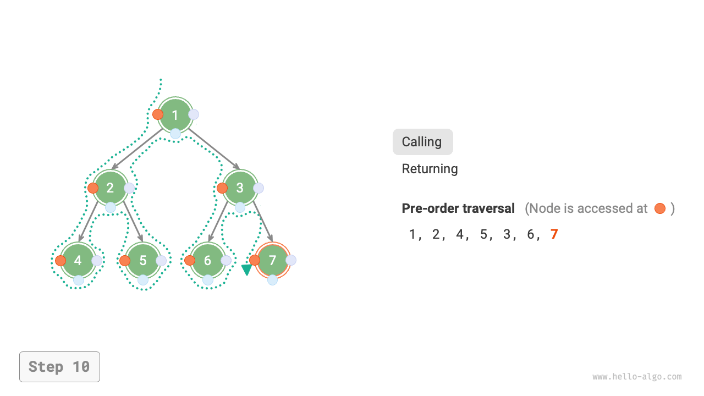

# 7.2 &nbsp; Duyệt cây nhị phân

Về mặt cấu trúc, cây là một cấu trúc dữ liệu dựa trên danh sách liên kết. Do đó, phương pháp duyệt của nó liên quan đến việc truy cập từng nút một thông qua con trỏ. Tuy nhiên, cây là một cấu trúc dữ liệu phi tuyến tính, khiến việc duyệt cây phức tạp hơn so với duyệt danh sách liên kết, cần đến sự hỗ trợ của các thuật toán tìm kiếm.

Các phương pháp duyệt phổ biến cho cây nhị phân bao gồm duyệt theo mức, duyệt trước (pre-order), duyệt giữa (in-order) và duyệt sau (post-order).

## 7.2.1 &nbsp; Duyệt theo mức

Như hình dưới đây, <u>duyệt theo mức</u> duyệt cây nhị phân từ trên xuống dưới, theo từng tầng. Trong cùng một tầng, nó truy cập các nút từ trái sang phải.

Duyệt theo mức thực chất là một dạng của <u>duyệt theo chiều rộng</u>, còn gọi là <u>tìm kiếm theo chiều rộng (BFS)</u>, thể hiện phương pháp duyệt "mở rộng theo vòng tròn ra ngoài" từng lớp một.

{ class="animation-figure" }{ class="animation-figure" }

<p align="center"> Figure 7-9 &nbsp; Duyệt theo mức của một cây nhị phân </p>

### 1. &nbsp; Triển khai mã

Duyệt theo chiều rộng thường được triển khai với sự hỗ trợ của một "hàng đợi" (queue). Hàng đợi tuân theo quy tắc "vào trước, ra trước", trong khi duyệt theo chiều rộng tuân theo quy tắc "tiến theo từng lớp", ý tưởng nền tảng của hai cái này là tương đồng. Mã được triển khai như sau:

=== "Python"

    ```python title="binary_tree_bfs.py"
    def level_order(root: TreeNode | None) -> list[int]:
        """Level-order traversal"""
        # Initialize queue, add root node
        queue: deque[TreeNode] = deque()
        queue.append(root)
        # Initialize a list to store the traversal sequence
        res = []
        while queue:
            node: TreeNode = queue.popleft()  # Queue dequeues
            res.append(node.val)  # Save node value
            if node.left is not None:
                queue.append(node.left)  # Left child node enqueues
            if node.right is not None:
                queue.append(node.right)  # Right child node enqueues
        return res
    ```

=== "C++"

    ```cpp title="binary_tree_bfs.cpp"
    /* Level-order traversal */
    vector<int> levelOrder(TreeNode *root) {
        // Initialize queue, add root node
        queue<TreeNode *> queue;
        queue.push(root);
        // Initialize a list to store the traversal sequence
        vector<int> vec;
        while (!queue.empty()) {
            TreeNode *node = queue.front();
            queue.pop();              // Queue dequeues
            vec.push_back(node->val); // Save node value
            if (node->left != nullptr)
                queue.push(node->left); // Left child node enqueues
            if (node->right != nullptr)
                queue.push(node->right); // Right child node enqueues
        }
        return vec;
    }
    ```

=== "Java"

    ```java title="binary_tree_bfs.java"
    /* Level-order traversal */
    List<Integer> levelOrder(TreeNode root) {
        // Initialize queue, add root node
        Queue<TreeNode> queue = new LinkedList<>();
        queue.add(root);
        // Initialize a list to store the traversal sequence
        List<Integer> list = new ArrayList<>();
        while (!queue.isEmpty()) {
            TreeNode node = queue.poll(); // Queue dequeues
            list.add(node.val);           // Save node value
            if (node.left != null)
                queue.offer(node.left);   // Left child node enqueues
            if (node.right != null)
                queue.offer(node.right);  // Right child node enqueues
        }
        return list;
    }
    ```

=== "C#"

    ```csharp title="binary_tree_bfs.cs"
    [class]{binary_tree_bfs}-[func]{LevelOrder}
    ```

=== "Go"

    ```go title="binary_tree_bfs.go"
    [class]{}-[func]{levelOrder}
    ```

=== "Swift"

    ```swift title="binary_tree_bfs.swift"
    [class]{}-[func]{levelOrder}
    ```

=== "JS"

    ```javascript title="binary_tree_bfs.js"
    [class]{}-[func]{levelOrder}
    ```

=== "TS"

    ```typescript title="binary_tree_bfs.ts"
    [class]{}-[func]{levelOrder}
    ```

=== "Dart"

    ```dart title="binary_tree_bfs.dart"
    [class]{}-[func]{levelOrder}
    ```

=== "Rust"

    ```rust title="binary_tree_bfs.rs"
    [class]{}-[func]{level_order}
    ```

=== "C"

    ```c title="binary_tree_bfs.c"
    [class]{}-[func]{levelOrder}
    ```

=== "Kotlin"

    ```kotlin title="binary_tree_bfs.kt"
    [class]{}-[func]{levelOrder}
    ```

=== "Ruby"

    ```ruby title="binary_tree_bfs.rb"
    [class]{}-[func]{level_order}
    ```

=== "Zig"

    ```zig title="binary_tree_bfs.zig"
    [class]{}-[func]{levelOrder}
    ```

### 2. &nbsp; Phân tích độ phức tạp

- **Độ phức tạp thời gian là $O(n)$**: Mọi nút đều được ghé thăm một lần, tốn $O(n)$ thời gian, với $n$ là số nút.
- **Độ phức tạp không gian là $O(n)$**: Trong trường hợp xấu nhất, tức là cây đầy (full binary tree), trước khi xuống tầng dưới cùng, hàng đợi có thể chứa nhiều nhất $(n + 1) / 2$ nút cùng lúc, chiếm $O(n)$ không gian.

## 7.2.2 &nbsp; Duyệt trước, duyệt giữa và duyệt sau

Tương ứng, duyệt trước (pre-order), duyệt giữa (in-order) và duyệt sau (post-order) đều thuộc về <u>duyệt theo chiều sâu</u>, còn gọi là <u>tìm kiếm theo chiều sâu (DFS)</u>, thể hiện phương pháp "đi đến cùng trước, rồi quay lui và tiếp tục".

Hình dưới đây minh họa nguyên lý làm việc của việc duyệt theo chiều sâu trên một cây nhị phân. **Duyệt theo chiều sâu giống như "đi bộ" xung quanh toàn bộ cây nhị phân**, tại mỗi nút gặp ba vị trí tương ứng với duyệt trước, duyệt giữa và duyệt sau.

{ class="animation-figure" }

<p align="center"> Figure 7-10 &nbsp; Duyệt trước, duyệt giữa và duyệt sau của một cây nhị phân</p>

### 1. &nbsp; Triển khai mã

Tìm kiếm theo chiều sâu thường được triển khai dựa trên đệ quy:

=== "Python"

    ```python title="binary_tree_dfs.py"
    def pre_order(root: TreeNode | None):
        """Pre-order traversal"""
        if root is None:
            return
        # Visit priority: root node -> left subtree -> right subtree
        res.append(root.val)
        pre_order(root=root.left)
        pre_order(root=root.right)

    def in_order(root: TreeNode | None):
        """In-order traversal"""
        if root is None:
            return
        # Visit priority: left subtree -> root node -> right subtree
        in_order(root=root.left)
        res.append(root.val)
        in_order(root=root.right)

    def post_order(root: TreeNode | None):
        """Post-order traversal"""
        if root is None:
            return
        # Visit priority: left subtree -> right subtree -> root node
        post_order(root=root.left)
        post_order(root=root.right)
        res.append(root.val)
    ```

=== "C++"

    ```cpp title="binary_tree_dfs.cpp"
    /* Pre-order traversal */
    void preOrder(TreeNode *root) {
        if (root == nullptr)
            return;
        // Visit priority: root node -> left subtree -> right subtree
        vec.push_back(root->val);
        preOrder(root->left);
        preOrder(root->right);
    }

    /* In-order traversal */
    void inOrder(TreeNode *root) {
        if (root == nullptr)
            return;
        // Visit priority: left subtree -> root node -> right subtree
        inOrder(root->left);
        vec.push_back(root->val);
        inOrder(root->right);
    }

    /* Post-order traversal */
    void postOrder(TreeNode *root) {
        if (root == nullptr)
            return;
        // Visit priority: left subtree -> right subtree -> root node
        postOrder(root->left);
        postOrder(root->right);
        vec.push_back(root->val);
    }
    ```

=== "Java"

    ```java title="binary_tree_dfs.java"
    /* Pre-order traversal */
    void preOrder(TreeNode root) {
        if (root == null)
            return;
        // Visit priority: root node -> left subtree -> right subtree
        list.add(root.val);
        preOrder(root.left);
        preOrder(root.right);
    }

    /* In-order traversal */
    void inOrder(TreeNode root) {
        if (root == null)
            return;
        // Visit priority: left subtree -> root node -> right subtree
        inOrder(root.left);
        list.add(root.val);
        inOrder(root.right);
    }

    /* Post-order traversal */
    void postOrder(TreeNode root) {
        if (root == null)
            return;
        // Visit priority: left subtree -> right subtree -> root node
        postOrder(root.left);
        postOrder(root.right);
        list.add(root.val);
    }
    ```

=== "C#"

    ```csharp title="binary_tree_dfs.cs"
    [class]{binary_tree_dfs}-[func]{PreOrder}

    [class]{binary_tree_dfs}-[func]{InOrder}

    [class]{binary_tree_dfs}-[func]{PostOrder}
    ```

=== "Go"

    ```go title="binary_tree_dfs.go"
    [class]{}-[func]{preOrder}

    [class]{}-[func]{inOrder}

    [class]{}-[func]{postOrder}
    ```

=== "Swift"

    ```swift title="binary_tree_dfs.swift"
    [class]{}-[func]{preOrder}

    [class]{}-[func]{inOrder}

    [class]{}-[func]{postOrder}
    ```

=== "JS"

    ```javascript title="binary_tree_dfs.js"
    [class]{}-[func]{preOrder}

    [class]{}-[func]{inOrder}

    [class]{}-[func]{postOrder}
    ```

=== "TS"

    ```typescript title="binary_tree_dfs.ts"
    [class]{}-[func]{preOrder}

    [class]{}-[func]{inOrder}

    [class]{}-[func]{postOrder}
    ```

=== "Dart"

    ```dart title="binary_tree_dfs.dart"
    [class]{}-[func]{preOrder}

    [class]{}-[func]{inOrder}

    [class]{}-[func]{postOrder}
    ```

=== "Rust"

    ```rust title="binary_tree_dfs.rs"
    [class]{}-[func]{pre_order}

    [class]{}-[func]{in_order}

    [class]{}-[func]{post_order}
    ```

=== "C"

    ```c title="binary_tree_dfs.c"
    [class]{}-[func]{preOrder}

    [class]{}-[func]{inOrder}

    [class]{}-[func]{postOrder}
    ```

=== "Kotlin"

    ```kotlin title="binary_tree_dfs.kt"
    [class]{}-[func]{preOrder}

    [class]{}-[func]{inOrder}

    [class]{}-[func]{postOrder}
    ```

=== "Ruby"

    ```ruby title="binary_tree_dfs.rb"
    [class]{}-[func]{pre_order}

    [class]{}-[func]{in_order}

    [class]{}-[func]{post_order}
    ```

=== "Zig"

    ```zig title="binary_tree_dfs.zig"
    [class]{}-[func]{preOrder}

    [class]{}-[func]{inOrder}

    [class]{}-[func]{postOrder}
    ```

!!! tip

    Tìm kiếm theo chiều sâu cũng có thể được hiện thực bằng cách lặp (iteration), độc giả quan tâm có thể tự tìm hiểu.

Hình dưới đây minh họa quá trình đệ quy của việc duyệt tiền tự một cây nhị phân, có thể chia thành hai phần đối lập: "đệ quy" và "trở về".

1. "Đệ quy" nghĩa là bắt đầu một hàm mới, chương trình truy cập nút tiếp theo trong quá trình này.
2. "Trở về" nghĩa là hàm kết thúc và trả về, cho biết nút hiện tại đã được truy cập xong.

=== "<1>"
    { class="animation-figure" }

=== "<2>"
    { class="animation-figure" }

=== "<3>"
    { class="animation-figure" }

=== "<4>"
    { class="animation-figure" }

=== "<5>"
    { class="animation-figure" }

=== "<6>"
    { class="animation-figure" }

=== "<7>"
    { class="animation-figure" }

=== "<8>"
    { class="animation-figure" }

=== "<9>"
    { class="animation-figure" }

=== "<10>"
    { class="animation-figure" }

=== "<11>"
    { class="animation-figure" }

<p align="center"> Figure 7-11 &nbsp; Quá trình đệ quy của duyệt trước (tiền tự) của một cây nhị phân</p>

### 2. &nbsp; Phân tích độ phức tạp

- **Độ phức tạp thời gian là $O(n)$**: Mọi nút đều được ghé thăm một lần, dùng $O(n)$ thời gian.
- **Độ phức tạp không gian là $O(n)$**: Trong trường hợp xấu nhất, tức là cây suy biến thành một danh sách liên kết, độ sâu đệ quy đạt tới $n$, hệ thống chiếm $O(n)$ không gian cho các khung ngăn xếp.
