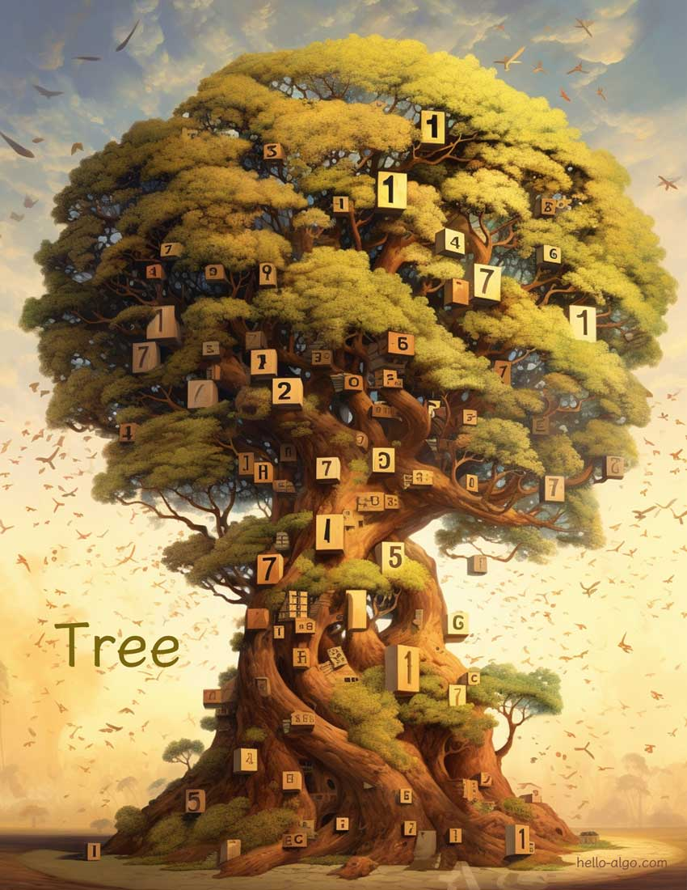

# Chapter 7. &nbsp; Tree

!!! abstract

    Cây cao tỏa ra một sinh khí rực rỡ, tự hào với những rễ sâu và tán lá phong phú, nhưng các cành lại thưa thớt, tạo nên một vẻ huyền ảo.
    
    Nó cho chúng ta thấy hình thức sống động của phương pháp chia để trị trong dữ liệu.

## Chapter contents

- [7.1 &nbsp; Binary tree](binary_tree.md)
- [7.2 &nbsp; Binary tree traversal](binary_tree_traversal.md)
- [7.3 &nbsp; Array Representation of tree](array_representation_of_tree.md)
- [7.4 &nbsp; Binary Search tree](binary_search_tree.md)
- [7.5 &nbsp; AVL tree *](avl_tree.md)
- [7.6 &nbsp; Summary](summary.md)